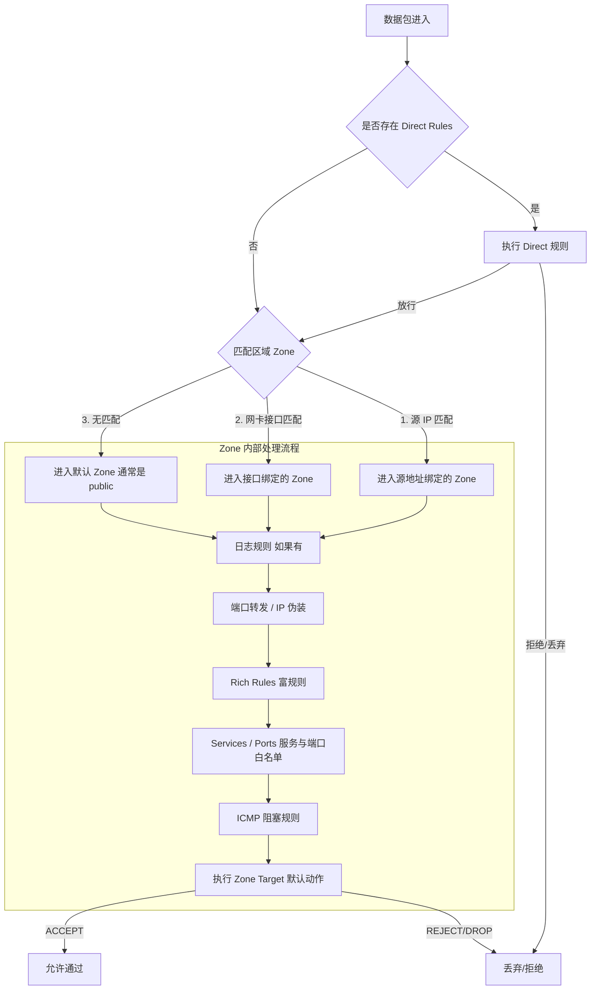

# Firewalld 详细使用指南
本文档详细介绍了 Linux 下 `firewalld` 防火墙的安装、管理、规则配置流程及最佳实践。

## 1. 环境检查与安装维护
### 1.1 检查防火墙状态
在进行任何配置之前，首先检查系统中是否存在 `firewalld` 或其他防火墙服务（如 `iptables`）。

```bash
# 检查 firewalld 和 iptables 的 systemd 单元文件状态
systemctl list-unit-files | grep -E "firewalld|iptables"

# 输出示例：
# firewalld.service          enabled  (已安装并开机自启)
# iptables.service           disabled (已安装但未开机自启)
```

### 1.2 安装与启动
如果未安装 `firewalld`，请根据发行版执行以下命令：

**CentOS/RHEL/Alibaba Cloud Linux:**

```bash
yum install firewalld -y
```

**Ubuntu/Debian:**

```bash
apt install firewalld -y
```

**启动与维护命令:**

```bash
# 启动防火墙
systemctl start firewalld

# 设置开机自启
systemctl enable firewalld

# 停止防火墙
systemctl stop firewalld

# 禁用开机自启
systemctl disable firewalld

# 查看运行状态
systemctl status firewalld

# 查看 firewalld 自身状态（简略）
firewall-cmd --state
# 输出: running 表示正在运行
```

### 1.3 理解区域 (Zones)
"区域 (Zone)" 是 Firewalld 的核心概念，代表了**不同信任级别的网络连接集合**。

**1. 区域是固定的吗？**

+ **预定义区域**：Firewalld 默认提供了 9 个预定义区域（如 public, home, work, drop 等），覆盖了绝大多数场景。
+ **自定义区域**：用户**可以**创建自定义区域，但在实际运维中，通常直接使用预定义区域就足够了。

**2. 常见预定义区域说明：**

| 区域名称 | 信任级别 | 默认行为 | 适用场景 |
| :--- | :--- | :--- | :--- |
| **drop** | 最低 | **丢弃**所有进入的包，不回送任何响应。仅允许出站连接。 | 遭受攻击或极度不信任的网络 |
| **block** | 低 | **拒绝**进入的包，并回送 ICMP Prohibited 消息。 | 需要明确告知对方"被拒绝"时 |
| **public** | 中 (默认) | 仅允许**显式放行**的连接（如 ssh, dhcpv6-client）。其他均拒绝。 | 公共场所、云服务器默认环境 |
| **external** | 中 | 类似 public，但默认开启了**IP 伪装 (Masquerading)**，用于路由器/网关。 | 作为网关或路由器的外网接口 |
| **internal** | 高 | 类似 home，用于内部网络。 | 内网服务器之间的通信 |
| **trusted** | 最高 | **接受所有**网络连接。 | 完全可信的局域网或测试环境 |


**3. 同一规则在不同区域配置如何生效？（区域激活逻辑）**

一个数据包进入防火墙时，**只会匹配一个区域**。它**不会**同时在 public 和 trusted 区域中进行匹配。

**匹配优先级规则（核心逻辑）：**

1. **源地址 (Source) 匹配**：  
如果数据包的**源 IP** 绑定到了某个区域（例如：`firewall-cmd --zone=trusted --add-source=192.168.1.100`），那么该数据包**直接进入该区域**处理。
    - _结果_：规则完全取决于 `trusted` 区域的配置，`public` 区域的规则对其无效。
2. **网卡接口 (Interface) 匹配**：  
如果源 IP 没有绑定任何区域，则检查数据包进入的**网卡**（如 eth0）。如果 eth0 绑定到了某个区域（默认通常绑定在 `public`），则数据包进入该区域。
3. **默认区域 (Default Zone)**：  
如果既没有匹配源 IP，也没有匹配网卡（极少见），则进入默认区域（通常是 `public`）。

**举例说明：**

+ **场景**：
    - eth0 网卡绑定在 `public` 区域（默认）。
    - 配置 A：`public` 区域开放 80 端口。
    - 配置 B：`trusted` 区域开放 8080 端口，并绑定源 IP `1.1.1.1`。
+ **结果**：
    - 来自 `1.1.1.1` 的流量 -> **命中源地址规则** -> 进入 `trusted` 区域 -> **允许访问 8080**（哪怕 public 没开 8080），**无法访问 80**（除非 trusted 也开了 80）。
    - 来自 `2.2.2.2` 的流量 -> 源地址未匹配 -> **命中网卡 eth0** -> 进入 `public` 区域 -> **允许访问 80**，**无法访问 8080**。

---

## 2. 命令详细使用流程与方式
`firewalld` 使用 `firewall-cmd` 作为主要交互工具。配置分为 **运行时配置 (Runtime)** 和 **永久配置 (Permanent)**。

### 2.1 运行时 vs 永久生效
+ **运行时配置 (Runtime)**:
    - 命令不带 `--permanent` 参数。
    - **立即生效**，但重启服务或系统后**失效**。
    - 适用于测试规则。
+ **永久配置 (Permanent)**:
    - 命令带 `--permanent` 参数。
    - **不会立即生效**，需要重载防火墙 (`--reload`) 才会生效。
    - 写入配置文件，重启后依然有效。

**最佳实践流程:**

1. 先添加永久规则：`firewall-cmd --permanent --add-port=80/tcp`
2. 重载使其生效：`firewall-cmd --reload`

### 2.2 常用基础命令
```bash
# 查看默认区域
firewall-cmd --get-default-zone

# 查看所有支持的区域
firewall-cmd --get-zones

# 查看当前激活的区域（有网卡绑定的区域）
firewall-cmd --get-active-zones

# 查看指定区域的所有规则（以 public 为例）
firewall-cmd --zone=public --list-all

# 查看所有区域的规则
firewall-cmd --list-all-zones
```

---

## 3. 规则查看、备份与恢复
`firewalld` 的配置存储在 XML 文件中。

### 3.1 规则查看
```bash
# 查看当前加载的所有规则
firewall-cmd --list-all

# 查看特定服务的规则（例如 http）
firewall-cmd --zone=public --query-service=http

# 查看特定端口是否开放
firewall-cmd --zone=public --query-port=80/tcp
```

### 3.2 备份
配置主要存储在以下目录：

+ **用户自定义配置**: `/etc/firewalld/` (主要备份此目录)
+ **系统默认配置**: `/usr/lib/firewalld/` (通常无需备份，升级软件会更新)

**备份命令:**

```bash
# 创建备份目录
mkdir -p /backup/firewalld/

# 备份配置目录
cp -r /etc/firewalld /backup/firewalld/$(date +%F)

# 也可以直接导出当前规则（仅作参考，不易直接恢复）
firewall-cmd --list-all-zones > /backup/firewalld/rules_dump.txt
```

### 3.3 恢复
**恢复命令:**

```bash
# 停止服务
systemctl stop firewalld

# 还原配置
cp -r /backup/firewalld/202X-XX-XX/* /etc/firewalld/

# 启动服务
systemctl start firewalld
```

---

## 4. 规则优先级与生效流程
在 `firewalld` 中，数据包进入时会按照特定顺序匹配规则。

### 4.1 优先级逻辑
1. **Direct Rules (直接规则)**: 通过 `--direct` 添加的规则，优先级最高，直接映射到 iptables/nftables 链。
2. **Source Binding (源地址绑定)**: 根据数据包源 IP 匹配到的 Zone。
3. **Interface Binding (接口绑定)**: 根据数据包进入网卡匹配到的 Zone。
4. **Zone 内部规则顺序**:
    - Port Forwarding / Masquerading (端口转发/伪装)
    - Rich Rules (富规则) - _注: Rich Rules 内部也有优先级，但通常高于普通 Service/Port_
    - Services / Ports (白名单服务和端口)
    - ICMP Blocks (ICMP 阻塞)
    - Zone Target (区域默认动作，如 default, ACCEPT, REJECT, DROP)

### 4.2 优先级流程图 (Mermaid)


---

## 5. 常见配置场景示例
以下示例均以 `public` 区域为例，且包含 **永久生效** 操作。

### 5.1 端口管理
**场景 A: 开放 Web 服务端口 (80, 8080)**

```bash
# 1. 开放端口
firewall-cmd --permanent --add-port=80/tcp
firewall-cmd --permanent --add-port=8080/tcp

# 2. 重载生效
firewall-cmd --reload

# 3. 验证
firewall-cmd --list-ports
```

**场景 B: 关闭端口 (3306)**  
如果之前误开了数据库端口，需要关闭：

```bash
firewall-cmd --permanent --remove-port=3306/tcp
firewall-cmd --reload
```

### 5.2 IP 限制与富规则 (Rich Rules)
Rich Rules 提供了更细粒度的控制，支持 `源地址` + `动作` 的组合。

**场景 C: 仅允许特定 IP (192.168.1.100) 访问 MySQL (3306)**

_注意：如果之前全局开放了 3306，需要先移除全局规则，再添加限制规则。_

```bash
# 1. 移除全局 3306 开放 (如果存在)
firewall-cmd --permanent --remove-port=3306/tcp

# 2. 添加富规则：允许 192.168.1.100 访问 3306
firewall-cmd --permanent --add-rich-rule='rule family="ipv4" source address="192.168.1.100" port port="3306" protocol="tcp" accept'

# 3. 重载
firewall-cmd --reload
```

**场景 D: 封禁恶意 IP (10.0.0.5)**

```bash
# 拒绝来自 10.0.0.5 的所有流量
firewall-cmd --permanent --add-rich-rule='rule family="ipv4" source address="10.0.0.5" reject'
firewall-cmd --reload
```

**场景 E: 网段限制 (允许 172.16.0.0/24 网段访问 SSH)**

```bash
# 1. 移除 ssh 服务 (默认通常是开启的，移除后仅允许富规则匹配)
# 注意：操作远程服务器时请谨慎，建议先添加富规则再移除服务，防止断连
firewall-cmd --permanent --remove-service=ssh

# 2. 添加允许网段的规则
firewall-cmd --permanent --add-rich-rule='rule family="ipv4" source address="172.16.0.0/24" service name="ssh" accept'

# 3. 重载
firewall-cmd --reload
```

### 5.3 端口转发
**场景 F: 将本机的 8888 端口转发到 80 端口**

```bash
# 开启伪装 (必须开启)
firewall-cmd --permanent --add-masquerade

# 添加转发规则
firewall-cmd --permanent --add-forward-port=port=8888:proto=tcp:toport=80

# 重载
firewall-cmd --reload
```

### 5.4 紧急模式
如果遇到攻击，需要立即切断所有网络连接：

```bash
# 开启恐慌模式 (切断所有网络)
firewall-cmd --panic-on

# 关闭恐慌模式 (恢复)
firewall-cmd --panic-off

# 查看状态
firewall-cmd --query-panic
```

