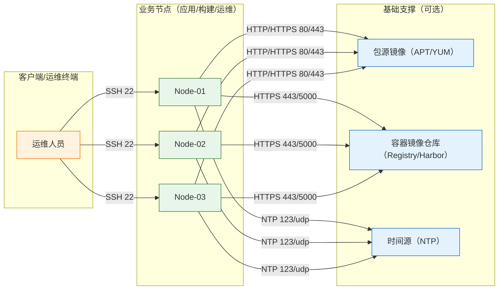
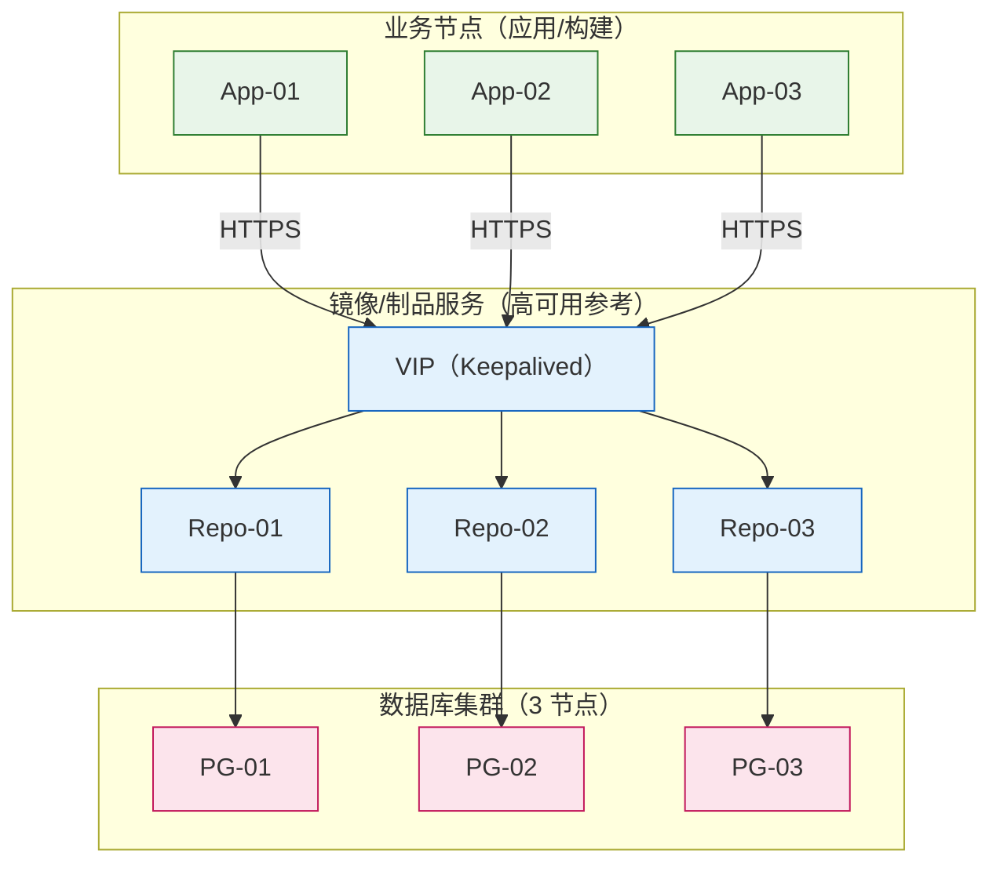

[TOC]

## 1. 简介

### 1.1 服务介绍与核心特性

本指南用于在 Rocky Linux 9 与 Ubuntu 24.04 上完成通用生产环境初始化，面向 Go / Java / PHP 等运行时部署前的基础能力建设：

- 系统包与常用工具安装
- 时间同步与时区配置
- 基础安全与系统限制（ulimit）
- Docker Engine 安装与基本校验（用于容器化快速启动）

### 1.2 适用场景

- 生产环境：多台服务器需要一致的基础环境与容器运行能力
- 内网环境：需要统一包源/镜像源以提升稳定性与可控性
- 开发/测试：希望快速具备 Docker 与基本运维工具

### 1.3 架构原理图（Mermaid图，添加颜色样式标记）



### 1.4 版本说明

- Rocky Linux：9（建议使用当前受支持的小版本，例如 9.7）([官方版本说明](https://wiki.rockylinux.org/rocky/version/))
- Ubuntu：24.04 LTS（长期支持版本）
- Docker Engine：29.3.0（建议使用当前稳定版）([官方发布说明](https://docs.docker.com/engine/release-notes/29/))

## 2. 版本选择指南

### 2.1 版本对应关系表

| 组件 | Rocky Linux 9（建议） | Ubuntu 24.04（建议） | 说明 |
|---|---|---|---|
| 系统基础工具 | dnf 仓库版本 | apt 仓库版本 | 优先使用系统仓库，便于安全更新 |
| Docker Engine | Docker CE 官方仓库 | Docker CE 官方仓库 | 避免使用系统自带旧版本 |

### 2.2 版本决策建议

- 优先选择发行版默认仓库的基础组件（curl/wget/vim/chrony 等），减少第三方源依赖。
- Docker 建议使用官方仓库，避免系统仓库版本偏旧导致功能缺失或兼容性问题。
- 内网/离线场景建议引入统一包源镜像与镜像仓库（稳定性优先于“最新”）。

## 3. 生产环境规划（高可用架构）

### 3.1 集群架构图（Mermaid图，数据库集群至少 3 节点）



### 3.2 节点角色与配置要求（最低配置 / 推荐配置）

| 角色 | 数量 | 最低配置 | 推荐配置 |
|---|---:|---|---|
| 应用/构建节点 | 3+ | 2C/4G/50G | 4C/8G/100G SSD |
| 镜像/制品节点（可选） | 3 | 2C/4G/100G | 4C/16G/200G SSD |
| 数据库节点（可选） | 3 | 2C/4G/100G | 4C/16G/200G SSD |

### 3.3 网络与端口规划

| 源地址 | 目标地址 | 目标端口 | 协议 | 用途 |
|---|---|---:|---|---|
| 运维终端 | 所有节点 | 22 | TCP | SSH 运维管理 |
| 所有节点 | 外部包源 / 内部镜像源 | 80/443 | TCP | 软件包下载与系统更新 |
| 所有节点 | 内部镜像仓库 | 443/5000 | TCP | Docker 镜像拉取/推送 |
| 所有节点 | 时间源（NTP） | 123 | UDP | 时间同步 |

## 4. 生产环境部署

### 4.1 前置准备（所有节点）

> 🖥️ **执行节点：所有节点（Master + Worker）**

```bash
id -u ops &>/dev/null || useradd -m -s /bin/bash ops
mkdir -p /etc/sudoers.d
cat > /etc/sudoers.d/90-ops << 'EOF'
ops ALL=(ALL) NOPASSWD: ALL
EOF
chmod 0440 /etc/sudoers.d/90-ops

timedatectl set-timezone Asia/Shanghai
```

```bash
# ✅ 验证
id ops
# 预期输出：uid=xxxx(ops) gid=xxxx(ops) groups=xxxx(ops)

timedatectl | grep "Time zone"
# 预期输出：Time zone: Asia/Shanghai (...)
```

### 4.2 Rocky Linux 9 部署步骤

#### 4.2.1 系统更新与基础工具

> 🖥️ **执行节点：所有节点（Master + Worker）**

```bash
# ── Rocky Linux 9 ──────────────────────────────────────────────
dnf makecache -y
dnf update -y
dnf install -y curl wget vim git tar unzip bash-completion chrony ca-certificates

# ── Ubuntu 24.04（差异）────────────────────────────────────────
apt-get update -y
apt-get upgrade -y
apt-get install -y curl wget vim git tar unzip bash-completion chrony ca-certificates
```

```bash
# ✅ 验证
git --version
curl --version | head -n 1
chronyc -v | head -n 1 || true
# 预期输出：命令可执行，版本信息正常显示
```

#### 4.2.2 时间同步（chrony）

> 🖥️ **执行节点：所有节点（Master + Worker）**

```bash
systemctl enable --now chronyd || systemctl enable --now chrony
```

```bash
# ✅ 验证
timedatectl status | grep "NTP synchronized"
# 预期输出：NTP synchronized: yes
```

#### 4.2.3 系统限制（nofile / nproc）

> 🖥️ **执行节点：所有节点（Master + Worker）**

```bash
mkdir -p /etc/security/limits.d
cat > /etc/security/limits.d/99-limits.conf << 'EOF'
* soft nofile 1048576
* hard nofile 1048576
* soft nproc  1048576
* hard nproc  1048576
EOF
```

```bash
# ✅ 验证（重新登录后生效）
ulimit -n
# 预期输出：1048576
```

#### 4.2.4 安装 Docker Engine（生产建议）

> 🖥️ **执行节点：所有节点（Master + Worker）**

```bash
# ── Rocky Linux 9 ──────────────────────────────────────────────
dnf install -y dnf-plugins-core
dnf config-manager --add-repo https://download.docker.com/linux/centos/docker-ce.repo
dnf install -y docker-ce docker-ce-cli containerd.io docker-buildx-plugin docker-compose-plugin
systemctl enable --now docker

# ── Ubuntu 24.04（差异）────────────────────────────────────────
install -m 0755 -d /etc/apt/keyrings
curl -fsSL https://download.docker.com/linux/ubuntu/gpg | gpg --dearmor -o /etc/apt/keyrings/docker.gpg
chmod a+r /etc/apt/keyrings/docker.gpg
echo "deb [arch=$(dpkg --print-architecture) signed-by=/etc/apt/keyrings/docker.gpg] https://download.docker.com/linux/ubuntu $(. /etc/os-release && echo $VERSION_CODENAME) stable" > /etc/apt/sources.list.d/docker.list
apt-get update -y
apt-get install -y docker-ce docker-ce-cli containerd.io docker-buildx-plugin docker-compose-plugin
systemctl enable --now docker
```

```bash
# ✅ 验证
docker version --format '{{.Server.Version}}'
# 预期输出：29.x.x（以实际安装为准）

docker compose version
# 预期输出：Docker Compose version vX.Y.Z
```

### 4.3 Ubuntu 24.04 部署步骤

仅当以下命令与 Rocky Linux 9 存在差异时，按本节执行；其余步骤与 Rocky Linux 9 相同：

- Docker 官方仓库密钥与 apt 源配置（见 4.2.4 的 Ubuntu 差异块）
- 基础工具安装与系统升级命令（apt-get，见 4.2.1 的 Ubuntu 差异块）

### 4.4 集群初始化与配置

运行时环境部署不涉及集群初始化；若在内网部署统一包源/镜像仓库，建议将其纳入企业基础设施规划并采用高可用方案（见 3.1）。

### 4.5 安装验证（含预期输出）

> 🖥️ **执行节点：所有节点（Master + Worker）**

```bash
cat /etc/os-release | head -n 5
uname -r
timedatectl status | grep -E "Time zone|NTP synchronized"
docker info --format '{{.ServerVersion}}'
```

```bash
# 预期输出：
# - /etc/os-release 显示 Rocky Linux 9 或 Ubuntu 24.04
# - NTP synchronized: yes
# - docker 版本可正常输出
```

## 5. 关键参数配置说明

### 5.1 核心配置文件详解（含逐行注释）

#### 5.1.1 /etc/security/limits.d/99-limits.conf

```conf
* soft nofile 1048576
* hard nofile 1048576
* soft nproc  1048576
* hard nproc  1048576
```

#### 5.1.2 /etc/docker/daemon.json（可选）

> ⚠️ 若需要使用内网镜像加速器或修改默认数据目录，才创建该文件。

```bash
mkdir -p /etc/docker
cat > /etc/docker/daemon.json << 'EOF'
{
  "data-root": "/var/lib/docker",
  "log-driver": "json-file",
  "log-opts": {
    "max-size": "100m",
    "max-file": "3"
  }
}
EOF
systemctl restart docker
```

```bash
# ✅ 验证
docker info --format '{{.DockerRootDir}}'
# 预期输出：/var/lib/docker
```

### 5.2 生产环境推荐调优参数

- ★ 文件句柄与进程数上限：nofile/nproc 建议提升至 10^6 级别（高并发场景避免资源耗尽）。
- ⚠️ Docker 日志：建议开启滚动（max-size/max-file），避免单文件膨胀占满磁盘。
- ⚠️ data-root：如使用独立数据盘，建议迁移到挂载盘路径（降低系统盘风险）。

## 6. 快速体验部署（开发 / 测试环境）

### 6.1 快速启动方案选型

基础环境验证以 Docker 为主：用于快速确认容器运行时与网络联通性，且不影响主机运行时安装策略。

### 6.2 快速启动步骤与验证

> 🖥️ **执行节点：任意一台节点**

```bash
docker run --rm hello-world
```

```bash
# ✅ 验证
docker ps -a
# 预期输出：容器已退出，hello-world 镜像存在或已自动拉取
```

### 6.3 停止与清理

```bash
docker image rm -f hello-world || true
docker system prune -f
```

## 7. 日常运维操作

### 7.1 常用管理命令

```bash
systemctl status docker
journalctl -u docker --no-pager -n 200
docker ps
docker images
docker system df
```

### 7.2 备份与恢复

```bash
systemctl stop docker
tar -C /var/lib -czf /backup/docker-data-$(date +%F).tar.gz docker
systemctl start docker
```

### 7.3 集群扩缩容

运行时基础环境按“节点等同”扩缩容：新增节点按第 4 章执行，确保版本一致即可。

### 7.4 版本升级（含回滚方案）

```bash
# ── Rocky Linux 9 ──────────────────────────────────────────────
dnf update -y docker-ce docker-ce-cli containerd.io docker-buildx-plugin docker-compose-plugin

# ── Ubuntu 24.04（差异）────────────────────────────────────────
apt-get update -y
apt-get install -y --only-upgrade docker-ce docker-ce-cli containerd.io docker-buildx-plugin docker-compose-plugin
```

> ⚠️ 回滚方案：升级前导出当前版本号与关键配置；若升级异常，回退到指定版本包并重启服务。

```bash
docker version --format '{{.Server.Version}}'
cat /etc/docker/daemon.json 2>/dev/null || true
```

## 9. 注意事项与生产检查清单

### 9.1 安装前环境核查

```bash
cat /etc/os-release | head -n 5
uname -m
nproc
free -h
df -h
curl -I https://download.docker.com | head -n 1
```

### 9.2 常见故障排查（现象 → 原因 → 排查步骤 → 解决方案）

#### 9.2.1 现象：Docker 启动失败

- 原因：daemon.json 格式错误 / 目录权限异常 / 端口冲突
- 排查步骤：

```bash
systemctl status docker -l --no-pager
journalctl -u docker --no-pager -n 200
cat /etc/docker/daemon.json
```

- 解决方案：

```bash
mv /etc/docker/daemon.json /etc/docker/daemon.json.bak.$(date +%s) || true
systemctl restart docker
```

#### 9.2.2 现象：系统时间不同步

- 原因：NTP 出口受限 / chrony 未启动
- 排查步骤：

```bash
systemctl status chronyd || systemctl status chrony
chronyc sources -v
```

- 解决方案：

```bash
systemctl restart chronyd || systemctl restart chrony
```

### 9.3 安全加固建议

- ★ 最小权限：仅为运维账号授予必要 sudo 能力，并纳入审计。
- ★ 禁止暴露 Docker Socket：避免将 /var/run/docker.sock 暴露给不可信容器。
- ⚠️ 内网镜像仓库：开启 TLS 与访问控制，避免镜像被篡改。

## 10. 参考资料

- [Rocky Linux Release and Version Guide](https://wiki.rockylinux.org/rocky/version/)
- [Docker Engine v29 Release Notes](https://docs.docker.com/engine/release-notes/29/)
