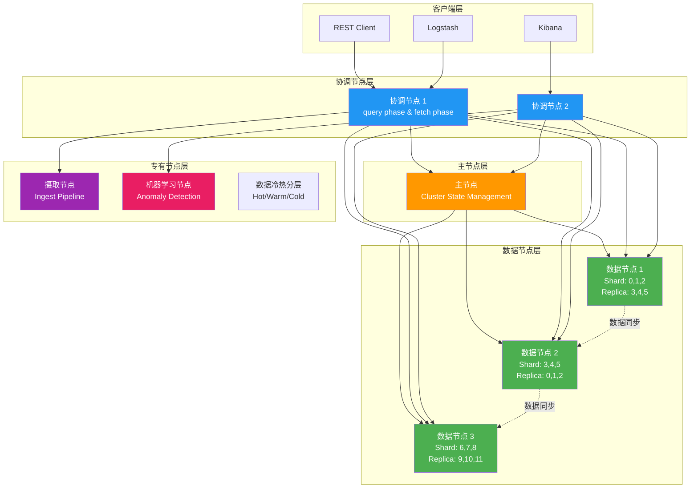
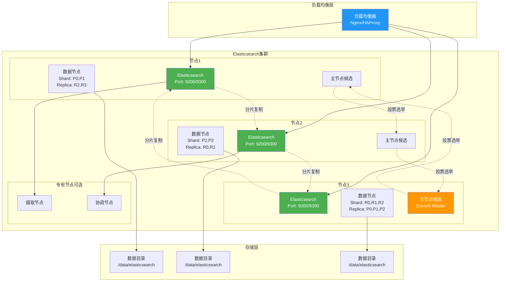

# Elasticsearch生产级部署与运维指南

## 目录

- [1. 简介](#1-简介)
  - [1.1 服务介绍与核心特性](#11-服务介绍与核心特性)
  - [1.2 适用场景](#12-适用场景)
  - [1.3 架构原理图](#13-架构原理图)
- [2. 版本选择指南](#2-版本选择指南)
  - [2.1 版本对应关系表](#21-版本对应关系表)
  - [2.2 版本决策建议](#22-版本决策建议)
- [3. 生产环境规划（高可用架构）](#3-生产环境规划高可用架构)
  - [3.1 集群架构图](#31-集群架构图)
  - [3.2 节点角色与配置要求](#32-节点角色与配置要求)
  - [3.3 网络与端口规划](#33-网络与端口规划)
- [4. 生产环境部署](#4-生产环境部署)
  - [4.1 前置准备](#41-前置准备)
  - [4.2 Rocky Linux 9 部署步骤](#42-rocky-linux-9-部署步骤)
  - [4.3 Ubuntu 22.04 部署步骤](#43-ubuntu-2204-部署步骤)
  - [4.4 集群初始化与配置](#44-集群初始化与配置)
  - [4.5 安装验证](#45-安装验证)
- [5. 关键参数配置说明](#5-关键参数配置说明)
  - [5.1 核心配置文件详解](#51-核心配置文件详解)
  - [5.2 生产环境推荐调优参数](#52-生产环境推荐调优参数)
- [6. 开发/测试环境快速部署](#6-开发测试环境快速部署)
  - [6.1 Docker Compose 部署](#61-docker-compose-部署)
  - [6.2 启动与验证](#62-启动与验证)
- [7. 日常运维操作](#7-日常运维操作)
  - [7.1 常用管理命令](#71-常用管理命令)
  - [7.2 备份与恢复](#72-备份与恢复)
  - [7.3 集群扩缩容](#73-集群扩缩容)
  - [7.4 版本升级](#74-版本升级)
- [8. 使用手册（数据库专项）](#8-使用手册数据库专项)
  - [8.1 连接与认证](#81-连接与认证)
  - [8.2 索引管理命令](#82-索引管理命令)
  - [8.3 数据增删改查](#83-数据增删改查)
  - [8.4 用户与权限管理](#84-用户与权限管理)
  - [8.5 性能查询与慢查询分析](#85-性能查询与慢查询分析)
  - [8.6 备份恢复命令](#86-备份恢复命令)
  - [8.7 集群状态监控命令](#87-集群状态监控命令)
  - [8.8 生产常见故障处理命令](#88-生产常见故障处理命令)
- [9. 注意事项与生产检查清单](#9-注意事项与生产检查清单)
  - [9.1 安装前环境核查](#91-安装前环境核查)
  - [9.2 常见故障排查](#92-常见故障排查)
  - [9.3 安全加固建议](#93-安全加固建议)
- [10. 参考资料](#10-参考资料)

---

## 1. 简介

### 1.1 服务介绍与核心特性

**Elasticsearch** 是一个基于 Lucene 的分布式、RESTful 风格的搜索和数据分析引擎，能够解决不断涌现的各种用例。作为 Elastic Stack 核心组件，它集中存储您的数据，帮助您发现意料之中以及意料之外的情况。

**核心特性：**

- **分布式架构**：支持多节点集群部署，自动分片和副本分配，提供高可用性和水平扩展能力
- **实时搜索**：提供毫秒级的文档搜索和分析响应
- **全文检索**：基于 Lucene 的强大全文搜索能力，支持多语言、复杂查询
- **多租户支持**：支持多索引、多类型数据管理
- **RESTful API**：提供简洁的 HTTP REST 接口，易于集成
- **Schema-free**：采用 JSON 文档存储，无需预定义数据结构
- **高可用性**：支持故障自动转移，数据多副本复制
- **近实时分析**：支持复杂的聚合分析和可视化
- **扩展性**：支持水平扩展到数百节点和 PB 级数据
- **生态丰富**：与 Logstash、Kibana、Beats 等组件形成完整的数据分析平台

### 1.2 适用场景

- **日志分析与监控**：集中收集、分析和可视化应用日志、系统日志
- **全文搜索**：电商产品搜索、文档检索、知识库搜索
- **指标分析**：应用性能监控（APM）、业务指标分析
- **安全信息事件管理（SIEM）**：安全日志分析和威胁检测
- **数据仓库**：大数据存储和分析平台
- **地理位置搜索**：基于位置的服务和推荐
- **时间序列分析**：IoT 数据、监控指标的时间序列分析
- **企业搜索**：企业文档、邮件、知识库的统一搜索平台

### 1.3 架构原理图

Elasticsearch 集群由多个节点组成，每个节点可以承担不同的角色：



**节点角色说明：**

- **Master-eligible Node**：主节点候选者，负责集群状态管理
- **Data Node**：数据节点，存储数据和执行 CRUD、聚合操作
- **Coordinating Node**：协调节点，处理客户端请求并分发到其他节点
- **Ingest Node**：摄取节点，在索引前预处理文档
- **Machine Learning Node**：机器学习节点，运行异常检测等 ML 任务
- **Tribe Node**：部落节点，连接多个集群（已废弃，使用跨集群复制代替）

---

## 2. 版本选择指南

### 2.1 版本对应关系表

| Elasticsearch 版本 | Java 版本 | Lucene 版本 | 发布状态 | 主要特性 |
|-------------------|-----------|-------------|---------|---------|
| 7.10.x | Java 8/11 | 8.10.1 | EOL（2022.09） | 最后开源版本，支持度高 |
| 7.17.x | Java 11/17/18 | 8.11.1 | 维护模式 | 7.x 系列稳定版本 |
| 8.11.x | Java 17/21 | 9.11.1 | 当前稳定版 | 推荐生产使用 |
| 8.12.x | Java 17/21 | 9.12.0 | 最新版本 | 最新特性，需验证 |

> ⚠️ **重要说明**：Elasticsearch 7.10 之后版本采用 SSPL（Elastic License）双重许可证，不再 100% 开源。如需纯开源版本，建议使用 OpenSearch（AWS 维护的 Elasticsearch 分支）。

### 2.2 版本决策建议

**选择版本时应考虑以下因素：**

1. **许可证合规性**
   - 如果项目必须使用 100% 开源软件，选择 7.10.x 或使用 OpenSearch
   - 如果接受 Elastic License，推荐使用 8.11.x 或更高版本

2. **Java 版本兼容性**
   - 检查您的 Java 环境，8.x 版本需要 Java 17 或更高版本
   - 7.x 版本支持 Java 8，适合旧系统迁移

3. **功能需求**
   - 需要向量搜索、近似最近邻（ANN）功能？选择 8.x
   - 需要最新的安全和性能优化？选择 8.11.x 或更高版本

4. **升级路径**
   - 从旧版本升级时，不能跨大版本升级（如 6.x → 8.x）
   - 需要先升级到 7.x，再升级到 8.x

5. **社区支持和文档**
   - 8.x 版本文档更完善，社区活跃度高
   - 7.17.x 仍然有长期支持，适合保守型项目

**推荐决策：**
- **新项目**：使用 Elasticsearch 8.11.x 或 OpenSearch 2.x
- **现有 7.x 项目**：评估升级到 7.17.x 或 8.x 的成本收益
- **现有 6.x 项目**：先升级到 7.17.x，再规划 8.x 升级

---

## 3. 生产环境规划（高可用架构）

### 3.1 集群架构图

生产环境推荐部署 **3 节点或以上** 的 Elasticsearch 集群，每个节点承担多种角色以确保高可用性：



### 3.2 节点角色与配置要求

#### 节点角色配置建议

| 角色 | 最小节点数 | 最低配置 | 推荐配置 | 说明 |
|------|-----------|---------|---------|------|
| **Master-eligible** | 3（奇数） | 2核/4GB | 4核/8GB | 管理集群状态，轻量级 |
| **Data** | 3+ | 4核/8GB | 8核/32GB | 存储和计算数据 |
| **Coordinating** | 2+ | 2核/4GB | 4核/16GB | 处理查询分发聚合 |
| **Ingest** | 2+ | 2核/4GB | 4核/16GB | 预处理文档数据 |
| **ML** | 0-2 | 4核/8GB | 8核/32GB | 机器学习任务 |

#### 混合角色节点配置（中小型集群推荐）

| 节点数 | 角色 | 内存 | CPU | 磁盘 | 说明 |
|--------|------|------|-----|------|------|
| 3节点 | Master + Data + Coordinating | 16GB | 8核 | 500GB SSD | 适合中小型数据集 |
| 5节点 | 3 Master + Data + 2 Coordinating | 32GB | 16核 | 1TB SSD | 中等规模，高并发 |
| 7节点+ | 3 Master + 3 Data + 2 Ingest + ML | 64GB | 32核 | 2TB SSD | 大规模生产环境 |

> ⚠️ **重要**：
> - 堆内存（Heap）设置为系统内存的 50%，最大不超过 31GB
> - 剩余 50% 内存留给操作系统文件系统缓存
> - SSD 磁盘对于 Elasticsearch 性能至关重要
> - 数据目录建议单独挂载到高性能磁盘

### 3.3 网络与端口规划

| 源地址 | 目标端口 | 协议 | 用途 | 必须开放 |
|--------|---------|------|------|---------|
| 客户端 | 9200 | TCP | HTTP REST API | ✅ 是 |
| 节点间通信 | 9300 | TCP | 集群内部传输（节点发现、分片复制） | ✅ 是 |
| 监控系统 | 9200 | TCP | 监控指标采集 | ✅ 是 |
| Kibana | 9200 | TCP | Web UI 访问 | ✅ 是 |
| Logstash/Beats | 9200 | TCP | 数据写入 | ✅ 是 |

> ★ **防火墙规则示例**：
```bash
# ── Rocky Linux 9 ──────────────────────────
firewall-cmd --permanent --add-port=9200/tcp  # HTTP API
firewall-cmd --permanent --add-port=9300/tcp  # 节点间通信
firewall-cmd --permanent --add-rich-rule='rule family="ipv4" source address="10.0.0.0/8" port port="9300" protocol="tcp" accept'
firewall-cmd --reload

# ── Ubuntu 22.04 ───────────────────────────
ufw allow 9200/tcp  # HTTP API
ufw allow from 10.0.0.0/8 to any port 9300 proto tcp  # 节点间通信
ufw reload
```

---

## 4. 生产环境部署

### 4.1 前置准备（所有节点）

#### 4.1.1 系统配置优化

```bash
# ── Rocky Linux 9 ──────────────────────────
# 禁用 swap
swapoff -a
sed -i '/ swap / s/^\(.*\)$/#\1/g' /etc/fstab

# 配置 vm.max_map_count（Elasticsearch 要求）
sysctl -w vm.max_map_count=262144
cat >> /etc/sysctl.conf << EOF
vm.max_map_count=262144
EOF

# 配置文件描述符限制
cat >> /etc/security/limits.conf << EOF
# ── Elasticsearch 用户资源限制 ──────────────────────────
elasticsearch  -  nofile  65535
elasticsearch  -  memlock unlimited
EOF

# ── Ubuntu 22.04 ───────────────────────────
# 禁用 swap
swapoff -a
sed -i '/ swap / s/^\(.*\)$/#\1/g' /etc/fstab

# 配置 vm.max_map_count
sysctl -w vm.max_map_count=262144
cat >> /etc/sysctl.conf << EOF
vm.max_map_count=262144
EOF

# 配置文件描述符限制
cat >> /etc/security/limits.conf << EOF
# ── Elasticsearch 用户资源限制 ──────────────────────────
elasticsearch  -  nofile  65535
elasticsearch  -  memlock unlimited
EOF
```

#### 4.1.2 创建 Elasticsearch 用户和目录

```bash
# ── Rocky Linux 9 & Ubuntu 22.04 ──────────────────────────
# 创建专用用户
useradd -M -d /usr/share/elasticsearch -s /sbin/nologin elasticsearch

# 创建数据和日志目录
mkdir -p /data/elasticsearch/data
mkdir -p /data/elasticsearch/logs
chown -R elasticsearch:elasticsearch /data/elasticsearch

# 创建临时目录
mkdir -p /tmp/elasticsearch
chown -R elasticsearch:elasticsearch /tmp/elasticsearch
```

### 4.2 Rocky Linux 9 部署步骤

#### 4.2.1 安装 Java 17

```bash
# ── Rocky Linux 9 ──────────────────────────
# 安装 OpenJDK 17
dnf install -y java-17-openjdk java-17-openjdk-devel

# 验证 Java 版本
java -version

# 设置 JAVA_HOME
cat >> /etc/profile.d/java.sh << 'EOF'
export JAVA_HOME=/usr/lib/jvm/java-17-openjdk
export PATH=$JAVA_HOME/bin:$PATH
EOF
source /etc/profile.d/java.sh
```

#### 4.2.2 下载并安装 Elasticsearch

```bash
# ── Rocky Linux 9 ──────────────────────────
# 下载 Elasticsearch 8.11.x（官方 GPG 密钥）
rpm --import https://artifacts.elastic.co/GPG-KEY-elasticsearch

# 添加 Elasticsearch yum 仓库
cat >> /etc/yum.repos.d/elasticsearch.repo << 'EOF'
[elasticsearch]
name=Elasticsearch repository for 8.x packages
baseurl=https://artifacts.elastic.co/packages/8.x/yum
gpgcheck=1
gpgkey=https://artifacts.elastic.co/GPG-KEY-elasticsearch
enabled=0
autorefresh=1
type=rpm-md
EOF

# 安装 Elasticsearch
dnf install -y --enablerepo=elasticsearch elasticsearch

# 验证安装
rpm -qa | grep elasticsearch
```

#### 4.2.3 配置 Elasticsearch

**主配置文件：/etc/elasticsearch/elasticsearch.yml**

```bash
cat >> /etc/elasticsearch/elasticsearch.yml << 'EOF'
# ── 集群配置 ─────────────────────────────────────
cluster.name: my-production-cluster  # ★ ⚠️ 生产环境必须修改集群名称

# ── 节点配置 ─────────────────────────────────────
node.name: es-node-1  # ★ ⚠️ 每个节点名称必须唯一
node.roles: [master, data, ingest, coordinating]  # 节点角色配置

# ── 网络配置 ─────────────────────────────────────
network.host: 0.0.0.0  # 监听所有网络接口
http.port: 9200  # HTTP API 端口
transport.port: 9300  # 节点间通信端口

# ── 发现配置 ─────────────────────────────────────
discovery.seed_hosts: ["10.0.1.11", "10.0.1.12", "10.0.1.13"]  # ★ ⚠️ 替换为实际节点IP
cluster.initial_master_nodes: ["es-node-1", "es-node-2", "es-node-3"]  # ★ ⚠️ 首次启动时指定

# ── 数据路径配置 ───────────────────────────────────
path.data: /data/elasticsearch/data  # ★ 数据目录
path.logs: /data/elasticsearch/logs  # ★ 日志目录

# ── 内存配置 ───────────────────────────────────────
bootstrap.memory_lock: true  # 锁定内存，防止 swap

# ── 安全配置（生产环境必须启用）────────────────────
xpack.security.enabled: true  # 启用安全功能
xpack.security.transport.ssl.enabled: true  # 启用节点间 SSL
xpack.security.http.ssl.enabled: true  # 启用 HTTP SSL
xpack.security.http.ssl.certificate: /etc/elasticsearch/certs/node1.crt  # SSL 证书路径
xpack.security.http.ssl.key: /etc/elasticsearch/certs/node1.key  # SSL 密钥路径
xpack.security.http.ssl.certificate_authorities: /etc/elasticsearch/certs/ca.crt  # CA 证书路径

# ── 生产环境性能优化 ───────────────────────────────
action.destructive_requires_name: true  # 删除索引需要显式指定索引名
cluster.routing.allocation.disk.watermark.low: 85%  # 磁盘使用率低水位线
cluster.routing.allocation.disk.watermark.high: 90%  # 磁盘使用率高水位线
cluster.routing.allocation.disk.watermark.flood_stage: 95%  # 磁盘洪水水位线

# ── 监控配置 ───────────────────────────────────────
xpack.monitoring.collection.enabled: true
EOF
```

**JVM 配置文件：/etc/elasticsearch/jvm.options**

```bash
cat >> /etc/elasticsearch/jvm.options << 'EOF'
# ── 堆内存配置（设置为系统内存的 50%，最大不超过 31GB）──
-Xms16g  # ★ ⚠️ 最小堆内存（根据实际内存调整）
-Xmx16g  # ★ ⚠️ 最大堆内存（与 Xms 相同）

# ── GC 配置（使用 G1GC）────────────────────────────
-XX:+UseG1GC
-XX:MaxGCPauseMillis=200

# ── 性能优化 ───────────────────────────────────────
-XX:+AlwaysPreTouch
-XX:+HeapDumpOnOutOfMemoryError
-XX:HeapDumpPath=/data/elasticsearch/logs/
-XX:ErrorFile=/data/elasticsearch/logs/hs_err_pid%p.log

# ── 文件描述符 ───────────────────────────────────
-Djdk.io.permissions=true
EOF
```

**服务配置文件：/etc/systemd/system/elasticsearch.service.d/override.conf**

```bash
mkdir -p /etc/systemd/system/elasticsearch.service.d/
cat >> /etc/systemd/system/elasticsearch.service.d/override.conf << 'EOF'
[Service]
# 限制内存锁定
LimitMEMLOCK=infinity

# 设置最大文件描述符
LimitNOFILE=65535

# 设置临时目录
Environment="ES_TMPDIR=/tmp/elasticsearch"
EOF
```

#### 4.2.4 生成 SSL/TLS 证书

```bash
# ── 生成 CA 证书 ──────────────────────────────────
/usr/share/elasticsearch/bin/elasticsearch-certutil ca

# ── 生成节点证书 ──────────────────────────────────
/usr/share/elasticsearch/bin/elasticsearch-certutil cert --ca elastic-stack-ca.p12 --name es-node-1 --dns es-node-1,localhost

# ── 移动证书到指定目录 ────────────────────────────
mkdir -p /etc/elasticsearch/certs
mv elastic-stack-ca.p12 /etc/elasticsearch/certs/
mv es-node-1.p12 /etc/elasticsearch/certs/
chown -R elasticsearch:elasticsearch /etc/elasticsearch/certs/
chmod 600 /etc/elasticsearch/certs/*.p12
```

#### 4.2.5 启动 Elasticsearch

```bash
# ── Rocky Linux 9 ──────────────────────────
# 重新加载 systemd 配置
systemctl daemon-reload

# 启用并启动 Elasticsearch
systemctl enable --now elasticsearch

# 查看服务状态
systemctl status elasticsearch

# 查看日志
journalctl -u elasticsearch -f
```

### 4.3 Ubuntu 22.04 部署步骤

#### 4.3.1 安装 Java 17

```bash
# ── Ubuntu 22.04 ───────────────────────────
# 安装 OpenJDK 17
apt-get update
apt-get install -y openjdk-17-jdk

# 验证 Java 版本
java -version

# 设置 JAVA_HOME
cat >> /etc/profile.d/java.sh << 'EOF'
export JAVA_HOME=/usr/lib/jvm/java-17-openjdk-amd64
export PATH=$JAVA_HOME/bin:$PATH
EOF
source /etc/profile.d/java.sh
```

#### 4.3.2 下载并安装 Elasticsearch

```bash
# ── Ubuntu 22.04 ───────────────────────────
# 下载并安装公钥
wget -qO - https://artifacts.elastic.co/GPG-KEY-elasticsearch | gpg --dearmor -o /usr/share/keyrings/elasticsearch-keyring.gpg

# 添加 Elasticsearch apt 仓库
echo "deb [signed-by=/usr/share/keyrings/elasticsearch-keyring.gpg] https://artifacts.elastic.co/packages/8.x/apt stable main" | tee /etc/apt/sources.list.d/elastic-8.x.list

# 更新包列表并安装
apt-get update
apt-get install -y elasticsearch

# 验证安装
dpkg -l | grep elasticsearch
```

#### 4.3.3 配置 Elasticsearch

Ubuntu 22.04 的配置文件与 Rocky Linux 9 完全相同，请参考 **4.2.3 配置 Elasticsearch** 章节的内容。

#### 4.3.4 启动 Elasticsearch

```bash
# ── Ubuntu 22.04 ───────────────────────────
# 重新加载 systemd 配置
systemctl daemon-reload

# 启用并启动 Elasticsearch
systemctl enable --now elasticsearch

# 查看服务状态
systemctl status elasticsearch

# 查看日志
journalctl -u elasticsearch -f
```

### 4.4 集群初始化与配置

#### 4.4.1 设置默认密码

```bash
# 在任一节点执行以下命令
/usr/share/elasticsearch/bin/elasticsearch-setup-passwords interactive

# 按提示为以下用户设置密码：
# - elastic: 超级用户
# - kibana_system: Kibana 连接用户
# - logstash_system: Logstash 连接用户
# - beats_system: Beats 连接用户
# - apm_system: APM 服务用户
# - remote_monitoring_user: 监控用户
```

#### 4.4.2 验证集群状态

```bash
# 基本验证（需要密码）
curl -u elastic:your_password -XGET 'https://localhost:9200/_cluster/health?pretty'

# 预期输出（集群状态为 green）：
{
  "cluster_name" : "my-production-cluster",
  "status" : "green",
  "number_of_nodes" : 3,
  "number_of_data_nodes" : 3
}

# 查看节点信息
curl -u elastic:your_password -XGET 'https://localhost:9200/_cat/nodes?v'

# 查看索引信息
curl -u elastic:your_password -XGET 'https://localhost:9200/_cat/indices?v'
```

### 4.5 安装验证

#### 4.5.1 集群健康检查

```bash
# ── 集群健康状态
curl -u elastic:your_password -XGET 'https://localhost:9200/_cluster/health?pretty'

# ── 节点列表
curl -u elastic:your_password -XGET 'https://localhost:9200/_cat/nodes?v&h=name,ip,role,master,heap.percent,ram.current,ram.percent,cpu,load_1m'

# ── 分片分配情况
curl -u elastic:your_password -XGET 'https://localhost:9200/_cat/shards?v&h=index,shard,prirep,state,docs,store,node&s=store:desc'

# ── 索引统计
curl -u elastic:your_password -XGET 'https://localhost:9200/_cat/indices?v&h=index,health,status,docs.count,store.size,pri.store.size&s=store.size:desc'
```

**预期输出示例：**

```
# 节点列表
name          ip            role                  master heap.percent ram.current ram.percent cpu load_1m
es-node-1     10.0.1.11     cdhilmrstw         *      45           15.7gb      78.1        12   2.45
es-node-2     10.0.1.12     cdhilmrstw         -      42           15.7gb      78.1        10   2.12
es-node-3     10.0.1.13     cdhilmrstw         -      48           15.7gb      78.1        15   2.67
```

---

## 5. 关键参数配置说明

### 5.1 核心配置文件详解

#### 5.1.1 elasticsearch.yml 详解

```yaml
# ======================== 集群配置 ========================
cluster.name: my-production-cluster  # ★ ⚠️ 集群名称，同一集群的所有节点必须相同

# ======================== 节点配置 ========================
node.name: es-node-1  # ★ ⚠️ 节点名称，集群内必须唯一

# 节点角色配置（多个角色）
node.roles: [master, data, ingest, coordinating]
  # master: 主节点候选者，管理集群状态
  # data: 数据节点，存储数据和执行查询
  # ingest: 摄取节点，预处理文档
  # coordinating: 协调节点，分发查询和聚合
  # ml: 机器学习节点（需要启用 ML 功能）
  # transform: 数据转换节点
  # remote_cluster_client: 跨集群客户端

# ======================== 网络配置 ========================
network.host: 0.0.0.0  # 监听地址，0.0.0.0 表示监听所有网络接口
http.port: 9200  # HTTP API 端口
transport.port: 9300  # 节点间通信端口

# ======================== 发现配置 ========================
discovery.seed_hosts: ["10.0.1.11", "10.0.1.12", "10.0.1.13"]  # ★ ⚠️ 集群节点IP列表
cluster.initial_master_nodes: ["es-node-1", "es-node-2", "es-node-3"]  # ★ ⚠️ 初始主节点候选者

# ======================== 路径配置 ========================
path.data: /data/elasticsearch/data  # ★ 数据目录路径
path.logs: /data/elasticsearch/logs  # ★ 日志目录路径
path.repo: /backup/elasticsearch  # 快照仓库路径

# ======================== 内存配置 ========================
bootstrap.memory_lock: true  # 锁定堆内存，防止 swap 交换到磁盘

# ======================== 安全配置 ========================
xpack.security.enabled: true  # 启用安全功能
xpack.security.transport.ssl.enabled: true  # 节点间 SSL
xpack.security.http.ssl.enabled: true  # HTTP SSL
xpack.security.http.ssl.certificate: /etc/elasticsearch/certs/node1.crt  # SSL 证书
xpack.security.http.ssl.key: /etc/elasticsearch/certs/node1.key  # SSL 密钥
xpack.security.http.ssl.certificate_authorities: /etc/elasticsearch/certs/ca.crt  # CA 证书
xpack.security.transport.ssl.certificate: /etc/elasticsearch/certs/node1.p12  # 节点证书
xpack.security.transport.ssl.key: /etc/elasticsearch/certs/node1.p12  # 节点密钥

# ======================== 索引配置 ========================
action.auto_create_index: false  # 禁止自动创建索引（生产环境推荐）
action.destructive_requires_name: true  # 删除索引时必须指定索引名

# ======================== 分片配置 ========================
index.number_of_shards: 3  # 默认分片数
index.number_of_replicas: 1  # 默认副本数

# ======================== 磁盘水位线 ========================
cluster.routing.allocation.disk.watermark.low: 85%  # 低水位线，超过则不再分配分片
cluster.routing.allocation.disk.watermark.high: 90%  # 高水位线，超过时尝试重新分配分片
cluster.routing.allocation.disk.watermark.flood_stage: 95%  # 洪水水位线，超过时阻止写入操作

# ======================== 缓存配置 ========================
indices.queries.cache.size: 20%  # 查询缓存大小（堆内存百分比）
indices.request.cache.size: 5%  # 请求缓存大小（堆内存百分比）
indices.fielddata.cache.size: 40%  # 字段数据缓存大小

# ======================== 线程池配置 ========================
thread_pool:
  write:
    queue_size: 1000  # 写入线程池队列大小
  search:
    queue_size: 1000  # 搜索线程池队列大小
```

### 5.2 生产环境推荐调优参数

#### 5.2.1 JVM 堆内存设置

```bash
# 在 jvm.options 中设置
-Xms16g  # 最小堆内存 = 最大堆内存
-Xmx16g  # 最大堆内存 = 系统内存的 50%，不超过 31GB

# 计算公式：
# 堆内存 = min(系统内存 * 50%, 31GB)
# 例如：32GB 系统内存 → 堆内存设置为 16GB
```

#### 5.2.2 系统级优化

```bash
# /etc/sysctl.conf
vm.max_map_count=262144  # ★ 必须：Elasticsearch 要求
vm.swappiness=1  # 降低 swap 使用倾向
fs.file-max=2097152  # 增加文件描述符限制

# /etc/security/limits.conf
elasticsearch  -  nofile  65535  # 文件描述符限制
elasticsearch  -  nproc  4096   # 进程数限制
elasticsearch  -  memlock unlimited  # 锁定内存
```

#### 5.2.3 索引性能优化

```json
PUT /_template/default_template
{
  "index_patterns": ["*"],
  "settings": {
    "number_of_shards": 3,        # 根据数据量调整（单个分片 20-50GB）
    "number_of_replicas": 1,      # 根据可用性要求调整
    "refresh_interval": "30s",    # 降低刷新频率，提高批量写入性能
    "index.translog.durability": "async",  # 异步事务日志（可能丢数据）
    "index.translog.sync_interval": "30s"
  }
}
```

#### 5.2.4 查询性能优化

```json
PUT /_cluster/settings
{
  "persistent": {
    "indices.queries.cache.size": "20%",  # 查询缓存
    "indices.request.cache.size": "5%",   # 请求缓存
    "indices.fielddata.cache.size": "40%"  # 字段数据缓存
  }
}
```

---

## 6. 开发/测试环境快速部署

### 6.1 Docker Compose 部署

> ⚠️ **警告**：本方案仅适用于开发/测试环境，不适用于生产环境！

#### 6.1.1 创建 docker-compose.yml

```bash
cat >> docker-compose.yml << 'EOF'
version: '3.8'

services:
  elasticsearch-node1:
    image: docker.elastic.co/elasticsearch/elasticsearch:8.11.3
    container_name: es-node-1
    environment:
      - node.name=es-node-1
      - cluster.name=es-docker-cluster
      - discovery.seed_hosts=es-node-2,es-node-3
      - cluster.initial_master_nodes=es-node-1,es-node-2,es-node-3
      - bootstrap.memory_lock=true
      - "ES_JAVA_OPTS=-Xms1g -Xmx1g"  # ★ ⚠️ 开发环境可降低内存
      - xpack.security.enabled=false  # ⚠️ 测试环境可禁用安全
    ulimits:
      memlock:
        soft: -1
        hard: -1
    volumes:
      - es-data1:/usr/share/elasticsearch/data
    ports:
      - "9201:9200"
      - "9301:9300"
    networks:
      - es-net

  elasticsearch-node2:
    image: docker.elastic.co/elasticsearch/elasticsearch:8.11.3
    container_name: es-node-2
    environment:
      - node.name=es-node-2
      - cluster.name=es-docker-cluster
      - discovery.seed_hosts=es-node-1,es-node-3
      - cluster.initial_master_nodes=es-node-1,es-node-2,es-node-3
      - bootstrap.memory_lock=true
      - "ES_JAVA_OPTS=-Xms1g -Xmx1g"
      - xpack.security.enabled=false
    ulimits:
      memlock:
        soft: -1
        hard: -1
    volumes:
      - es-data2:/usr/share/elasticsearch/data
    ports:
      - "9202:9200"
      - "9302:9300"
    networks:
      - es-net

  elasticsearch-node3:
    image: docker.elastic.co/elasticsearch/elasticsearch:8.11.3
    container_name: es-node-3
    environment:
      - node.name=es-node-3
      - cluster.name=es-docker-cluster
      - discovery.seed_hosts=es-node-1,es-node-2
      - cluster.initial_master_nodes=es-node-1,es-node-2,es-node-3
      - bootstrap.memory_lock=true
      - "ES_JAVA_OPTS=-Xms1g -Xmx1g"
      - xpack.security.enabled=false
    ulimits:
      memlock:
        soft: -1
        hard: -1
    volumes:
      - es-data3:/usr/share/elasticsearch/data
    ports:
      - "9203:9200"
      - "9303:9300"
    networks:
      - es-net

  kibana:
    image: docker.elastic.co/kibana/kibana:8.11.3
    container_name: kibana
    environment:
      - ELASTICSEARCH_HOSTS=http://es-node-1:9200
    ports:
      - "5601:5601"
    networks:
      - es-net
    depends_on:
      - elasticsearch-node1

volumes:
  es-data1:
  es-data2:
  es-data3:

networks:
  es-net:
    driver: bridge
EOF
```

### 6.2 启动与验证

#### 6.2.1 启动服务

```bash
# ── 启动集群 ─────────────────────────────────────
docker compose up -d

# ── 查看启动日志 ─────────────────────────────────
docker compose logs -f elasticsearch-node1

# ── 等待集群初始化完成（约 1-2 分钟）
```

#### 6.2.2 验证集群状态

```bash
# ── 检查集群健康
curl -XGET 'http://localhost:9201/_cluster/health?pretty'

# ── 查看节点信息
curl -XGET 'http://localhost:9201/_cat/nodes?v'

# ── 访问 Kibana
# 浏览器打开：http://localhost:5601
```

**预期输出：**

```json
{
  "cluster_name" : "es-docker-cluster",
  "status" : "green",
  "number_of_nodes" : 3,
  "number_of_data_nodes" : 3
}
```

#### 6.2.3 清理环境

```bash
# ── 停止并删除所有容器和数据
docker compose down -v

# ── 清理镜像（可选）
docker rmi docker.elastic.co/elasticsearch/elasticsearch:8.11.3
docker rmi docker.elastic.co/kibana/kibana:8.11.3
```

---

## 7. 日常运维操作

### 7.1 常用管理命令

#### 7.1.1 集群管理

```bash
# ── 集群健康状态
curl -u elastic:password -XGET 'https://localhost:9200/_cluster/health?pretty'

# ── 集群状态统计
curl -u elastic:password -XGET 'https://localhost:9200/_cluster/stats?pretty'

# ── 节点信息
curl -u elastic:password -XGET 'https://localhost:9200/_cat/nodes?v&h=name,ip,role,master,heap.percent,ram.current,cpu,load_1m'

# ── 集群设置
curl -u elastic:password -XGET 'https://localhost:9200/_cluster/settings?pretty'
```

#### 7.1.2 索引管理

```bash
# ── 列出所有索引
curl -u elastic:password -XGET 'https://localhost:9200/_cat/indices?v'

# ── 创建索引
curl -u elastic:password -XPUT 'https://localhost:9200/my_index?pretty'

# ── 删除索引
curl -u elastic:password -XDELETE 'https://localhost:9200/my_index?pretty'

# ── 关闭索引（释放内存）
curl -u elastic:password -XPOST 'https://localhost:9200/my_index/_close?pretty'

# ── 打开索引
curl -u elastic:password -XPOST 'https://localhost:9200/my_index/_open?pretty'

# ── 清理索引缓存
curl -u elastic:password -XPOST 'https://localhost:9200/my_index/_cache/clear?pretty'
```

#### 7.1.3 分片管理

```bash
# ── 查看分片分配
curl -u elastic:password -XGET 'https://localhost:9200/_cat/shards?v&h=index,shard,prirep,state,docs,store,node'

# ── 手动移动分片
curl -u elastic:password -XPOST 'https://localhost:9200/_cluster/reroute?pretty' -H 'Content-Type: application/json' -d '
{
  "commands": [{
    "move": {
      "index": "my_index",
      "shard": 0,
      "from_node": "node1",
      "to_node": "node2"
    }
  }]
}'

# ── 分配未分配的分片
curl -u elastic:password -XPOST 'https://localhost:9200/_cluster/reroute?retry_failed=true'
```

### 7.2 备份与恢复

#### 7.2.1 配置快照仓库

```bash
# ── 注册文件系统快照仓库
curl -u elastic:password -XPUT 'https://localhost:9200/_snapshot/backup_repo?pretty' -H 'Content-Type: application/json' -d '
{
  "type": "fs",
  "settings": {
    "location": "/backup/elasticsearch"
  }
}'
```

#### 7.2.2 创建快照

```bash
# ── 创建快照
curl -u elastic:password -XPUT 'https://localhost:9200/_snapshot/backup_repo/snapshot_1?wait_for_completion=true&pretty'

# ── 创建特定索引的快照
curl -u elastic:password -XPUT 'https://localhost:9200/_snapshot/backup_repo/snapshot_2?wait_for_completion=true&pretty' -H 'Content-Type: application/json' -d '
{
  "indices": "index1,index2",
  "ignore_unavailable": true,
  "include_global_state": false
}'
```

#### 7.2.3 恢复快照

```bash
# ── 列出所有快照
curl -u elastic:password -XGET 'https://localhost:9200/_snapshot/backup_repo/_all?pretty'

# ── 恢复快照
curl -u elastic:password -XPOST 'https://localhost:9200/_snapshot/backup_repo/snapshot_1/_restore?wait_for_completion=true&pretty'

# ── 恢复特定索引
curl -u elastic:password -XPOST 'https://localhost:9200/_snapshot/backup_repo/snapshot_1/_restore?pretty' -H 'Content-Type: application/json' -d '
{
  "indices": "index1,index2",
  "ignore_unavailable": true,
  "include_global_state": false
}'
```

### 7.3 集群扩缩容

#### 7.3.1 添加新节点

1. **部署新节点**（参考第 4 章部署步骤）
2. **配置相同集群名称**（`cluster.name`）
3. **配置节点发现**（`discovery.seed_hosts`）
4. **启动节点**，自动加入集群

```bash
# ── 验证新节点加入
curl -u elastic:password -XGET 'https://localhost:9200/_cat/nodes?v'

# ── 查看分片重新分配
curl -u elastic:password -XGET 'https://localhost:9200/_cat/shards?v'
```

#### 7.3.2 移除节点

```bash
# ── 排空节点（迁移分片）
curl -u elastic:password -XPUT 'https://localhost:9200/_cluster/settings?pretty' -H 'Content-Type: application/json' -d '
{
  "transient": {
    "cluster.routing.allocation.exclude._name": "node-to-remove"
  }
}'

# ── 等待分片迁移完成
curl -u elastic:password -XGET 'https://localhost:9200/_cat/shards?v'

# ── 停止节点
systemctl stop elasticsearch
```

### 7.4 版本升级

#### 7.4.1 滚动升级流程

```bash
# ── 第1步：禁用分片分配
curl -u elastic:password -XPUT 'https://localhost:9200/_cluster/settings?pretty' -H 'Content-Type: application/json' -d '
{
  "persistent": {
    "cluster.routing.allocation.enable": "primaries"
  }
}'

# ── 第2步：停止待升级节点
systemctl stop elasticsearch

# ── 第3步：升级软件
# Rocky Linux 9
dnf update elasticsearch

# Ubuntu 22.04
apt-get install --only-upgrade elasticsearch

# ── 第4步：启动节点
systemctl start elasticsearch

# ── 第5步：等待节点加入集群
curl -u elastic:password -XGET 'https://localhost:9200/_cat/nodes?v'

# ── 第6步：启用分片分配
curl -u elastic:password -XPUT 'https://localhost:9200/_cluster/settings?pretty' -H 'Content-Type: application/json' -d '
{
  "persistent": {
    "cluster.routing.allocation.enable": null
  }
}'

# ── 重复步骤 2-6 升级其他节点
```

#### 7.4.2 回滚方案

> ⚠️ **注意**：Elasticsearch 不支持降级到旧版本！

**如果升级失败，按以下步骤恢复：**

```bash
# ── 方案1：使用快照恢复
curl -u elastic:password -XPOST 'https://localhost:9200/_snapshot/backup_repo/snapshot_before_upgrade/_restore?pretty'

# ── 方案2：从备份数据目录恢复
# 1. 停止所有节点
systemctl stop elasticsearch

# 2. 恢复数据目录
# mv /data/elasticsearch/data /data/elasticsearch/data.failed
# mv /backup/elasticsearch/data /data/elasticsearch/data

# 3. 重新安装旧版本
# Rocky Linux 9
dnf downgrade elasticsearch

# Ubuntu 22.04
apt-get install elasticsearch=<旧版本>

# 4. 启动集群
systemctl start elasticsearch
```

---

## 8. 使用手册（数据库专项）

### 8.1 连接与认证

#### 8.1.1 REST API 认证

```bash
# ── 基本认证
curl -u elastic:your_password -XGET 'https://localhost:9200/'

# ── 使用 API Key 认证
curl -H "Authorization: ApiKey base64EncodedApiKey" -XGET 'https://localhost:9200/'

# ── 生成 API Key
curl -u elastic:your_password -XPOST 'https://localhost:9200/_security/api_key' -H 'Content-Type: application/json' -d '
{
  "name": "my-api-key",
  "expiration": "365d",
  "role_descriptors": {
    "role_name": {
      "cluster": ["monitor"],
      "index": [
        {
          "names": ["*"],
          "privileges": ["all"]
        }
      ]
    }
  }
}'
```

#### 8.1.2 客户端连接示例

**Python 示例：**

```python
from elasticsearch import Elasticsearch

# 连接 Elasticsearch
es = Elasticsearch(
    ["https://localhost:9200"],
    basic_auth=("elastic", "your_password"),
    verify_certs=False,  # 仅测试环境
    ssl_show_warn=False
)

# 测试连接
response = es.info()
print(response)
```

**Java 示例：**

```java
import org.elasticsearch.client.RestClient;
import org.elasticsearch.client.RestHighLevelClient;

// 创建连接
RestHighLevelClient client = new RestHighLevelClient(
    RestClient.builder(
        new HttpHost("localhost", 9200, "https")
    )
    .setHttpClientConfigCallback(httpClientBuilder -> httpClientBuilder
        .setDefaultCredentialsProvider(
            credentialsProvider
        )
    )
);
```

### 8.2 索引管理命令

#### 8.2.1 创建索引

```bash
# ── 创建简单索引
curl -u elastic:password -XPUT 'https://localhost:9200/my_index?pretty'

# ── 创建带映射的索引
curl -u elastic:password -XPUT 'https://localhost:9200/my_index?pretty' -H 'Content-Type: application/json' -d '
{
  "mappings": {
    "properties": {
      "title": {
        "type": "text",
        "fields": {
          "keyword": {
            "type": "keyword"
          }
        }
      },
      "content": {
        "type": "text"
      },
      "timestamp": {
        "type": "date"
      },
      "user_id": {
        "type": "long"
      }
    }
  },
  "settings": {
    "number_of_shards": 3,
    "number_of_replicas": 1,
    "refresh_interval": "30s"
  }
}'
```

#### 8.2.2 更新索引映射

```bash
# ── 添加新字段
curl -u elastic:password -XPUT 'https://localhost:9200/my_index/_mapping?pretty' -H 'Content-Type: application/json' -d '
{
  "properties": {
    "new_field": {
      "type": "keyword"
    }
  }
}'
```

#### 8.2.3 删除索引

```bash
# ── 删除单个索引
curl -u elastic:password -XDELETE 'https://localhost:9200/my_index?pretty'

# ── 删除多个索引
curl -u elastic:password -XDELETE 'https://localhost:9200/index1,index2?pretty'

# ── 删除匹配模式的索引
curl -u elastic:password -XDELETE 'https://localhost:9200/logs-*?pretty'

# ── 删除所有索引（危险操作！）
curl -u elastic:password -XDELETE 'https://localhost:9200/_all?pretty'
```

#### 8.2.4 索引模板

```bash
# ── 创建索引模板
curl -u elastic:password -XPUT 'https://localhost:9200/_index_template/logs_template?pretty' -H 'Content-Type: application/json' -d '
{
  "index_patterns": ["logs-*"],
  "template": {
    "settings": {
      "number_of_shards": 3,
      "number_of_replicas": 1,
      "refresh_interval": "30s"
    },
    "mappings": {
      "properties": {
        "@timestamp": {
          "type": "date"
        },
        "level": {
          "type": "keyword"
        },
        "message": {
          "type": "text"
        }
      }
    }
  }
}'
```

### 8.3 数据增删改查（CRUD）

#### 8.3.1 创建文档（Create）

```bash
# ── 创建文档（自动生成 ID）
curl -u elastic:password -XPOST 'https://localhost:9200/my_index/_doc?pretty' -H 'Content-Type: application/json' -d '
{
  "title": "Elasticsearch Tutorial",
  "content": "This is a tutorial about Elasticsearch",
  "timestamp": "2025-03-09T10:00:00",
  "user_id": 12345
}'

# ── 创建文档（指定 ID）
curl -u elastic:password -XPUT 'https://localhost:9200/my_index/_doc/1?pretty' -H 'Content-Type: application/json' -d '
{
  "title": "First Document",
  "content": "This is the first document",
  "timestamp": "2025-03-09T10:00:00",
  "user_id": 12345
}'
```

#### 8.3.2 查询文档（Read）

```bash
# ── 根据 ID 查询单个文档
curl -u elastic:password -XGET 'https://localhost:9200/my_index/_doc/1?pretty'

# ── 检查文档是否存在
curl -u elastic:password -XHEAD 'https://localhost:9200/my_index/_doc/1'

# ── 批量查询（_mget）
curl -u elastic:password -XGET 'https://localhost:9200/_mget?pretty' -H 'Content-Type: application/json' -d '
{
  "docs": [
    {
      "_index": "my_index",
      "_id": "1"
    },
    {
      "_index": "my_index",
      "_id": "2"
    }
  ]
}'
```

#### 8.3.3 更新文档（Update）

```bash
# ── 全量更新（覆盖文档）
curl -u elastic:password -XPUT 'https://localhost:9200/my_index/_doc/1?pretty' -H 'Content-Type: application/json' -d '
{
  "title": "Updated Title",
  "content": "Updated content",
  "timestamp": "2025-03-09T11:00:00",
  "user_id": 12345
}'

# ── 部分更新（使用 _update）
curl -u elastic:password -XPOST 'https://localhost:9200/my_index/_update/1?pretty' -H 'Content-Type: application/json' -d '
{
  "doc": {
    "title": "Partially Updated Title"
  }
}'

# ── 使用脚本更新
curl -u elastic:password -XPOST 'https://localhost:9200/my_index/_update/1?pretty' -H 'Content-Type: application/json' -d '
{
  "script": {
    "source": "ctx._source.views++",
    "lang": "painless"
  }
}'
```

#### 8.3.4 删除文档（Delete）

```bash
# ── 删除单个文档
curl -u elastic:password -XDELETE 'https://localhost:9200/my_index/_doc/1?pretty'

# ── 按查询删除
curl -u elastic:password -XPOST 'https://localhost:9200/my_index/_delete_by_query?pretty' -H 'Content-Type: application/json' -d '
{
  "query": {
    "range": {
      "timestamp": {
        "lt": "2025-01-01"
      }
    }
  }
}'
```

### 8.4 用户与权限管理

#### 8.4.1 创建用户

```bash
# ── 创建用户
curl -u elastic:password -XPOST 'https://localhost:9200/_security/user/logstash_user?pretty' -H 'Content-Type: application/json' -d '
{
  "password": "logstash_password",
  "roles": ["logstash_admin"],
  "full_name": "Logstash User",
  "email": "logstash@example.com"
}'

# ── 创建内置角色用户
curl -u elastic:password -XPOST 'https://localhost:9200/_security/user/kibana_system?pretty' -H 'Content-Type: application/json' -d '
{
  "password": "kibana_password",
  "roles": ["kibana_system"]
}'
```

#### 8.4.2 创建角色

```bash
# ── 创建自定义角色
curl -u elastic:password -XPOST 'https://localhost:9200/_security/role/data_analyst?pretty' -H 'Content-Type: application/json' -d '
{
  "indices": [
    {
      "names": ["logs-*", "metrics-*"],
      "privileges": ["read", "view_index_metadata"]
    }
  ],
  "cluster": ["monitor", "composite_aggs"]
}'
```

#### 8.4.3 查看用户和角色

```bash
# ── 查看所有用户
curl -u elastic:password -XGET 'https://localhost:9200/_security/user?pretty'

# ── 查看用户信息
curl -u elastic:password -XGET 'https://localhost:9200/_security/user/elastic?pretty'

# ── 查看所有角色
curl -u elastic:password -XGET 'https://localhost:9200/_security/role?pretty'
```

### 8.5 性能查询与慢查询分析

#### 8.5.1 查询性能分析

```bash
# ── 启用查询分析
curl -u elastic:password -XPOST 'https://localhost:9200/my_index/_search?pretty&explain=true' -H 'Content-Type: application/json' -d '
{
  "query": {
    "match": {
      "title": "elasticsearch"
    }
  }
}'

# ── 使用 Profile API
curl -u elastic:password -XGET 'https://localhost:9200/my_index/_search?pretty' -H 'Content-Type: application/json' -d '
{
  "profile": true,
  "query": {
    "match": {
      "title": "elasticsearch"
    }
  }
}'
```

#### 8.5.2 慢查询日志配置

```bash
# ── 配置慢查询日志
curl -u elastic:password -XPUT 'https://localhost:9200/_cluster/settings?pretty' -H 'Content-Type: application/json' -d '
{
  "persistent": {
    "search.slowlog.threshold.query.warn": "10s",
    "search.slowlog.threshold.query.info": "5s",
    "search.slowlog.threshold.query.debug": "2s",
    "search.slowlog.threshold.query.trace": "500ms",
    "search.slowlog.threshold.fetch.warn": "1s",
    "search.slowlog.threshold.fetch.info": "800ms",
    "search.slowlog.threshold.fetch.debug": "500ms",
    "search.slowlog.threshold.fetch.trace": "200ms"
  }
}'
```

#### 8.5.3 查看慢查询日志

```bash
# ── 查看慢查询日志
tail -f /data/elasticsearch/logs/my-cluster_index_search_slowlog.json

# ── 或通过 API 查看
curl -u elastic:password -XGET 'https://localhost:9200/_cat/thread_pool/search?v&h=node_name,name,active,queue,rejected'
```

### 8.6 备份恢复命令

#### 8.6.1 创建增量快照

```bash
# ── 创建快照（增量）
curl -u elastic:password -XPUT 'https://localhost:9200/_snapshot/backup_repo/snapshot_incremental?wait_for_completion=true&pretty'

# ── 创建快照策略
curl -u elastic:password -XPUT 'https://localhost:9200/_slm/policy/daily_snapshots?pretty' -H 'Content-Type: application/json' -d '
{
  "schedule": "0 2 * * *",
  "name": "<daily-snapshot-{now/d}>",
  "repository": "backup_repo",
  "config": {
    "indices": "*",
    "ignore_unavailable": false,
    "include_global_state": false
  },
  "retention": {
    "expire_after": "30d",
    "min_count": 7,
    "max_count": 50
  }
}'
```

#### 8.6.2 恢复快照

```bash
# ── 恢复所有索引
curl -u elastic:password -XPOST 'https://localhost:9200/_snapshot/backup_repo/latest_snapshot/_restore?pretty'

# ── 恢复时重命名索引
curl -u elastic:password -XPOST 'https://localhost:9200/_snapshot/backup_repo/snapshot_1/_restore?pretty' -H 'Content-Type: application/json' -d '
{
  "indices": "index1,index2",
  "rename_pattern": "index_(.+)",
  "rename_replacement": "restored_index_$1"
}'
```

### 8.7 集群状态监控命令

#### 8.7.1 集群健康度

```bash
# ── 详细健康状态
curl -u elastic:password -XGET 'https://localhost:9200/_cluster/health?pretty'

# ── 等待绿色状态
curl -u elastic:password -XGET 'https://localhost:9200/_cluster/health/wait_for_status=green&timeout=50s&pretty'

# ── 集群状态统计
curl -u elastic:password -XGET 'https://localhost:9200/_cluster/stats?human&pretty'
```

#### 8.7.2 节点监控

```bash
# ── 节点统计信息
curl -u elastic:password -XGET 'https://localhost:9200/_nodes/stats?human&pretty'

# ── 节点热点线程
curl -u elastic:password -XGET 'https://localhost:9200/_nodes/hot_threads?threads=5'
```

#### 8.7.3 索引统计

```bash
# ── 索引统计
curl -u elastic:password -XGET 'https://localhost:9200/my_index/_stats?pretty'

# ── 所有索引统计
curl -u elastic:password -XGET 'https://localhost:9200/_stats?pretty'
```

### 8.8 生产常见故障处理命令

#### 8.8.1 集群不可用（Red 状态）

```bash
# ── 查看集群状态
curl -u elastic:password -XGET 'https://localhost:9200/_cluster/health?pretty'

# ── 查看未分配分片
curl -u elastic:password -XGET 'https://localhost:9200/_cat/shards?v&h=index,shard,prirep,state,unassigned.reason'

# ── 查看分配失败原因
curl -u elastic:password -XGET 'https://localhost:9200/_cluster/allocation/explain?pretty'

# ── 强制分配分片
curl -u elastic:password -XPOST 'https://localhost:9200/_cluster/reroute?retry_failed=true&pretty'
```

#### 8.8.2 节点离线处理

```bash
# ── 查看节点状态
curl -u elastic:password -XGET 'https://localhost:9200/_cat/nodes?v'

# ── 排空节点（迁移分片）
curl -u elastic:password -XPUT 'https://localhost:9200/_cluster/settings?pretty' -H 'Content-Type: application/json' -d '
{
  "transient": {
    "cluster.routing.allocation.exclude._name": "problematic-node"
  }
}'

# ── 重新包含节点
curl -u elastic:password -XPUT 'https://localhost:9200/_cluster/settings?pretty' -H 'Content-Type: application/json' -d '
{
  "transient": {
    "cluster.routing.allocation.exclude._name": null
  }
}'
```

#### 8.8.3 内存溢出处理

```bash
# ── 查看堆内存使用
curl -u elastic:password -XGET 'https://localhost:9200/_nodes/stats/jvm?pretty'

# ── 清理字段数据缓存
curl -u elastic:password -XPOST 'https://localhost:9200/_cache/clear?pretty'

# ── 清理查询缓存
curl -u elastic:password -XPOST 'https://localhost:9200/my_index/_cache/clear?pretty'
```

---

## 9. 注意事项与生产检查清单

### 9.1 安装前环境核查

- [ ] **系统资源**：CPU ≥ 4 核，内存 ≥ 16GB，磁盘 ≥ 500GB SSD
- [ ] **Java 版本**：已安装 Java 17 或更高版本
- [ ] **系统配置**：`vm.max_map_count` ≥ 262144
- [ ] **文件描述符**：`ulimit -n` ≥ 65535
- [ ] **Swap 配置**：已禁用 swap 或设置 `vm.swappiness=1`
- [ ] **网络配置**：节点间网络互通，防火墙已开放 9200/9300 端口
- [ ] **磁盘分区**：数据目录挂载到独立磁盘或分区
- [ ] **时间同步**：所有节点已配置 NTP 时间同步
- [ ] **主机名解析**：所有节点已配置 `/etc/hosts` 或 DNS
- [ ] **证书准备**：已准备 SSL/TLS 证书（生产环境）

### 9.2 常见故障排查

#### 故障1：集群状态为 Red

**现象**：`_cluster/health` 返回 `"status": "red"`

**原因**：主分片未分配

**排查**：
```bash
# ── 查看未分配的分片
curl -u elastic:password -XGET 'https://localhost:9200/_cat/shards?v' | grep UNASSIGNED

# ── 查看分配失败原因
curl -u elastic:password -XGET 'https://localhost:9200/_cluster/allocation/explain?pretty'
```

**解决**：
```bash
# ── 手动分配分片
curl -u elastic:password -XPOST 'https://localhost:9200/_cluster/reroute?retry_failed=true'

# ── 或强制分配
curl -u elastic:password -XPOST 'https://localhost:9200/_cluster/reroute?pretty' -H 'Content-Type: application/json' -d '
{
  "commands": [{
    "allocate_stale_primary": {
      "index": "my_index",
      "shard": 0,
      "node": "node1",
      "accept_data_loss": true
    }
  }]
}'
```

#### 故障2：节点无法加入集群

**现象**：新节点启动后无法出现在集群中

**原因**：集群名称不匹配或配置错误

**排查**：
```bash
# ── 查看日志
tail -f /data/elasticsearch/logs/my-cluster.log

# ── 检查配置
grep cluster.name /etc/elasticsearch/elasticsearch.yml
```

**解决**：
- 确保所有节点的 `cluster.name` 相同
- 检查 `discovery.seed_hosts` 配置
- 验证网络连通性：`telnet <其他节点IP> 9300`
- 检查防火墙规则

#### 故障3：内存锁定失败

**现象**：日志中显示 `memory locking requested for elasticsearch process but memory is not locked`

**原因**：`bootstrap.memory_lock: true` 但系统未授权

**排查**：
```bash
# ── 检查限制
ulimit -l

# ── 检查服务配置
systemctl show elasticsearch | grep LimitMEMLOCK
```

**解决**：
```bash
# ── 配置 systemd override
mkdir -p /etc/systemd/system/elasticsearch.service.d/
cat >> /etc/systemd/system/elasticsearch.service.d/override.conf << 'EOF'
[Service]
LimitMEMLOCK=infinity
EOF

# ── 重新加载并重启
systemctl daemon-reload
systemctl restart elasticsearch
```

#### 故障4：磁盘空间不足

**现象**：索引无法写入，日志显示磁盘洪水阶段

**原因**：磁盘使用率超过洪水水位线（默认 95%）

**排查**：
```bash
# ── 查看磁盘使用
df -h /data/elasticsearch

# ── 查看设置
curl -u elastic:password -XGET 'https://localhost:9200/_cluster/settings?pretty' | grep watermark
```

**解决**：
```bash
# ── 清理旧数据
curl -u elastic:password -XDELETE 'https://localhost:9200/logs-2024-*'

# ── 或调整水位线
curl -u elastic:password -XPUT 'https://localhost:9200/_cluster/settings?pretty' -H 'Content-Type: application/json' -d '
{
  "transient": {
    "cluster.routing.allocation.disk.watermark.flood_stage": "98%"
  }
}'
```

### 9.3 安全加固建议

#### 9.3.1 网络安全

```bash
# ── 仅允许必要端口访问
firewall-cmd --permanent --add-port=9200/tcp
firewall-cmd --permanent --add-rich-rule='rule family="ipv4" source address="10.0.0.0/8" port port="9300" protocol="tcp" accept'
firewall-cmd --reload

# ── 使用反向代理
# 通过 Nginx 反向代理访问 Elasticsearch，限制直接访问
```

#### 9.3.2 认证授权

```bash
# ── 启用安全功能
xpack.security.enabled: true

# ── 禁用默认用户
# 不使用 elastic 超级用户进行日常操作

# ── 使用最小权限原则
# 为不同应用创建专用用户和角色
```

#### 9.3.3 审计日志

```bash
# ── 启用审计日志
curl -u elastic:password -XPUT 'https://localhost:9200/_cluster/settings?pretty' -H 'Content-Type: application/json' -d '
{
  "persistent": {
    "xpack.security.audit.logfile.enabled": true,
    "xpack.security.audit.logfile.events.include": ["access_denied", "authentication_failed"]
  }
}'
```

#### 9.3.4 加密通信

```bash
# ── 启用 TLS/SSL
xpack.security.http.ssl.enabled: true
xpack.security.transport.ssl.enabled: true

# ── 使用权威 CA 签发的证书
# 生产环境避免使用自签名证书
```

#### 9.3.5 定期更新

```bash
# ── 定期更新到最新补丁版本
# 关注 Elasticsearch 安全公告
# 及时修复 CVE 漏洞
```

---

## 10. 参考资料

- [Elasticsearch 官方文档](https://www.elastic.co/guide/en/elasticsearch/reference/current/index.html)
- [Elasticsearch 安装指南](https://www.elastic.co/guide/en/elasticsearch/reference/current/install-elasticsearch.html)
- [Elasticsearch 生产环境最佳实践](https://www.elastic.co/guide/en/elasticsearch/reference/current/system-config.html)
- [Elasticsearch 安全配置](https://www.elastic.co/guide/en/elasticsearch/reference/current/security-settings.html)
- [Elasticsearch 备份恢复](https://www.elastic.co/guide/en/elasticsearch/reference/current/snapshots-tls-repository.html)
- [Elasticsearch 性能调优](https://www.elastic.co/guide/en/elasticsearch/reference/current/tune-for-indexing-speed.html)
- [Elasticsearch 集群扩缩容](https://www.elastic.co/guide/en/elasticsearch/reference/current/Scaling-elasticsearch.html)

---

**文档维护信息**
- **创建日期**：2025-03-09
- **最后更新**：2025-03-09
- **维护者**：devinyan
- **版本**：v1.0.0
- **适用版本**：Elasticsearch 8.11.x
