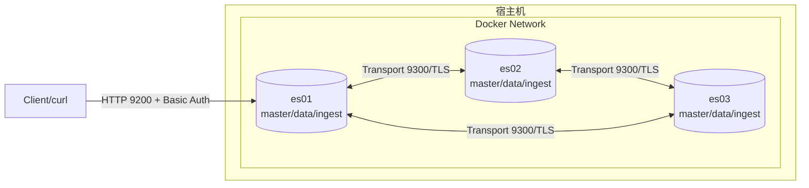

[TOC]

本文档按仓库内 `compose-3nodes-secure/` 目录的三节点 Compose 实践流程编写，默认以单台宿主机运行 3 个 Elasticsearch 容器为目标。

> ⚠️ 本文档模式为 HTTP 明文（不启用 HTTPS），但启用账号密码认证。账号密码会以明文方式在网络中传输，仅用于开发/测试或完全可信内网环境。

## 1. 简介

### 1.1 服务介绍与核心特性

Elasticsearch 是一个基于 Lucene 构建的分布式搜索与分析引擎，核心特性：
- **分布式扩展**：分片与副本自动管理，支持水平扩容
- **近实时检索**：写入后可快速被检索
- **REST API**：HTTP/JSON 交互，便于集成
- **安全能力可选**：可启用 TLS、账号认证、RBAC、审计等（生产建议开启）

### 1.2 适用场景

- **日志分析**：ELK/EFK 栈核心存储
- **全文检索**：站内搜索、电商搜索
- **安全分析**：SIEM、审计检索
- **指标与追踪**：APM/Trace 指标查询与聚合

### 1.3 架构原理图（单机三节点容器）



### 1.4 版本说明（推荐版本）

- Elasticsearch：`9.3.1`（本仓库 Compose 默认值，见 `compose-3nodes-secure/.env`）
- Docker Engine：`24+`（建议使用新版本，便于获得最新的 cgroup/网络修复）
- Docker Compose：`docker compose`（插件形式，v2+，本文档不使用 `docker-compose`）

## 2. 版本选择指南

### 2.1 版本对应关系表

| 版本系列 | 当前状态 | JDK 要求 | 说明 |
| :--- | :--- | :--- | :--- |
| **9.x** | Current | 内置 JDK | 新功能更活跃，默认安全开启 |
| **8.x** | Widely used | 内置 JDK | 生态成熟，默认安全开启 |
| **7.x** | Maintenance | 需要 JDK 11+ | 安全默认行为不同，迁移成本更高 |

### 2.2 版本决策建议

- 新部署优先选择 9.x/8.x：默认安全能力更完整，运维成本更低
- 对兼容性要求高的存量系统：建议先评估客户端 SDK 与索引模板兼容性，再升级

## 3. 目录规划（宿主机持久化）

### 3.1 目录结构（本仓库规划）

部署目录：`01-databases/elasticsearch/compose-3nodes-secure/`

```text
compose-3nodes-secure/
├── .env
├── docker-compose.yml
├── config/
│   ├── es01.yml
│   ├── es02.yml
│   └── es03.yml
├── setup/
│   └── instances.yml
├── certs/                      # 自动生成：Transport TLS 证书（客户端不使用）
│   ├── ca/
│   ├── es01/
│   ├── es02/
│   └── es03/
└── data/                       # 自动生成：三节点数据目录
    ├── es01/
    ├── es02/
    └── es03/
```

### 3.2 持久化策略说明

- `data/`：三节点数据分别落盘到宿主机目录，便于空间规划与排错
- `certs/`：为节点间 9300 通信生成的 Transport TLS 证书（客户端访问 9200 不需要证书）
- 删除容器不会清理数据：需要手动删除 `data/`（以及按需删除 `certs/`）才会完全重置环境

### 3.3 网络与端口规划

| 源地址 | 目标地址 | 目标端口 | 协议 | 用途 | 访问限制 |
| :--- | :--- | :--- | :--- | :--- | :--- |
| Client/本机 | 宿主机 `localhost` | `ES_HTTP_PORT`（默认 9200） | HTTP | REST API（Basic Auth） | 仅限测试网/内网，避免公网暴露 |
| es01/es02/es03 | Docker 网络内互联 | 9300 | TLS over TCP | 节点间 Transport 通信 | 仅容器网络内可达（不对宿主机映射） |

## 4. Docker Compose 三节点部署（HTTP）

### 4.1 前置准备（宿主机）

> 🖥️ **执行节点：宿主机**

#### 4.1.1 内核参数（必须）

Elasticsearch 启动会执行 bootstrap checks，`vm.max_map_count` 不满足会直接退出（exit code 78）。

```bash
sysctl vm.max_map_count

sudo sysctl -w vm.max_map_count=262144
echo "vm.max_map_count=262144" | sudo tee -a /etc/sysctl.conf
```

> 📌 注意：如果宿主机没有 sudo 权限，请切换 root 执行上述命令，并确保该参数已持久化。

#### 4.1.2 目录准备（幂等）

```bash
cd 01-databases/elasticsearch/compose-3nodes-secure
mkdir -p ./certs ./data/es01 ./data/es02 ./data/es03
```

### 4.2 配置（必须修改）

> 🖥️ **执行节点：宿主机**

编辑 `compose-3nodes-secure/.env`：
- `ELASTIC_PASSWORD`：★ 必须修改，`elastic` 超级用户密码
- `ES_HEAP`：⚠️ 根据宿主机可用内存调整（建议为 Docker 可用内存的 50%，且不超过 ~31g）
- `ES_HTTP_PORT`：⚠️ 端口冲突时修改

`.env` 示例：

```dotenv
STACK_VERSION=9.3.1
CLUSTER_NAME=es-3node
ES_HTTP_PORT=9200
ES_HEAP=2g
ELASTIC_PASSWORD=ChangeMe_ThisIsNotSafe
```

### 4.3 启动（三节点）

> 🖥️ **执行节点：宿主机**

```bash
cd 01-databases/elasticsearch/compose-3nodes-secure
docker compose up -d
docker compose ps
```

启动过程说明：
- `setup` 负责生成 Transport TLS 证书到 `certs/`（仅用于节点间 9300 通信）
- `init-perms` 会为 `data/` 目录设置可写权限（首次部署或清理数据后需要）
- `es01`/`es02`/`es03` 启动后，通过 9300 端口组成集群

### 4.4 验证（HTTP）

> 🖥️ **执行节点：宿主机**

验证集群健康：

```bash
curl -s http://localhost:9200 | head -n 1
curl --fail -u "elastic:${ELASTIC_PASSWORD}" http://localhost:9200/_cluster/health?pretty
```

预期输出（关键字段）：

```json
{
  "cluster_name" : "es-3node",
  "status" : "green",
  "number_of_nodes" : 3,
  "number_of_data_nodes" : 3
}
```

验证节点列表：

```bash
curl --fail -u "elastic:${ELASTIC_PASSWORD}" http://localhost:9200/_cat/nodes?v
```

#### 4.4.1 跨主机访问（远程客户端）

远程主机直接通过 HTTP 访问宿主机暴露端口即可：

```bash
curl --fail -u "elastic:你的密码" http://<HOST_IP_OR_DOMAIN>:9200
curl --fail -u "elastic:你的密码" http://<HOST_IP_OR_DOMAIN>:9200/_cat/nodes?v
```

### 4.5 停止与清理

> 🖥️ **执行节点：宿主机**

停止并删除容器（不会删除 `data/`）：

```bash
cd 01-databases/elasticsearch/compose-3nodes-secure
docker compose down --remove-orphans
```

清理集群数据（仅清空索引与数据，谨慎执行）：

```bash
cd 01-databases/elasticsearch/compose-3nodes-secure
docker compose down --remove-orphans
rm -rf ./data
```

完全重置（清空数据与 Transport 证书，谨慎执行）：

```bash
cd 01-databases/elasticsearch/compose-3nodes-secure
docker compose down --remove-orphans
rm -rf ./data ./certs
```

### 4.6 复制到新机器部署（推荐流程）

> 🖥️ **执行节点：新宿主机**

迁移原则：
- 不复制旧机器的 `data/`，在新机器重新初始化数据
- 不复制旧机器的 `certs/`，在新机器重新生成 Transport TLS 证书

建议只复制以下内容到新机器（保持目录结构不变）：
- `compose-3nodes-secure/.env`
- `compose-3nodes-secure/docker-compose.yml`
- `compose-3nodes-secure/config/`
- `compose-3nodes-secure/setup/instances.yml`

新机器部署步骤：

```bash
cd /data/technical-documentation/01-databases/elasticsearch/compose-3nodes-secure

sudo sysctl -w vm.max_map_count=262144
echo "vm.max_map_count=262144" | sudo tee -a /etc/sysctl.conf

mkdir -p ./certs ./data/es01 ./data/es02 ./data/es03
docker compose up -d

curl --fail -u "elastic:${ELASTIC_PASSWORD}" http://localhost:9200/_cluster/health?pretty
```

## 5. 关键配置说明（本仓库版本）

### 5.1 配置文件位置

| 类型 | 路径 |
| :--- | :--- |
| Compose | `compose-3nodes-secure/docker-compose.yml` |
| 环境变量 | `compose-3nodes-secure/.env` |
| 节点配置 | `compose-3nodes-secure/config/es01.yml` |
| 节点配置 | `compose-3nodes-secure/config/es02.yml` |
| 节点配置 | `compose-3nodes-secure/config/es03.yml` |
| 证书实例清单 | `compose-3nodes-secure/setup/instances.yml` |

### 5.2 安全基线说明

- 本方案启用账号认证（`xpack.security.enabled: true`），HTTP 层不启用 TLS（`xpack.security.http.ssl.enabled: false`）
- 9200 为 HTTP 明文且需要认证；未带认证访问会返回 401
- 9300 启用 Transport TLS（节点间加密与身份校验），证书由 `setup` 自动生成并落在 `certs/`

## 6. 日常运维操作

### 6.1 常用命令

```bash
cd 01-databases/elasticsearch/compose-3nodes-secure

docker compose ps
docker compose logs -f es01

curl -u "elastic:${ELASTIC_PASSWORD}" http://localhost:9200
curl -u "elastic:${ELASTIC_PASSWORD}" http://localhost:9200/_cat/indices?v
curl -u "elastic:${ELASTIC_PASSWORD}" http://localhost:9200/_cat/shards?v
```

### 6.2 备份与恢复（Snapshot）

Snapshot 需要一个可写的仓库目录（示例以容器内目录为例，真实使用建议挂载独立备份盘或对象存储）。

```bash
curl -u "elastic:${ELASTIC_PASSWORD}" -X PUT "http://localhost:9200/_snapshot/my_backup" -H 'Content-Type: application/json' -d '
{
  "type": "fs",
  "settings": {
    "location": "/mnt/backups"
  }
}'
```

## 7. 使用手册（数据库专项）

### 7.1 索引管理

```bash
curl -u "elastic:${ELASTIC_PASSWORD}" -X PUT "http://localhost:9200/my-index-001" -H 'Content-Type: application/json' -d '
{
  "settings": {
    "number_of_shards": 3,
    "number_of_replicas": 1
  }
}'

curl -u "elastic:${ELASTIC_PASSWORD}" -X GET "http://localhost:9200/my-index-001/_mapping?pretty"
curl -u "elastic:${ELASTIC_PASSWORD}" -X DELETE "http://localhost:9200/my-index-001"
```

### 7.2 CRUD 示例

```bash
curl -u "elastic:${ELASTIC_PASSWORD}" -X POST "http://localhost:9200/my-index-001/_doc/" -H 'Content-Type: application/json' -d '
{
  "user": "kimchy",
  "post_date": "2026-03-12T00:00:00",
  "message": "trying out Elasticsearch"
}'

curl -u "elastic:${ELASTIC_PASSWORD}" -X GET "http://localhost:9200/my-index-001/_search?q=user:kimchy"
```

## 8. 注意事项与生产检查清单

### 8.1 启动前检查

- [ ] `sysctl vm.max_map_count` 输出不小于 `262144`
- [ ] 宿主机可用内存满足 `ES_HEAP * 3`，并留有余量给文件缓存与系统
- [ ] `ES_HTTP_PORT` 未被占用（默认 9200）
- [ ] `ELASTIC_PASSWORD` 已替换默认弱密码
- [ ] `compose-3nodes-secure/data/` 位于足够性能与容量的磁盘上

### 8.2 常见问题排查（现象 → 原因 → 排查步骤 → 解决方案）

**现象：`es01` 退出，日志包含 `vm.max_map_count [65530] is too low`**
- 原因：bootstrap checks 未通过
- 排查步骤：`sysctl vm.max_map_count`
- 解决方案：
  ```bash
  sudo sysctl -w vm.max_map_count=262144
  echo "vm.max_map_count=262144" | sudo tee -a /etc/sysctl.conf
  ```

**现象：curl 返回 401，提示 `missing authentication credentials`**
- 原因：已启用账号认证，但请求未携带账号密码
- 解决方案：
  ```bash
  curl -u "elastic:${ELASTIC_PASSWORD}" http://localhost:9200
  ```

**现象：`setup` 一直不健康或节点启动失败**
- 原因：Transport TLS 证书未生成或 `certs/` 权限不正确
- 排查步骤：
  ```bash
  docker compose ps
  docker compose logs --tail=200 setup
  ```
- 解决方案：
  ```bash
  docker compose down --remove-orphans
  rm -rf ./certs
  docker compose up -d
  ```

**现象：启动后节点未凑齐 3 个，健康状态 `yellow/red`**
- 原因：节点未正常加入集群或资源不足导致 OOM/重启
- 排查步骤：
  ```bash
  docker compose logs --tail=200 es01
  docker compose logs --tail=200 es02
  docker compose logs --tail=200 es03
  ```
- 解决方案：
  - 降低 `.env` 的 `ES_HEAP`
  - 释放宿主机内存或提高 Docker 可用内存

## 9. 安全加固建议（生产参考）

- 本文档启用了账号认证，但 HTTP 明文传输，生产环境不建议使用
- 生产建议启用 HTTPS（HTTP TLS）并通过内网/网关访问 9200

## 10. 参考资料

- [Elasticsearch 官方文档](https://www.elastic.co/guide/en/elasticsearch/reference/current/index.html)
- [Bootstrap checks](https://www.elastic.co/docs/deploy-manage/deploy/self-managed/bootstrap-checks)
