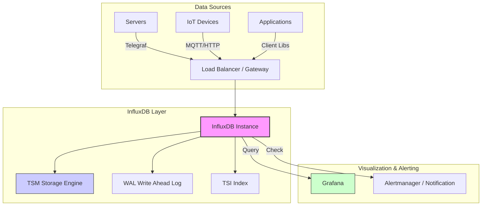

# InfluxDB 生产级部署与运维指南

[TOC]

## 1. 简介

### 1.1 服务介绍与核心特性
InfluxDB 是一个高性能的时序数据库（Time Series Database, TSDB），专为监控、应用程序指标、物联网传感器数据和实时分析等场景设计。
- **高性能写入与查询**：专为时间序列数据优化的 TSM 存储引擎。
- **强大的查询语言**：支持类 SQL 的 InfluxQL（v1/v2兼容）和函数式脚本语言 Flux（v2原生）。
- **生态集成**：与 Telegraf、Grafana 无缝集成，构成 TIG 监控栈的核心。
- **无依赖**：Go 语言编写，单二进制文件部署，无外部依赖。

### 1.2 适用场景
- **DevOps 监控**：存储服务器、容器、网络设备的性能指标。
- **IoT 物联网**：收集传感器数据、工业设备状态。
- **实时分析**：金融行情数据、用户行为日志分析。

### 1.3 架构原理图



### 1.4 目录结构
- `/var/lib/influxdb/engine`: 数据存储目录 (TSM/WAL)
- `/var/lib/influxdb/influxd.bolt`: 元数据存储 (KV store)
- `/etc/influxdb/config.toml`: 配置文件
- `/var/log/influxdb`: 日志目录

---

## 2. 版本选择指南

### 2.1 版本对应关系表

| 版本系列 | 状态 | 特性说明 | 适用场景 |
| :--- | :--- | :--- | :--- |
| **v2.7.x (OSS)** | ★ 推荐 | 引入 Flux 语言，统一 API，内置 UI，单节点 | 新项目默认选择，标准生产环境 |
| **v1.8.x** | 维护中 | 仅支持 InfluxQL，无内置 UI，旧架构兼容 | 维护旧系统，需兼容旧版客户端 |
| **Enterprise** | 商业版 | 支持原生集群（Clustering），高可用，水平扩展 | 关键业务，海量数据，需高可用 |

### 2.2 版本决策建议
> ⚠️ **决策建议**：
> - 对于绝大多数**新部署**的生产环境，请选择 **InfluxDB v2.7+ (OSS)**。
> - 如果业务数据量极大且必须要求**原生高可用集群**（自动故障转移、分片），请考虑 **InfluxDB Enterprise** 或 **InfluxDB Cloud**，或者在应用层实现双写。
> - 本文档以 **InfluxDB v2.7 OSS** 为主进行生产部署说明。

---

## 3. 生产环境规划（高可用架构）

> **注意**：InfluxDB OSS 版本为单节点架构。为满足生产环境高可靠性要求，通常采用 **高性能单机 + 极速恢复** 策略，或在应用层实现双写。
> 下图展示 **企业级/概念性** 的 3 节点高可用架构（适用于 Enterprise 或 代理层双写方案）。

### 3.1 集群架构图

```mermaid
graph TB
    subgraph "Load Balancing Layer"
        LB[Keepalived + HAProxy/Nginx]
        LB_Backup[Backup LB]
        LB -.-> LB_Backup
    end

    subgraph "InfluxDB Cluster / HA Layer"
        N1[InfluxDB Node 01 <br/>(Data/Meta)]
        N2[InfluxDB Node 02 <br/>(Data/Meta)]
        N3[InfluxDB Node 03 <br/>(Data/Meta)]
    end

    subgraph "Storage Layer"
        S1[SSD RAID 10]
        S2[SSD RAID 10]
        S3[SSD RAID 10]
    end
    
    LB --> N1
    LB --> N2
    LB --> N3
    
    N1 --- N2
    N2 --- N3
    N1 --- N3
    
    N1 --> S1
    N2 --> S2
    N3 --> S3

    style LB fill:#f96,stroke:#333,stroke-width:2px
    style N1 fill:#69f,stroke:#333,stroke-width:2px
    style N2 fill:#69f,stroke:#333,stroke-width:2px
    style N3 fill:#69f,stroke:#333,stroke-width:2px
```

### 3.2 节点角色与配置要求

| 角色 | 最低配置 | 推荐配置 | 说明 |
| :--- | :--- | :--- | :--- |
| **InfluxDB Node** | 4 Core, 8GB RAM | 8 Core, 32GB+ RAM | 内存直接影响索引(TSI)容量，建议大内存 |
| **Storage** | 500GB SSD | 2TB+ NVMe SSD (RAID 10) | **必须使用 SSD**，IOPS 要求高 |
| **OS** | Linux | Rocky Linux 9 / Ubuntu 22.04 | 需优化文件句柄数 |

### 3.3 网络与端口规划

| 端口 | 协议 | 用途 | 源地址限制 |
| :--- | :--- | :--- | :--- |
| **8086** | TCP | InfluxDB API / UI / Write / Query | 业务网段 / 监控采集端 |
| **8088** | TCP | RPC (备份/恢复) | 仅限运维管理网段 |

---

## 4. 生产环境部署

### 4.1 前置准备（所有节点）

所有节点需关闭 Swap，并优化内核参数以支持高并发写入。

```bash
# 关闭 Swap (临时 + 永久)
swapoff -a
sed -i '/swap/s/^/#/' /etc/fstab

# 优化内核参数
cat >> /etc/sysctl.d/99-influxdb.conf << 'EOF'
fs.file-max = 6553600
net.core.somaxconn = 4096
vm.swappiness = 0
EOF
sysctl -p /etc/sysctl.d/99-influxdb.conf

# 设置资源限制
cat >> /etc/security/limits.d/influxdb.conf << 'EOF'
* soft nofile 65536
* hard nofile 65536
EOF
```

### 4.2 部署步骤

#### ── Rocky Linux 9 ──────────────────────────

```bash
# 1. 添加 InfluxDB 官方源
cat <<EOF | sudo tee /etc/yum.repos.d/influxdb.repo
[influxdb]
name = InfluxDB Repository - RHEL
baseurl = https://repos.influxdata.com/rhel/9/x86_64/stable/
enabled = 1
gpgcheck = 1
gpgkey = https://repos.influxdata.com/influxdata-archive_compat.key
EOF

# 2. 安装 InfluxDB
sudo dnf install -y influxdb2

# 3. 启动并设置开机自启
sudo systemctl enable --now influxdb
```

#### ── Ubuntu 22.04 ───────────────────────────

```bash
# 1. 导入 GPG Key
wget -q https://repos.influxdata.com/influxdata-archive_compat.key
echo '393e8779c89ac8d958f81f942f9ad7fb82a25e133faddaf92e15b16e6ac9ce4c influxdata-archive_compat.key' | sha256sum -c && cat influxdata-archive_compat.key | gpg --dearmor | sudo tee /etc/apt/trusted.gpg.d/influxdata-archive_compat.gpg > /dev/null

# 2. 添加源
echo 'deb [signed-by=/etc/apt/trusted.gpg.d/influxdata-archive_compat.gpg] https://repos.influxdata.com/debian stable main' | sudo tee /etc/apt/sources.list.d/influxdata.list

# 3. 更新并安装
sudo apt-get update && sudo apt-get install -y influxdb2

# 4. 启动并设置开机自启
sudo systemctl enable --now influxdb
```

### 4.4 集群初始化与配置

InfluxDB v2 首次启动需进行初始化（Setup），创建初始组织（Org）、Bucket 和 Admin 用户。

```bash
# 执行初始化 (交互式或非交互式)
# ⚠️ 请记录输出的 Token，它是最高权限凭证！
influx setup \
  --username admin \
  --password 'S3cretP@ssw0rd' \      # ← 根据实际环境修改
  --org 'my-org' \
  --bucket 'default-bucket' \
  --retention 0 \                    # 0 表示永久保存，生产建议设置具体周期如 30d
  --force
```

### 4.5 安装验证

```bash
# 检查服务状态
systemctl status influxdb

# 验证 API 连通性
curl -I http://localhost:8086/ping

# 预期输出：
# HTTP/1.1 204 No Content
# X-Influxdb-Build: OSS
# X-Influxdb-Version: v2.7.x
```

---

## 5. 关键参数配置说明

### 5.1 核心配置文件详解
配置文件路径：`/etc/influxdb/config.toml`。
InfluxDB v2 默认配置较少，生产环境建议显式创建配置文件。

```bash
cat >> /etc/influxdb/config.toml << 'EOF'
# ── 基础配置 ──
# bolt-path = "/var/lib/influxdb/influxd.bolt"
# engine-path = "/var/lib/influxdb/engine"

# ── HTTP 配置 ──
http-bind-address = ":8086"
# http-idle-timeout = "3m0s"

# ── 性能调优 (根据内存大小调整) ──
# 缓存快照内存大小，默认 25MB。大内存机器可调大以减少磁盘 IO
# cache-snapshot-memory-size = "25m" 

# TSM 压缩并发度
# storage-write-timeout = "10s"

# ── 日志配置 ──
# log-level = "info"  # 可选 debug, info, error
EOF
```

### 5.2 生产环境推荐调优参数
在 `/etc/influxdb/config.toml` 中添加或修改：

```toml
# ★ 限制查询并发数，防止 OOM
query-concurrency = 10    # ← 建议设置为 CPU 核心数 + 2

# ★ 限制单次查询内存使用，防止单条大查询拖垮实例
query-initial-memory-bytes = "10m"
query-max-memory-bytes = "1g"  # ← ⚠️ 根据总内存调整，如 32G 内存可设为 4g-8g

# ★ 预写日志 (WAL) fsync 策略
# 建议保持默认 fsync，若极度追求写入性能且允许掉电丢数据，可改为 "none" (不推荐)
# storage-wal-fsync-delay = "0s"
```

---

## 6. 开发/测试环境快速部署（Docker Compose）

> ⚠️ **注意**：此方案仅用于本地开发或功能测试，**不适用于生产环境**。

### 6.1 Docker Compose 部署

```bash
cat >> docker-compose.yml << 'EOF'
version: '3.8'

services:
  influxdb:
    image: influxdb:2.7
    container_name: influxdb-dev
    ports:
      - "8086:8086"
    volumes:
      - ./data:/var/lib/influxdb2
      - ./config:/etc/influxdb2
    environment:
      - DOCKER_INFLUXDB_INIT_MODE=setup
      - DOCKER_INFLUXDB_INIT_USERNAME=admin
      - DOCKER_INFLUXDB_INIT_PASSWORD=password123  # ← 测试密码
      - DOCKER_INFLUXDB_INIT_ORG=test-org
      - DOCKER_INFLUXDB_INIT_BUCKET=test-bucket
      - DOCKER_INFLUXDB_INIT_RETENTION=1w
    restart: unless-stopped
EOF
```

### 6.2 启动与验证

```bash
docker-compose up -d
docker-compose logs -f
# 访问 http://localhost:8086 使用 Web UI
```

---

## 7. 日常运维操作

### 7.1 常用管理命令

```bash
# 查看所有 Org
influx org list

# 查看所有 Bucket
influx bucket list

# 创建新的 Token (全权限)
influx auth create --all-access --org my-org

# 写入测试数据 (Line Protocol)
influx write --bucket default-bucket --org my-org "cpu,host=server01 usage=0.5"
```

### 7.2 备份与恢复
InfluxDB v2 数据备份非常重要，建议设置定时任务。

```bash
# ── 全量备份 ──────────────────────────────
# 备份所有数据到指定目录
influx backup /path/to/backup_dir/$(date +%Y%m%d) -t <Admin-Token>

# ── 恢复数据 ──────────────────────────────
# 恢复前需停止服务或使用新的实例
# 恢复到临时目录或覆盖原目录
influx restore /path/to/backup_dir/20231001
```

### 7.3 集群扩缩容
- **OSS 版本**：不支持在线扩缩容。如需扩容，通常是**垂直升级**（增加 CPU/RAM/Disk）或**分库分表**（在应用层将不同业务写入不同 InfluxDB 实例）。
- **Enterprise 版本**：支持 `influxd-ctl add-data` 和 `add-meta` 命令添加节点，数据会自动 Rebalance。

### 7.4 版本升级
```bash
# 1. 备份数据
influx backup /tmp/backup_pre_upgrade

# 2. 停止服务
systemctl stop influxdb

# 3. 更新软件包
# Rocky: dnf update influxdb2
# Ubuntu: apt-get update && apt-get install --only-upgrade influxdb2

# 4. 启动服务
systemctl start influxdb
```

---

## 8. 使用手册（数据库专项）

### 8.1 连接与认证
InfluxDB v2 必须使用 Token 进行认证。

```bash
# CLI 配置 (避免每次输入 Token)
influx config create --active \
  -n prod-config \
  -u http://localhost:8086 \
  -o my-org \
  -t "Your-Super-Secret-Token"
```

### 8.2 库/表/索引管理命令
InfluxDB v2 中 "Database" 概念变为 "Bucket"（包含存储策略 Retention Policy）。

```bash
# 创建 Bucket (保留 30 天)
influx bucket create -n app-metrics -r 30d

# 删除 Bucket
influx bucket delete -n app-metrics
```

### 8.3 数据增删改查（CRUD）

#### 查询 (Flux 语言)
在 Web UI 的 Data Explorer 或 CLI 中执行：

```flux
// 查询过去 1 小时的 cpu usage
from(bucket: "default-bucket")
  |> range(start: -1h)
  |> filter(fn: (r) => r["_measurement"] == "cpu")
  |> filter(fn: (r) => r["_field"] == "usage_user")
  |> aggregateWindow(every: 1m, fn: mean)
  |> yield(name: "mean")
```

#### 删除 (Delete with Predicate)
InfluxDB **不建议频繁删除**，删除操作是逻辑删除，开销较大。

```bash
# 删除指定时间范围内，host=server1 的数据
influx delete \
  --bucket default-bucket \
  --start '2023-01-01T00:00:00Z' \
  --stop '2023-02-01T00:00:00Z' \
  --predicate '_measurement="cpu" AND host="server1"'
```

### 8.4 用户与权限管理

```bash
# 创建只读用户 (分两步：创建用户 -> 创建授权 Token)
# 1. 创建用户
influx user create -n viewer -p "password"

# 2. 为该用户创建只读 Token (需指定 User ID 和 Resource ID)
# 推荐在 UI 中操作 "API Tokens" -> "Generate Custom Token" 更直观
```

### 8.5 性能查询与慢查询分析
InfluxDB v2 提供内部指标 bucket `_monitoring` (需开启) 或通过 `/metrics` 接口暴露给 Prometheus。

```bash
# 实时查看正在执行的查询 (v2.x 需查询系统表)
# 在 Flux 中查询 system bucket
from(bucket: "_system")
  |> range(start: -5m)
  |> filter(fn: (r) => r["_measurement"] == "query_control")
```

### 8.6 生产常见故障处理命令

```bash
# 1. 磁盘写满处理
# 检查 WAL 目录大小
du -sh /var/lib/influxdb/engine/wal

# 2. 无法启动：检查 bolt 数据库损坏
influxd inspect report-db /var/lib/influxdb/influxd.bolt

# 3. 内存溢出 (OOM)
# 检查 dmesg
dmesg | grep -i kill
# 调小 config.toml 中的 cache-snapshot-memory-size 和 query-max-memory-bytes
```

---

## 9. 注意事项与生产检查清单

### 9.1 安装前环境核查
- [ ] **磁盘类型**：必须是 SSD/NVMe，HDD 会导致严重的性能问题。
- [ ] **时间同步**：所有节点必须配置 NTP (`chronyd`)，时间偏差会导致数据写入失败或查询异常。
- [ ] **端口占用**：确保 8086 未被其他服务占用。

### 9.2 常见故障排查
**错误：`engine: cache maximum memory size exceeded`**
- **原因**：写入速度过快，内存缓存（Cache）已满，刷盘（Snapshot）来不及。
- **解决**：
  1. 增加内存。
  2. 检查磁盘 IOPS 是否瓶颈。
  3. 降低客户端写入频率或 batch size。

**错误：`429 Too Many Requests`**
- **原因**：查询或写入并发超过限制。
- **解决**：调整 `query-concurrency` 或优化查询语句。

### 9.3 安全加固建议
1. **启用 HTTPS**：生产环境必须配置 TLS。
   ```bash
   # config.toml
   tls-cert = "/etc/ssl/influxdb.crt"
   tls-key = "/etc/ssl/influxdb.key"
   ```
2. **防火墙限制**：仅允许受信任 IP 访问 8086 端口。
3. **Token 保护**：严禁将 Admin Token 硬编码在客户端代码中。

---

## 10. 参考资料
- [InfluxDB v2 Documentation](https://docs.influxdata.com/influxdb/v2/)
- [InfluxDB Operational Best Practices](https://docs.influxdata.com/influxdb/v2/reference/internals/)
- [Flux Language Reference](https://docs.influxdata.com/flux/v0.x/)
