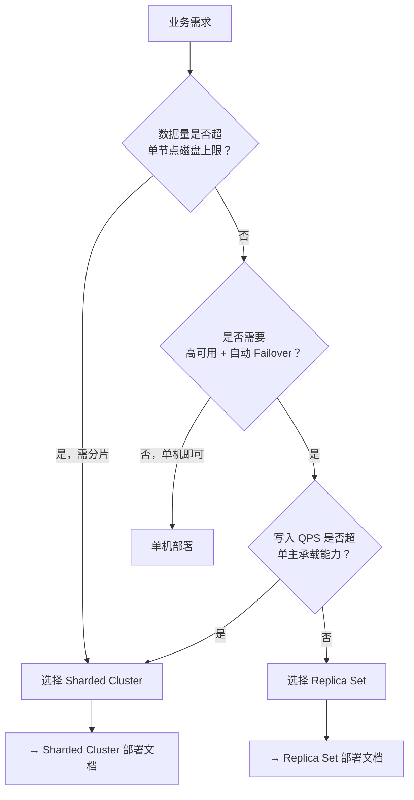

> [TOC]

# MongoDB 集群方案选型指南

本文档帮助你在 **Replica Set（副本集）** 与 **Sharded Cluster（分片集群）** 之间做出选择，并说明 MongoDB 7.x 与 8.x 的版本差异。

---

## 1. 方案对比

| 维度 | Replica Set（副本集） | Sharded Cluster（分片集群） |
|------|----------------------|----------------------------|
| **架构模式** | 主从复制 + 自动选主，单主多从 | 多分片 + Config Server + mongos 路由 |
| **最低节点数** | 3 节点（1 主 2 从） | 9 节点起（3 分片×3 副本 + 3 Config + mongos） |
| **数据分片** | ❌ 不支持，单主承载全部数据 | ✅ 支持，按分片键水平分片 |
| **自动 Failover** | ✅ 支持，主宕机时从节点自动提升 | ✅ 支持，每个分片独立副本集 |
| **水平扩展** | ❌ 不支持，仅读写分离 | ✅ 支持在线添加分片 |
| **运维复杂度** | 较低 | 较高（分片键设计、均衡、mongos 管理） |
| **典型用户规模** | 数据量 < 1TB、QPS 万级、单主可承载 | 数据量 TB～PB 级、高并发写、需线性扩展 |
| **适用场景** | 中小型生产、会话存储、配置中心、业务主库 | 大数据量、高并发、需分片 |

---

## 2. 版本对比（MongoDB 7.x vs 8.x）

| 维度 | MongoDB 7.x | MongoDB 8.x |
|------|-------------|-------------|
| **发布周期** | 2023-2025 | 2025+ |
| **关键新特性** | 事务性能提升、复合通配索引、可查询加密 GA | 并发写入 +20%、读吞吐 +36%、`null` 查询语义变更 |
| **破坏性变更** | 无（相对 6.x） | `null` 查询不再匹配 `undefined`；直连分片受限 |
| **客户端兼容性** | 驱动 2.x 兼容 | 驱动需支持 8.0 协议 |
| **是否需改业务代码** | 否 | ⚠️ 若依赖 `{field: null}` 匹配 `undefined` 需调整 |
| **升级路径** | 6.x → 7.x 直接升级 | 必须从 7.0 系列升级 |
| **大厂采用情况** | 广泛（7.0 LTS 至 2027） | 逐步迁移中 |

---

## 3. 选型决策树

---

## 4. 注意事项

### 4.1 方案不可混用

- **Replica Set 与 Sharded Cluster 不能混用于同一业务**：架构、连接方式、分片键设计完全不同。
- 同一公司可同时存在 Replica Set 和 Sharded Cluster，需独立部署、独立运维。

### 4.2 迁移路径

| 迁移方向 | 可行性 | 复杂度 | 说明 |
|----------|--------|--------|------|
| **Replica Set → Sharded Cluster** | 可行 | 高 | 需选择分片键、数据迁移 |
| **Sharded Cluster → Replica Set** | 不推荐 | 极高 | 需合并多分片数据 |

### 4.3 版本升级建议

- **新建集群**：优先 MongoDB 7.0.x（LTS），或 8.2.x（需评估 null 查询变更）。
- **现有 7.x 集群**：可滚动升级至 8.x，注意 `null` 查询语义。
- **现有 6.x 集群**：必须先升级至 7.x，再升级至 8.x。

---

## 5. 部署文档索引

| 方案 | 文档 | 说明 |
|------|------|------|
| **Replica Set** | [MongoDB-ReplicaSet 生产级部署与运维指南](./mongodb-replicaset-production/MongoDB-ReplicaSet生产级部署与运维指南.md) | 副本集模式，3 节点起，高可用 |
| **Sharded Cluster** | [MongoDB-ShardedCluster 生产级部署与运维指南](./mongodb-sharded-production/MongoDB-ShardedCluster生产级部署与运维指南.md) | 分片模式，水平扩展，大数据量 |
