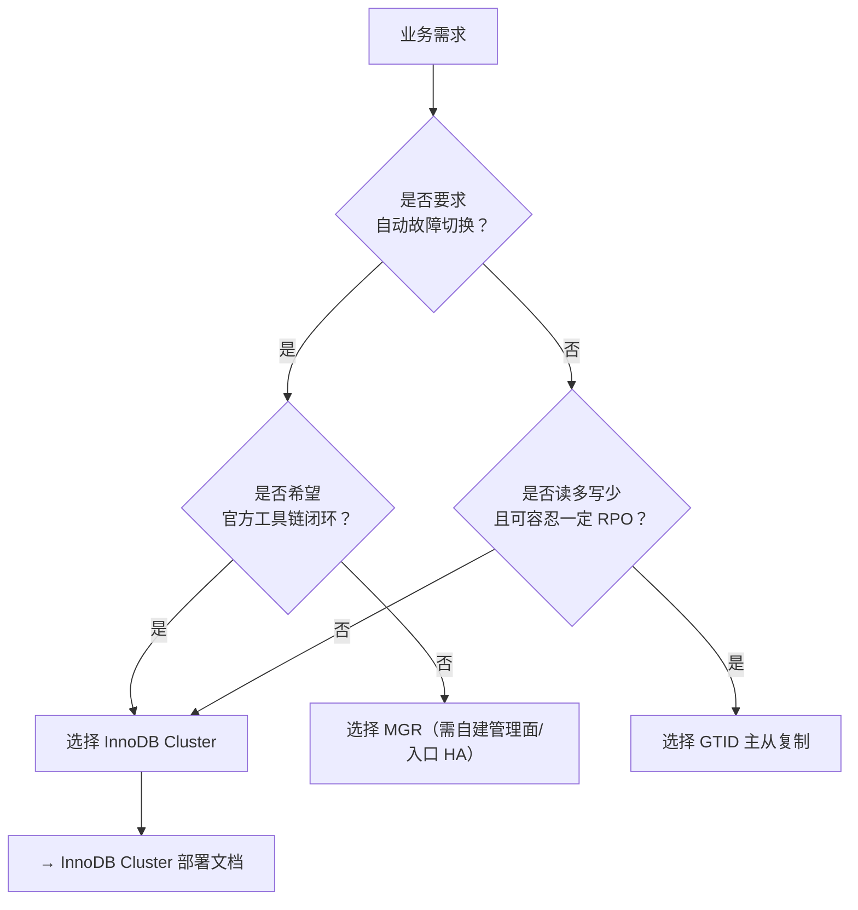

> [TOC]

# MySQL 集群方案选型指南

本文档面向 SRE/DBA 运维团队，用于在 MySQL 的主流高可用方案之间做选型，并给出本目录已提供的生产级部署文档索引。

---

## 1. 方案对比

| 维度 | InnoDB Cluster（AdminAPI） | MGR（裸组复制） | GTID 主从复制（异步） |
|------|-----------------------------|-----------------|------------------------|
| **架构模式** | Group Replication + 元数据 + MySQL Router（可选） | Group Replication（需自行补齐管理面） | 一主多从（异步/半同步可选） |
| **最低节点数** | 3 MySQL（单主） | 3 MySQL（单主/多主） | 2 MySQL（生产推荐 1 主 2 从） |
| **一致性模型** | 组提交 + 认证（可配置一致性级别） | 同左（取决于 MGR 配置） | 异步默认，读写一致性依赖业务约束 |
| **自动 Failover** | ✅（组内选主，Router 侧自动路由） | ✅（组内选主） | ❌（需 Orchestrator/MHA/ProxySQL 等补齐） |
| **读扩展** | ✅（二级节点只读；Router 可分流 RO） | ✅（同左） | ✅（只读从库扩展） |
| **写扩展** | ⚠️（单主推荐；多主会显著提高冲突成本） | ⚠️（同左） | ❌（单主写） |
| **运维复杂度** | 中（官方工具链，流程清晰） | 高（需手工维护成员/路由/故障处置） | 低-中（复制运维成熟，但 HA 组件多样） |
| **适用场景** | 通用 OLTP，强调自动故障切换、标准化 | 对 MGR 非常熟悉、需要深度定制 | 中小规模、读多写少、容忍 RPO 的场景 |
| **典型风险点** | 网络抖动导致成员驱逐、Router 入口 HA | 配置/管理命令碎片化 | 主库故障切换流程与一致性治理 |

---

## 2. 版本对比（8.0 vs 8.4 LTS vs Innovation）

| 维度 | MySQL 8.0 | MySQL 8.4 LTS | MySQL Innovation（9.x） |
|------|-----------|---------------|--------------------------|
| **发布策略** | 长期维护系列（历史版本） | LTS（生产主线） | 创新版本（更快迭代） |
| **生产推荐** | 仅用于存量集群（不建议新上） | ✅ 新建集群优先 | ⚠️ 有明确需求再上 |
| **InnoDB Cluster 支持** | ✅ | ✅ | ⚠️ 需严格对齐生态与工具链 |
| **客户端兼容性** | 成熟 | 成熟 | ⚠️ 需评估驱动/ORM 适配 |
| **是否需改业务代码** | 通常不需要 | 通常不需要 | ⚠️ 取决于使用特性与驱动版本 |

> 📌 注意：本目录当前生产级部署文档以 **MySQL 8.4 LTS** 为主线；8.0 存量用户建议按“滚动升级 + 回滚预案”推进到 8.4 LTS。

---

## 3. 选型决策树

---

## 4. 注意事项

### 4.1 方案不可混用（连接入口差异）

- InnoDB Cluster 通常通过 **MySQL Router** 提供固定入口（RW/RO 端口），业务侧应按入口规范接入。
- 主从复制通常需要额外代理/VIP 才能做到“固定入口 + 自动切主”；否则业务需要感知主库变化。

### 4.2 迁移路径（常见）

| 迁移方向 | 可行性 | 复杂度 | 说明 |
|----------|--------|--------|------|
| 主从复制 → InnoDB Cluster | 可行 | 中-高 | 需要停机/双写窗口与一致性校验；建议先演练回滚 |
| MGR → InnoDB Cluster | 可行 | 中 | InnoDB Cluster 本质上是 “MGR + 管理面 + Router”，建议按官方流程重建元数据 |

---

## 5. 部署文档索引

| 方案 | 文档 | 说明 |
|------|------|------|
| **MySQL 8.4 LTS · InnoDB Cluster** | [MySQL8-InnoDBCluster生产级部署与运维指南](./mysql8-innodbcluster-production/MySQL8-InnoDBCluster生产级部署与运维指南.md) | 3 节点起，自动故障切换，推荐生产主线 |

