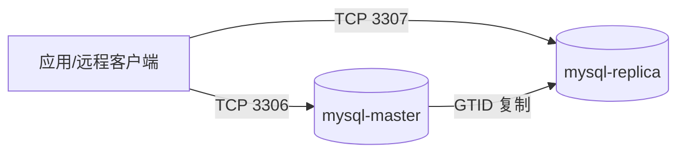

# MySQL 主从复制（Docker Compose）部署与验证指南（生产基线）

> **部署目标**：一主一从、GTID 自动定位复制、从库只读（持久化）、配置参数带注释  
> **适用场景**：中小规模生产/测试环境的主从复制；不包含自动故障转移（需额外方案）  
> **版本**：MySQL 8.0（本仓库 Compose 默认）  

---

## 1. 架构与访问方式

### 1.1 架构图



### 1.2 端口与访问

本方案对宿主机映射端口如下（可直接用宿主机 IP 远程访问）：

| 角色 | 容器 | 宿主机端口 | 容器端口 | 用途 |
|---|---|---:|---:|---|
| 主库 | `mysql-master` | 3306 | 3306 | 业务读写、DDL、账号创建 |
| 从库 | `mysql-replica` | 3307 | 3306 | 只读查询、备份、离线分析 |

远程连接示例（推荐使用业务账号）：

```bash
mysql -h <宿主机IP> -P 3306 -u app_user -p
mysql -h <宿主机IP> -P 3307 -u app_user -p
```

> 说明：从库会在首次启动完成后由初始化脚本执行 `SET PERSIST read_only=ON; SET PERSIST super_read_only=ON;`，避免误写。

---

## 2. 目录结构

部署目录：

`01-databases/mysql/compose-replication/`

```text
compose-replication/
├── .env
├── docker-compose.yml
├── config/
│   ├── master/my.cnf
│   └── replica/my.cnf
└── init/
    ├── master/01-create-replication-user.sh
    └── replica/01-setup-replication.sh
```

关键文件：

- Compose：[docker-compose.yml](file:///data/technical-documentation/01-databases/mysql/compose-replication/docker-compose.yml)
- 环境变量：[.env](file:///data/technical-documentation/01-databases/mysql/compose-replication/.env)
- 主库配置：[my.cnf](file:///data/technical-documentation/01-databases/mysql/compose-replication/config/master/my.cnf)
- 从库配置：[my.cnf](file:///data/technical-documentation/01-databases/mysql/compose-replication/config/replica/my.cnf)

---

## 3. 配置说明（必须修改）

编辑 [.env](file:///data/technical-documentation/01-databases/mysql/compose-replication/.env)：

- `MYSQL_ROOT_PASSWORD`：root 密码（仅用于容器内初始化与管理，生产不建议对外暴露 root）
- `MYSQL_DATABASE` / `MYSQL_USER` / `MYSQL_PASSWORD`：业务库与业务账号（只在主库创建，随后通过复制同步到从库）
- `MYSQL_REPLICATION_USER` / `MYSQL_REPLICATION_PASSWORD`：复制账号（主库创建，从库使用）

---

## 4. 生产级配置基线（带注释）

### 4.1 主库关键项

主库配置见 [master/my.cnf](file:///data/technical-documentation/01-databases/mysql/compose-replication/config/master/my.cnf)，重点包括：

- 字符集统一：`utf8mb4`
- GTID 复制：`gtid_mode=ON`、`enforce_gtid_consistency=ON`
- Binlog：`log_bin`、`binlog_format=ROW`、`sync_binlog=1`、`binlog_expire_logs_seconds`
- InnoDB：`innodb_dedicated_server=ON`、`innodb_flush_method=O_DIRECT`、`innodb_flush_log_at_trx_commit=1`
- 连接与句柄：`max_connections`、`open_files_limit`
- 慢日志：`slow_query_log=ON`、`long_query_time=0.5`

### 4.2 从库关键项

从库配置见 [replica/my.cnf](file:///data/technical-documentation/01-databases/mysql/compose-replication/config/replica/my.cnf)，重点包括：

- 唯一 `server-id`
- GTID 复制基线：同主库
- 崩溃恢复：`relay_log_recovery=ON`、复制元信息落表
- Relay Log 命名：避免主机名变化导致复制异常
- 只读策略：不在配置文件中硬开启（避免初始化阶段失败），由初始化脚本 `SET PERSIST` 持久化开启

---

## 5. 部署步骤（Docker Compose）

> 🖥️ 执行节点：宿主机

```bash
cd /data/technical-documentation/01-databases/mysql/compose-replication

docker compose up -d
docker compose ps
```

数据持久化方式：

- 使用 Docker **named volume**：`mysql-master-data`、`mysql-replica-data`
- 完全重置需要 `docker compose down -v`

---

## 6. 验证过程（已验证）

### 6.1 验证复制线程状态

在从库容器内执行（走 socket）：

```bash
docker exec mysql-replica sh -c \
  'mysql --socket=/var/lib/mysql/mysql.sock -uroot -p"$MYSQL_ROOT_PASSWORD" -e "SHOW REPLICA STATUS\\G" \
   | egrep -i "Replica_IO_Running|Replica_SQL_Running|Seconds_Behind_Source|Source_Host|Source_User|Auto_Position"'
```

已验证关键输出（示例）：

```text
Source_Host: mysql-master
Source_User: repl
Replica_IO_Running: Yes
Replica_SQL_Running: Yes
Seconds_Behind_Source: 0
Auto_Position: 1
```

### 6.2 写入主库，验证从库同步

```bash
docker exec mysql-master sh -c \
  'mysql --socket=/var/lib/mysql/mysql.sock -uroot -p"$MYSQL_ROOT_PASSWORD" -e "\
     CREATE DATABASE IF NOT EXISTS repl_test; \
     CREATE TABLE IF NOT EXISTS repl_test.t(id INT PRIMARY KEY, v VARCHAR(32)); \
     INSERT INTO repl_test.t VALUES (1, \"hello\") \
       ON DUPLICATE KEY UPDATE v=VALUES(v); \
   "'

sleep 2

docker exec mysql-replica sh -c \
  'mysql --socket=/var/lib/mysql/mysql.sock -uroot -p"$MYSQL_ROOT_PASSWORD" -e "SELECT * FROM repl_test.t;"'
```

已验证输出（示例）：

```text
id  v
1   hello
```

### 6.3 验证从库只读已持久化开启

```bash
docker exec mysql-replica sh -c \
  'mysql --socket=/var/lib/mysql/mysql.sock -uroot -p"$MYSQL_ROOT_PASSWORD" -e "\
     SHOW VARIABLES LIKE \"read_only\"; \
     SHOW VARIABLES LIKE \"super_read_only\"; \
   "'
```

已验证输出（示例）：

```text
read_only       ON
super_read_only ON
```

---

## 7. 常用运维命令

### 7.1 复制状态与故障处理

```bash
docker exec mysql-replica sh -c 'mysql --socket=/var/lib/mysql/mysql.sock -uroot -p"$MYSQL_ROOT_PASSWORD" -e "SHOW REPLICA STATUS\\G"'
docker exec mysql-replica sh -c 'mysql --socket=/var/lib/mysql/mysql.sock -uroot -p"$MYSQL_ROOT_PASSWORD" -e "STOP REPLICA; START REPLICA;"'
docker exec mysql-replica sh -c 'mysql --socket=/var/lib/mysql/mysql.sock -uroot -p"$MYSQL_ROOT_PASSWORD" -e "SHOW WARNINGS;"'
```

如果出现 SQL 线程报错，先看：

```bash
docker exec mysql-replica sh -c 'mysql --socket=/var/lib/mysql/mysql.sock -uroot -p"$MYSQL_ROOT_PASSWORD" -e "SHOW REPLICA STATUS\\G" | egrep -i \"Last_SQL_Error|Last_Error\"'
```

### 7.2 主库 binlog/GTID 观察

```bash
docker exec mysql-master sh -c 'mysql --socket=/var/lib/mysql/mysql.sock -uroot -p"$MYSQL_ROOT_PASSWORD" -e "SHOW MASTER STATUS\\G"'
docker exec mysql-master sh -c 'mysql --socket=/var/lib/mysql/mysql.sock -uroot -p"$MYSQL_ROOT_PASSWORD" -e "SELECT @@gtid_executed\\G"'
```

### 7.3 性能与排障（慢日志/连接）

```bash
docker exec mysql-master sh -c 'mysql --socket=/var/lib/mysql/mysql.sock -uroot -p"$MYSQL_ROOT_PASSWORD" -e "SHOW VARIABLES LIKE \"slow_query_log\"; SHOW VARIABLES LIKE \"long_query_time\";"'
docker exec mysql-master sh -c 'mysql --socket=/var/lib/mysql/mysql.sock -uroot -p"$MYSQL_ROOT_PASSWORD" -e "SHOW FULL PROCESSLIST;" | head -n 50'
```

---

## 8. 清理与重置

停止但保留数据（named volume 保留）：

```bash
cd /data/technical-documentation/01-databases/mysql/compose-replication
docker compose down --remove-orphans
```

完全重置（删除数据卷，谨慎执行）：

```bash
cd /data/technical-documentation/01-databases/mysql/compose-replication
docker compose down -v --remove-orphans
```

---

## 9. 生产注意事项

- 该方案仅提供“主从复制”，不包含自动故障转移；生产可结合 ProxySQL/Keepalived/Orchestrator 等实现 VIP/自动切主。
- `binlog_format` 在新版本 MySQL 里有弃用提示，但 ROW 仍是复制与审计最常见基线，按版本演进再调整。
- 生产建议配合备份体系（全量 + binlog），并定期验证恢复演练。
