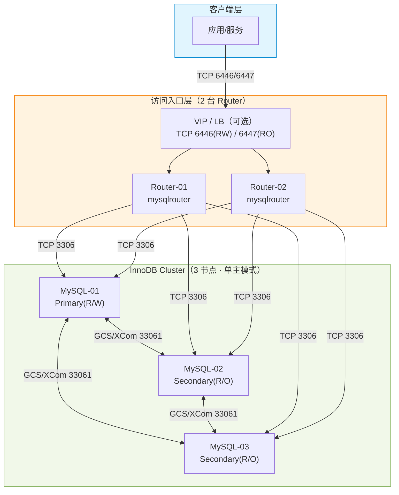

> [TOC]

# MySQL8-InnoDBCluster 生产级部署与运维指南

---

## 1. 简介

### 1.1 服务介绍与核心特性

MySQL 是通用关系型数据库，InnoDB 是其默认事务存储引擎。

InnoDB Cluster 是 MySQL 官方提供的高可用方案，核心由 **Group Replication（组复制）** + **MySQL Shell（AdminAPI 管理面）** + **MySQL Router（连接入口）** 组成，重点特性：

- **自动故障切换**：Primary 故障时自动选主，Secondary 自动跟随
- **固定连接入口**：Router 提供 RW/RO 端口，业务侧按端口策略接入
- **一致性可控**：可设置一致性级别（如 `BEFORE_ON_PRIMARY_FAILOVER`）在可用性与一致性之间权衡
- **在线扩容缩容**：按 AdminAPI 流程添加/移除实例
- **运维可观测**：通过 `mysqlsh`、`performance_schema` 获取集群状态与成员信息

### 1.2 适用场景

| 场景 | 说明 |
|------|------|
| 通用 OLTP | 需要自动故障切换与标准化运维流程 |
| 读扩展 | Secondary 提供只读查询入口（配合 Router RO 端口） |
| 统一入口治理 | 业务不直接连 MySQL 节点，统一走 Router/VIP |

### 1.3 架构原理图



### 1.4 版本说明

> 以下版本号通过 Docker Hub / GitHub Releases API 实际查询确认；并在本机 Docker 伪集群中完成 InnoDB Cluster 组建与故障切换验证。

| 组件 | 版本 | 兼容性 |
|------|------|--------|
| **MySQL Server** | 8.4.8（LTS） | Linux x86_64 / ARM64 |
| **MySQL Shell（mysqlsh）** | 8.4.4（验证环境镜像） | 需与 Server 同大版本（推荐同小版本） |
| **MySQL Router** | 8.4 LTS（随官方仓库提供） | 与 InnoDB Cluster 配套 |
| **mysqld_exporter** | v0.18.0（Prometheus） | Linux x86_64 |
| **操作系统** | Rocky Linux 9.x / Ubuntu 22.04 LTS | 内核 ≥ 5.14（推荐） |

---

## 2. 版本选择指南

### 2.1 版本对应关系表

| 组件 | 要求 |
|------|------|
| MySQL Server | 8.4 LTS（生产主线） |
| MySQL Shell / Router | 与 Server 同大版本（8.4） |
| 驱动/ORM | 支持 MySQL 8.x 协议与认证插件（`caching_sha2_password`） |

### 2.2 版本决策建议

| 场景 | 建议 |
|------|------|
| 新建集群 | 直接上 MySQL 8.4 LTS + InnoDB Cluster |
| 存量 8.0 集群 | 先补齐备份与回滚预案，再按滚动升级策略迁移到 8.4 LTS |
| 存量主从复制 | 如需自动切换与固定入口，优先评估迁移到 InnoDB Cluster |

---

## 3. 生产环境规划（高可用架构）

### 3.1 集群架构图

生产推荐最小规模：

- MySQL：3 节点（1 Primary + 2 Secondary）
- Router：2 节点（建议与 MySQL 分离部署）

### 3.2 节点角色与配置要求

| 角色 | 数量 | 最低配置 | 推荐配置 | 关键要求 |
|------|------|----------|----------|----------|
| MySQL 节点 | 3 | 4C/16G/SSD 200G | 8C/32G/SSD 500G+ | 低延迟网络、独立数据盘 |
| Router 节点 | 2 | 2C/4G/SSD 50G | 4C/8G/SSD 100G | 与业务同网段、可做 VIP/LB |

> ⚠️ 数据盘规划：建议使用独立挂载点（如 `/data/mysql`），并与系统盘分离（避免 I/O 干扰）。

### 3.3 网络与端口规划

| 源 | 目标 | 端口/协议 | 用途 |
|----|------|-----------|------|
| 应用网段 | VIP/LB | 6446/tcp | 业务读写入口（Router RW） |
| 应用网段 | VIP/LB | 6447/tcp | 业务只读入口（Router RO） |
| Router-01/02 | MySQL-01/02/03 | 3306/tcp | MySQL 协议连接 |
| Router-01/02 | MySQL-01/02/03 | 33060/tcp | X Protocol（可选） |
| MySQL-01/02/03 | MySQL-01/02/03 | 33061/tcp | Group Replication 通信（XCom/GCS） |
| Prometheus | MySQL-01/02/03 | 9104/tcp | mysqld_exporter 指标采集（可选） |

---

## 4. 生产环境部署

### 4.1 前置准备（所有节点）

> 🖥️ **执行节点：所有节点（MySQL-01/02/03 + Router-01/02）**

#### 4.1.1 时间同步与基础依赖

```bash
dnf install -y chrony curl wget tar gzip
systemctl enable --now chronyd
```

```bash
# ✅ 验证
timedatectl status | egrep -i "System clock synchronized|NTP service"
# 预期输出关键行包含：System clock synchronized: yes
```

> 📌 注意：Ubuntu 22.04 差异仅在包管理器（`apt-get`），其余步骤相同。

#### 4.1.2 内核与资源限制基线

```bash
cat > /etc/sysctl.d/99-mysql.conf << 'EOF'
vm.swappiness = 1
fs.file-max = 1048576
net.core.somaxconn = 65535
net.ipv4.tcp_max_syn_backlog = 65535
net.ipv4.ip_local_port_range = 1024 65535
EOF

sysctl -p /etc/sysctl.d/99-mysql.conf
```

```bash
cat > /etc/security/limits.d/99-mysql.conf << 'EOF'
mysql soft nofile 65535
mysql hard nofile 65535
mysql soft nproc  65535
mysql hard nproc  65535
EOF
```

#### 4.1.3 防火墙放通（按规划最小化）

```bash
firewall-cmd --permanent --add-port=3306/tcp
firewall-cmd --permanent --add-port=33060/tcp
firewall-cmd --permanent --add-port=33061/tcp
firewall-cmd --reload
```

```bash
# ✅ 验证
firewall-cmd --list-ports | tr ' ' '\n' | egrep '3306/tcp|33060/tcp|33061/tcp'
# 预期输出包含：3306/tcp 33060/tcp 33061/tcp
```

### 4.2 部署步骤（Rocky Linux 9）

#### 4.2.1 下载地址验证（仓库 RPM / APT）

> 🖥️ **执行节点：任意一台节点**

```bash
# ✅ 验证（Rocky Linux 9 仓库 RPM）
curl -sSI -L https://dev.mysql.com/get/mysql84-community-release-el9-3.noarch.rpm | head -n 20
# 预期输出包含：HTTP/1.1 200 OK

# ✅ 验证（Ubuntu/Debian 仓库 DEB）
curl -sSI -L https://dev.mysql.com/get/mysql-apt-config_0.8.36-1_all.deb | head -n 20
# 预期输出包含：HTTP/1.1 200 OK
```

#### 4.2.2 安装 MySQL 软件包（MySQL 节点）

> 🖥️ **执行节点：MySQL-01/02/03**

```bash
cd /tmp
[ -f mysql84-community-release-el9-3.noarch.rpm ] || \
  curl -L -o mysql84-community-release-el9-3.noarch.rpm \
  https://dev.mysql.com/get/mysql84-community-release-el9-3.noarch.rpm

dnf install -y ./mysql84-community-release-el9-3.noarch.rpm
dnf install -y mysql-community-server mysql-shell
```

```bash
# ✅ 验证
mysqld --version
mysqlsh --version
```

#### 4.2.3 安装 MySQL Router（Router 节点）

> 🖥️ **执行节点：Router-01/02**

```bash
cd /tmp
[ -f mysql84-community-release-el9-3.noarch.rpm ] || \
  curl -L -o mysql84-community-release-el9-3.noarch.rpm \
  https://dev.mysql.com/get/mysql84-community-release-el9-3.noarch.rpm

dnf install -y ./mysql84-community-release-el9-3.noarch.rpm
dnf install -y mysql-router mysql-shell
```

```bash
# ✅ 验证
mysqlrouter --version
mysqlsh --version
```

#### 4.2.4 目录规划（数据盘）

> 🖥️ **执行节点：MySQL-01/02/03**

```bash
mkdir -p /data/mysql
chown -R mysql:mysql /data/mysql
chmod 750 /data/mysql
```

### 4.3 集群初始化与配置

#### 4.3.1 配置文件（逐行注释）

> 🖥️ **执行节点：MySQL-01/02/03**

```bash
cat > /etc/my.cnf << 'EOF'
[mysqld]

# ====================
# 基础参数
# ====================

user = mysql
port = 3306
bind-address = 0.0.0.0

datadir = /data/mysql            # ★ ← 根据实际挂载点修改
socket  = /data/mysql/mysql.sock # ★ ← 与 datadir 保持一致
pid-file = /data/mysql/mysqld.pid

character-set-server = utf8mb4
collation-server = utf8mb4_0900_ai_ci
skip_name_resolve = ON           # ★（减少 DNS 解析导致的连接延迟）

default_time_zone = +08:00       # ⚠️ 按实际时区修改（建议统一）

# ====================
# InnoDB（生产基线）
# ====================

innodb_dedicated_server = ON     # ⚠️ 专用实例推荐开启（会按内存自动设置 buffer pool）
innodb_flush_method = O_DIRECT
innodb_flush_log_at_trx_commit = 1
sync_binlog = 1

# ====================
# Binlog / GTID（InnoDB Cluster 必需）
# ====================

server_id = 101                  # ★ ← 每个节点唯一（示例：101/102/103）
log_bin = mysql-bin
binlog_format = ROW              # ⚠️ 8.4 会提示弃用；按官方演进评估替换
binlog_row_image = FULL
binlog_expire_logs_seconds = 604800

gtid_mode = ON
enforce_gtid_consistency = ON
log_replica_updates = ON
binlog_checksum = NONE

# ====================
# 慢查询与审计（基线）
# ====================

slow_query_log = ON
long_query_time = 0.5            # ⚠️ 按业务调优
log_queries_not_using_indexes = OFF
log_error_verbosity = 2

# ====================
# Group Replication（InnoDB Cluster）
# ====================

plugin_load_add = group_replication.so

loose-group_replication_start_on_boot = OFF
loose-group_replication_single_primary_mode = ON
loose-group_replication_enforce_update_everywhere_checks = OFF

loose-group_replication_group_name = aaaaaaaa-bbbb-cccc-dddd-eeeeeeeeeeee  # ★ ← 集群唯一 UUID
loose-group_replication_local_address = 192.168.1.101:33061                # ★ ← 按节点修改
loose-group_replication_group_seeds = 192.168.1.101:33061,192.168.1.102:33061,192.168.1.103:33061  # ★
loose-group_replication_ip_allowlist = 192.168.1.0/24                      # ★ ← 按实际网段修改

report_host = 192.168.1.101       # ★ ← 按节点修改（必须可被其他成员解析/访问）
EOF
```

> ⚠️ `loose-` 前缀用于确保 MySQL 初始化阶段（`--initialize`）不会因插件参数尚未加载而启动失败；插件加载后参数仍会生效。

#### 4.3.2 启动 MySQL 并初始化 root 密码

> 🖥️ **执行节点：MySQL-01/02/03**

```bash
systemctl enable --now mysqld
```

```bash
# ✅ 验证
systemctl status mysqld
# 预期输出：Active: active (running)
```

```bash
# 获取临时 root 密码（RPM 默认行为）
grep -i 'temporary password' /var/log/mysqld.log | tail -n 1
```

```bash
# 使用临时密码登录并修改 root 密码
mysql --connect-expired-password -uroot -p
```

在 MySQL 控制台执行：

```sql
ALTER USER 'root'@'localhost' IDENTIFIED BY 'YourStr0ngRootP@ssw0rd!' ; -- ★
```

#### 4.3.3 配置实例并创建 InnoDB Cluster

> 🖥️ **执行节点：MySQL-01（计划 Primary）**

```bash
export MYSQL_ROOT_PWD='YourStr0ngRootP@ssw0rd!'  # ★ ← 根据实际修改
export ICADMIN_PWD='YourStr0ngICAdminP@ssw0rd!'  # ★ ← 根据实际修改
```

```bash
mysqlsh --uri root:${MYSQL_ROOT_PWD}@192.168.1.101:3306 --js -e \
  "dba.configureInstance('root:${MYSQL_ROOT_PWD}@192.168.1.101:3306',{clusterAdmin:'icadmin',clusterAdminPassword:'${ICADMIN_PWD}',restart:true});"
```

```bash
mysqlsh --uri root:${MYSQL_ROOT_PWD}@192.168.1.102:3306 --js -e \
  "dba.configureInstance('root:${MYSQL_ROOT_PWD}@192.168.1.102:3306',{clusterAdmin:'icadmin',clusterAdminPassword:'${ICADMIN_PWD}',restart:true});"
mysqlsh --uri root:${MYSQL_ROOT_PWD}@192.168.1.103:3306 --js -e \
  "dba.configureInstance('root:${MYSQL_ROOT_PWD}@192.168.1.103:3306',{clusterAdmin:'icadmin',clusterAdminPassword:'${ICADMIN_PWD}',restart:true});"
```

```bash
mysqlsh --uri icadmin:${ICADMIN_PWD}@192.168.1.101:3306 --js -e \
  "try{dba.getCluster().status();}catch(e){dba.createCluster('prod_ic84');}"
```

```bash
mysqlsh --uri icadmin:${ICADMIN_PWD}@192.168.1.101:3306 --js -e \
  "var c=dba.getCluster(); c.addInstance('icadmin:${ICADMIN_PWD}@192.168.1.102:3306',{recoveryMethod:'incremental'});"
mysqlsh --uri icadmin:${ICADMIN_PWD}@192.168.1.101:3306 --js -e \
  "var c=dba.getCluster(); c.addInstance('icadmin:${ICADMIN_PWD}@192.168.1.103:3306',{recoveryMethod:'incremental'});"
```

```bash
# ✅ 验证（关键输出）
mysqlsh --uri icadmin:${ICADMIN_PWD}@192.168.1.101:3306 --js -e \
  "var c=dba.getCluster(); print(JSON.stringify(c.status(), null, 2));" | egrep 'statusText|PRIMARY|SECONDARY' | head -n 20
# 预期输出关键行包含：Cluster is ONLINE and can tolerate up to ONE failure.
```

#### 4.3.4 部署 MySQL Router（固定入口）

> 🖥️ **执行节点：Router-01/02**

在 Router 节点执行 bootstrap（会在 MySQL 内创建 Router 专用账号，并生成 Router 配置）：

```bash
export ICADMIN_PWD='YourStr0ngICAdminP@ssw0rd!'  # ★ ← 根据实际修改
```

```bash
mkdir -p /etc/mysqlrouter/prod
chown -R mysqlrouter:mysqlrouter /etc/mysqlrouter/prod || true
```

```bash
mysqlrouter --bootstrap icadmin:${ICADMIN_PWD}@192.168.1.101:3306 \
  --directory /etc/mysqlrouter/prod \
  --user mysqlrouter
```

```bash
# ✅ 验证
ls -la /etc/mysqlrouter/prod/mysqlrouter.conf
# 预期输出：文件存在且非空
```

启动 Router：

```bash
cat > /etc/systemd/system/mysqlrouter-prod.service << 'EOF'
[Unit]
Description=MySQL Router (InnoDB Cluster) - prod
After=network-online.target
Wants=network-online.target

[Service]
Type=simple
User=mysqlrouter
Group=mysqlrouter
ExecStart=/usr/bin/mysqlrouter -c /etc/mysqlrouter/prod/mysqlrouter.conf
Restart=always
RestartSec=5
LimitNOFILE=65535

[Install]
WantedBy=multi-user.target
EOF

systemctl daemon-reload
systemctl enable --now mysqlrouter-prod.service
```

```bash
# ✅ 验证
systemctl status mysqlrouter-prod.service
# 预期输出：Active: active (running)

ss -lntp | egrep ':(6446|6447)\\b'
# 预期输出：监听 6446/6447
```

> 📌 注意：生产环境建议部署两台 Router，并通过 VIP/LB 形成固定入口。Router 自身不提供 VIP 功能。

#### 4.3.5 入口高可用（可选：Keepalived）

> 🖥️ **执行节点：Router-01/02**

```bash
dnf install -y keepalived
```

Router-01（MASTER）：

```bash
cat > /etc/keepalived/keepalived.conf << 'EOF'
vrrp_script chk_mysqlrouter {
  script "/usr/bin/pidof mysqlrouter"
  interval 2
  weight 20
}

vrrp_instance VI_1 {
  state MASTER
  # 🖥️ 【环境差异】根据实际部署环境选择：
  #   - 物理机：使用实际网卡名（如 ens192/ens160），保证与 VIP 所在网段一致
  #   - 虚拟机：常见为 ens33/eth0，需以 `ip addr` 结果为准
  #   - 云主机：通常使用内网网卡与内网 IP
  interface eth0                         # ★ ← 根据 `ip addr` 查到的实际网卡名填写
  virtual_router_id 51
  priority 120
  advert_int 1
  authentication {
    auth_type PASS
    auth_pass MySQLRouterVIP2026         # ★ ← 修改为安全随机字符串
  }
  virtual_ipaddress {
    192.168.1.200/24                     # ★ ← VIP（RW/RO 入口）
  }
  track_script {
    chk_mysqlrouter
  }
}
EOF

systemctl enable --now keepalived
```

```bash
# ✅ 验证
ip a | grep 192.168.1.200
# 预期输出：VIP 出现在 Router-01
```

### 4.4 安装验证

> 🖥️ **执行节点：任意 MySQL 节点**

```bash
# ✅ 验证：成员角色与状态
mysql -uroot -p -e "SELECT MEMBER_HOST,MEMBER_PORT,MEMBER_ROLE,MEMBER_STATE FROM performance_schema.replication_group_members;"
```

预期输出示例（生产环境会显示真实主机名/IP）：

```text
MEMBER_HOST     MEMBER_PORT  MEMBER_ROLE  MEMBER_STATE
192.168.1.101   3306         PRIMARY      ONLINE
192.168.1.102   3306         SECONDARY    ONLINE
192.168.1.103   3306         SECONDARY    ONLINE
```

> 📌 注意：本指南的 InnoDB Cluster 核心流程已在本机 Docker 伪集群中验证（含读写与故障切换）。生产环境建议在测试集群完整复现一次再上线。

---

## 5. 关键参数配置说明

### 5.1 核心配置文件详解

本方案以 `/etc/my.cnf` 为主配置文件，关键项：

- `server_id`（★ 每节点唯一）：复制/组复制的基础身份
- `gtid_mode` + `enforce_gtid_consistency`（★）：InnoDB Cluster 基线要求
- `log_bin` + `log_replica_updates`（★）：组内复制链路要求
- `group_replication_*`（★）：成员通信、种子列表、allowlist
- `report_host`（★）：成员对外可达地址（用于元数据与通信）

### 5.2 生产环境推荐调优参数

| 参数 | 建议 | 说明 |
|------|------|------|
| `innodb_dedicated_server` | ON（专用实例） | 自动按内存设定 buffer pool 等 |
| `long_query_time` | 0.2~1s | 结合业务 SLA 与日志量权衡 |
| `binlog_expire_logs_seconds` | ≥ 7 天 | 配合备份/回放窗口（PITR） |
| `max_connections` | 按连接池规模设定 | 避免无上限导致 OOM |

---

## 6. 快速体验部署（开发 / 测试环境）

本章仅用于快速验证 InnoDB Cluster 的创建、读写、故障切换流程，严禁用于生产。

### 6.1 快速启动方案选型

数据库类服务优先使用 Docker Compose 在单机上搭建 3 节点伪集群，便于复现集群创建与运维命令。

### 6.2 快速启动步骤与验证（已验证）

> 🖥️ **执行节点：一台 Linux（安装 Docker + Docker Compose）**

```bash
mkdir -p /tmp/mysql-innodbcluster-verify/{conf}
cd /tmp/mysql-innodbcluster-verify
```

写入 3 份配置（示例，按需改 `server_id` 与 `group_replication_local_address`）：

```bash
cat > conf/mysql1.cnf << 'EOF'
[mysqld]
server_id=1
log_bin=binlog
binlog_format=ROW
gtid_mode=ON
enforce_gtid_consistency=ON
log_replica_updates=ON
binlog_checksum=NONE
plugin_load_add='group_replication.so'
loose-group_replication_start_on_boot=OFF
loose-group_replication_group_name='aaaaaaaa-bbbb-cccc-dddd-eeeeeeeeeeee'
loose-group_replication_local_address='mysql1:33061'
loose-group_replication_group_seeds='mysql1:33061,mysql2:33061,mysql3:33061'
loose-group_replication_single_primary_mode=ON
loose-group_replication_enforce_update_everywhere_checks=OFF
loose-group_replication_ip_allowlist='0.0.0.0/0'
EOF
```

```bash
cat > conf/mysql2.cnf << 'EOF'
[mysqld]
server_id=2
log_bin=binlog
binlog_format=ROW
gtid_mode=ON
enforce_gtid_consistency=ON
log_replica_updates=ON
binlog_checksum=NONE
plugin_load_add='group_replication.so'
loose-group_replication_start_on_boot=OFF
loose-group_replication_group_name='aaaaaaaa-bbbb-cccc-dddd-eeeeeeeeeeee'
loose-group_replication_local_address='mysql2:33061'
loose-group_replication_group_seeds='mysql1:33061,mysql2:33061,mysql3:33061'
loose-group_replication_single_primary_mode=ON
loose-group_replication_enforce_update_everywhere_checks=OFF
loose-group_replication_ip_allowlist='0.0.0.0/0'
EOF
```

```bash
cat > conf/mysql3.cnf << 'EOF'
[mysqld]
server_id=3
log_bin=binlog
binlog_format=ROW
gtid_mode=ON
enforce_gtid_consistency=ON
log_replica_updates=ON
binlog_checksum=NONE
plugin_load_add='group_replication.so'
loose-group_replication_start_on_boot=OFF
loose-group_replication_group_name='aaaaaaaa-bbbb-cccc-dddd-eeeeeeeeeeee'
loose-group_replication_local_address='mysql3:33061'
loose-group_replication_group_seeds='mysql1:33061,mysql2:33061,mysql3:33061'
loose-group_replication_single_primary_mode=ON
loose-group_replication_enforce_update_everywhere_checks=OFF
loose-group_replication_ip_allowlist='0.0.0.0/0'
EOF
```

Compose 文件：

```bash
cat > docker-compose.yml << 'EOF'
services:
  mysql1:
    image: mysql:8.4.8
    container_name: mysql84ic-mysql1
    environment:
      MYSQL_ROOT_PASSWORD: "rootpass"
    volumes:
      - ./conf/mysql1.cnf:/etc/mysql/conf.d/custom.cnf:ro
    healthcheck:
      test: ["CMD-SHELL", "mysqladmin ping -uroot -p$$MYSQL_ROOT_PASSWORD -h 127.0.0.1 --silent"]
      interval: 3s
      timeout: 2s
      retries: 60

  mysql2:
    image: mysql:8.4.8
    container_name: mysql84ic-mysql2
    environment:
      MYSQL_ROOT_PASSWORD: "rootpass"
    volumes:
      - ./conf/mysql2.cnf:/etc/mysql/conf.d/custom.cnf:ro
    healthcheck:
      test: ["CMD-SHELL", "mysqladmin ping -uroot -p$$MYSQL_ROOT_PASSWORD -h 127.0.0.1 --silent"]
      interval: 3s
      timeout: 2s
      retries: 60

  mysql3:
    image: mysql:8.4.8
    container_name: mysql84ic-mysql3
    environment:
      MYSQL_ROOT_PASSWORD: "rootpass"
    volumes:
      - ./conf/mysql3.cnf:/etc/mysql/conf.d/custom.cnf:ro
    healthcheck:
      test: ["CMD-SHELL", "mysqladmin ping -uroot -p$$MYSQL_ROOT_PASSWORD -h 127.0.0.1 --silent"]
      interval: 3s
      timeout: 2s
      retries: 60
EOF
```

启动：

```bash
docker compose -p mysql84ic up -d
docker ps -a | egrep 'mysql84ic-mysql1|mysql84ic-mysql2|mysql84ic-mysql3'
```

使用 MySQL Shell（验证环境使用 `mindgrub/mysqlsh:8.4` 镜像）配置并创建集群：

```bash
docker pull mindgrub/mysqlsh:8.4
```

```bash
docker run --rm --network mysql84ic_default mindgrub/mysqlsh:8.4 mysqlsh --uri root:rootpass@mysql1:3306 --js -e \
  "dba.configureInstance('root:rootpass@mysql1:3306',{clusterAdmin:'icadmin',clusterAdminPassword:'icpass',restart:false});"
docker run --rm --network mysql84ic_default mindgrub/mysqlsh:8.4 mysqlsh --uri root:rootpass@mysql2:3306 --js -e \
  "dba.configureInstance('root:rootpass@mysql2:3306',{clusterAdmin:'icadmin',clusterAdminPassword:'icpass',restart:false});"
docker run --rm --network mysql84ic_default mindgrub/mysqlsh:8.4 mysqlsh --uri root:rootpass@mysql3:3306 --js -e \
  "dba.configureInstance('root:rootpass@mysql3:3306',{clusterAdmin:'icadmin',clusterAdminPassword:'icpass',restart:false});"
```

```bash
docker run --rm --network mysql84ic_default mindgrub/mysqlsh:8.4 mysqlsh --uri icadmin:icpass@mysql1:3306 --js -e \
  "dba.createCluster('ic84');"
```

> 📌 注意：如果某个实例已经产生了“非集群来源的 GTID”（例如多次尝试加入集群），可在该实例上执行：
>
> ```sql
> RESET BINARY LOGS AND GTIDS;
> ```
>
> 再按 `recoveryMethod:'incremental'` 重新加入。

```bash
docker run --rm --network mysql84ic_default mindgrub/mysqlsh:8.4 mysqlsh --uri icadmin:icpass@mysql1:3306 --js -e \
  "var c=dba.getCluster(); c.addInstance('icadmin:icpass@mysql2:3306',{recoveryMethod:'incremental'});"
docker run --rm --network mysql84ic_default mindgrub/mysqlsh:8.4 mysqlsh --uri icadmin:icpass@mysql1:3306 --js -e \
  "var c=dba.getCluster(); c.addInstance('icadmin:icpass@mysql3:3306',{recoveryMethod:'incremental'});"
```

```bash
# ✅ 验证：集群状态（已验证关键输出）
docker run --rm --network mysql84ic_default mindgrub/mysqlsh:8.4 mysqlsh --uri icadmin:icpass@mysql1:3306 --js -e \
  "var c=dba.getCluster(); print(JSON.stringify(c.status(), null, 2));" | egrep 'statusText|PRIMARY|SECONDARY' | head -n 30

# 预期输出关键行：
# "statusText": "Cluster is ONLINE and can tolerate up to ONE failure."
```

读写验证（已验证）：

```bash
docker exec mysql84ic-mysql1 sh -lc 'mysql --socket=/var/lib/mysql/mysql.sock -uroot -p"$MYSQL_ROOT_PASSWORD" -e "CREATE DATABASE IF NOT EXISTS ic_test; CREATE TABLE IF NOT EXISTS ic_test.t(id INT PRIMARY KEY, v VARCHAR(32)); INSERT INTO ic_test.t VALUES (1, \"hello\") ON DUPLICATE KEY UPDATE v=VALUES(v);"'
sleep 2
docker exec mysql84ic-mysql2 sh -lc 'mysql --socket=/var/lib/mysql/mysql.sock -uroot -p"$MYSQL_ROOT_PASSWORD" -e "SELECT * FROM ic_test.t;"'
docker exec mysql84ic-mysql3 sh -lc 'mysql --socket=/var/lib/mysql/mysql.sock -uroot -p"$MYSQL_ROOT_PASSWORD" -e "SELECT * FROM ic_test.t;"'
```

故障切换验证（已验证）：

```bash
docker stop -t 5 mysql84ic-mysql1
sleep 10
docker exec mysql84ic-mysql2 sh -lc 'mysql --socket=/var/lib/mysql/mysql.sock -uroot -p"$MYSQL_ROOT_PASSWORD" -e "SELECT MEMBER_HOST,MEMBER_ROLE,MEMBER_STATE FROM performance_schema.replication_group_members;"'
```

已验证关键输出示例：

```text
MEMBER_HOST     MEMBER_ROLE  MEMBER_STATE
9107d95e200a    PRIMARY      ONLINE
1c216d0a26d9    SECONDARY    ONLINE
```

### 6.3 停止与清理

```bash
docker compose -p mysql84ic down -v --remove-orphans
rm -rf /tmp/mysql-innodbcluster-verify/
```

---

## 7. 日常运维操作

### 7.1 常用管理命令

```bash
mysqlsh --uri icadmin:YourStr0ngICAdminP@ssw0rd!@192.168.1.101:3306 --js -e \
  "var c=dba.getCluster(); print(JSON.stringify(c.status(), null, 2));"
```

```bash
mysql -uroot -p -e "SELECT MEMBER_HOST,MEMBER_PORT,MEMBER_ROLE,MEMBER_STATE FROM performance_schema.replication_group_members;"
```

### 7.2 备份与恢复

逻辑备份（MySQL Shell Dump Utility）：

```bash
mysqlsh --uri backup_user:YourBackupP@ssw0rd!@127.0.0.1:3306 --js -e \
  "util.dumpInstance('/data/backup/mysql/ic84-full', {threads:4, consistency:'lock'});"
```

逻辑恢复：

```bash
mysqlsh --uri root:YourStr0ngRootP@ssw0rd!@127.0.0.1:3306 --js -e \
  "util.loadDump('/data/backup/mysql/ic84-full', {threads:4});"
```

> ⚠️ PITR（点时间恢复）建议组合：全量备份 + binlog（`mysqlbinlog` 回放）。必须在演练环境验证回放链路与权限。

### 7.3 集群扩缩容

添加新节点（示例）：

```bash
mysqlsh --uri icadmin:YourStr0ngICAdminP@ssw0rd!@192.168.1.101:3306 --js -e \
  "var c=dba.getCluster(); c.addInstance('icadmin:YourStr0ngICAdminP@ssw0rd!@192.168.1.104:3306',{recoveryMethod:'incremental'});"
```

移除节点（示例）：

```bash
mysqlsh --uri icadmin:YourStr0ngICAdminP@ssw0rd!@192.168.1.101:3306 --js -e \
  "var c=dba.getCluster(); c.removeInstance('192.168.1.104:3306');"
```

### 7.4 版本升级（必须包含回滚）

升级策略（滚动升级）：

- 先升级 Secondary，再升级 Primary
- 每台节点升级后必须完成：实例可用 + 组内 ONLINE + 读写验证

回滚策略（必须演练）：

- 保留旧版本仓库与安装包缓存
- 保留最近一次全量备份 + 连续 binlog
- 若升级后出现无法恢复的兼容问题：停止升级窗口，按备份恢复到旧集群或旧版本节点

---

## 8. 使用手册（数据库专项）

### 8.1 连接与认证

业务侧推荐通过 Router 接入（固定入口）：

```bash
mysql -h <VIP或LB地址> -P 6446 -u app_user -p  # RW
mysql -h <VIP或LB地址> -P 6447 -u app_user -p  # RO
```

### 8.2 库/表/索引管理命令

```sql
CREATE DATABASE appdb;
CREATE TABLE appdb.t1(id BIGINT PRIMARY KEY, v VARCHAR(64));
CREATE INDEX idx_v ON appdb.t1(v);
```

### 8.3 数据增删改查（CRUD）

```sql
INSERT INTO appdb.t1 VALUES (1,'a');
SELECT * FROM appdb.t1 WHERE id=1;
UPDATE appdb.t1 SET v='b' WHERE id=1;
DELETE FROM appdb.t1 WHERE id=1;
```

### 8.4 用户与权限管理

```sql
CREATE USER 'app_user'@'10.%' IDENTIFIED BY 'YourAppP@ssw0rd!'; -- ★
GRANT SELECT, INSERT, UPDATE, DELETE ON appdb.* TO 'app_user'@'10.%';
FLUSH PRIVILEGES;
```

### 8.5 性能查询与慢查询分析

```sql
SHOW VARIABLES LIKE 'slow_query_log';
SHOW VARIABLES LIKE 'long_query_time';
```

### 8.6 备份恢复命令（逻辑、增量）

```bash
mysqlsh --uri backup_user:YourBackupP@ssw0rd!@127.0.0.1:3306 --js -e \
  "util.dumpSchemas(['appdb'], '/data/backup/mysql/appdb', {threads:4});"
```

### 8.7 主从/集群状态监控命令

```sql
SELECT MEMBER_HOST,MEMBER_ROLE,MEMBER_STATE FROM performance_schema.replication_group_members;
```

### 8.8 生产常见故障处理命令

- **现象**：成员被驱逐（`MEMBER_STATE=OFFLINE`）
- **排查**：检查 33061 互通、延迟、错误日志
- **处置**：修复网络后按 AdminAPI 执行 rejoin/rescan（避免手工改元数据）

---

## 9. 监控与告警接入

### 9.1 Prometheus 指标暴露（mysqld_exporter）

下载与安装（x86_64 示例）：

```bash
cd /tmp
[ -f mysqld_exporter-0.18.0.linux-amd64.tar.gz ] || \
  wget -O mysqld_exporter-0.18.0.linux-amd64.tar.gz \
  "https://github.com/prometheus/mysqld_exporter/releases/download/v0.18.0/mysqld_exporter-0.18.0.linux-amd64.tar.gz"

tar xzf mysqld_exporter-0.18.0.linux-amd64.tar.gz
cp mysqld_exporter-0.18.0.linux-amd64/mysqld_exporter /usr/local/bin/
chmod +x /usr/local/bin/mysqld_exporter
```

创建采集账号：

```sql
CREATE USER 'exporter'@'127.0.0.1' IDENTIFIED BY 'YourExporterP@ssw0rd!'; -- ★
GRANT PROCESS, REPLICATION CLIENT, SELECT ON *.* TO 'exporter'@'127.0.0.1';
FLUSH PRIVILEGES;
```

systemd 服务：

```bash
cat > /etc/systemd/system/mysqld-exporter.service << 'EOF'
[Unit]
Description=MySQL Exporter for Prometheus
After=mysqld.service

[Service]
Type=simple
User=mysql
Environment="DATA_SOURCE_NAME=exporter:YourExporterP@ssw0rd!@(127.0.0.1:3306)/"
ExecStart=/usr/local/bin/mysqld_exporter --web.listen-address=:9104
Restart=always
RestartSec=5

[Install]
WantedBy=multi-user.target
EOF

systemctl daemon-reload
systemctl enable --now mysqld-exporter.service
```

```bash
# ✅ 验证
curl -s http://localhost:9104/metrics | grep "mysql_up"
# 预期输出：mysql_up 1
```

### 9.2 关键监控指标（建议 TOP）

| 指标 | 含义 | 告警阈值 |
|------|------|----------|
| `mysql_up` | 实例可达 | = 0 Critical |
| `mysql_global_status_threads_connected` | 当前连接数 | > max_connections × 80% Warning |
| `mysql_global_status_slow_queries` | 慢查询累计 | 5m 增量异常上升 Warning |
| `mysql_global_status_innodb_buffer_pool_reads` | Buffer Pool miss | 5m miss rate 异常上升 Warning |
| `mysql_global_status_innodb_row_lock_time` | 行锁等待 | 5m 持续高位 Warning |

### 9.3 Grafana Dashboard 推荐

- Dashboard ID：`14057`（MySQL Exporter Quickstart and Dashboard）
- 链接：https://grafana.com/grafana/dashboards/14057-mysql/

### 9.4 告警规则示例（Prometheus）

```yaml
groups:
  - name: mysql
    rules:
      - alert: MySQLDown
        expr: mysql_up == 0
        for: 1m
        labels:
          severity: critical
        annotations:
          summary: "MySQL 实例不可达 {{ $labels.instance }}"
          description: "mysqld_exporter 上报 mysql_up=0"

      - alert: MySQLTooManyConnections
        expr: mysql_global_status_threads_connected > (mysql_global_variables_max_connections * 0.8)
        for: 5m
        labels:
          severity: warning
        annotations:
          summary: "MySQL 连接数过高 {{ $labels.instance }}"
          description: "threads_connected={{ $value }}"
```

---

## 10. 注意事项与生产检查清单

### 10.1 安装前环境核查

| 检查项 | 命令 | 预期结果 |
|--------|------|---------|
| 时钟同步 | `timedatectl status` | NTP 已同步 |
| 文件描述符 | `ulimit -n` | ≥ 65535 |
| 端口放通 | `firewall-cmd --list-ports` | 包含 3306/33060/33061 |
| 数据目录 | `ls -ld /data/mysql` | 属主 mysql:mysql |
| MySQL 版本 | `mysqld --version` | 8.4 LTS |

### 10.2 常见故障排查

#### 集群不可容灾（statusText 显示 NOT tolerant）

- **现象**：`mysqlsh ... cluster.status()` 显示 `OK_NO_TOLERANCE`
- **原因**：成员数不足（< 3）或成员 OFFLINE
- **排查步骤**：
  1. `SELECT MEMBER_HOST,MEMBER_ROLE,MEMBER_STATE FROM performance_schema.replication_group_members;`
  2. 检查 33061/tcp 互通（防火墙/安全组/ACL）
  3. 查看错误日志（`/var/log/mysqld.log`）
- **解决方案**：修复网络/资源问题后，将 OFFLINE 节点按 AdminAPI 流程 rejoin 或重新加入

### 10.3 安全加固建议

- **禁用远程 root**：root 仅允许本地 socket 或堡垒机管理网段
- **开启最小权限**：业务账号仅授予所需库表权限
- **强制 TLS**（推荐）：Router 与 MySQL 节点、业务与入口链路按合规要求启用
- **审计与留痕**：开启慢查询与关键操作审计（结合日志平台集中采集）

---

## 11. 参考资料

- MySQL Docker Hub（标签与版本）：https://hub.docker.com/_/mysql
- MySQL Yum Repository 下载页：https://dev.mysql.com/downloads/repo/yum/
- MySQL APT Repository 下载页：https://dev.mysql.com/downloads/repo/apt/
- mysqld_exporter（Prometheus）：https://github.com/prometheus/mysqld_exporter
- Grafana MySQL Dashboard 14057：https://grafana.com/grafana/dashboards/14057-mysql/
