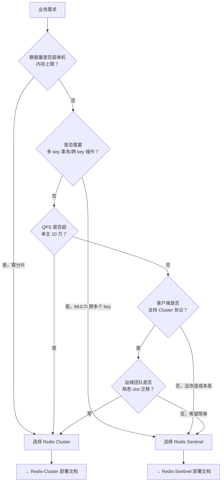

> [TOC]

# Redis 集群方案选型指南

本文档帮助你在 **Redis Cluster（分片模式）** 与 **Redis Sentinel（哨兵模式）** 之间做出选择，并说明 Redis 7.x 与 8.x 的版本差异。

---

## 1. 方案对比

| 维度 | Redis Cluster | Redis Sentinel |
|------|---------------|----------------|
| **架构模式** | 去中心化分片，16384 个 hash slot 分布到多主 | 主从复制 + 哨兵监控，单主多从 |
| **最低节点数** | 6 节点（3 主 3 从） | 5 节点（1 主 2 从 + 3 哨兵） |
| **数据分片** | ✅ 支持，自动按 key 哈希分片 | ❌ 不支持，单主承载全部数据 |
| **自动 Failover** | ✅ 支持，主宕机时从提升 | ✅ 支持，哨兵投票选新主 |
| **水平扩展** | ✅ 支持在线添加节点、迁移 slot | ❌ 不支持，单主瓶颈 |
| **多 key 事务** | ⚠️ 仅同 slot 内支持 MULTI/EXEC | ✅ 支持，单主无限制 |
| **客户端要求** | 必须支持 Cluster 协议（MOVED/ASK 重定向） | 支持主从切换即可（或通过代理固定入口） |
| **运维复杂度** | 较高（slot 迁移、reshard、节点管理） | 较低（主从 + 哨兵配置） |
| **典型用户规模** | 数据量 TB 级、QPS 10 万+、需分片 | 数据量 GB 级、QPS 万级、单主可承载 |
| **适用场景** | 高并发缓存、大数据量、需线性扩展 | 会话存储、配置缓存、中小规模高可用 |

---

## 2. 版本对比（Redis 7.x vs 8.x）

| 维度 | Redis 7.x | Redis 8.x |
|------|-----------|-----------|
| **发布周期** | 2022-2025 | 2025+ |
| **关键新特性** | ACL v2、Redis Function、Sharded Pub/Sub、Multi-part AOF | 多线程 I/O 增强、`io-threads-do-reads` 合并进默认、`latency-tracking` 内置、hash slot 迁移优化 |
| **破坏性变更** | 无（相对 6.x） | `io-threads-do-reads` 参数移除（读已默认多线程） |
| **客户端兼容性** | RESP2/RESP3 均支持 | 同 7.x，RESP 协议兼容 |
| **是否需改业务代码** | 否 | 否（常规读写、Cluster、Sentinel 均兼容） |
| **配置差异** | 需显式 `io-threads-do-reads yes` | 无需该参数，删除不报错 |
| **大厂采用情况** | 广泛（阿里、腾讯、字节等） | 逐步迁移中，新集群推荐 |

> 📌 **结论**：7.x → 8.x 升级**无需改业务代码**，仅需注意配置文件中去掉 `io-threads-do-reads`（若存在）。本仓库部署文档以 **Redis 8.6.1** 为主线，兼容 7.x 用户参考（配置参数基本一致）。

---

## 3. 选型决策树

---

## 4. 注意事项

### 4.1 方案不可混用

- **Cluster 与 Sentinel 不能混用于同一业务**：Cluster 是分片架构，Sentinel 是主从架构，数据模型、客户端连接方式完全不同。
- 同一公司可同时存在 Cluster 集群（大数据量业务）和 Sentinel 集群（会话/配置类业务），但需独立部署、独立运维。

### 4.2 迁移路径

| 迁移方向 | 可行性 | 复杂度 | 说明 |
|----------|--------|--------|------|
| **Sentinel → Cluster** | 可行 | 高 | 需数据迁移工具（如 redis-shake）、业务改造（支持 Cluster 协议）、停机或双写迁移 |
| **Cluster → Sentinel** | 不推荐 | 极高 | 需合并多主数据，业务改造大，通常仅作架构收缩时的特殊场景 |

### 4.3 版本升级建议

- **新建集群**：直接使用 Redis 8.6.1。
- **现有 7.x 集群**：可滚动升级至 8.x，客户端无需改动；升级前去掉配置中的 `io-threads-do-reads`。
- **现有 6.x 集群**：建议先升级至 7.x（ACL 等可能有调整），再升级至 8.x。

---

## 5. 部署文档索引

| 方案 | 文档 | 说明 |
|------|------|------|
| **Redis Cluster** | [Redis-Cluster 生产级部署与运维指南](./redis-cluster-production/Redis-Cluster生产级部署与运维指南.md) | 分片模式，6 节点起，支持水平扩展 |
| **Redis Sentinel** | [Redis-Sentinel 生产级部署与运维指南](./redis-sentinel-production/Redis-Sentinel生产级部署与运维指南.md) | 主从 + 哨兵，单主多从，自动故障转移 |
