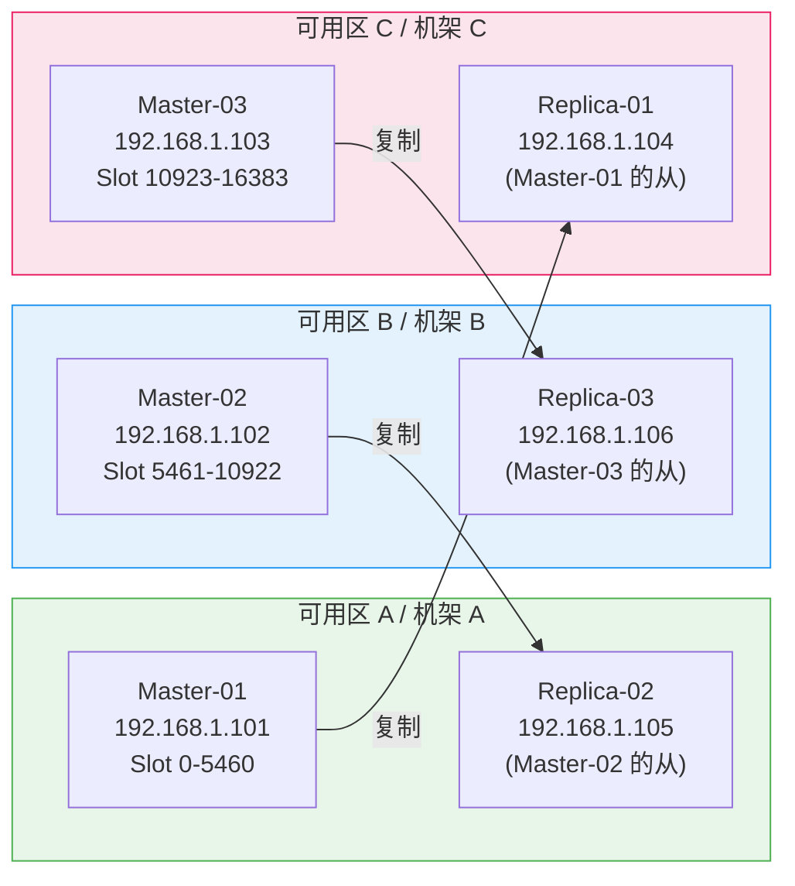

> [TOC]

# Redis-Cluster 生产级部署与运维指南

## 1. 简介

### 1.1 服务介绍与核心特性

Redis（Remote Dictionary Server）是高性能内存数据结构存储系统，支持 String、Hash、List、Set、Sorted Set、Bitmap、HyperLogLog、Stream 等数据结构。

Redis Cluster 是 Redis 官方提供的分布式分片方案，核心特性：

- **数据分片**：16384 个哈希槽（hash slot）自动分配到多个主节点，支持水平扩展
- **高可用**：每个主节点配备从节点，主节点故障时自动 failover（秒级切换）
- **去中心化**：Gossip 协议实现节点间通信，无单点故障
- **线性扩展**：支持在线添加/移除节点，自动 slot 迁移，业务无感知
- **原子操作**：同一 slot 内支持 MULTI/EXEC 事务和 Lua 脚本

### 1.2 适用场景

| 场景 | 说明 |
|------|------|
| 高并发缓存 | 电商秒杀、热点数据缓存，单集群 QPS 10万+ |
| 会话存储 | 分布式 Session 共享，支持 TTL 自动过期 |
| 排行榜/计数器 | Sorted Set 实现实时排行，原子 INCR 计数 |
| 消息队列 | Stream 数据结构实现轻量级消息队列（含消费者组） |
| 分布式锁 | Redlock 算法实现跨节点分布式锁 |
| 实时数据分析 | HyperLogLog 基数统计、Bitmap 用户行为分析 |

### 1.3 架构原理图


### 1.4 版本说明

> 以下版本号均通过 GitHub Releases API + Docker Hub 实际查询确认。

| 组件 | 版本 | 兼容性 |
|------|------|--------|
| **Redis Server** | 8.6.1（2026-03 最新稳定版） | Linux x86_64 / ARM64 |
| **Redis CLI** | 随 Redis Server 一同安装 | — |
| **redis_exporter** | v1.82.0（Prometheus 指标导出） | 兼容 Redis 5.x-8.x |
| **操作系统** | Rocky Linux 9.x / Ubuntu 22.04 LTS 或 24.04 LTS | 内核 ≥ 5.4 |
| **GCC**（源码编译） | ≥ 9.0 | Rocky 9 自带 11.x |

---

## 2. 版本选择指南

### 2.1 版本对应关系表

| Redis 大版本 | 发布周期 | Cluster 支持 | 关键特性 |
|-------------|---------|-------------|---------|
| **8.x**（当前） | 2025+ | 完整支持 | 多线程 I/O 增强（`io-threads-do-reads` 已默认合并）、性能优化、hash slot 迁移增强、`latency-tracking` 内置 |
| **7.x** | 2022-2025 | 完整支持 | ACL v2、Function、Sharded Pub/Sub、Multi-part AOF |
| **6.x** | 2020-2022 | 完整支持 | ACL v1、SSL/TLS、RESP3 协议 |

> 📌 注意：Redis 8.x 移除了 `io-threads-do-reads` 参数（读操作已默认使用多线程），从 7.x 升级时需在配置文件中删除此行，否则启动告警。

### 2.2 版本决策建议

| 场景 | 建议 |
|------|------|
| **新建集群** | 直接使用 8.6.1，享受最新性能优化和安全修复 |
| **现有 7.x 集群** | 评估后滚动升级至 8.x，客户端 SDK 无需变更（RESP 协议兼容） |
| **现有 6.x 集群** | 建议先升级至 7.x 过渡（ACL 配置可能需调整），再升级至 8.x |
| **多集群混合** | 新集群用 8.x，老集群按计划逐步升级，客户端 SDK 需兼容两个版本 |

---

## 3. 生产环境规划（高可用架构）

### 3.1 集群架构图



> ⚠️ **关键设计**：主从节点必须分布在不同可用区/机架，确保单个可用区故障时集群仍可用。上图中 Master-01 在 AZ-A，其 Replica-01 在 AZ-C，以此类推交叉分布。

### 3.2 节点角色与配置要求

| 角色 | 数量 | 最低配置 | 推荐配置 | 说明 |
|------|------|---------|---------|------|
| Master | 3 | 4C 8G 100G SSD | 8C 16G 500G NVMe SSD | 承载读写，内存按数据量 × 2 预留 |
| Replica | 3 | 4C 8G 100G SSD | 8C 16G 500G NVMe SSD | 故障接管 + 读分离（可选） |

> ⚠️ **内存规划**：`maxmemory` 设置为物理内存的 **60%-75%**，预留空间给 RDB/AOF 重写 fork 子进程、操作系统缓存。例如 16G 物理内存建议 `maxmemory 10gb`。

### 3.3 网络与端口规划

| 源 | 目标端口 | 协议 | 用途 |
|----|---------|------|------|
| 客户端 → Redis 节点 | 6379/tcp | RESP | Redis 数据读写 |
| Redis 节点 ↔ Redis 节点 | 16379/tcp | Gossip（二进制） | 集群总线：节点发现、故障检测、slot 迁移 |
| 运维机 → Redis 节点 | 6379/tcp | RESP | redis-cli 管理 |
| Prometheus → Redis 节点 | 9121/tcp | HTTP | redis_exporter 指标采集 |

> ⚠️ 集群总线端口 = 数据端口 + 10000（默认 6379 + 10000 = 16379），防火墙必须同时放行两个端口。

---

## 4. 生产环境部署

### 4.1 前置准备（所有节点）

> 🖥️ **执行节点：所有节点（6 台）**

#### 4.1.1 系统优化

```bash
cat > /etc/sysctl.d/99-redis.conf << 'EOF'
vm.overcommit_memory = 1          # ★ Redis BGSAVE 必须，允许 fork 时 overcommit
vm.swappiness = 1                 # 尽量避免使用 swap（设为 0 在某些内核可能触发 OOM killer）
net.core.somaxconn = 65535        # ★ 监听队列上限，需 ≥ Redis tcp-backlog
net.core.netdev_max_backlog = 65535
net.ipv4.tcp_max_syn_backlog = 65535
net.ipv4.tcp_keepalive_time = 60
net.ipv4.tcp_keepalive_intvl = 10
net.ipv4.tcp_keepalive_probes = 3
net.ipv4.tcp_fin_timeout = 15
EOF

sysctl -p /etc/sysctl.d/99-redis.conf
```

```bash
# ★ 关闭 Transparent Huge Pages（THP）—— Redis 强烈建议关闭，否则 fork 延迟和内存占用显著增加
cat > /etc/systemd/system/disable-thp.service << 'EOF'
[Unit]
Description=Disable Transparent Huge Pages (THP)
DefaultDependencies=no
After=sysinit.target local-fs.target
Before=redis.service

[Service]
Type=oneshot
ExecStart=/bin/sh -c 'echo never > /sys/kernel/mm/transparent_hugepage/enabled && echo never > /sys/kernel/mm/transparent_hugepage/defrag'

[Install]
WantedBy=multi-user.target
EOF

systemctl daemon-reload
systemctl enable --now disable-thp.service
```

```bash
# ✅ 验证
cat /sys/kernel/mm/transparent_hugepage/enabled
# 预期输出：always madvise [never]

sysctl vm.overcommit_memory
# 预期输出：vm.overcommit_memory = 1

sysctl net.core.somaxconn
# 预期输出：net.core.somaxconn = 65535
```

```bash
cat > /etc/security/limits.d/99-redis.conf << 'EOF'
redis soft nofile 65535
redis hard nofile 65535
redis soft nproc 65535
redis hard nproc 65535
EOF
```

#### 4.1.2 创建 Redis 用户与目录

```bash
id -u redis &>/dev/null || useradd -r -s /sbin/nologin -d /opt/redis redis

mkdir -p /opt/redis/{bin,conf,data,logs,run}
mkdir -p /backup/redis
chown -R redis:redis /opt/redis /backup/redis
```

#### 4.1.3 防火墙配置

```bash
# ── Rocky Linux 9（firewalld）──────────────
firewall-cmd --permanent --add-port=6379/tcp
firewall-cmd --permanent --add-port=16379/tcp
firewall-cmd --permanent --add-port=9121/tcp
firewall-cmd --reload

# ✅ 验证
firewall-cmd --list-ports
# 预期输出包含：6379/tcp 16379/tcp 9121/tcp
```

```bash
# ── Ubuntu 22.04（差异）────────────────────
# ufw allow 6379/tcp
# ufw allow 16379/tcp
# ufw allow 9121/tcp
# ufw reload
```

> 📌 注意：云主机（阿里云/AWS/腾讯云）通常在安全组中配置端口规则，无需操作 firewalld/ufw。

### 4.2 部署步骤

> 🖥️ **执行节点：所有节点（6 台）**

#### 4.2.1 安装 Redis 8.6.1（源码编译）

```bash
# ── Rocky Linux 9 ──────────────────────────
dnf install -y gcc make jemalloc-devel systemd-devel

# ── Ubuntu 22.04（差异）────────────────────
# apt-get update && apt-get install -y build-essential libjemalloc-dev libsystemd-dev
```

```bash
cd /tmp
[ -f redis-8.6.1.tar.gz ] || wget -O redis-8.6.1.tar.gz "https://download.redis.io/releases/redis-8.6.1.tar.gz"
tar xzf redis-8.6.1.tar.gz
cd redis-8.6.1

make -j$(nproc) USE_SYSTEMD=yes BUILD_TLS=yes
make install PREFIX=/opt/redis

chown -R redis:redis /opt/redis/bin/
```

```bash
# ✅ 验证
/opt/redis/bin/redis-server --version
# 预期输出：Redis server v=8.6.1 sha=...

/opt/redis/bin/redis-cli --version
# 预期输出：redis-cli 8.6.1
```

```bash
rm -rf /tmp/redis-8.6.1 /tmp/redis-8.6.1.tar.gz
```

#### 4.2.2 配置文件

> 🖥️ **执行节点：每个节点分别配置（修改 bind IP 和 cluster-announce-ip）**

以 Master-01（192.168.1.101）为例，其他节点替换对应 IP：

```bash
cat > /opt/redis/conf/redis.conf << 'EOF'
# ━━━━━━━━━━━━━━━━ 网络 ━━━━━━━━━━━━━━━━
bind 192.168.1.101 127.0.0.1    # ★ ← 根据本节点实际 IP 修改
port 6379
protected-mode yes
tcp-backlog 511
timeout 300                      # 空闲客户端超时断开（秒），0 为不断开
tcp-keepalive 60

# ━━━━━━━━━━━━━━━━ 通用 ━━━━━━━━━━━━━━━━
daemonize no                     # systemd 管理，不使用 daemon 模式
pidfile /opt/redis/run/redis_6379.pid
loglevel notice
logfile /opt/redis/logs/redis.log
databases 16

# ━━━━━━━━━━━━━━━━ 安全 ━━━━━━━━━━━━━━━━
requirepass YourStr0ngP@ssw0rd!  # ★ ← 根据实际环境修改，生产必须设置强密码
masterauth YourStr0ngP@ssw0rd!   # ★ ← 与 requirepass 保持一致，集群节点间认证

# ━━━━━━━━━━━━━━━━ 内存 ━━━━━━━━━━━━━━━━
maxmemory 10gb                   # ★ ← 根据物理内存调整，建议为物理内存的 60%-75%
                                 # ⚠️ 16G 物理内存 → 10gb，32G → 20gb-24gb
maxmemory-policy allkeys-lru     # ⚠️ 纯缓存用 allkeys-lru；有持久化需求用 volatile-lru

# ━━━━━━━━━━━━━━━━ RDB 持久化 ━━━━━━━━━━━━━━━━
save 3600 1                      # 3600 秒内至少 1 次写入则触发 RDB
save 300 100
save 60 10000
rdbcompression yes
rdbchecksum yes
dbfilename dump.rdb
dir /opt/redis/data              # ★ ← 数据目录，建议挂载独立 SSD/NVMe 磁盘

# ━━━━━━━━━━━━━━━━ AOF 持久化 ━━━━━━━━━━━━━━━━
appendonly yes                   # ★ 生产环境必须开启 AOF
appendfilename "appendonly.aof"
appendfsync everysec             # 每秒刷盘，兼顾性能与数据安全
                                 # ⚠️ 对数据丢失零容忍用 always（性能下降约 50%）
auto-aof-rewrite-percentage 100
auto-aof-rewrite-min-size 64mb
aof-use-rdb-preamble yes         # 混合持久化：AOF 重写时使用 RDB 格式前缀，加速重启加载

# ━━━━━━━━━━━━━━━━ 主从复制 ━━━━━━━━━━━━━━━━
replica-serve-stale-data yes
replica-read-only yes
repl-diskless-sync yes           # 无盘复制：主节点直接通过 socket 发送 RDB
repl-diskless-sync-delay 5
repl-backlog-size 256mb          # ★ 复制积压缓冲区，网络抖动时避免全量同步
                                 # ⚠️ 写入量大的场景建议 512mb 或更大
repl-backlog-ttl 3600

# ━━━━━━━━━━━━━━━━ Lazy Free ━━━━━━━━━━━━━━━━
lazyfree-lazy-eviction yes       # 内存淘汰时异步释放
lazyfree-lazy-expire yes         # key 过期时异步释放
lazyfree-lazy-server-del yes     # DEL 改为异步 UNLINK
replica-lazy-flush yes           # 从节点全量同步前异步清空

# ━━━━━━━━━━━━━━━━ 性能调优 ━━━━━━━━━━━━━━━━
hz 10                            # 内部定时任务频率（高并发可调至 100）
dynamic-hz yes
io-threads 4                     # ★ ← 多线程 I/O，建议 CPU 核数的 1/2
                                 # ⚠️ 4 核设 2-3，8 核设 4-6
                                 # ⚠️ Redis 8.x 已移除 io-threads-do-reads（读默认多线程）

# ━━━━━━━━━━━━━━━━ Cluster ━━━━━━━━━━━━━━━━
cluster-enabled yes
cluster-config-file /opt/redis/data/nodes-6379.conf
cluster-node-timeout 15000       # ★ 节点超时判定（毫秒），生产建议 15000
                                 # ⚠️ 过小会导致网络抖动时误判故障
cluster-announce-ip 192.168.1.101  # ★ ← 根据本节点实际 IP 修改
cluster-announce-port 6379
cluster-announce-bus-port 16379
cluster-require-full-coverage yes  # 任一 slot 不可用时整个集群拒绝写入
                                   # ⚠️ 设为 no 则部分 slot 不可用时其余 slot 仍可读写
cluster-allow-reads-when-down no

# ━━━━━━━━━━━━━━━━ 慢查询日志 ━━━━━━━━━━━━━━━━
slowlog-log-slower-than 10000    # 超过 10ms 的命令记入慢查询日志
slowlog-max-len 1024

# ━━━━━━━━━━━━━━━━ 延迟追踪 ━━━━━━━━━━━━━━━━
latency-tracking yes             # Redis 8.x 内置延迟追踪，替代旧版 latency monitor

# ━━━━━━━━━━━━━━━━ 客户端限制 ━━━━━━━━━━━━━━━━
maxclients 10000
EOF

chown redis:redis /opt/redis/conf/redis.conf
chmod 640 /opt/redis/conf/redis.conf
```

> ⚠️ **每个节点必须修改的参数**：
> - `bind` — 本节点 IP
> - `cluster-announce-ip` — 本节点 IP
> - 其余参数 6 个节点保持一致

#### 4.2.3 Systemd 服务文件

> 🖥️ **执行节点：所有节点（6 台）**

```bash
cat > /etc/systemd/system/redis.service << 'EOF'
[Unit]
Description=Redis 8.6.1 Cluster Node
After=network-online.target
Wants=network-online.target

[Service]
Type=notify
User=redis
Group=redis
ExecStart=/opt/redis/bin/redis-server /opt/redis/conf/redis.conf
ExecStop=/opt/redis/bin/redis-cli -a YourStr0ngP@ssw0rd! shutdown  # ★ ← 密码与配置文件一致
Restart=always
RestartSec=5
LimitNOFILE=65535
LimitNPROC=65535
TimeoutStartSec=30
TimeoutStopSec=30

[Install]
WantedBy=multi-user.target
EOF

systemctl daemon-reload
systemctl enable --now redis.service
```

```bash
# ✅ 验证
systemctl status redis.service
# 预期输出：Active: active (running)

/opt/redis/bin/redis-cli -a YourStr0ngP@ssw0rd! PING
# 预期输出：PONG
```

### 4.3 集群初始化与配置

> 🖥️ **执行节点：任意一台 Master 节点（如 Master-01）**

确认 6 个节点全部启动后，执行集群创建：

```bash
/opt/redis/bin/redis-cli -a YourStr0ngP@ssw0rd! --cluster create \
  192.168.1.101:6379 \
  192.168.1.102:6379 \
  192.168.1.103:6379 \
  192.168.1.104:6379 \
  192.168.1.105:6379 \
  192.168.1.106:6379 \
  --cluster-replicas 1
```

> ⚠️ `--cluster-replicas 1` 表示每个主节点分配 1 个从节点。Redis 会自动将前 3 个节点设为 Master，后 3 个设为 Replica。确认 slot 分配方案后输入 `yes`。

预期输出关键信息：

```
>>> Performing hash slots allocation on 6 nodes...
Master[0] -> Slots 0 - 5460
Master[1] -> Slots 5461 - 10922
Master[2] -> Slots 10923 - 16383
Adding replica 192.168.1.105:6379 to 192.168.1.101:6379
Adding replica 192.168.1.106:6379 to 192.168.1.102:6379
Adding replica 192.168.1.104:6379 to 192.168.1.103:6379
...
[OK] All nodes agree about slots configuration.
[OK] All 16384 slots covered.
```

> ⚠️ **跨机架部署注意**：默认分配可能将主从放在同一机架。创建集群后使用 `CLUSTER REPLICATE` 手动调整主从关系，确保主从分布在不同可用区。

### 4.4 安装验证

> 🖥️ **执行节点：任意一台节点**

```bash
# ✅ 验证集群状态
/opt/redis/bin/redis-cli -a YourStr0ngP@ssw0rd! CLUSTER INFO
# 预期输出关键行：
# cluster_state:ok
# cluster_slots_assigned:16384
# cluster_slots_ok:16384
# cluster_known_nodes:6
# cluster_size:3
```

```bash
# ✅ 验证节点列表
/opt/redis/bin/redis-cli -a YourStr0ngP@ssw0rd! CLUSTER NODES
# 预期输出：3 个 master + 3 个 slave，所有节点状态为 connected
```

```bash
# ✅ 验证读写
/opt/redis/bin/redis-cli -a YourStr0ngP@ssw0rd! -c SET test:key "hello-cluster"
# 预期输出：OK（可能带 -> Redirected to slot [xxxx] 提示，属正常）

/opt/redis/bin/redis-cli -a YourStr0ngP@ssw0rd! -c GET test:key
# 预期输出：hello-cluster
```

```bash
# ✅ 验证集群完整性
/opt/redis/bin/redis-cli -a YourStr0ngP@ssw0rd! --cluster check 192.168.1.101:6379
# 预期输出：
# [OK] All nodes agree about slots configuration.
# [OK] All 16384 slots covered.
```

---

## 5. 关键参数配置说明

### 5.1 核心参数分类汇总

完整配置文件已在 4.2.2 节提供（含逐行注释），此处分类汇总。

| 分类 | 参数 | 推荐值 | 说明 |
|------|------|--------|------|
| **内存** | `maxmemory` | 物理内存 60%-75% | ★ 必须设置，否则无限增长直到 OOM |
| **内存** | `maxmemory-policy` | `allkeys-lru` | 纯缓存用 allkeys-lru，有持久化需求用 volatile-lru |
| **持久化** | `appendonly` | `yes` | ★ 生产必须开启 AOF |
| **持久化** | `appendfsync` | `everysec` | 兼顾性能与安全 |
| **持久化** | `aof-use-rdb-preamble` | `yes` | 混合持久化，加速重启加载 |
| **复制** | `repl-backlog-size` | `256mb` | ★ 写入量大时调至 512mb+ |
| **复制** | `repl-diskless-sync` | `yes` | 减少磁盘 I/O |
| **Cluster** | `cluster-node-timeout` | `15000` | 生产建议 15s，过小易误判 |
| **性能** | `io-threads` | CPU 核数 ÷ 2 | ★ 多线程 I/O，显著提升网络吞吐 |
| **性能** | `hz` | `10` | 高并发场景可调至 100 |
| **Lazy Free** | `lazyfree-lazy-*` | 全部 `yes` | 避免大 key 删除阻塞主线程 |
| **安全** | `requirepass` | 强密码 | ★ 生产必须设置 |
| **安全** | `protected-mode` | `yes` | 配合 bind 限制访问来源 |
| **监控** | `latency-tracking` | `yes` | Redis 8.x 内置延迟追踪 |
| **慢查询** | `slowlog-log-slower-than` | `10000` | 超过 10ms 记录慢查询 |

### 5.2 生产环境推荐调优参数

#### 内存相关

```bash
redis-cli -a YourStr0ngP@ssw0rd! INFO memory
# 关注指标：
# used_memory_human      — 已使用内存
# maxmemory_human        — 最大内存限制
# mem_fragmentation_ratio — 内存碎片率（正常 1.0-1.5，>1.5 需关注）
```

> ⚠️ 当 `mem_fragmentation_ratio` > 1.5 时，通过 `MEMORY PURGE` 手动释放，或配置 `activedefrag yes` 开启自动碎片整理。

#### 持久化策略选择

| 场景 | RDB | AOF | 说明 |
|------|-----|-----|------|
| 纯缓存（可丢数据） | 开启 | 关闭 | 仅用 RDB 做冷备份 |
| 缓存 + 数据安全 | 开启 | everysec | ★ 推荐方案，最多丢失 1 秒数据 |
| 金融/交易场景 | 开启 | always | 零数据丢失，性能下降约 50% |

#### 网络相关

| 参数 | 推荐值 | 说明 |
|------|--------|------|
| `tcp-backlog` | `511` | 需配合内核 `net.core.somaxconn` ≥ 511 |
| `timeout` | `300` | 空闲连接超时，防止连接泄漏 |
| `tcp-keepalive` | `60` | 检测死连接 |
| `maxclients` | `10000` | 根据业务并发量调整 |

---

## 6. 快速体验部署（开发 / 测试环境）

> ⚠️ **本章方案仅适用于开发/测试环境，严禁用于生产。** Redis Cluster 强依赖多节点集群模式，使用 Docker Compose 在单机模拟 6 节点（3 主 3 从）集群。

### 6.1 快速启动方案选型

Redis Cluster 最少需要 6 个节点（3 主 3 从），选择 Docker Compose 在单机启动 6 个容器模拟集群，是最便捷的体验方式。

### 6.2 快速启动步骤与验证

```bash
mkdir -p /tmp/redis-cluster-test
```

```bash
cat > /tmp/redis-cluster-test/docker-compose.yml << 'DEOF'
services:
  redis-node-1:
    image: redis:8.6.1
    container_name: redis-test-1
    command: >
      redis-server
      --port 6379
      --cluster-enabled yes
      --cluster-config-file nodes.conf
      --cluster-node-timeout 5000
      --appendonly yes
      --maxmemory 256mb
      --maxmemory-policy allkeys-lru
      --requirepass TestPass123
      --masterauth TestPass123
      --protected-mode no
      --cluster-announce-ip 172.28.0.11
      --cluster-announce-port 6379
      --cluster-announce-bus-port 16379
    networks:
      redis-net:
        ipv4_address: 172.28.0.11
    volumes:
      - data1:/data

  redis-node-2:
    image: redis:8.6.1
    container_name: redis-test-2
    command: >
      redis-server
      --port 6379
      --cluster-enabled yes
      --cluster-config-file nodes.conf
      --cluster-node-timeout 5000
      --appendonly yes
      --maxmemory 256mb
      --maxmemory-policy allkeys-lru
      --requirepass TestPass123
      --masterauth TestPass123
      --protected-mode no
      --cluster-announce-ip 172.28.0.12
      --cluster-announce-port 6379
      --cluster-announce-bus-port 16379
    networks:
      redis-net:
        ipv4_address: 172.28.0.12
    volumes:
      - data2:/data

  redis-node-3:
    image: redis:8.6.1
    container_name: redis-test-3
    command: >
      redis-server
      --port 6379
      --cluster-enabled yes
      --cluster-config-file nodes.conf
      --cluster-node-timeout 5000
      --appendonly yes
      --maxmemory 256mb
      --maxmemory-policy allkeys-lru
      --requirepass TestPass123
      --masterauth TestPass123
      --protected-mode no
      --cluster-announce-ip 172.28.0.13
      --cluster-announce-port 6379
      --cluster-announce-bus-port 16379
    networks:
      redis-net:
        ipv4_address: 172.28.0.13
    volumes:
      - data3:/data

  redis-node-4:
    image: redis:8.6.1
    container_name: redis-test-4
    command: >
      redis-server
      --port 6379
      --cluster-enabled yes
      --cluster-config-file nodes.conf
      --cluster-node-timeout 5000
      --appendonly yes
      --maxmemory 256mb
      --maxmemory-policy allkeys-lru
      --requirepass TestPass123
      --masterauth TestPass123
      --protected-mode no
      --cluster-announce-ip 172.28.0.14
      --cluster-announce-port 6379
      --cluster-announce-bus-port 16379
    networks:
      redis-net:
        ipv4_address: 172.28.0.14
    volumes:
      - data4:/data

  redis-node-5:
    image: redis:8.6.1
    container_name: redis-test-5
    command: >
      redis-server
      --port 6379
      --cluster-enabled yes
      --cluster-config-file nodes.conf
      --cluster-node-timeout 5000
      --appendonly yes
      --maxmemory 256mb
      --maxmemory-policy allkeys-lru
      --requirepass TestPass123
      --masterauth TestPass123
      --protected-mode no
      --cluster-announce-ip 172.28.0.15
      --cluster-announce-port 6379
      --cluster-announce-bus-port 16379
    networks:
      redis-net:
        ipv4_address: 172.28.0.15
    volumes:
      - data5:/data

  redis-node-6:
    image: redis:8.6.1
    container_name: redis-test-6
    command: >
      redis-server
      --port 6379
      --cluster-enabled yes
      --cluster-config-file nodes.conf
      --cluster-node-timeout 5000
      --appendonly yes
      --maxmemory 256mb
      --maxmemory-policy allkeys-lru
      --requirepass TestPass123
      --masterauth TestPass123
      --protected-mode no
      --cluster-announce-ip 172.28.0.16
      --cluster-announce-port 6379
      --cluster-announce-bus-port 16379
    networks:
      redis-net:
        ipv4_address: 172.28.0.16
    volumes:
      - data6:/data

networks:
  redis-net:
    driver: bridge
    ipam:
      config:
        - subnet: 172.28.0.0/24

volumes:
  data1:
  data2:
  data3:
  data4:
  data5:
  data6:
DEOF
```

```bash
cd /tmp/redis-cluster-test
docker compose up -d

sleep 5

docker exec redis-test-1 redis-cli -a TestPass123 --cluster create \
  172.28.0.11:6379 172.28.0.12:6379 172.28.0.13:6379 \
  172.28.0.14:6379 172.28.0.15:6379 172.28.0.16:6379 \
  --cluster-replicas 1 --cluster-yes
```

```bash
# ✅ 验证
docker exec redis-test-1 redis-cli -a TestPass123 CLUSTER INFO
# 预期输出：cluster_state:ok, cluster_slots_ok:16384, cluster_known_nodes:6

docker exec redis-test-1 redis-cli -a TestPass123 -c SET hello world
# 预期输出：OK

docker exec redis-test-1 redis-cli -a TestPass123 -c GET hello
# 预期输出：world
```

### 6.3 停止与清理

```bash
cd /tmp/redis-cluster-test
docker compose down -v
rm -rf /tmp/redis-cluster-test/
docker system prune -f
```

---

## 7. 日常运维操作

### 7.1 常用管理命令

#### 集群状态检查

```bash
# 集群整体状态
redis-cli -a YourStr0ngP@ssw0rd! CLUSTER INFO

# 节点列表（含角色、slot 分配、连接状态）
redis-cli -a YourStr0ngP@ssw0rd! CLUSTER NODES

# 当前节点 ID
redis-cli -a YourStr0ngP@ssw0rd! CLUSTER MYID

# 集群完整性检查（slot 覆盖、节点一致性）
redis-cli -a YourStr0ngP@ssw0rd! --cluster check 192.168.1.101:6379

# 集群概览（各节点 key 数量和 slot 分布）
redis-cli -a YourStr0ngP@ssw0rd! --cluster info 192.168.1.101:6379
```

#### 内存与性能监控

```bash
# 内存使用详情
redis-cli -a YourStr0ngP@ssw0rd! INFO memory
# 关注：used_memory_human, maxmemory_human, mem_fragmentation_ratio

# 单个 key 内存占用
redis-cli -a YourStr0ngP@ssw0rd! -c MEMORY USAGE <key>

# 内存诊断
redis-cli -a YourStr0ngP@ssw0rd! MEMORY DOCTOR

# 内存碎片手动整理
redis-cli -a YourStr0ngP@ssw0rd! MEMORY PURGE

# 慢查询日志
redis-cli -a YourStr0ngP@ssw0rd! SLOWLOG GET 10
redis-cli -a YourStr0ngP@ssw0rd! SLOWLOG LEN
redis-cli -a YourStr0ngP@ssw0rd! SLOWLOG RESET

# 延迟诊断（Redis 8.x 内置 latency-tracking）
redis-cli -a YourStr0ngP@ssw0rd! LATENCY LATEST
redis-cli -a YourStr0ngP@ssw0rd! LATENCY HISTORY <event>

# 实时延迟测试
redis-cli -a YourStr0ngP@ssw0rd! --latency -h 192.168.1.101 -p 6379
redis-cli -a YourStr0ngP@ssw0rd! --latency-history -h 192.168.1.101 -p 6379

# 客户端连接列表
redis-cli -a YourStr0ngP@ssw0rd! CLIENT LIST

# 服务器统计
redis-cli -a YourStr0ngP@ssw0rd! INFO stats
# 关注：instantaneous_ops_per_sec, keyspace_hits, keyspace_misses

# 实时命令监控（调试用，生产慎用，会严重影响性能）
redis-cli -a YourStr0ngP@ssw0rd! MONITOR
```

#### 数据操作

```bash
# Cluster 模式下必须加 -c 参数
redis-cli -a YourStr0ngP@ssw0rd! -c SET key value
redis-cli -a YourStr0ngP@ssw0rd! -c GET key
redis-cli -a YourStr0ngP@ssw0rd! -c DEL key

# 查看 key 所在 slot
redis-cli -a YourStr0ngP@ssw0rd! CLUSTER KEYSLOT <key>

# 查看某个 slot 中的 key 数量
redis-cli -a YourStr0ngP@ssw0rd! CLUSTER COUNTKEYSINSLOT <slot>

# 扫描 key（生产环境禁止使用 KEYS *，使用 SCAN 替代）
redis-cli -a YourStr0ngP@ssw0rd! SCAN 0 MATCH "prefix:*" COUNT 100

# 查看 key 编码类型
redis-cli -a YourStr0ngP@ssw0rd! -c OBJECT ENCODING <key>

# 当前节点 key 数量
redis-cli -a YourStr0ngP@ssw0rd! DBSIZE

# 大 key 扫描
redis-cli -a YourStr0ngP@ssw0rd! --bigkeys
```

#### 配置热更新

```bash
# 在线修改配置（无需重启）
redis-cli -a YourStr0ngP@ssw0rd! CONFIG SET maxmemory 12gb
redis-cli -a YourStr0ngP@ssw0rd! CONFIG SET hz 100

# 将当前运行配置持久化到配置文件
redis-cli -a YourStr0ngP@ssw0rd! CONFIG REWRITE

# 查看当前配置值
redis-cli -a YourStr0ngP@ssw0rd! CONFIG GET maxmemory
redis-cli -a YourStr0ngP@ssw0rd! CONFIG GET "save"
```

#### ACL 用户管理

```bash
# 查看所有用户
redis-cli -a YourStr0ngP@ssw0rd! ACL LIST

# 查看当前用户
redis-cli -a YourStr0ngP@ssw0rd! ACL WHOAMI

# 创建只读用户（仅允许 GET/MGET/SCAN 等读命令）
redis-cli -a YourStr0ngP@ssw0rd! ACL SETUSER readonly on '>ReadOnlyP@ss' '~*' '+@read'

# 创建应用用户（允许读写，禁止管理命令）
redis-cli -a YourStr0ngP@ssw0rd! ACL SETUSER appuser on '>AppP@ss2026' '~app:*' '+@read' '+@write' '+@string' '+@hash' '+@list' '+@set' '+@sortedset' '-@admin' '-@dangerous'

# 删除用户
redis-cli -a YourStr0ngP@ssw0rd! ACL DELUSER <username>

# 持久化 ACL 配置
redis-cli -a YourStr0ngP@ssw0rd! ACL SAVE

# 查看 ACL 被拒绝日志
redis-cli -a YourStr0ngP@ssw0rd! ACL LOG 10
redis-cli -a YourStr0ngP@ssw0rd! ACL LOG RESET
```

### 7.2 备份与恢复

#### RDB 备份

```bash
# 触发后台 RDB 快照
redis-cli -a YourStr0ngP@ssw0rd! BGSAVE

# 查看最后一次 RDB 保存时间
redis-cli -a YourStr0ngP@ssw0rd! LASTSAVE

# 查看持久化状态
redis-cli -a YourStr0ngP@ssw0rd! INFO persistence
# 关注：rdb_last_bgsave_status:ok, aof_enabled:1

# 备份 RDB 文件（在所有节点执行）
cp /opt/redis/data/dump.rdb /backup/redis/dump-$(hostname)-$(date +%Y%m%d%H%M%S).rdb
```

#### AOF 备份

```bash
# 手动触发 AOF 重写
redis-cli -a YourStr0ngP@ssw0rd! BGREWRITEAOF

# 备份 AOF 目录
cp -r /opt/redis/data/appendonlydir/ /backup/redis/aof-$(hostname)-$(date +%Y%m%d%H%M%S)/
```

#### 恢复流程

```
1. 停止 Redis 服务：systemctl stop redis
2. 将备份的 RDB/AOF 文件复制到 /opt/redis/data/
3. 确保文件权限：chown -R redis:redis /opt/redis/data/
4. 启动 Redis：systemctl start redis（优先加载 AOF，AOF 不存在则加载 RDB）
5. 验证数据：redis-cli -a YourStr0ngP@ssw0rd! DBSIZE
```

### 7.3 集群扩缩容

#### 扩容（添加节点）

```bash
# 添加新的 Master 节点
redis-cli -a YourStr0ngP@ssw0rd! --cluster add-node \
  192.168.1.107:6379 192.168.1.101:6379

# 为新 Master 分配 slot（从现有节点迁移）
redis-cli -a YourStr0ngP@ssw0rd! --cluster reshard 192.168.1.101:6379 \
  --cluster-from <source-node-id> \
  --cluster-to <new-node-id> \
  --cluster-slots 4096 \
  --cluster-yes

# 添加新的 Replica 节点
redis-cli -a YourStr0ngP@ssw0rd! --cluster add-node \
  192.168.1.108:6379 192.168.1.101:6379 \
  --cluster-slave --cluster-master-id <master-node-id>
```

#### 缩容（移除节点）

```bash
# 先迁移 slot 到其他节点
redis-cli -a YourStr0ngP@ssw0rd! --cluster reshard 192.168.1.101:6379 \
  --cluster-from <removing-node-id> \
  --cluster-to <target-node-id> \
  --cluster-slots <slot-count> \
  --cluster-yes

# 确认 slot 已全部迁移
redis-cli -a YourStr0ngP@ssw0rd! --cluster check 192.168.1.101:6379

# 移除节点
redis-cli -a YourStr0ngP@ssw0rd! --cluster del-node \
  192.168.1.101:6379 <removing-node-id>
```

#### Slot 均衡

```bash
redis-cli -a YourStr0ngP@ssw0rd! --cluster rebalance 192.168.1.101:6379 \
  --cluster-threshold 2
```

### 7.4 版本升级

#### 滚动升级步骤（不停机）

```
1. 升级前准备：
   a. 所有节点执行 BGSAVE 并备份 RDB 文件
   b. 记录当前 CLUSTER NODES 信息

2. 先升级所有 Replica 节点（逐个操作）：
   a. systemctl stop redis
   b. 替换 /opt/redis/bin/ 下的二进制文件（新版本编译产物）
   c. systemctl start redis
   d. 确认节点自动重新加入集群（CLUSTER NODES 状态为 connected）

3. 逐个升级 Master 节点：
   a. 在目标 Master 的 Replica 上执行 CLUSTER FAILOVER（Replica 提升为 Master）
   b. 等待 failover 完成（CLUSTER NODES 确认角色互换）
   c. 停止原 Master（现已降为 Replica）：systemctl stop redis
   d. 替换二进制文件，启动服务
   e. 确认节点重新加入集群
```

```bash
# 在 Replica 上执行手动 failover
redis-cli -a YourStr0ngP@ssw0rd! -h <replica-ip> -p 6379 CLUSTER FAILOVER

# ✅ 验证 failover 完成
redis-cli -a YourStr0ngP@ssw0rd! CLUSTER NODES
# 预期：原 Replica 变为 master，原 Master 变为 slave
```

#### 回滚方案

```
1. 停止已升级节点：systemctl stop redis
2. 将二进制文件替换回旧版本
3. 启动服务（Redis 向下兼容 RDB/AOF 格式）
4. 若 RDB/AOF 格式不兼容（跨大版本），需从备份恢复
```

> ⚠️ 升级前务必对所有节点执行 `BGSAVE` 并备份 RDB 文件至 `/backup/redis/`。

---

## 8. 使用手册（数据库专项）

### 8.1 连接与认证

```bash
# 单节点连接
redis-cli -h 192.168.1.101 -p 6379 -a YourStr0ngP@ssw0rd!

# Cluster 模式连接（自动跟随 MOVED 重定向）
redis-cli -h 192.168.1.101 -p 6379 -a YourStr0ngP@ssw0rd! -c

# 使用 ACL 用户连接
redis-cli -h 192.168.1.101 -p 6379 --user appuser --pass AppP@ss2026 -c
```

### 8.2 数据类型操作

```bash
# ━━━ String ━━━
SET user:1001:name "张三" EX 3600    # 设置值，3600 秒过期
GET user:1001:name                   # 获取值
INCR counter:page_view               # 原子自增
MSET "{user:1001}:name" "张三" "{user:1001}:age" "30"   # 批量设置（Hash Tag 确保同 slot）
MGET "{user:1001}:name" "{user:1001}:age"

# ━━━ Hash ━━━
HSET user:2001 name "李四" age 25 city "上海"
HGET user:2001 name                  # 获取单个字段
HGETALL user:2001                    # 获取全部字段

# ━━━ List ━━━
LPUSH queue:tasks "task1" "task2" "task3"
RPOP queue:tasks                     # 右侧弹出
LRANGE queue:tasks 0 -1              # 查看全部元素

# ━━━ Set ━━━
SADD tags:article:1 "redis" "database" "nosql"
SMEMBERS tags:article:1              # 查看全部成员

# ━━━ Sorted Set ━━━
ZADD leaderboard 100 "player1" 200 "player2" 150 "player3"
ZREVRANGE leaderboard 0 9 WITHSCORES  # Top 10（降序）
ZRANK leaderboard "player1"           # 排名（升序）

# ━━━ Stream ━━━
XADD mystream '*' field1 value1 field2 value2
XLEN mystream                        # 消息数量
XRANGE mystream - + COUNT 10         # 读取最近 10 条
```

> ⚠️ **Cluster 模式下的多 key 操作**：`MSET`、`MGET`、`SUNION` 等多 key 命令要求所有 key 在同一 slot。使用 **Hash Tag** `{tag}` 强制路由：`SET {user:1001}:name "张三"` 和 `SET {user:1001}:age 30` 会被路由到同一 slot。

### 8.3 用户与权限管理

```bash
ACL LIST                             # 查看所有 ACL 用户
ACL WHOAMI                           # 查看当前用户

# 创建监控专用用户
ACL SETUSER monitor on '>MonitorP@ss' '~*' '+info' '+cluster|info' '+cluster|nodes' '+slowlog|get' '+client|list' '-@all'

ACL DELUSER <username>               # 删除用户
ACL SAVE                             # 持久化 ACL 配置
ACL LOG 10                           # 查看被拒绝的命令日志
ACL LOG RESET                        # 清空 ACL 日志
```

### 8.4 性能查询与慢查询分析

```bash
SLOWLOG GET 20                       # 获取最近 20 条慢查询
SLOWLOG LEN                          # 慢查询日志条数
SLOWLOG RESET                        # 清空慢查询日志

# 实时延迟测试
redis-cli --latency -h 192.168.1.101 -p 6379 -a YourStr0ngP@ssw0rd!
# 预期输出：min: 0, max: 1, avg: 0.50 (100 samples)

redis-cli --latency-history -h 192.168.1.101 -p 6379 -a YourStr0ngP@ssw0rd!

# Redis 8.x 内置延迟追踪
LATENCY LATEST
LATENCY HISTORY <event>

# 大 key 扫描
redis-cli -h 192.168.1.101 -p 6379 -a YourStr0ngP@ssw0rd! --bigkeys
```

### 8.5 主从/集群状态监控命令

```bash
INFO replication                     # role, connected_slaves, slave0:state=online
CLUSTER INFO                         # cluster_state:ok, cluster_slots_ok:16384
CLUSTER NODES                        # 节点详情
CLUSTER MYID                         # 当前节点 ID
CLUSTER SLOTS                        # Slot 分布
```

### 8.6 生产常见故障处理命令

```bash
# 手动 Failover（在 Replica 上执行）
CLUSTER FAILOVER                     # 安全 failover（等待主从同步完成）
CLUSTER FAILOVER FORCE               # 强制 failover（Master 不可达时使用）
CLUSTER FAILOVER TAKEOVER            # 最后手段，不经过集群共识直接接管

# 修复集群（slot 迁移中断后的清理）
redis-cli -a YourStr0ngP@ssw0rd! --cluster fix 192.168.1.101:6379

# 重置节点（将节点从集群中移除，慎用）
CLUSTER RESET SOFT                   # 清除 slot 和已知节点，保留数据
CLUSTER RESET HARD                   # 清除所有集群信息和数据

# 忘记节点（从集群中移除已下线节点的记录，需在所有存活节点执行）
CLUSTER FORGET <node-id>
```

---

## 9. 监控与告警接入

### 9.1 Prometheus 指标暴露（redis_exporter）

> 🖥️ **执行节点：每个 Redis 节点或独立监控节点**

```bash
# 下载并安装 redis_exporter（v1.82.0 已验证兼容 Redis 8.6.1）
cd /tmp
[ -f redis_exporter-v1.82.0.linux-amd64.tar.gz ] || \
  wget -O redis_exporter-v1.82.0.linux-amd64.tar.gz \
  "https://github.com/oliver006/redis_exporter/releases/download/v1.82.0/redis_exporter-v1.82.0.linux-amd64.tar.gz"

tar xzf redis_exporter-v1.82.0.linux-amd64.tar.gz
cp redis_exporter-v1.82.0.linux-amd64/redis_exporter /usr/local/bin/
chmod +x /usr/local/bin/redis_exporter
rm -rf /tmp/redis_exporter-v1.82.0*
```

```bash
cat > /etc/systemd/system/redis-exporter.service << 'EOF'
[Unit]
Description=Redis Exporter for Prometheus
After=redis.service

[Service]
Type=simple
User=redis
ExecStart=/usr/local/bin/redis_exporter \
  --redis.addr=redis://127.0.0.1:6379 \
  --redis.password=YourStr0ngP@ssw0rd! \
  --web.listen-address=:9121
Restart=always
RestartSec=5

[Install]
WantedBy=multi-user.target
EOF

systemctl daemon-reload
systemctl enable --now redis-exporter.service
```

```bash
# ✅ 验证
curl -s http://localhost:9121/metrics | grep "redis_up"
# 预期输出：redis_up 1
```

### 9.2 关键监控指标

| 指标名 | 含义 | 告警阈值 |
|--------|------|---------|
| `redis_up` | 实例是否可达 | = 0 告警（Critical） |
| `redis_connected_clients` | 当前客户端连接数 | > maxclients × 80% 告警 |
| `redis_blocked_clients` | 阻塞中的客户端 | > 10 告警 |
| `redis_used_memory_bytes` | 已使用内存 | > maxmemory × 90% 告警 |
| `redis_mem_fragmentation_ratio` | 内存碎片率 | > 1.5 Warning，> 2.0 Critical |
| `redis_instantaneous_ops_per_sec` | 当前 QPS | 监控趋势，突增/突降告警 |
| `redis_keyspace_hits_total` / `redis_keyspace_misses_total` | 缓存命中率 | 命中率 < 90% Warning |
| `redis_connected_slaves` | 已连接的从节点数 | < 预期数量告警 |
| `redis_master_link_up{} = 0` | 主从复制断开 | = 0 Critical |
| `redis_cluster_state` | 集群状态 | ≠ ok 告警（Critical） |
| `redis_cluster_slots_ok` | 正常 slot 数 | < 16384 Critical |
| `redis_aof_last_bgrewrite_status` | AOF 重写状态 | ≠ ok 告警 |
| `redis_rdb_last_bgsave_status` | RDB 快照状态 | ≠ ok 告警 |
| `redis_slowlog_length` | 慢查询日志条数 | 持续增长告警 |

### 9.3 Grafana Dashboard 推荐

| Dashboard | ID | 说明 |
|-----------|----|------|
| **Redis Dashboard for Prometheus** | `763` | 经典 Redis 监控面板，兼容 redis_exporter |
| **Redis Cluster Overview** | `11835` | 集群级别视图，slot 分布和节点状态 |

导入方式：Grafana → Dashboards → Import → 输入 Dashboard ID → 选择 Prometheus 数据源

### 9.4 告警规则示例（Prometheus alerting rules）

```bash
cat > /etc/prometheus/rules/redis-alerts.yml << 'EOF'
groups:
  - name: redis-cluster-alerts
    rules:
      - alert: RedisDown
        expr: redis_up == 0
        for: 1m
        labels:
          severity: critical
        annotations:
          summary: "Redis 实例不可达 {{ $labels.instance }}"
          description: "Redis 实例 {{ $labels.instance }} 已宕机超过 1 分钟"

      - alert: RedisClusterStateNotOk
        expr: redis_cluster_state != 1
        for: 30s
        labels:
          severity: critical
        annotations:
          summary: "Redis Cluster 状态异常 {{ $labels.instance }}"
          description: "集群 cluster_state 不为 ok，可能存在 slot 未覆盖"

      - alert: RedisClusterSlotsNotFullyCovered
        expr: redis_cluster_slots_ok < 16384
        for: 1m
        labels:
          severity: critical
        annotations:
          summary: "Redis Cluster Slot 未完全覆盖 {{ $labels.instance }}"
          description: "当前 slots_ok={{ $value }}，预期 16384"

      - alert: RedisMemoryHigh
        expr: redis_used_memory_bytes / redis_maxmemory > 0.9
        for: 5m
        labels:
          severity: warning
        annotations:
          summary: "Redis 内存使用超过 90% {{ $labels.instance }}"
          description: "内存使用率 {{ $value | humanizePercentage }}，请关注淘汰策略或扩容"

      - alert: RedisMemoryFragmentationHigh
        expr: redis_mem_fragmentation_ratio > 1.5
        for: 10m
        labels:
          severity: warning
        annotations:
          summary: "Redis 内存碎片率过高 {{ $labels.instance }}"
          description: "碎片率 {{ $value }}，建议执行 MEMORY PURGE 或开启 activedefrag"

      - alert: RedisReplicationBroken
        expr: redis_connected_slaves < 1 and redis_instance_info{role="master"} == 1
        for: 2m
        labels:
          severity: critical
        annotations:
          summary: "Redis Master 无从节点 {{ $labels.instance }}"
          description: "Master 节点已无连接的 Replica，存在数据丢失风险"

      - alert: RedisSlowlogGrowing
        expr: delta(redis_slowlog_length[5m]) > 10
        for: 5m
        labels:
          severity: warning
        annotations:
          summary: "Redis 慢查询日志快速增长 {{ $labels.instance }}"
          description: "5 分钟内新增 {{ $value }} 条慢查询，请排查慢命令"

      - alert: RedisRDBSaveFailed
        expr: redis_rdb_last_bgsave_status != 1
        for: 5m
        labels:
          severity: warning
        annotations:
          summary: "Redis RDB 快照失败 {{ $labels.instance }}"
          description: "最近一次 BGSAVE 状态不为 ok，请检查磁盘空间和权限"

      - alert: RedisConnectedClientsHigh
        expr: redis_connected_clients > 8000
        for: 5m
        labels:
          severity: warning
        annotations:
          summary: "Redis 客户端连接数过高 {{ $labels.instance }}"
          description: "当前连接数 {{ $value }}，接近 maxclients 限制"
EOF
```

Prometheus 配置中添加 redis_exporter 抓取目标：

```yaml
# prometheus.yml
scrape_configs:
  - job_name: 'redis-cluster'
    static_configs:
      - targets:
          - '192.168.1.101:9121'
          - '192.168.1.102:9121'
          - '192.168.1.103:9121'
          - '192.168.1.104:9121'
          - '192.168.1.105:9121'
          - '192.168.1.106:9121'
        labels:
          cluster: 'redis-prod-cluster'
```

---

## 10. 注意事项与生产检查清单

### 10.1 安装前环境核查

| 检查项 | 命令 | 预期结果 |
|--------|------|---------|
| THP 已关闭 | `cat /sys/kernel/mm/transparent_hugepage/enabled` | `[never]` |
| overcommit_memory | `sysctl vm.overcommit_memory` | `= 1` |
| somaxconn | `sysctl net.core.somaxconn` | `≥ 65535` |
| 文件描述符 | `ulimit -n` | `≥ 65535` |
| 防火墙端口 | `firewall-cmd --list-ports` | 包含 `6379/tcp 16379/tcp 9121/tcp` |
| 数据目录权限 | `ls -la /opt/redis/data/` | 属主为 `redis:redis` |
| 时钟同步 | `timedatectl status` | NTP 已同步 |
| 磁盘空间 | `df -h /opt/redis/data/` | 可用空间 ≥ 数据量 × 3 |

### 10.2 常见故障排查

#### 集群状态异常（cluster_state:fail）

- **现象**：`CLUSTER INFO` 返回 `cluster_state:fail`
- **原因**：有 slot 未被覆盖（Master 宕机且无可用 Replica）
- **排查步骤**：
  1. `CLUSTER NODES` 查看哪些节点状态为 `fail`
  2. 检查对应节点是否可达（网络/进程）
  3. 检查该 Master 的 Replica 是否存在
- **解决方案**：
  - 恢复故障节点，或在存活 Replica 上执行 `CLUSTER FAILOVER FORCE`
  - 若无 Replica，需添加新节点并手动分配 slot

#### 内存使用过高

- **现象**：`used_memory` 接近 `maxmemory`，开始触发淘汰
- **原因**：数据量增长超预期 / 大 key / 内存碎片
- **排查步骤**：
  1. `redis-cli --bigkeys` 扫描大 key
  2. `INFO memory` 查看 `mem_fragmentation_ratio`
  3. `MEMORY USAGE <key>` 检查可疑 key
- **解决方案**：
  - 清理过期/无用 key
  - 碎片率高时执行 `MEMORY PURGE` 或开启 `activedefrag`
  - 扩容集群节点

#### 主从复制中断

- **现象**：Replica 状态显示 `master_link_status:down`
- **原因**：网络中断 / `repl-backlog-size` 不足导致全量同步失败
- **排查步骤**：
  1. 检查 Master 和 Replica 之间网络连通性
  2. `INFO replication` 查看 `master_link_down_since_seconds`
  3. 检查 Redis 日志 `/opt/redis/logs/redis.log`
- **解决方案**：
  - 修复网络问题后 Replica 会自动重连
  - 若频繁全量同步，增大 `repl-backlog-size`

#### Slot 迁移卡住

- **现象**：`CLUSTER NODES` 显示某 slot 处于 `migrating` 或 `importing` 状态
- **原因**：reshard 过程中节点宕机或网络中断
- **排查步骤**：
  1. `--cluster check` 查看哪些 slot 状态异常
  2. 确认源节点和目标节点是否都在线
- **解决方案**：
  - `redis-cli --cluster fix <any-node-ip>:6379` 自动修复

### 10.3 安全加固建议

| 措施 | 说明 |
|------|------|
| **设置强密码** | `requirepass` + `masterauth`，长度 ≥ 16 位，含大小写+数字+特殊字符 |
| **ACL 最小权限** | 为每个应用创建独立用户，仅授予所需命令和 key 模式权限 |
| **bind 限制** | 仅绑定内网 IP，禁止绑定 `0.0.0.0` |
| **禁用危险命令** | `rename-command FLUSHALL ""`、`rename-command FLUSHDB ""`、`rename-command KEYS ""` |
| **网络隔离** | Redis 部署在内网，通过防火墙/安全组限制访问来源 |
| **TLS 加密** | 跨机房/公网传输时启用 TLS（编译时需 `BUILD_TLS=yes`，已在 4.2.1 中包含） |
| **定期审计** | 定期检查 `ACL LOG`、`SLOWLOG`、客户端连接列表 |
| **定期备份** | Crontab 定时执行 BGSAVE + RDB 文件外部备份 |

---

## 11. 参考资料

| 资源 | 链接 |
|------|------|
| Redis 官方文档 | [https://redis.io/docs/](https://redis.io/docs/) |
| Redis Cluster 规范 | [https://redis.io/docs/reference/cluster-spec/](https://redis.io/docs/reference/cluster-spec/) |
| Redis GitHub 仓库 | [https://github.com/redis/redis](https://github.com/redis/redis) |
| Redis 8.6.1 Release Notes | [https://github.com/redis/redis/releases/tag/8.6.1](https://github.com/redis/redis/releases/tag/8.6.1) |
| Redis 源码下载 | [https://download.redis.io/releases/redis-8.6.1.tar.gz](https://download.redis.io/releases/redis-8.6.1.tar.gz) |
| Docker Hub Redis | [https://hub.docker.com/_/redis](https://hub.docker.com/_/redis) |
| redis_exporter (Prometheus) | [https://github.com/oliver006/redis_exporter](https://github.com/oliver006/redis_exporter) |
| Grafana Redis Dashboard | [https://grafana.com/grafana/dashboards/763](https://grafana.com/grafana/dashboards/763) |
