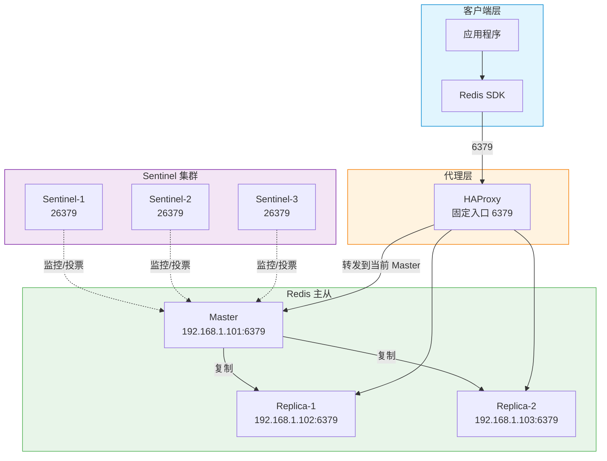
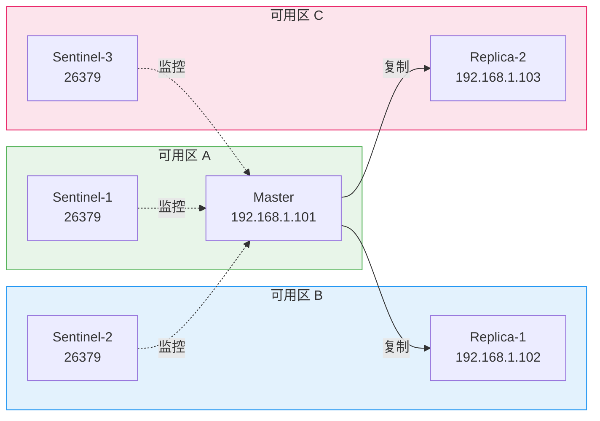

> [TOC]

# Redis-Sentinel 生产级部署与运维指南

## 1. 简介

### 1.1 服务介绍与核心特性

Redis Sentinel 是 Redis 官方提供的高可用方案，基于主从复制 + 哨兵监控，实现主节点故障时的自动故障转移。

核心特性：

- **主从复制**：单主多从，数据异步复制到从节点
- **自动 Failover**：哨兵监控主节点，主宕机时投票选举新主，秒级切换
- **无数据分片**：单主承载全部数据，适合中小规模
- **多 key 事务**：支持跨 key 的 MULTI/EXEC、Lua 脚本，无 slot 限制
- **固定入口**：通过 HAProxy 等代理提供单一连接地址，业务无感知主从切换

### 1.2 适用场景

| 场景 | 说明 |
|------|------|
| 会话存储 | 分布式 Session，单主可承载 |
| 配置缓存 | 配置中心、开关等，数据量小 |
| 消息队列 | List/Stream 轻量队列，单主足够 |
| 排行榜/计数器 | Sorted Set、INCR，QPS 万级 |
| 多 key 事务 | 需 MULTI 跨多个 key 的业务 |

### 1.3 架构原理图



### 1.4 版本说明

| 组件 | 版本 | 兼容性 |
|------|------|--------|
| **Redis Server** | 8.6.1 | Linux x86_64 / ARM64 |
| **redis-sentinel** | 随 Redis Server 一同安装 | — |
| **HAProxy**（可选） | 2.9+ | 提供固定入口 |
| **redis_exporter** | v1.82.0 | 兼容 Redis 5.x-8.x |
| **操作系统** | Rocky Linux 9.x / Ubuntu 22.04 LTS 或 24.04 LTS | 内核 ≥ 5.4 |

---

## 2. 版本选择指南

> 📎 版本决策详见：[Redis 集群方案选型指南](../Redis集群方案选型指南.md#2-版本对比redis-7x-vs-8x)

| 场景 | 建议 |
|------|------|
| **新建集群** | 使用 Redis 8.6.1 |
| **现有 7.x** | 可滚动升级至 8.x，配置中去掉 `io-threads-do-reads` |
| **现有 6.x** | 建议先升级至 7.x 再升级 8.x |

---

## 3. 生产环境规划（高可用架构）

### 3.1 集群架构图



> ⚠️ **关键设计**：主从节点与 Sentinel 分布在不同可用区，避免单点故障。

### 3.2 节点角色与配置要求

| 角色 | 数量 | 最低配置 | 推荐配置 | 说明 |
|------|------|---------|---------|------|
| Master | 1 | 4C 8G 100G SSD | 8C 16G 500G NVMe SSD | 承载全部读写 |
| Replica | 2 | 4C 8G 100G SSD | 8C 16G 500G NVMe SSD | 故障接管 + 读分离 |
| Sentinel | 3 | 1C 512M | 1C 1G | 奇数个，Quorum ≥ 2 |

### 3.3 网络与端口规划

| 源 | 目标端口 | 协议 | 用途 |
|----|---------|------|------|
| 客户端 → Redis | 6379/tcp | RESP | 数据读写 |
| 客户端 → HAProxy | 6379/tcp | TCP | 固定入口（可选） |
| 客户端 → Sentinel | 26379/tcp | RESP | 查询 master 地址、订阅事件 |
| Sentinel ↔ Redis | 6379/tcp | RESP | 监控、执行 failover |
| Sentinel ↔ Sentinel | 26379/tcp | Gossip | 哨兵间通信 |
| Prometheus → Redis | 9121/tcp | HTTP | redis_exporter |

---

## 4. 生产环境部署

### 4.1 前置准备（所有节点）

> 🖥️ **执行节点：所有节点（Master + Replica + Sentinel 共 6 台）**

#### 4.1.1 系统优化

```bash
cat > /etc/sysctl.d/99-redis.conf << 'EOF'
vm.overcommit_memory = 1
vm.swappiness = 1
net.core.somaxconn = 65535
net.core.netdev_max_backlog = 65535
net.ipv4.tcp_max_syn_backlog = 65535
EOF

sysctl -p /etc/sysctl.d/99-redis.conf
```

```bash
# 关闭 THP
cat > /etc/systemd/system/disable-thp.service << 'EOF'
[Unit]
Description=Disable Transparent Huge Pages
DefaultDependencies=no
After=sysinit.target local-fs.target
Before=redis.service redis-sentinel.service

[Service]
Type=oneshot
ExecStart=/bin/sh -c 'echo never > /sys/kernel/mm/transparent_hugepage/enabled && echo never > /sys/kernel/mm/transparent_hugepage/defrag'

[Install]
WantedBy=multi-user.target
EOF

systemctl daemon-reload
systemctl enable --now disable-thp.service
```

```bash
cat > /etc/security/limits.d/99-redis.conf << 'EOF'
redis soft nofile 65535
redis hard nofile 65535
redis soft nproc 65535
redis hard nproc 65535
EOF
```

#### 4.1.2 创建 Redis 用户与目录

```bash
id -u redis &>/dev/null || useradd -r -s /sbin/nologin -d /opt/redis redis

mkdir -p /opt/redis/{bin,conf,data,logs,run}
mkdir -p /backup/redis
chown -R redis:redis /opt/redis /backup/redis
```

#### 4.1.3 防火墙配置

```bash
# ── Rocky Linux 9 ──────────────────────────
firewall-cmd --permanent --add-port=6379/tcp
firewall-cmd --permanent --add-port=26379/tcp
firewall-cmd --permanent --add-port=9121/tcp
firewall-cmd --reload

# ── Ubuntu 22.04（差异）────────────────────
# ufw allow 6379/tcp
# ufw allow 26379/tcp
# ufw allow 9121/tcp
# ufw reload
```

### 4.2 部署步骤

> 🖥️ **执行节点：所有 Redis 节点**

#### 4.2.1 安装 Redis 8.6.1（源码编译）

```bash
# ── Rocky Linux 9 ──────────────────────────
dnf install -y gcc make jemalloc-devel systemd-devel

# ── Ubuntu 22.04（差异）────────────────────
# apt-get update && apt-get install -y build-essential libjemalloc-dev libsystemd-dev
```

```bash
cd /tmp
[ -f redis-8.6.1.tar.gz ] || wget -O redis-8.6.1.tar.gz "https://download.redis.io/releases/redis-8.6.1.tar.gz"
tar xzf redis-8.6.1.tar.gz
cd redis-8.6.1

make -j$(nproc) USE_SYSTEMD=yes BUILD_TLS=yes
make install PREFIX=/opt/redis

chown -R redis:redis /opt/redis/bin/
rm -rf /tmp/redis-8.6.1 /tmp/redis-8.6.1.tar.gz
```

#### 4.2.2 Master 节点配置文件

> 🖥️ **执行节点：Master 节点（192.168.1.101）**

```bash
cat > /opt/redis/conf/redis.conf << 'EOF'
bind 192.168.1.101 127.0.0.1
port 6379
protected-mode yes
daemonize no
pidfile /opt/redis/run/redis_6379.pid
loglevel notice
logfile /opt/redis/logs/redis.log
databases 16

requirepass YourStr0ngP@ssw0rd!
masterauth YourStr0ngP@ssw0rd!

maxmemory 10gb
maxmemory-policy allkeys-lru

save 3600 1
save 300 100
save 60 10000
rdbcompression yes
rdbchecksum yes
dbfilename dump.rdb
dir /opt/redis/data

appendonly yes
appendfilename "appendonly.aof"
appendfsync everysec
aof-use-rdb-preamble yes

replica-serve-stale-data yes
replica-read-only yes
repl-diskless-sync yes
repl-backlog-size 256mb

lazyfree-lazy-eviction yes
lazyfree-lazy-expire yes
lazyfree-lazy-server-del yes
replica-lazy-flush yes

tcp-backlog 511
timeout 300
tcp-keepalive 60
maxclients 10000

slowlog-log-slower-than 10000
slowlog-max-len 1024
EOF

chown redis:redis /opt/redis/conf/redis.conf
chmod 640 /opt/redis/conf/redis.conf
```

#### 4.2.3 Replica 节点配置文件

> 🖥️ **执行节点：Replica 节点（192.168.1.102、192.168.1.103），修改 bind 和 replicaof**

```bash
# Replica-1（192.168.1.102）示例
cat > /opt/redis/conf/redis.conf << 'EOF'
bind 192.168.1.102 127.0.0.1
port 6379
protected-mode yes
daemonize no
pidfile /opt/redis/run/redis_6379.pid
loglevel notice
logfile /opt/redis/logs/redis.log
databases 16

replicaof 192.168.1.101 6379
masterauth YourStr0ngP@ssw0rd!
requirepass YourStr0ngP@ssw0rd!

maxmemory 10gb
maxmemory-policy allkeys-lru

save 3600 1
save 300 100
save 60 10000
rdbcompression yes
rdbchecksum yes
dbfilename dump.rdb
dir /opt/redis/data

appendonly yes
appendfilename "appendonly.aof"
appendfsync everysec
aof-use-rdb-preamble yes

replica-serve-stale-data yes
replica-read-only yes
repl-diskless-sync yes
repl-backlog-size 256mb

lazyfree-lazy-eviction yes
lazyfree-lazy-expire yes
lazyfree-lazy-server-del yes
replica-lazy-flush yes

tcp-backlog 511
timeout 300
tcp-keepalive 60
maxclients 10000

slowlog-log-slower-than 10000
slowlog-max-len 1024
EOF

chown redis:redis /opt/redis/conf/redis.conf
chmod 640 /opt/redis/conf/redis.conf
```

#### 4.2.4 Sentinel 节点配置文件

> 🖥️ **执行节点：Sentinel 节点（3 台），修改 bind**

```bash
cat > /opt/redis/conf/sentinel.conf << 'EOF'
port 26379
bind 0.0.0.0
protected-mode yes
daemonize no
logfile ""
dir /opt/redis/data

sentinel monitor mymaster 192.168.1.101 6379 2
sentinel down-after-milliseconds mymaster 5000
sentinel failover-timeout mymaster 60000
sentinel parallel-syncs mymaster 1
sentinel auth-pass mymaster YourStr0ngP@ssw0rd!
requirepass YourStr0ngP@ssw0rd!
EOF

chown redis:redis /opt/redis/conf/sentinel.conf
chmod 640 /opt/redis/conf/sentinel.conf
```

#### 4.2.5 Systemd 服务

**Redis 服务（Master + Replica）：**

```bash
cat > /etc/systemd/system/redis.service << 'EOF'
[Unit]
Description=Redis 8.6.1
After=network-online.target
Wants=network-online.target

[Service]
Type=notify
User=redis
Group=redis
ExecStart=/opt/redis/bin/redis-server /opt/redis/conf/redis.conf
ExecStop=/opt/redis/bin/redis-cli -a YourStr0ngP@ssw0rd! shutdown
Restart=always
RestartSec=5
LimitNOFILE=65535

[Install]
WantedBy=multi-user.target
EOF

systemctl daemon-reload
systemctl enable --now redis.service
```

**Sentinel 服务（3 台 Sentinel 节点）：**

```bash
cat > /etc/systemd/system/redis-sentinel.service << 'EOF'
[Unit]
Description=Redis Sentinel 8.6.1
After=network-online.target redis.service
Wants=network-online.target

[Service]
Type=notify
User=redis
Group=redis
ExecStart=/opt/redis/bin/redis-sentinel /opt/redis/conf/sentinel.conf
Restart=always
RestartSec=5
LimitNOFILE=65535

[Install]
WantedBy=multi-user.target
EOF

systemctl daemon-reload
systemctl enable --now redis-sentinel.service
```

> 📌 注意：Sentinel 节点若与 Redis 同机，需先启动 Redis 再启动 Sentinel；若 Sentinel 独立部署，无需 redis.service。

### 4.3 启动顺序

```
1. 启动 Master 节点 Redis
2. 启动 Replica 节点 Redis（replicaof 指向 Master）
3. 启动 3 台 Sentinel 节点
4. 验证：SENTINEL MASTER mymaster
```

### 4.4 安装验证

> 🖥️ **执行节点：任意节点**

```bash
# ✅ 验证 Sentinel 已识别 Master
redis-cli -p 26379 -a YourStr0ngP@ssw0rd! SENTINEL MASTER mymaster
# 预期输出包含：name mymaster, ip 192.168.1.101, port 6379

# ✅ 验证从节点列表
redis-cli -p 26379 -a YourStr0ngP@ssw0rd! SENTINEL SLAVES mymaster

# ✅ 验证读写
redis-cli -h 192.168.1.101 -p 6379 -a YourStr0ngP@ssw0rd! SET test:key "hello-sentinel"
redis-cli -h 192.168.1.101 -p 6379 -a YourStr0ngP@ssw0rd! GET test:key
# 预期输出：hello-sentinel

# ✅ 验证主从复制
redis-cli -h 192.168.1.101 -p 6379 -a YourStr0ngP@ssw0rd! INFO replication
# 预期：role:master, connected_slaves:2
```

---

## 5. 关键参数配置说明

### 5.1 Redis 核心参数

| 分类 | 参数 | 推荐值 | 说明 |
|------|------|--------|------|
| 内存 | `maxmemory` | 物理内存 60%-75% | 必须设置 |
| 内存 | `maxmemory-policy` | `allkeys-lru` | 淘汰策略 |
| 持久化 | `appendonly` | `yes` | 生产必须开启 AOF |
| 持久化 | `appendfsync` | `everysec` | 每秒刷盘 |
| 复制 | `repl-backlog-size` | `256mb` | 复制积压 |
| 安全 | `requirepass` | 强密码 | 必须设置 |
| 安全 | `masterauth` | 与 requirepass 一致 | Replica 连接 Master 认证 |

### 5.2 Sentinel 核心参数

| 参数 | 推荐值 | 说明 |
|------|--------|------|
| `sentinel monitor mymaster <ip> <port> <quorum>` | quorum=2 | 至少 2 个 Sentinel 认为主下线才触发 failover |
| `sentinel down-after-milliseconds` | 5000 | 5 秒无响应判定主观下线 |
| `sentinel failover-timeout` | 60000 | failover 超时 60 秒 |
| `sentinel parallel-syncs` | 1 | 同时向新主同步的从节点数，过大易造成主压力 |

---

## 6. 快速体验部署（开发 / 测试环境）

> ⚠️ **本章方案仅适用于开发/测试环境，严禁用于生产。**

使用 Docker Compose 在单机模拟 1 主 2 从 + 3 哨兵 + HAProxy 固定入口。

### 6.1 快速启动方案选型

Sentinel 需至少 1 主 2 从 + 3 哨兵，选择 Docker Compose 单机模拟。

### 6.2 快速启动步骤与验证

```bash
cd /data/technical-documentation/01-databases/redis/compose-sentinel
```

编辑 `.env`，设置 `REDIS_PASSWORD`、`REDIS_VERSION=8.6.1`（可选，默认 7.2-alpine）。

```bash
mkdir -p ./data/master ./data/replica-1 ./data/replica-2 ./data/sentinel-1 ./data/sentinel-2 ./data/sentinel-3
docker compose up -d

sleep 15

# ✅ 验证
docker exec redis-sentinel-1 redis-cli -p 26379 -a $REDIS_PASSWORD SENTINEL MASTER mymaster
docker exec redis-master redis-cli -a $REDIS_PASSWORD SET hello world
docker exec redis-master redis-cli -a $REDIS_PASSWORD GET hello
# 预期：world
```

### 6.3 停止与清理

```bash
cd /data/technical-documentation/01-databases/redis/compose-sentinel
docker compose down -v
docker system prune -f
```

---

## 7. 日常运维操作

### 7.1 常用管理命令

#### Sentinel 状态检查

```bash
# 查询当前 Master 地址
redis-cli -p 26379 -a YourStr0ngP@ssw0rd! SENTINEL GET-MASTER-ADDR-BY-NAME mymaster

# Master 详情
redis-cli -p 26379 -a YourStr0ngP@ssw0rd! SENTINEL MASTER mymaster

# 从节点列表
redis-cli -p 26379 -a YourStr0ngP@ssw0rd! SENTINEL SLAVES mymaster

# Sentinel 节点列表
redis-cli -p 26379 -a YourStr0ngP@ssw0rd! SENTINEL SENTINELS mymaster

# 检查 Master 是否客观下线
redis-cli -p 26379 -a YourStr0ngP@ssw0rd! SENTINEL CKQUORUM mymaster
```

#### 主从复制状态

```bash
redis-cli -h <master-ip> -p 6379 -a YourStr0ngP@ssw0rd! INFO replication
# 关注：role, connected_slaves, slave0:state=online
```

#### 手动 Failover（运维用）

```bash
# 在任意 Sentinel 上执行，强制触发 failover
redis-cli -p 26379 -a YourStr0ngP@ssw0rd! SENTINEL FAILOVER mymaster
```

### 7.2 备份与恢复

与 Cluster 相同：`BGSAVE`、`LASTSAVE`、`BGREWRITEAOF`，备份 RDB/AOF 至 `/backup/redis/`。

### 7.3 版本升级

滚动升级：先升级 Replica，再通过 `SENTINEL FAILOVER` 将 Replica 提升为主，升级原主，重复直至全部完成。

### 7.4 添加从节点

```bash
# 在新节点配置 replicaof <master-ip> 6379，启动 Redis
# Sentinel 会自动发现新从节点
redis-cli -p 26379 -a YourStr0ngP@ssw0rd! SENTINEL SLAVES mymaster
```

---

## 8. 使用手册（数据库专项）

### 8.1 连接与认证

```bash
# 直连 Master（需知晓当前 Master 地址）
redis-cli -h 192.168.1.101 -p 6379 -a YourStr0ngP@ssw0rd!

# 通过 Sentinel 获取 Master 地址（客户端 SDK 常用）
redis-cli -p 26379 -a YourStr0ngP@ssw0rd! SENTINEL GET-MASTER-ADDR-BY-NAME mymaster

# 通过 HAProxy 固定入口（推荐，主从切换无感知）
redis-cli -h <haproxy-ip> -p 6379 -a YourStr0ngP@ssw0rd!
```

### 8.2 数据类型操作

与 Cluster 相同，支持 String、Hash、List、Set、Sorted Set、Stream 等；**无 Hash Tag 限制**，多 key 操作无 slot 约束。

### 8.3 主从/集群状态监控命令

```bash
INFO replication
SENTINEL MASTER mymaster
SENTINEL SLAVES mymaster
SENTINEL SENTINELS mymaster
```

---

## 9. 监控与告警接入

### 9.1 Prometheus 指标暴露

在 Master 和 Replica 节点部署 redis_exporter，配置同 Cluster 文档第 9.1 节。

### 9.2 关键监控指标

| 指标 | 含义 | 告警阈值 |
|------|------|---------|
| `redis_up` | 实例可达 | = 0 Critical |
| `redis_connected_slaves` | 从节点数 | < 2 Warning |
| `redis_master_link_up` | 主从连接（Replica 视角） | = 0 Critical |
| `redis_used_memory_bytes` | 内存使用 | > maxmemory×90% Warning |

### 9.3 Grafana Dashboard

使用 Dashboard ID `763`（Redis Dashboard for Prometheus）。

### 9.4 告警规则

参考 Cluster 文档第 9.4 节，去掉 Cluster 相关规则，保留主从、内存、持久化等。

---

## 10. 注意事项与生产检查清单

### 10.1 安装前环境核查

| 检查项 | 命令 | 预期结果 |
|--------|------|---------|
| THP 已关闭 | `cat /sys/kernel/mm/transparent_hugepage/enabled` | `[never]` |
| overcommit_memory | `sysctl vm.overcommit_memory` | `= 1` |
| 防火墙端口 | `firewall-cmd --list-ports` | 包含 6379/tcp 26379/tcp |
| 主从复制 | `INFO replication` | connected_slaves ≥ 2 |
| Sentinel Quorum | `SENTINEL CKQUORUM mymaster` | OK 3 usable Sentinels |

### 10.2 常见故障排查

#### 主从复制中断

- **现象**：`INFO replication` 显示 `master_link_status:down`
- **排查**：检查网络、`repl-backlog-size`、Master 是否存活
- **解决**：修复网络后自动重连；或增大 `repl-backlog-size`

#### Failover 未触发

- **现象**：Master 宕机但未自动切换
- **排查**：`SENTINEL CKQUORUM mymaster` 是否满足 quorum
- **解决**：确保至少 quorum 个 Sentinel 存活且能互通

### 10.3 安全加固建议

与 Cluster 相同：强密码、ACL 最小权限、bind 限制、禁用危险命令、网络隔离。

---

## 11. 参考资料

| 资源 | 链接 |
|------|------|
| Redis 官方文档 | [https://redis.io/docs/](https://redis.io/docs/) |
| Redis Sentinel 文档 | [https://redis.io/docs/management/sentinel/](https://redis.io/docs/management/sentinel/) |
| Redis 8.6.1 源码下载 | [https://download.redis.io/releases/redis-8.6.1.tar.gz](https://download.redis.io/releases/redis-8.6.1.tar.gz) |
| 选型指南 | [Redis 集群方案选型指南](../Redis集群方案选型指南.md) |
