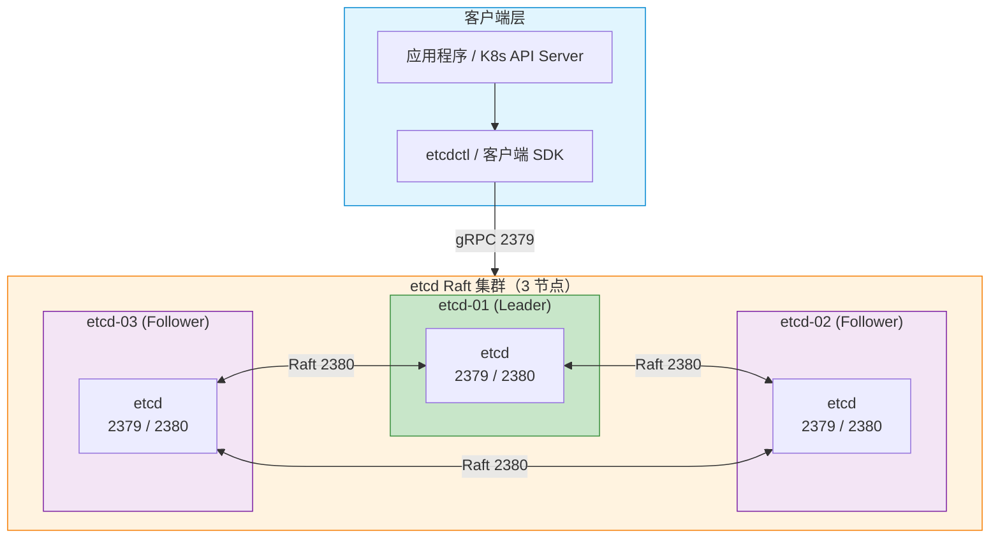
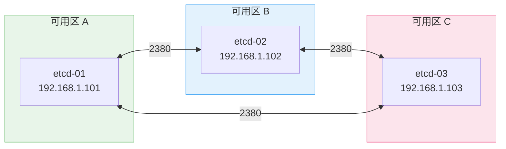

> [TOC]

# etcd 集群生产级部署与运维指南

## 1. 简介

### 1.1 服务介绍与核心特性

etcd 是分布式键值存储系统，基于 Raft 共识算法实现强一致性，是 Kubernetes、CoreDNS、Kafka 等系统的核心依赖。

**核心特性**：
- **强一致性**：Raft 共识算法保证读写一致性
- **高可用**：3/5/7 节点集群，容忍 (N-1)/2 节点故障
- **Watch 机制**：支持键值变更的实时推送
- **租约（Lease）**：支持 TTL 自动过期，常用于服务发现与分布式锁
- **事务**：支持多键原子事务

### 1.2 适用场景

| 场景 | 说明 |
|------|------|
| Kubernetes 元数据存储 | K8s 默认使用 etcd 存储集群状态 |
| 服务发现 | 配合 CoreDNS、Consul 等实现服务注册与发现 |
| 分布式配置中心 | 集中存储配置，支持 Watch 推送 |
| 分布式锁 | 基于 Lease + 事务实现 |
| 消息队列元数据 | Kafka、RocketMQ 等可选 etcd 作为协调存储 |

### 1.3 架构原理图



### 1.4 版本说明

> 以下版本号均通过 GitHub Releases API 实际查询确认（2026-03-14）。

| 组件 | 版本 | 兼容性 |
|------|------|--------|
| **etcd** | 3.6.8（2026-02 最新稳定版） | Linux x86_64 / ARM64 |
| **etcdctl / etcdutl** | 随 etcd 一同安装 | — |
| **操作系统** | Rocky Linux 9.x / Ubuntu 22.04 LTS 或 24.04 LTS | 内核 ≥ 5.4 |
| **Go**（从源码编译） | ≥ 1.21 | — |

---

## 2. 版本选择指南

### 2.1 版本对应关系表

| etcd 大版本 | 发布周期 | 关键特性 |
|-------------|---------|---------|
| **3.6.x**（当前） | 2025-2026 | 性能优化、安全增强、etcdutl 工具 |
| **3.5.x** | 2022-2025 | 结构化日志、JWT 认证 |
| **3.4.x** | 2019-2022 | 客户端 gRPC 代理、Learner 节点 |

### 2.2 版本决策建议

| 场景 | 建议 |
|------|------|
| **新建集群** | 直接使用 3.6.8 |
| **现有 3.5.x 集群** | 参考 [升级指南](https://etcd.io/docs/v3.6/upgrades/upgrade_3_6/) 滚动升级 |
| **K8s 兼容性** | K8s 1.28+ 推荐 etcd 3.5+，1.30+ 推荐 3.6+ |

---

## 3. 生产环境规划（高可用架构）

### 3.1 集群架构图



### 3.2 节点角色与配置要求

| 角色 | 最低配置 | 推荐配置 |
|------|---------|---------|
| etcd 节点 | 2C4G、50GB SSD | 4C8G、100GB NVMe SSD |
| 网络 | 千兆内网 | 万兆内网（高 QPS 场景） |

> ⚠️ **存储**：etcd 对磁盘延迟敏感，必须使用 SSD，禁止使用 HDD 或 NFS。

### 3.3 网络与端口规划

| 源地址 | 目标端口 | 协议 | 用途 |
|--------|---------|------|------|
| 客户端 / K8s API Server | 2379 | TCP | 客户端 gRPC |
| etcd 节点互访 | 2380 | TCP | Raft 共识通信 |
| Prometheus | 2379 | TCP | /metrics 指标采集 |

### 3.4 安装目录规划

| 路径 | 用途 | 规划说明 |
|------|------|----------|
| `/opt/etcd/` | 安装根目录 | 程序与配置集中管理 |
| `/opt/etcd/bin/` | 可执行文件 | etcd、etcdctl、etcdutl |
| `/opt/etcd/conf/` | 配置文件 | etcd.conf、systemd 环境变量 |
| `/data/etcd/` | 数据目录 | 独立挂载 SSD，与程序分离 |
| `/data/etcd/log/` | 日志目录 | 可选，默认 stderr |

**推荐目录树**：
```
/opt/etcd/
├── bin/          # etcd、etcdctl、etcdutl
├── conf/         # 配置文件
└── ssl/          # TLS 证书（生产建议启用）

/data/etcd/
├── data/         # --data-dir 数据目录
└── log/          # 日志（若配置 --log-outputs 文件）
```

---

## 4. 生产环境部署

### 4.1 前置准备（所有节点）

#### 4.1.1 本步目的
为 etcd 集群部署准备操作系统环境，包括内核参数调优、资源限制、时间同步等，确保中间件在生产负载下稳定运行。

#### 4.1.2 本步做了什么
配置内核参数（文件句柄、swap、网络）、创建 etcd 用户、设置 ulimit、确保 NTP 同步。不调优内核的部署只能算「能跑」，不能算「生产级」。

#### 4.1.3 内核与系统级调优（Pre-flight Tuning）

| 参数 | 推荐值 | 作用 | 验证命令 |
|------|--------|------|----------|
| `fs.file-max` | 655360 | 提高系统文件句柄上限 | `sysctl fs.file-max` |
| `vm.swappiness` | 0 或 1 | 降低 swap 倾向，避免 etcd 被换出 | `sysctl vm.swappiness` |
| `net.core.somaxconn` | 4096 | 提高 TCP 连接队列 | `sysctl net.core.somaxconn` |

**执行命令**：

```bash
# ── Rocky Linux 9 / Ubuntu 22.04 ──────────────────────────
# 本步目的：应用内核参数，需 root 执行
cat >> /etc/sysctl.d/99-etcd.conf << 'EOF'
# etcd 生产环境内核调优
fs.file-max = 655360
vm.swappiness = 0
net.core.somaxconn = 4096
EOF

sysctl -p /etc/sysctl.d/99-etcd.conf
```

**验证方法**：
```bash
# ✅ 验证
sysctl fs.file-max vm.swappiness net.core.somaxconn
# 预期输出：fs.file-max = 655360、vm.swappiness = 0、net.core.somaxconn = 4096
```

#### 4.1.4 创建 etcd 用户与目录

**本步目的**：以非 root 用户运行 etcd，降低安全风险。

**本步做了什么**：创建 etcd 系统用户、创建安装与数据目录、设置权限。

```bash
# 创建 etcd 用户（幂等）
id -u etcd &>/dev/null || useradd -r -s /sbin/nologin -d /opt/etcd etcd

# 按 3.4 规划创建目录
mkdir -p /opt/etcd/{bin,conf,ssl}
mkdir -p /data/etcd/{data,log}

# 分配权限
chown -R etcd:etcd /opt/etcd /data/etcd
chmod 750 /opt/etcd/ssl
```

**验证方法**：
```bash
# ✅ 验证
id etcd && ls -la /opt/etcd /data/etcd
# 预期：etcd 用户存在，目录属主为 etcd
```

#### 4.1.5 设置 ulimit

```bash
# 本步目的：提高 etcd 进程可打开文件数
cat >> /etc/security/limits.d/99-etcd.conf << 'EOF'
etcd soft nofile 65536
etcd hard nofile 65536
etcd soft nproc 65536
etcd hard nproc 65536
EOF
# 需重新登录或重启服务后生效
```

#### 4.1.6 时间同步

```bash
# 本步目的：Raft 对时钟敏感，节点间时间差需 < 1s
timedatectl set-ntp true
timedatectl status
# 预期：NTP synchronized: yes
```

---

### 4.2 部署步骤

> 🖥️ **执行节点**：所有 etcd 节点（etcd-01、etcd-02、etcd-03）

#### 4.2.1 第一步：按 3.4 规划创建目录（已在 4.1.4 完成）

#### 4.2.2 第二步：下载并安装 etcd

**本步目的**：获取 etcd 二进制并放置到规划目录。

**本步做了什么**：从 GitHub 下载 tar 包、解压、复制 etcd/etcdctl/etcdutl 到 /opt/etcd/bin/。

```bash
ETCD_VER=v3.6.8
DOWNLOAD_URL="https://github.com/etcd-io/etcd/releases/download"

# 下载（幂等：已存在则跳过）
[ -f /tmp/etcd-${ETCD_VER}-linux-amd64.tar.gz ] || \
  curl -L -o /tmp/etcd-${ETCD_VER}-linux-amd64.tar.gz \
  "${DOWNLOAD_URL}/${ETCD_VER}/etcd-${ETCD_VER}-linux-amd64.tar.gz"

# 解压并安装
tar xzf /tmp/etcd-${ETCD_VER}-linux-amd64.tar.gz -C /tmp --strip-components=1
cp /tmp/etcd /tmp/etcdctl /tmp/etcdutl /opt/etcd/bin/
chown etcd:etcd /opt/etcd/bin/*
chmod 755 /opt/etcd/bin/*
```

**验证方法**：
```bash
# ✅ 验证
/opt/etcd/bin/etcd --version
# 预期输出：etcd Version: 3.6.8
```

#### 4.2.3 第三步：配置环境变量与启动参数

**本步目的**：为每个节点生成正确的 cluster 配置，确保节点能正确加入集群。

**本步做了什么**：创建 systemd 环境文件，包含节点名、IP、initial-cluster 等。以下以 etcd-01（192.168.1.101）为例，etcd-02、etcd-03 需修改对应变量。

```bash
# ★ 以下变量需根据实际节点修改
NODE_NAME="etcd-01"                                    # ← 本节点名称
NODE_IP="192.168.1.101"                                # ← 本节点 IP
CLUSTER="etcd-01=http://192.168.1.101:2380,etcd-02=http://192.168.1.102:2380,etcd-03=http://192.168.1.103:2380"  # ← 所有节点 peer 地址

cat > /opt/etcd/conf/etcd.env << EOF
ETCD_NAME=${NODE_NAME}
ETCD_DATA_DIR=/data/etcd/data
ETCD_LISTEN_CLIENT_URLS="http://0.0.0.0:2379"
ETCD_ADVERTISE_CLIENT_URLS="http://${NODE_IP}:2379"
ETCD_LISTEN_PEER_URLS="http://0.0.0.0:2380"
ETCD_INITIAL_ADVERTISE_PEER_URLS="http://${NODE_IP}:2380"
ETCD_INITIAL_CLUSTER="${CLUSTER}"
ETCD_INITIAL_CLUSTER_TOKEN="etcd-cluster-prod"
ETCD_INITIAL_CLUSTER_STATE="new"
EOF

chown etcd:etcd /opt/etcd/conf/etcd.env
```

**etcd-02、etcd-03 差异**：仅 `NODE_NAME`、`NODE_IP` 不同，`CLUSTER` 三节点必须相同。

#### 4.2.4 第四步：创建 systemd 服务

```bash
cat > /etc/systemd/system/etcd.service << 'EOF'
[Unit]
Description=etcd key-value store
Documentation=https://etcd.io
After=network.target

[Service]
Type=notify
User=etcd
EnvironmentFile=/opt/etcd/conf/etcd.env
ExecStart=/opt/etcd/bin/etcd
Restart=on-failure
RestartSec=5
LimitNOFILE=65536

[Install]
WantedBy=multi-user.target
EOF

systemctl daemon-reload
```

---

### 4.3 集群初始化与配置

**本步目的**：首次启动 3 节点形成 Raft 集群。

**本步做了什么**：在 3 台节点上按顺序启动 etcd，`initial-cluster-state=new` 表示新建集群。

```bash
# 在所有节点执行（建议先 01，再 02，再 03，间隔 2 秒）
systemctl enable --now etcd
```

**验证方法**：
```bash
# ✅ 验证（在任意节点执行）
export ETCDCTL_API=3
/opt/etcd/bin/etcdctl --endpoints=http://127.0.0.1:2379 endpoint health
# 预期：http://127.0.0.1:2379 is healthy

/opt/etcd/bin/etcdctl --endpoints=http://127.0.0.1:2379 member list -w table
# 预期：3 个节点，均为 started
```

---

### 4.4 安装验证

```bash
# 写入测试数据
/opt/etcd/bin/etcdctl --endpoints=http://127.0.0.1:2379 put testkey "hello-etcd"

# 读取
/opt/etcd/bin/etcdctl --endpoints=http://127.0.0.1:2379 get testkey
# 预期输出：testkey / hello-etcd

# 集群状态
/opt/etcd/bin/etcdctl --endpoints=http://127.0.0.1:2379 endpoint status -w table
# 预期：3 个 endpoint，其中 1 个 IS LEADER 为 true
```

---

### 4.5 安装后的目录结构

| 路径 | 用途 | 运维关注点 |
|------|------|------------|
| `/opt/etcd/bin/` | etcd、etcdctl、etcdutl | 升级时替换二进制 |
| `/opt/etcd/conf/` | etcd.env 环境配置 | 修改后需 systemctl restart etcd |
| `/data/etcd/data/` | 数据目录（--data-dir） | 必须纳入备份，扩容时注意磁盘 IO |
| `/data/etcd/log/` | 日志（若配置） | 建议 logrotate，监控磁盘 |

```
/opt/etcd/
├── bin/          # etcd、etcdctl、etcdutl
├── conf/         # etcd.env 环境变量
└── ssl/          # TLS 证书（生产建议启用）

/data/etcd/
├── data/         # Raft 日志与快照，必须备份
└── log/          # 应用日志（若 --log-outputs 指定文件）
```

---

## 5. 关键参数配置说明

### 5.1 核心配置文件详解

etcd 使用环境变量或 YAML 配置文件，本示例以 `/opt/etcd/conf/etcd.env` 环境变量形式。**必须修改项**见下表：

| 参数 | 必须修改 | 说明 |
|------|----------|------|
| ETCD_NAME | ★ | 本节点名称，集群内唯一 |
| ETCD_LISTEN_CLIENT_URLS / ADVERTISE | ★ | 客户端地址，生产建议 HTTPS |
| ETCD_INITIAL_CLUSTER | ★ | 所有节点 peer URL，三节点必须相同 |
| ETCD_INITIAL_ADVERTISE_PEER_URLS | ★ | 本节点 peer 地址，每节点不同 |
| ETCD_INITIAL_CLUSTER_TOKEN | ⚠️ | 集群令牌，多集群共存时区分 |

**逐行注释示例**（etcd-01 节点）：

```bash
# etcd.env - etcd-01 (192.168.1.101)
# ★ 以下为本节点专属，etcd-02/03 仅 NAME 与 IP 不同

ETCD_NAME=etcd-01
# 数据目录，需 SSD，必须与 3.4 规划一致
ETCD_DATA_DIR=/data/etcd/data

# 客户端监听：0.0.0.0 表示所有网卡；生产建议 https://0.0.0.0:2379 + TLS
ETCD_LISTEN_CLIENT_URLS="http://0.0.0.0:2379"
# 对外宣告地址，客户端连接用，需为其他节点可访问的 IP
ETCD_ADVERTISE_CLIENT_URLS="http://192.168.1.101:2379"

# 集群内部 Raft 通信
ETCD_LISTEN_PEER_URLS="http://0.0.0.0:2380"
ETCD_INITIAL_ADVERTISE_PEER_URLS="http://192.168.1.101:2380"
# 初始集群成员，三节点必须完全一致
ETCD_INITIAL_CLUSTER="etcd-01=http://192.168.1.101:2380,etcd-02=http://192.168.1.102:2380,etcd-03=http://192.168.1.103:2380"

ETCD_INITIAL_CLUSTER_TOKEN="etcd-cluster-prod"
# new=新建集群；existing=加入已有集群（扩容时）
ETCD_INITIAL_CLUSTER_STATE="new"

# 存储配额，超过后集群只读告警，默认 2GB
ETCD_QUOTA_BACKEND_BYTES="2147483648"
```

### 5.2 生产环境参数优化详解

| 参数 | 默认值 | 推荐值 | 说明 |
|------|--------|--------|------|
| `ETCD_AUTO_COMPACTION_RETENTION` | 0（关闭） | `1`（1 小时）或 `24`（24 小时） | 自动压缩历史版本，防止 DB 无限增长；单位小时 |
| `ETCD_AUTO_COMPACTION_MODE` | periodic | periodic | 与上配合：periodic=按时间、revision=按版本数 |
| `ETCD_MAX_REQUEST_BYTES` | 1572864 (1.5MB) | 1572864 | 单请求最大字节，超大 value 需调大 |
| `ETCD_SNAPSHOT_COUNT` | 100000 | 100000 | 触发快照的事务数，一般无需改 |
| `ETCD_HEARTBEAT_INTERVAL` | 100ms | 100 | 心跳间隔，网络不稳定可适当增大 |
| `ETCD_ELECTION_TIMEOUT` | 1000ms | 1000 | 选举超时，需 > heartbeat×10，慎改 |
| `ETCD_LOG_LEVEL` | info | info | debug/info/warn/error |
| `ETCD_LOG_OUTPUTS` | default | stderr 或 /data/etcd/log/etcd.log | 日志输出 |

```bash
# 追加到 /opt/etcd/conf/etcd.env（生产调优）
ETCD_AUTO_COMPACTION_RETENTION="1"
ETCD_AUTO_COMPACTION_MODE="periodic"
ETCD_MAX_REQUEST_BYTES="1572864"
ETCD_LOG_LEVEL="info"
ETCD_LOG_OUTPUTS="stderr"
```

### 5.3 生产环境认证配置（用户与密码）

> 生产环境**必须**启用认证，避免未授权访问。etcd 支持基于角色的访问控制（RBAC）与用户密码。

**建议**：集群启动并确认正常后，立即创建 root 用户、启用 auth，再创建业务用只读/读写用户。

#### 5.3.1 创建 root 并启用认证

```bash
# 在集群健康状态下执行（任意节点）
export ETCDCTL_API=3
ENDPOINTS="http://127.0.0.1:2379"

# 1. 创建 root 角色
/opt/etcd/bin/etcdctl --endpoints=$ENDPOINTS role add root

# 2. 创建 root 用户（交互式会提示输入密码；非交互式见下方示例）
/opt/etcd/bin/etcdctl --endpoints=$ENDPOINTS user add root
# 按提示输入密码，如：YourNewRootPassword123!

# 3. 将 root 用户绑定到 root 角色
/opt/etcd/bin/etcdctl --endpoints=$ENDPOINTS user grant-role root root

# 4. 启用认证（启用后所有请求均需认证）
/opt/etcd/bin/etcdctl --endpoints=$ENDPOINTS auth enable
```

**非交互式添加用户**（脚本/自动化场景）：

```bash
# 创建带密码的用户，密码通过参数传入
/opt/etcd/bin/etcdctl --endpoints=$ENDPOINTS user add appuser --interactive=false --new-user-password='YourAppPassword123!'

# 创建角色并授权（示例：appuser 对 /app/ 前缀有读写权限）
/opt/etcd/bin/etcdctl --endpoints=$ENDPOINTS role add approle
/opt/etcd/bin/etcdctl --endpoints=$ENDPOINTS role grant-permission approle readwrite /app/
/opt/etcd/bin/etcdctl --endpoints=$ENDPOINTS user grant-role appuser approle
```

#### 5.3.2 启用认证后的客户端连接

```bash
# etcdctl 使用用户名密码
/opt/etcd/bin/etcdctl --endpoints=http://127.0.0.1:2379 --user=root:YourNewRootPassword123! put key val
/opt/etcd/bin/etcdctl --endpoints=http://127.0.0.1:2379 --user=appuser:YourAppPassword123! get /app/config
```

#### 5.3.3 修改用户密码

```bash
/opt/etcd/bin/etcdctl --endpoints=$ENDPOINTS --user=root:OldPassword user passwd root
# 按提示输入新密码
```

> ⚠️ **注意**：`auth enable` 前必须存在 root 用户且已绑定 root 角色，否则无法启用。启用后务必妥善保管 root 密码。

---

## 6. 快速体验部署（开发 / 测试环境）

### 6.1 快速启动方案选型
etcd 支持 Docker 单机/集群快速启动，适合本地验证。以下使用 Docker Compose 启动 3 节点伪集群。

### 6.2 快速启动步骤与验证

```bash
mkdir -p /tmp/etcd-verify && cd /tmp/etcd-verify

cat > docker-compose.yml << 'EOF'
version: "3.8"
services:
  etcd1:
    image: quay.io/coreos/etcd:v3.6.8
    command:
      - etcd
      - --name=etcd1
      - --data-dir=/etcd-data
      - --listen-client-urls=http://0.0.0.0:2379
      - --advertise-client-urls=http://etcd1:2379
      - --listen-peer-urls=http://0.0.0.0:2380
      - --initial-advertise-peer-urls=http://etcd1:2380
      - --initial-cluster=etcd1=http://etcd1:2380,etcd2=http://etcd2:2380,etcd3=http://etcd3:2380
      - --initial-cluster-token=verify
      - --initial-cluster-state=new
    ports: ["23791:2379"]
    networks: [etcd-net]
  etcd2:
    image: quay.io/coreos/etcd:v3.6.8
    command:
      - etcd
      - --name=etcd2
      - --data-dir=/etcd-data
      - --listen-client-urls=http://0.0.0.0:2379
      - --advertise-client-urls=http://etcd2:2379
      - --listen-peer-urls=http://0.0.0.0:2380
      - --initial-advertise-peer-urls=http://etcd2:2380
      - --initial-cluster=etcd1=http://etcd1:2380,etcd2=http://etcd2:2380,etcd3=http://etcd3:2380
      - --initial-cluster-token=verify
      - --initial-cluster-state=new
    ports: ["23792:2379"]
    networks: [etcd-net]
  etcd3:
    image: quay.io/coreos/etcd:v3.6.8
    command:
      - etcd
      - --name=etcd3
      - --data-dir=/etcd-data
      - --listen-client-urls=http://0.0.0.0:2379
      - --advertise-client-urls=http://etcd3:2379
      - --listen-peer-urls=http://0.0.0.0:2380
      - --initial-advertise-peer-urls=http://etcd3:2380
      - --initial-cluster=etcd1=http://etcd1:2380,etcd2=http://etcd2:2380,etcd3=http://etcd3:2380
      - --initial-cluster-token=verify
      - --initial-cluster-state=new
    ports: ["23793:2379"]
    networks: [etcd-net]
networks:
  etcd-net: {}
EOF

docker compose up -d
sleep 5
docker exec etcd1 etcdctl endpoint health --endpoints=http://localhost:2379,http://etcd2:2379,http://etcd3:2379
```

### 6.3 停止与清理

```bash
docker compose down -v
rm -rf /tmp/etcd-verify
```

---

## 7. 日常运维操作

### 7.1 常用管理命令

| 命令 | 说明 |
|------|------|
| `etcdctl endpoint health` | 健康检查 |
| `etcdctl member list` | 成员列表 |
| `etcdctl endpoint status` | 节点状态（含 Leader） |
| `etcdctl put key val` | 写入 |
| `etcdctl get key` | 读取 |
| `etcdctl watch key` | 监听键变化 |

### 7.2 备份与恢复

**备份**（建议 cron 每日执行）：
```bash
# 本步目的：创建快照用于灾难恢复
ETCDCTL_API=3 /opt/etcd/bin/etcdctl snapshot save /backup/etcd/etcd-$(date +%Y%m%d_%H%M%S).db \
  --endpoints=http://127.0.0.1:2379
```

**恢复**（灾难恢复，3 节点均需执行）：
```bash
# 本步目的：从快照重建集群，所有节点使用同一快照
# 本步做了什么：etcdutl 从快照创建新数据目录，写入新 cluster 元数据
systemctl stop etcd
rm -rf /data/etcd/data/*

# 每个节点执行（--name、--initial-advertise-peer-urls 按本节点修改）
/opt/etcd/bin/etcdutl snapshot restore /backup/etcd/etcd-xxx.db \
  --name=etcd-01 \
  --data-dir=/data/etcd/data \
  --initial-cluster=etcd-01=http://192.168.1.101:2380,etcd-02=http://192.168.1.102:2380,etcd-03=http://192.168.1.103:2380 \
  --initial-cluster-token=etcd-cluster-prod \
  --initial-advertise-peer-urls=http://192.168.1.101:2380

chown -R etcd:etcd /data/etcd/data
systemctl start etcd
```
> 📌 注意：etcd-02、etcd-03 仅 `--name`、`--initial-advertise-peer-urls` 不同，`--initial-cluster` 三节点必须一致。

### 7.3 集群扩缩容
参考 [etcd 官方运维指南](https://etcd.io/docs/v3.6/op-guide/runtime-configuration/)。

### 7.4 版本升级
参考 [升级指南](https://etcd.io/docs/v3.6/upgrades/upgrade_3_6/)，滚动升级，保留回滚方案。

### 7.5 日志清理与轮转

**选型说明**：etcd 默认输出到 stderr，若配置 `--log-outputs` 到文件，采用 logrotate。

**保留策略**：

| 日志类型 | 路径 | 保留天数 | 单文件上限 | 压缩 |
|---------|------|---------|-----------|------|
| 运行日志 | /data/etcd/log/*.log | 14 天 | 100M | 是 |

**logrotate 配置**：
```bash
cat > /etc/logrotate.d/etcd << 'EOF'
/data/etcd/log/*.log {
    daily
    rotate 14
    size 100M
    compress
    delaycompress
    copytruncate
    missingok
    notifempty
}
EOF
```

**验证**：`logrotate -d /etc/logrotate.d/etcd`

---

## 9. 监控与告警接入

### 9.1 Prometheus 指标暴露
etcd 内置 Prometheus 格式指标，无需单独 Exporter。指标端点：`http://{node}:2379/metrics`。

### 9.2 关键监控指标

| 指标 | 说明 | 告警阈值建议 |
|------|------|-------------|
| `etcd_server_has_leader` | 集群是否有 Leader | 0 告警 |
| `etcd_server_leader_changes_seen_total` | Leader 切换次数 | 1h 内 > 3 告警 |
| `etcd_disk_backend_commit_duration_seconds` | 磁盘提交延迟 | p99 > 0.5s 告警 |
| `etcd_mvcc_db_total_size_in_bytes` | 存储大小 | 接近 quota 告警 |

### 9.3 Grafana Dashboard
- Dashboard ID：**3070**（etcd 官方）
- 或从 [Grafana 官网](https://grafana.com/grafana/dashboards/) 搜索 "etcd"

### 9.4 告警规则示例
```yaml
- alert: EtcdNoLeader
  expr: etcd_server_has_leader == 0
  for: 1m
  labels: { severity: critical }
  annotations: { summary: "etcd 集群无 Leader" }
```

---

## 10. 注意事项与生产检查清单

### 10.1 安装前环境核查
- [ ] 3 节点时钟同步（NTP）
- [ ] 2379、2380 端口互通
- [ ] 数据目录使用 SSD
- [ ] 内核参数已调优

### 10.2 常见故障排查与处理指南

#### 故障：节点无法加入集群

**现象**：`member list` 仅 1~2 个节点，新节点启动报错。

**原因**：`initial-cluster` 配置错误、网络不通、token 不一致。

**排查**：
```bash
etcdctl member list --endpoints=http://127.0.0.1:2379
# 检查各节点 initial-cluster 是否完全一致
```

**解决**：确保 3 节点 `ETCD_INITIAL_CLUSTER`、`ETCD_INITIAL_CLUSTER_TOKEN` 完全一致；检查防火墙放行 2380。

---

#### 故障：集群无 Leader（Raft 选举失败）

**现象**：`etcd_server_has_leader` 为 0，客户端请求超时。

**状态流转图**：


**原因**：节点数不足半数（3 节点至少 2 个存活）、网络分区、磁盘满。

**排查**：
```bash
etcdctl endpoint status --endpoints=http://node1:2379,http://node2:2379,http://node3:2379 -w table
# 查看各节点 Raft 状态
```

**解决**：恢复宕机节点或网络；若 2 节点永久丢失，需从快照恢复并重新建集群。

---

#### 故障：磁盘空间不足

**现象**：etcd 日志报 "no space left on device"，服务异常。

**解决**：扩容磁盘或清理历史数据；调整 `ETCD_AUTO_COMPACTION_RETENTION` 加快压缩；临时可提高 quota（不治本）。

---

### 10.3 安全加固建议
- 生产环境启用 TLS（`--cert-file`、`--key-file`、`--trusted-ca-file`）
- 启用 RBAC 认证（`etcdctl user add`、`role grant`）
- 限制 2379、2380 仅内网访问

### 10.4 伪集群验证踩坑与经验总结

| 问题现象 | 报错/原因 | 解决方式 |
|---------|----------|---------|
| Docker 集群启动后 member list 为空 | 容器名解析延迟，节点未完全就绪 | 等待 5~10 秒后重试 |
| snapshot save 成功但 restore 报错 | etcd 3.6 restore 参数变化 | 使用 `etcdutl snapshot restore`，参考 `--help` |
| 单节点测试 initial-cluster 写 127.0.0.1 | 多节点时需写实际 IP/主机名 | 生产必须用可解析的地址 |

---

## 11. 参考资料

- [etcd 官方文档](https://etcd.io/docs/v3.6/)
- [etcd 运维指南](https://etcd.io/docs/v3.6/op-guide/)
- [etcd 升级指南](https://etcd.io/docs/v3.6/upgrades/upgrade_3_6/)
