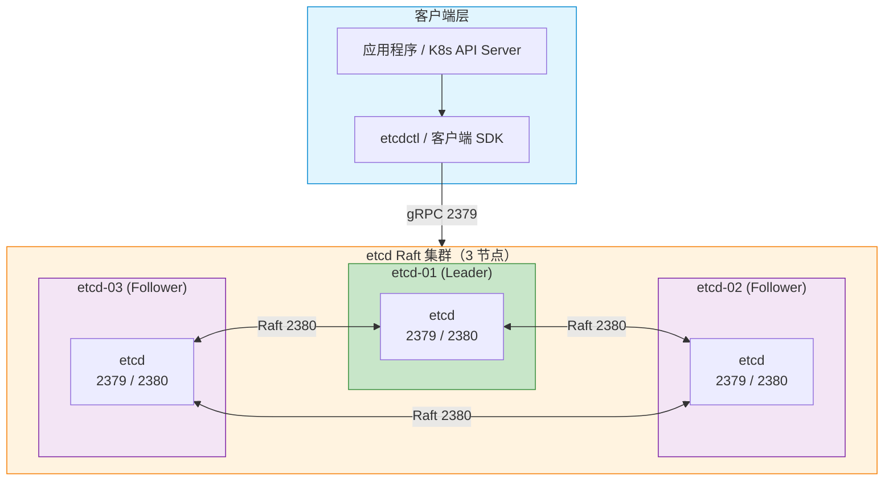
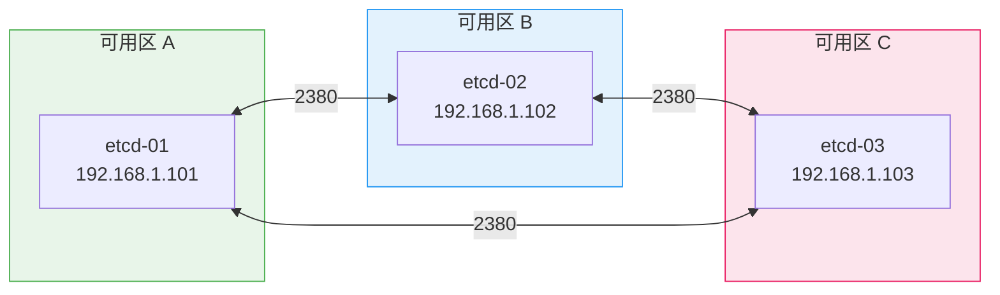

> [TOC]

# etcd 集群生产级部署与运维指南

## 1. 简介

### 1.1 服务介绍与核心特性

etcd 是分布式键值存储系统，基于 Raft 共识算法实现强一致性，是 Kubernetes、CoreDNS、Kafka 等系统的核心依赖。

**核心特性**：
- **强一致性**：Raft 共识算法保证读写一致性
- **高可用**：3/5/7 节点集群，容忍 (N-1)/2 节点故障
- **Watch 机制**：支持键值变更的实时推送
- **租约（Lease）**：支持 TTL 自动过期，常用于服务发现与分布式锁
- **事务**：支持多键原子事务

### 1.2 适用场景

| 场景 | 说明 |
|------|------|
| Kubernetes 元数据存储 | K8s 默认使用 etcd 存储集群状态 |
| 服务发现 | 配合 CoreDNS、Consul 等实现服务注册与发现 |
| 分布式配置中心 | 集中存储配置，支持 Watch 推送 |
| 分布式锁 | 基于 Lease + 事务实现 |
| 消息队列元数据 | Kafka、RocketMQ 等可选 etcd 作为协调存储 |

### 1.3 架构原理图



### 1.4 版本说明

> 以下版本号均通过 GitHub Releases API 实际查询确认（2026-03-14）。

| 组件 | 版本 | 兼容性 |
|------|------|--------|
| **etcd** | 3.6.8（2026-02 最新稳定版） | Linux x86_64 / ARM64 |
| **etcdctl / etcdutl** | 随 etcd 一同安装 | — |
| **操作系统** | Rocky Linux 9.x / Ubuntu 22.04 LTS 或 24.04 LTS | 内核 ≥ 5.4 |
| **Go**（从源码编译） | ≥ 1.21 | — |

---

## 2. 版本选择指南

### 2.1 版本对应关系表

| etcd 大版本 | 发布周期 | 关键特性 |
|-------------|---------|---------|
| **3.6.x**（当前） | 2025-2026 | 性能优化、安全增强、etcdutl 工具 |
| **3.5.x** | 2022-2025 | 结构化日志、JWT 认证 |
| **3.4.x** | 2019-2022 | 客户端 gRPC 代理、Learner 节点 |

### 2.2 版本决策建议

| 场景 | 建议 |
|------|------|
| **新建集群** | 直接使用 3.6.8 |
| **现有 3.5.x 集群** | 参考 [升级指南](https://etcd.io/docs/v3.6/upgrades/upgrade_3_6/) 滚动升级 |
| **K8s 兼容性** | K8s 1.28+ 推荐 etcd 3.5+，1.30+ 推荐 3.6+ |

---

## 3. 生产环境规划（高可用架构）

### 3.1 集群架构图



### 3.2 节点角色与配置要求

| 角色 | 最低配置 | 推荐配置 |
|------|---------|---------|
| etcd 节点 | 2C4G、50GB SSD | 4C8G、100GB NVMe SSD |
| 网络 | 千兆内网 | 万兆内网（高 QPS 场景） |

> ⚠️ **存储**：etcd 对磁盘延迟敏感，必须使用 SSD，禁止使用 HDD 或 NFS。

### 3.3 网络与端口规划

| 源地址 | 目标端口 | 协议 | 用途 |
|--------|---------|------|------|
| 客户端 / K8s API Server | 2379 | TCP | 客户端 gRPC |
| etcd 节点互访 | 2380 | TCP | Raft 共识通信 |
| Prometheus | 2379 | TCP | /metrics 指标采集 |

### 3.4 安装目录规划

| 路径 | 用途 | 规划说明 |
|------|------|----------|
| `/opt/etcd/` | 安装根目录 | 程序与配置集中管理 |
| `/opt/etcd/bin/` | 可执行文件 | etcd、etcdctl、etcdutl |
| `/opt/etcd/conf/` | 配置文件 | etcd.conf、systemd 环境变量 |
| `/data/etcd/` | 数据目录 | 独立挂载 SSD，与程序分离 |
| `/data/etcd/log/` | 日志目录 | 可选，默认 stderr |

**推荐目录树**：
```
/opt/etcd/
├── bin/          # etcd、etcdctl、etcdutl
├── conf/         # 配置文件
└── ssl/          # TLS 证书（生产建议启用）

/data/etcd/
├── data/         # --data-dir 数据目录
└── log/          # 日志（若配置 --log-outputs 文件）
```

---

## 4. 生产环境部署

### 4.1 前置准备（所有节点）

> **作用**：为 etcd 准备内核调优、用户与目录、ulimit、NTP 等，不调优内核的部署只能算「能跑」，不能算「生产级」。

#### 4.1.1 内核与系统级调优（Pre-flight Tuning）

| 参数 | 推荐值 | 作用 | 验证命令 |
|------|--------|------|----------|
| `fs.file-max` | 655360 | 提高系统文件句柄上限 | `sysctl fs.file-max` |
| `vm.swappiness` | 0 或 1 | 降低 swap 倾向，避免 etcd 被换出 | `sysctl vm.swappiness` |
| `net.core.somaxconn` | 4096 | 提高 TCP 连接队列 | `sysctl net.core.somaxconn` |

```bash
cat >> /etc/sysctl.d/99-etcd.conf << 'EOF'
fs.file-max = 655360
vm.swappiness = 0
net.core.somaxconn = 4096
EOF
sysctl -p /etc/sysctl.d/99-etcd.conf
```

```bash
# ✅ 验证
sysctl fs.file-max vm.swappiness net.core.somaxconn
# 预期：fs.file-max = 655360、vm.swappiness = 0、net.core.somaxconn = 4096
```

#### 4.1.2 创建 etcd 用户与目录

```bash
id -u etcd &>/dev/null || useradd -r -s /sbin/nologin -d /opt/etcd etcd
mkdir -p /opt/etcd/{bin,conf,ssl}
mkdir -p /data/etcd/{data,log}
chown -R etcd:etcd /opt/etcd /data/etcd
chmod 750 /opt/etcd/ssl
```

#### 4.1.3 设置 ulimit

```bash
cat >> /etc/security/limits.d/99-etcd.conf << 'EOF'
etcd soft nofile 65536
etcd hard nofile 65536
etcd soft nproc 65536
etcd hard nproc 65536
EOF
```

#### 4.1.4 时间同步

```bash
timedatectl set-ntp true
timedatectl status  # 预期：NTP synchronized: yes
```

---

### 4.2 部署步骤

> 🖥️ **执行节点**：所有 etcd 节点（etcd-01、etcd-02、etcd-03）

#### 4.2.1 下载并安装 etcd

```bash
ETCD_VER=v3.6.8
DOWNLOAD_URL="https://github.com/etcd-io/etcd/releases/download"

[ -f /tmp/etcd-${ETCD_VER}-linux-amd64.tar.gz ] || \
  curl -L -o /tmp/etcd-${ETCD_VER}-linux-amd64.tar.gz \
  "${DOWNLOAD_URL}/${ETCD_VER}/etcd-${ETCD_VER}-linux-amd64.tar.gz"

tar xzf /tmp/etcd-${ETCD_VER}-linux-amd64.tar.gz -C /tmp --strip-components=1
cp /tmp/etcd /tmp/etcdctl /tmp/etcdutl /opt/etcd/bin/
chown etcd:etcd /opt/etcd/bin/*
chmod 755 /opt/etcd/bin/*
```

```bash
# ✅ 验证
/opt/etcd/bin/etcd --version  # 预期：etcd Version: 3.6.8
```

#### 4.2.2 配置环境变量（以 etcd-01 为例）

```bash
NODE_NAME="etcd-01"
NODE_IP="192.168.1.101"
CLUSTER="etcd-01=http://192.168.1.101:2380,etcd-02=http://192.168.1.102:2380,etcd-03=http://192.168.1.103:2380"

cat > /opt/etcd/conf/etcd.env << EOF
ETCD_NAME=${NODE_NAME}
ETCD_DATA_DIR=/data/etcd/data
ETCD_LISTEN_CLIENT_URLS="http://0.0.0.0:2379"
ETCD_ADVERTISE_CLIENT_URLS="http://${NODE_IP}:2379"
ETCD_LISTEN_PEER_URLS="http://0.0.0.0:2380"
ETCD_INITIAL_ADVERTISE_PEER_URLS="http://${NODE_IP}:2380"
ETCD_INITIAL_CLUSTER="${CLUSTER}"
ETCD_INITIAL_CLUSTER_TOKEN="etcd-cluster-prod"
ETCD_INITIAL_CLUSTER_STATE="new"
EOF
chown etcd:etcd /opt/etcd/conf/etcd.env
```

> etcd-02、etcd-03 仅 `NODE_NAME`、`NODE_IP` 不同，`CLUSTER` 三节点必须相同。

#### 4.2.3 创建 systemd 服务

```bash
cat > /etc/systemd/system/etcd.service << 'EOF'
[Unit]
Description=etcd key-value store
Documentation=https://etcd.io
After=network.target

[Service]
Type=notify
User=etcd
EnvironmentFile=/opt/etcd/conf/etcd.env
ExecStart=/opt/etcd/bin/etcd
Restart=on-failure
RestartSec=5
LimitNOFILE=65536

[Install]
WantedBy=multi-user.target
EOF
systemctl daemon-reload
```

---

### 4.3 集群初始化与配置

```bash
# 所有节点执行（建议 01→02→03 间隔 2 秒）
systemctl enable --now etcd
```

```bash
# ✅ 验证（任意节点）
export ETCDCTL_API=3
/opt/etcd/bin/etcdctl --endpoints=http://127.0.0.1:2379 endpoint health
/opt/etcd/bin/etcdctl --endpoints=http://127.0.0.1:2379 member list -w table
# 预期：3 节点 healthy，均为 started
```

---

### 4.4 安装验证

```bash
/opt/etcd/bin/etcdctl --endpoints=http://127.0.0.1:2379 put testkey "hello-etcd"
/opt/etcd/bin/etcdctl --endpoints=http://127.0.0.1:2379 get testkey
# 预期：testkey / hello-etcd

/opt/etcd/bin/etcdctl --endpoints=http://127.0.0.1:2379 endpoint status -w table
# 预期：1 个 IS LEADER 为 true
```

---

### 4.5 安装后的目录结构

| 路径 | 用途 | 运维关注点 |
|------|------|------------|
| `/opt/etcd/bin/` | etcd、etcdctl、etcdutl | 升级时替换二进制 |
| `/opt/etcd/conf/` | etcd.env 环境配置 | 修改后需 systemctl restart etcd |
| `/data/etcd/data/` | 数据目录（--data-dir） | 必须纳入备份 |
| `/data/etcd/log/` | 日志（若配置） | 建议 logrotate |

```
/opt/etcd/
├── bin/          # etcd、etcdctl、etcdutl
├── conf/         # etcd.env 环境变量
└── ssl/          # TLS 证书（生产建议启用）

/data/etcd/
├── data/         # Raft 日志与快照，必须备份
└── log/          # 应用日志
```

---

## 5. 关键参数配置说明

### 5.1 核心配置文件详解

etcd 使用环境变量（`/opt/etcd/conf/etcd.env`）。**必须修改项**：

| 参数 | 必须修改 | 说明 |
|------|----------|------|
| ETCD_NAME | ★ | 本节点名称，集群内唯一 |
| ETCD_LISTEN_CLIENT_URLS / ADVERTISE | ★ | 客户端地址，生产建议 HTTPS |
| ETCD_INITIAL_CLUSTER | ★ | 所有节点 peer URL，三节点必须相同 |
| ETCD_INITIAL_ADVERTISE_PEER_URLS | ★ | 本节点 peer 地址 |
| ETCD_INITIAL_CLUSTER_TOKEN | ⚠️ | 集群令牌，多集群共存时区分 |

**逐行注释示例**（etcd-01）：

```bash
# etcd.env - etcd-01 (192.168.1.101)
ETCD_NAME=etcd-01
ETCD_DATA_DIR=/data/etcd/data              # 数据目录，需 SSD

# 客户端：0.0.0.0 表示所有网卡；生产建议 https + TLS
ETCD_LISTEN_CLIENT_URLS="http://0.0.0.0:2379"
ETCD_ADVERTISE_CLIENT_URLS="http://192.168.1.101:2379"

# 集群内部 Raft 通信
ETCD_LISTEN_PEER_URLS="http://0.0.0.0:2380"
ETCD_INITIAL_ADVERTISE_PEER_URLS="http://192.168.1.101:2380"
ETCD_INITIAL_CLUSTER="etcd-01=http://192.168.1.101:2380,etcd-02=http://192.168.1.102:2380,etcd-03=http://192.168.1.103:2380"

ETCD_INITIAL_CLUSTER_TOKEN="etcd-cluster-prod"
ETCD_INITIAL_CLUSTER_STATE="new"           # new=新建；existing=加入已有
ETCD_QUOTA_BACKEND_BYTES="2147483648"      # 2GB 存储配额
```

### 5.2 生产环境参数优化详解

| 参数 | 默认值 | 推荐值 | 说明 |
|------|--------|--------|------|
| `ETCD_AUTO_COMPACTION_RETENTION` | 0 | `1` 或 `24` | 自动压缩，单位小时，防止 DB 无限增长 |
| `ETCD_AUTO_COMPACTION_MODE` | periodic | periodic | periodic=按时间、revision=按版本数 |
| `ETCD_MAX_REQUEST_BYTES` | 1572864 | 1572864 | 单请求最大字节 |
| `ETCD_LOG_LEVEL` | info | info | debug/info/warn/error |
| `ETCD_LOG_OUTPUTS` | default | stderr | 或 /data/etcd/log/etcd.log |

```bash
# 追加到 /opt/etcd/conf/etcd.env
ETCD_AUTO_COMPACTION_RETENTION="1"
ETCD_AUTO_COMPACTION_MODE="periodic"
ETCD_MAX_REQUEST_BYTES="1572864"
ETCD_LOG_LEVEL="info"
ETCD_LOG_OUTPUTS="stderr"
```

### 5.3 生产环境认证配置（用户与密码）

> 生产环境**必须**启用认证。etcd 支持 RBAC 与用户密码。

**建议**：集群正常后，先创建 root、启用 auth，再创建业务用户。

#### 5.3.1 创建 root 并启用认证

```bash
export ETCDCTL_API=3
ENDPOINTS="http://127.0.0.1:2379"

/opt/etcd/bin/etcdctl --endpoints=$ENDPOINTS role add root
/opt/etcd/bin/etcdctl --endpoints=$ENDPOINTS user add root
# 按提示输入密码，如：YourNewRootPassword123!

/opt/etcd/bin/etcdctl --endpoints=$ENDPOINTS user grant-role root root
/opt/etcd/bin/etcdctl --endpoints=$ENDPOINTS auth enable
```

**非交互式添加用户**：

```bash
/opt/etcd/bin/etcdctl --endpoints=$ENDPOINTS user add appuser --interactive=false --new-user-password='YourAppPassword123!'

/opt/etcd/bin/etcdctl --endpoints=$ENDPOINTS role add approle
/opt/etcd/bin/etcdctl --endpoints=$ENDPOINTS role grant-permission approle readwrite /app/
/opt/etcd/bin/etcdctl --endpoints=$ENDPOINTS user grant-role appuser approle
```

#### 5.3.2 启用认证后的连接

```bash
/opt/etcd/bin/etcdctl --endpoints=http://127.0.0.1:2379 --user=root:YourNewRootPassword123! put key val
/opt/etcd/bin/etcdctl --endpoints=http://127.0.0.1:2379 --user=appuser:YourAppPassword123! get /app/config
```

#### 5.3.3 修改密码

```bash
/opt/etcd/bin/etcdctl --endpoints=$ENDPOINTS --user=root:OldPassword user passwd root
```

> ⚠️ `auth enable` 前必须存在 root 且已绑定 root 角色。启用后妥善保管 root 密码。

---

## 6. 快速体验部署（开发 / 测试环境）

### 6.1 快速启动方案选型
Docker Compose 3 节点伪集群，适合本地验证。

### 6.2 快速启动步骤与验证

**方式一**：在文档目录执行（若已有 docker-compose.yml）：
```bash
cd $(dirname <文档路径>)/..   # 或 cd 02-message-queue/etcd/etcd-cluster-production
docker compose up -d
sleep 5
docker exec etcd1 etcdctl endpoint health --endpoints=http://localhost:2379,http://etcd2:2379,http://etcd3:2379
```

**方式二**：任意目录创建并启动（自包含）：
```bash
mkdir -p /tmp/etcd-verify && cd /tmp/etcd-verify

cat > docker-compose.yml << 'EOF'
services:
  etcd1:
    image: quay.io/coreos/etcd:v3.6.8
    container_name: etcd1
    command:
      - etcd
      - --name=etcd1
      - --data-dir=/etcd-data
      - --listen-client-urls=http://0.0.0.0:2379
      - --advertise-client-urls=http://etcd1:2379
      - --listen-peer-urls=http://0.0.0.0:2380
      - --initial-advertise-peer-urls=http://etcd1:2380
      - --initial-cluster=etcd1=http://etcd1:2380,etcd2=http://etcd2:2380,etcd3=http://etcd3:2380
      - --initial-cluster-token=verify
      - --initial-cluster-state=new
    ports: ["23791:2379", "23801:2380"]
    networks: [etcd-net]
  etcd2:
    image: quay.io/coreos/etcd:v3.6.8
    container_name: etcd2
    command:
      - etcd
      - --name=etcd2
      - --data-dir=/etcd-data
      - --listen-client-urls=http://0.0.0.0:2379
      - --advertise-client-urls=http://etcd2:2379
      - --listen-peer-urls=http://0.0.0.0:2380
      - --initial-advertise-peer-urls=http://etcd2:2380
      - --initial-cluster=etcd1=http://etcd1:2380,etcd2=http://etcd2:2380,etcd3=http://etcd3:2380
      - --initial-cluster-token=verify
      - --initial-cluster-state=new
    ports: ["23792:2379", "23802:2380"]
    networks: [etcd-net]
  etcd3:
    image: quay.io/coreos/etcd:v3.6.8
    container_name: etcd3
    command:
      - etcd
      - --name=etcd3
      - --data-dir=/etcd-data
      - --listen-client-urls=http://0.0.0.0:2379
      - --advertise-client-urls=http://etcd3:2379
      - --listen-peer-urls=http://0.0.0.0:2380
      - --initial-advertise-peer-urls=http://etcd3:2380
      - --initial-cluster=etcd1=http://etcd1:2380,etcd2=http://etcd2:2380,etcd3=http://etcd3:2380
      - --initial-cluster-token=verify
      - --initial-cluster-state=new
    ports: ["23793:2379", "23803:2380"]
    networks: [etcd-net]
networks:
  etcd-net: {}
EOF

docker compose up -d
sleep 5
docker exec etcd1 etcdctl endpoint health --endpoints=http://localhost:2379,http://etcd2:2379,http://etcd3:2379
```

### 6.3 停止与清理

```bash
docker compose down -v
```

---

## 7. 日常运维操作

### 7.1 常用管理命令

| 命令 | 说明 |
|------|------|
| `etcdctl endpoint health` | 健康检查 |
| `etcdctl member list` | 成员列表 |
| `etcdctl endpoint status` | 节点状态（含 Leader） |
| `etcdctl put key val` | 写入 |
| `etcdctl get key` | 读取 |

### 7.2 备份与恢复

**备份**：
```bash
ETCDCTL_API=3 /opt/etcd/bin/etcdctl snapshot save /backup/etcd/etcd-$(date +%Y%m%d_%H%M%S).db \
  --endpoints=http://127.0.0.1:2379
```

**恢复**（每节点执行，`--name`、`--initial-advertise-peer-urls` 按节点修改）：
```bash
systemctl stop etcd
rm -rf /data/etcd/data/*

/opt/etcd/bin/etcdutl snapshot restore /backup/etcd/etcd-xxx.db \
  --name=etcd-01 \
  --data-dir=/data/etcd/data \
  --initial-cluster=etcd-01=http://192.168.1.101:2380,etcd-02=http://192.168.1.102:2380,etcd-03=http://192.168.1.103:2380 \
  --initial-cluster-token=etcd-cluster-prod \
  --initial-advertise-peer-urls=http://192.168.1.101:2380

chown -R etcd:etcd /data/etcd/data
systemctl start etcd
```

### 7.3 集群扩缩容
参考 [etcd 官方运维指南](https://etcd.io/docs/v3.6/op-guide/runtime-configuration/)。

### 7.4 版本升级
参考 [升级指南](https://etcd.io/docs/v3.6/upgrades/upgrade_3_6/)。

### 7.5 日志清理与轮转

**logrotate 配置**：
```bash
cat > /etc/logrotate.d/etcd << 'EOF'
/data/etcd/log/*.log {
    daily
    rotate 14
    size 100M
    compress
    delaycompress
    copytruncate
    missingok
    notifempty
}
EOF
```
验证：`logrotate -d /etc/logrotate.d/etcd`

---

## 9. 监控与告警接入

### 9.1 Prometheus 指标
etcd 内置 `/metrics`，无需单独 Exporter。端点：`http://{node}:2379/metrics`。

### 9.2 关键监控指标

| 指标 | 说明 | 告警建议 |
|------|------|---------|
| `etcd_server_has_leader` | 是否有 Leader | 0 告警 |
| `etcd_server_leader_changes_seen_total` | Leader 切换 | 1h 内 > 3 告警 |
| `etcd_disk_backend_commit_duration_seconds` | 磁盘延迟 | p99 > 0.5s 告警 |

### 9.3 Grafana Dashboard
Dashboard ID：**3070**（etcd 官方）

### 9.4 告警规则示例
```yaml
- alert: EtcdNoLeader
  expr: etcd_server_has_leader == 0
  for: 1m
  labels: { severity: critical }
  annotations: { summary: "etcd 集群无 Leader" }
```

---

## 10. 注意事项与生产检查清单

### 10.1 安装前环境核查
- [ ] 3 节点时钟同步（NTP）
- [ ] 2379、2380 端口互通
- [ ] 数据目录使用 SSD
- [ ] 内核参数已调优

### 10.2 常见故障排查与处理指南

#### 故障：节点无法加入集群
**现象**：`member list` 仅 1~2 个节点。**原因**：`initial-cluster` 错误、网络不通。**解决**：确保 3 节点 `ETCD_INITIAL_CLUSTER`、`ETCD_INITIAL_CLUSTER_TOKEN` 完全一致；放行 2380。

#### 故障：集群无 Leader
**状态流转图**：


**原因**：节点数不足半数、网络分区、磁盘满。**解决**：恢复节点或网络；2 节点永久丢失需从快照恢复。

#### 故障：磁盘空间不足
**现象**：日志报 "no space left"。**解决**：扩容或清理；调小 `ETCD_AUTO_COMPACTION_RETENTION`。

---

### 10.3 安全加固建议
- 启用 TLS（`--cert-file`、`--key-file`、`--trusted-ca-file`）
- 启用 RBAC 认证
- 限制 2379、2380 仅内网访问

### 10.4 伪集群验证踩坑与经验总结

| 问题现象 | 原因 | 解决方式 |
|---------|------|---------|
| member list 为空 | 容器启动延迟 | 等待 5~10 秒后重试 |
| snapshot restore 报错 | etcd 3.6 参数变化 | 用 `etcdutl snapshot restore` |
| initial-cluster 写 127.0.0.1 | 多节点需实际 IP | 生产必须用可解析地址 |

---

## 11. 参考资料

- [etcd 官方文档](https://etcd.io/docs/v3.6/)
- [etcd 运维指南](https://etcd.io/docs/v3.6/op-guide/)
- [etcd 升级指南](https://etcd.io/docs/v3.6/upgrades/upgrade_3_6/)
