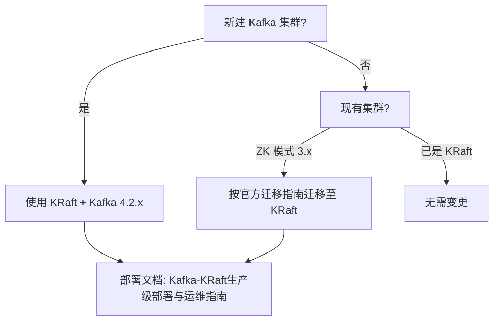

> [TOC]

# Kafka 集群方案选型指南

> 📋 **适用范围**：本文档为 Kafka 集群部署前的方案与版本选型参考。部署步骤请参阅各方案对应的生产级部署文档。

---

## 方案对比

| 维度 | KRaft 模式 | ZooKeeper 模式 |
|------|------------|----------------|
| **架构模式** | 内置 Controller 集群（Raft 共识） | 依赖外部 ZooKeeper 集群 |
| **最低节点数** | 3 节点（Controller+Broker 合一） | 3 Broker + 3 ZooKeeper |
| **数据分片** | 分区 + 副本，与 ZK 模式相同 | 分区 + 副本 |
| **自动 Failover** | Controller 选举 + Leader 切换 | ZK 协调 + Leader 切换 |
| **适用场景** | **新建集群唯一推荐** | 仅存量 3.x 及以下老集群 |
| **运维复杂度** | 低（无 ZK 依赖） | 高（需维护 ZK 集群） |
| **典型用户规模** | 全规模 | 逐步迁移中 |

---

## 版本对比

| 维度 | Kafka 4.x | Kafka 3.x |
|------|-----------|-----------|
| **ZooKeeper 支持** | 已移除 | 3.5 起弃用，3.6 仍支持 |
| **KRaft 状态** | 默认且唯一 | 3.3+ 生产就绪 |
| **客户端兼容性** | 兼容 3.x 客户端 | 兼容 2.x 客户端 |
| **是否需改业务代码** | 否 | 否 |
| **大厂采用情况** | 新集群逐步采用 | 存量仍广泛使用 |

---

## 选型决策树

---

## 注意事项

- **KRaft 与 ZooKeeper 模式不可混用**：同一集群只能选择一种元数据存储方式。
- **迁移路径**：从 ZooKeeper 迁移到 KRaft 需按 [Apache Kafka 官方迁移指南](https://kafka.apache.org/documentation/#kraft_migration) 执行，涉及停机或滚动迁移。
- **Kafka 4.0+**：ZooKeeper 支持已完全移除，新部署仅能使用 KRaft。

---

## 部署文档索引

- [Kafka-KRaft 生产级部署与运维指南](./kafka-kraft-production/Kafka-KRaft生产级部署与运维指南.md)
