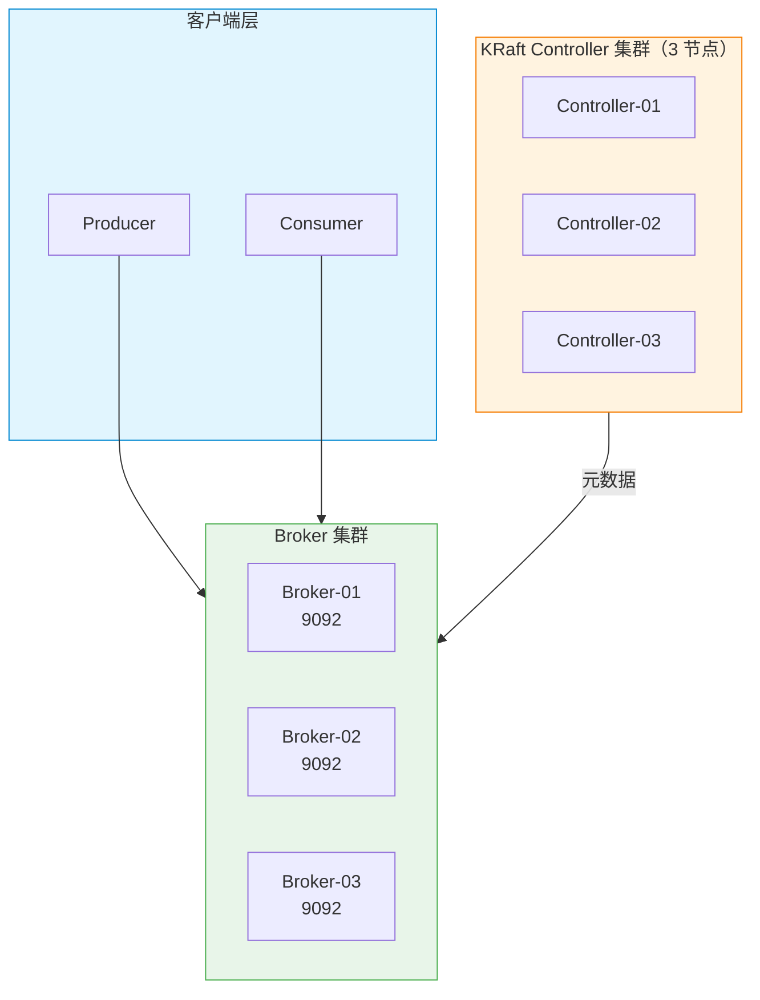
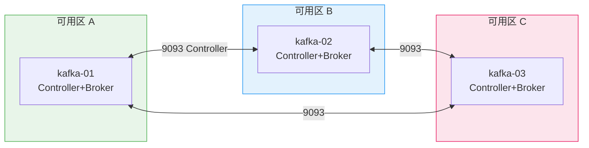

> [TOC]

# Kafka-KRaft 生产级部署与运维指南

> 📋 **适用范围**：本文档适用于 Rocky Linux 9.x / Ubuntu 22.04 LTS、Apache Kafka 4.2.0、KRaft 模式。
> Kafka 4.x 已移除 ZooKeeper 支持，新集群仅能使用 KRaft。最后验证日期：2026-03-14。

---

## 1. 简介

### 1.1 服务介绍与核心特性

Apache Kafka 是分布式流处理与消息队列平台。KRaft 模式自 Kafka 3.3 起生产就绪，4.0 起成为默认且唯一模式，元数据由 Controller 集群通过 Raft 共识管理，无需 ZooKeeper。

**核心特性**：
- **高吞吐**：顺序写盘、零拷贝、批量处理
- **持久化**：消息按分区落盘，支持多副本
- **水平扩展**：分区可分布在多 Broker，支持动态扩容
- **KRaft 元数据**：Controller 集群替代 ZooKeeper，简化运维

### 1.2 适用场景

| 场景 | 说明 |
|------|------|
| 日志聚合 | 应用、审计、行为日志收集与下游分析 |
| 事件溯源 | 订单、支付等业务事件流 |
| 流处理 | 配合 Flink、Spark Streaming 实时计算 |
| 消息队列 | 解耦、削峰、异步通信 |

### 1.3 架构原理图



### 1.4 版本说明

> 以下版本号通过 Docker 镜像 `apache/kafka:4.2.0` 实际拉取及下载页验证确认（2026-03-14）。

| 组件 | 版本 | 兼容性 |
|------|------|--------|
| **Kafka** | 4.2.0（当前最新稳定版） | Linux x86_64 / ARM64 |
| **JDK** | 17（Kafka 4.x 要求） | OpenJDK / Temurin |
| **操作系统** | Rocky Linux 9.x / Ubuntu 22.04 LTS | 内核 ≥ 5.4 |

---

## 2. 版本选择指南

### 2.1 版本对应关系表

| 方案 | Kafka 版本 | 元数据存储 | 说明 |
|------|------------|-----------|------|
| **KRaft**（本文档） | 4.0+ | 内置 Controller | 唯一推荐 |
| ZooKeeper | 3.x 及以下 | 外部 ZooKeeper | 4.0 已移除 |

### 2.2 版本决策建议

| 场景 | 建议 |
|------|------|
| **新建集群** | 使用 KRaft + Kafka 4.2.x |
| **现有 3.x ZK 集群** | 按 [官方迁移指南](https://kafka.apache.org/documentation/#kraft_migration) 迁移至 KRaft |

---

## 3. 生产环境规划（高可用架构）

### 3.1 集群架构图



### 3.2 节点角色与配置要求

| 角色 | 最低配置 | 推荐配置 |
|------|---------|---------|
| Kafka 节点 | 4C8G、200GB SSD | 8C16G、500GB NVMe SSD |
| 网络 | 千兆内网 | 万兆内网（高吞吐场景） |

> ⚠️ **存储**：Kafka 对磁盘顺序写性能敏感，必须使用 SSD，禁止使用 HDD 或 NFS。

### 3.3 容量规划

**存储估算公式**：

```
磁盘需求 = 日均写入量 × 副本数 × 保留天数 ÷ 压缩比 × 1.3（预留）
示例：日写入 100GB，3 副本，保留 7 天，压缩比 3：
  = 100GB × 3 × 7 ÷ 3 × 1.3 ≈ 910GB（每节点约 300GB+）
```

| 规模 | 日写入量 | 峰值吞吐 | 节点规格 | 说明 |
|------|---------|---------|---------|------|
| 小规模 | < 50GB/天 | < 50MB/s | 4C 8G 200G SSD × 3 | 日志、小流量消息 |
| 中规模 | 50~500GB/天 | 50~200MB/s | 8C 16G 500G NVMe × 3 | 事件流、中等 QPS |
| 大规模 | > 500GB/天 | > 200MB/s | 16C 32G 1T NVMe × 6+ | 高吞吐、多分区 |

> 以上为参考值，实际需根据业务压测结果调整。启用压缩时 CPU 开销增加 30~50%。

### 3.4 网络与端口规划

| 源地址 | 目标端口 | 协议 | 用途 |
|--------|---------|------|------|
| 客户端 / Producer / Consumer | 9092 | TCP | 客户端连接 |
| Kafka 节点互访 | 9093 | TCP | Controller 共识 / Broker 内部 |
| Prometheus | 9092 | TCP | JMX Exporter metrics 采集 |

### 3.5 安装目录规划

| 路径 | 用途 | 规划说明 |
|------|------|----------|
| `/opt/kafka/` | 安装根目录 | 程序与配置集中管理 |
| `/opt/kafka/bin/` | 可执行脚本 | kafka-server-start.sh、kafka-topics.sh 等 |
| `/opt/kafka/config/` | 配置文件 | server.properties |
| `/data/kafka/log/` | 分区数据（log.dirs） | **必须独立大容量 SSD** |
| `/data/kafka/logs/` | 应用日志 | 建议 logrotate |

**推荐目录树**：
```
/opt/kafka/
├── bin/          # kafka-*.sh
├── config/       # server.properties
└── libs/         # 依赖 Jar

/data/kafka/
├── log/          # 分区数据（log.dirs），必须备份
└── logs/         # 应用日志
```

---

## 4. 生产环境部署

### 4.1 前置准备（所有节点）

> 🖥️ **执行节点：所有 Kafka 节点（kafka-01、kafka-02、kafka-03）**

#### 4.1.1 内核与系统级调优（Pre-flight Tuning）

| 参数 | 推荐值 | 作用 | 验证命令 |
|------|--------|------|----------|
| `vm.swappiness` | 1 | 减少 swap，避免消息被换出 | `sysctl vm.swappiness` |
| `net.core.somaxconn` | 4096 | 提高 TCP 连接队列 | `sysctl net.core.somaxconn` |
| `fs.file-max` | 655360 | 文件句柄上限（分区、连接） | `sysctl fs.file-max` |

```bash
cat > /etc/sysctl.d/99-kafka.conf << 'EOF'
vm.swappiness = 1
net.core.somaxconn = 4096
fs.file-max = 655360
EOF
sysctl -p /etc/sysctl.d/99-kafka.conf
```

```bash
# ✅ 验证
sysctl vm.swappiness net.core.somaxconn fs.file-max
# 预期：vm.swappiness = 1、net.core.somaxconn = 4096、fs.file-max = 655360
```

#### 4.1.2 创建 kafka 用户与目录

```bash
id -u kafka &>/dev/null || useradd -r -s /sbin/nologin kafka
mkdir -p /data/kafka/{log,logs}
chown -R kafka:kafka /data/kafka
```

> `/opt/kafka` 由 4.2.2 安装步骤创建，此处不预创建，避免与安装后的符号链接冲突。

#### 4.1.3 设置 ulimit

```bash
cat > /etc/security/limits.d/99-kafka.conf << 'EOF'
kafka soft nofile 65536
kafka hard nofile 65536
kafka soft nproc 65536
kafka hard nproc 65536
EOF
```

#### 4.1.4 时间同步

```bash
timedatectl set-ntp true
timedatectl status  # 预期：NTP synchronized: yes
```

---

### 4.2 部署步骤

> 🖥️ **执行节点：所有 Kafka 节点**

#### 4.2.1 第一步：按 3.5 规划创建安装目录结构

```bash
mkdir -p /data/kafka/{log,logs}
chown -R kafka:kafka /data/kafka
```

> 若 4.1.2 已执行可跳过。`/opt/kafka` 由安装解压后通过符号链接创建。

#### 4.2.2 第二步：在规划目录下安装 Kafka

> **作用**：下载 Kafka 安装包并解压到 `/opt/kafka`。

```bash
KAFKA_VER=4.2.0
SCALA_VER=2.13
URL="https://downloads.apache.org/kafka/${KAFKA_VER}/kafka_${SCALA_VER}-${KAFKA_VER}.tgz"

[ -f /tmp/kafka_${SCALA_VER}-${KAFKA_VER}.tgz ] || \
  curl -L -o /tmp/kafka_${SCALA_VER}-${KAFKA_VER}.tgz "$URL"

tar xzf /tmp/kafka_${SCALA_VER}-${KAFKA_VER}.tgz -C /opt/
# 若 /opt/kafka 已存在为目录，ln 会失败，需先移除；符号链接则会被覆盖
[ -d /opt/kafka ] && [ ! -L /opt/kafka ] && rm -rf /opt/kafka
ln -sfn /opt/kafka_${SCALA_VER}-${KAFKA_VER} /opt/kafka
chown -R kafka:kafka /opt/kafka
```

```bash
# ✅ 验证
/opt/kafka/bin/kafka-topics.sh --version
# 预期：输出包含 4.2.0
```

**失败常见原因**：下载 URL 不可达（可改用 `archive.apache.org/dist/kafka/`）、JDK 未安装。

#### 4.2.3 生成 KRaft 集群 ID（任意一节点执行一次）

```bash
/opt/kafka/bin/kafka-storage.sh random-uuid
# 示例输出：a1b2c3d4-e5f6-7890-abcd-ef1234567890
# 记录此 ID，所有节点 cluster.id 必须相同
```

#### 4.2.4 配置并格式化存储（每节点）

> **作用**：按节点 ID 初始化 KRaft 元数据存储，每节点 `node.id` 必须不同。

```bash
CLUSTER_ID="<上一步得到的 UUID>"   # ← 根据实际修改
NODE_ID=1   # kafka-01 用 1，kafka-02 用 2，kafka-03 用 3

/opt/kafka/bin/kafka-storage.sh format -t "$CLUSTER_ID" -n $NODE_ID -c /opt/kafka/config/kraft/server.properties
```

> kafka-02、kafka-03 仅 `NODE_ID` 不同（2、3），`CLUSTER_ID` 三节点必须相同。

**失败常见原因**：`cluster.id` 与 `node.id` 不一致、目录无写权限、重复 format 会报错。

#### 4.2.5 创建每节点 server.properties

**必须修改项清单**：

| 参数 | 节点 | 必须相同/不同 | 说明 |
|------|------|---------------|------|
| `node.id` | 每节点不同 | 不同 | 1 / 2 / 3 |
| `process.roles` | 每节点相同 | 相同 | controller,broker |
| `controller.quorum.voters` | 每节点相同 | 相同 | 1@host1:9093,2@host2:9093,3@host3:9093 |
| `listeners` / `advertised.listeners` | 每节点 host 不同 | 不同 | 本机 IP |

以 kafka-01（192.168.1.101）为例：

```bash
NODE_IP="192.168.1.101"   # ← 根据实际环境修改
NODE_ID=1

cat > /opt/kafka/config/kraft/server.properties << EOF
# KRaft 模式
node.id=${NODE_ID}
process.roles=controller,broker
controller.quorum.voters=1@192.168.1.101:9093,2@192.168.1.102:9093,3@192.168.1.103:9093

# 监听：客户端 9092，Controller 9093
listeners=PLAINTEXT://0.0.0.0:9092,CONTROLLER://0.0.0.0:9093
advertised.listeners=PLAINTEXT://${NODE_IP}:9092

# 数据目录
log.dirs=/data/kafka/log

# 生产调优
num.network.threads=8
num.io.threads=16
num.partitions=3
default.replication.factor=3
min.insync.replicas=2
offsets.topic.replication.factor=3
unclean.leader.election.enable=false
EOF
chown kafka:kafka /opt/kafka/config/kraft/server.properties
```

> kafka-02、kafka-03 仅修改 `NODE_IP`、`node.id`、`advertised.listeners`，`controller.quorum.voters` 必须相同。

#### 4.2.6 创建 Systemd Unit 文件并启用服务

```bash
cat > /etc/systemd/system/kafka.service << 'EOF'
[Unit]
Description=Apache Kafka Server (KRaft)
Documentation=https://kafka.apache.org
After=network-online.target
Wants=network-online.target

[Service]
Type=simple
User=kafka
Group=kafka
LimitNOFILE=65536
LimitNPROC=65536
OOMScoreAdjust=-500
Restart=on-failure
RestartSec=5
TimeoutStartSec=120
TimeoutStopSec=120
ExecStart=/opt/kafka/bin/kafka-server-start.sh /opt/kafka/config/kraft/server.properties
ExecStop=/bin/kill -SIGTERM $MAINPID
WorkingDirectory=/opt/kafka

[Install]
WantedBy=multi-user.target
EOF
systemctl daemon-reload
```

---

### 4.3 集群初始化与配置

```bash
# 所有节点执行（建议 01→02→03 间隔 5 秒）
systemctl enable --now kafka
```

```bash
# ✅ 验证（任意节点）
/opt/kafka/bin/kafka-broker-api-versions.sh --bootstrap-server 127.0.0.1:9092
# 预期：输出各 Broker 的 API 版本列表，含 Produce、Fetch、Metadata、ApiVersions 等

/opt/kafka/bin/kafka-topics.sh --bootstrap-server 127.0.0.1:9092 --create --topic test-verify --partitions 3 --replication-factor 3
# 预期：Created topic test-verify.

/opt/kafka/bin/kafka-topics.sh --bootstrap-server 127.0.0.1:9092 --describe --topic test-verify
# 预期：PartitionCount: 3	ReplicationFactor: 3	Isr: 各分区 Leader 与副本正常
```

---

### 4.4 安装验证

```bash
echo "test-msg-$(date +%s)" | /opt/kafka/bin/kafka-console-producer.sh --bootstrap-server 127.0.0.1:9092 --topic test-verify

/opt/kafka/bin/kafka-console-consumer.sh --bootstrap-server 127.0.0.1:9092 --topic test-verify --from-beginning --timeout-ms 5000
# 预期：输出 test-msg-xxx，末尾可能 TimeoutException（5 秒无新消息正常退出）
```

---

### 4.5 安装后的目录结构

| 路径 | 用途 | 运维关注点 |
|------|------|------------|
| `/opt/kafka/bin/` | kafka-server-start.sh、kafka-topics.sh 等 | 升级时替换 |
| `/opt/kafka/config/kraft/` | server.properties | 修改后需 systemctl restart kafka |
| `/data/kafka/log/` | 分区数据（log.dirs） | 必须纳入备份 |
| `/data/kafka/logs/` | 应用日志（若配置） | 建议 logrotate |

```
/opt/kafka/
├── bin/              # kafka-*.sh
├── config/
│   └── kraft/
│       └── server.properties
└── libs/            # 依赖 Jar

/data/kafka/
├── log/              # 分区数据，必须备份
└── logs/             # 应用日志
```

---

## 5. 关键参数配置说明

### 5.1 核心配置文件详解

**必须修改项清单**：

| 参数 | 必须修改 | 说明 |
|------|----------|------|
| `node.id` | ★ | 集群内唯一，每节点不同 |
| `controller.quorum.voters` | ★ | 所有节点必须相同 |
| `advertised.listeners` | ★ | 客户端连接地址，每节点为本机 IP |
| `log.dirs` | ★ | 数据目录，生产必须独立 SSD |

**逐行注释示例**（kafka-01）：

```properties
# server.properties - kafka-01 (192.168.1.101)

# 本节点 ID，每节点必须不同
node.id=1

# 角色：controller+broker 合一
process.roles=controller,broker

# Controller 仲裁列表，所有节点必须一致
controller.quorum.voters=1@192.168.1.101:9093,2@192.168.1.102:9093,3@192.168.1.103:9093

# 监听：客户端 9092，Controller 9093
listeners=PLAINTEXT://0.0.0.0:9092,CONTROLLER://0.0.0.0:9093
advertised.listeners=PLAINTEXT://192.168.1.101:9092   # ★ 客户端连接地址

# 数据目录，生产必须独立 SSD
log.dirs=/data/kafka/log

# 生产调优
num.network.threads=8
num.io.threads=16
num.partitions=3
default.replication.factor=3
min.insync.replicas=2
offsets.topic.replication.factor=3
unclean.leader.election.enable=false
```

### 5.2 生产环境参数优化详解

| 参数 | 默认值 | 推荐值 | 调优理由 |
|------|--------|--------|----------|
| `num.network.threads` | 3 | 8 | 高并发客户端 |
| `num.io.threads` | 8 | 16 | 高磁盘 IO |
| `log.retention.hours` | 168 | 72~168 | 按业务保留时长 |
| `min.insync.replicas` | 1 | 2 | 至少 2 副本确认 |
| `default.replication.factor` | 1 | 3 | 3 副本高可用 |

#### 5.2.1 数据一致性、不丢失与消费位移持久化

**Broker 端**：

| 参数 | 生产建议 | 作用 |
|------|----------|------|
| `min.insync.replicas` | 2 | 配合 acks=all，至少 2 副本写入成功 |
| `unclean.leader.election.enable` | false | 禁止非 ISR 副本当选 Leader |
| `offsets.topic.replication.factor` | 3 | 消费者位移 Topic 多副本，重启后续传 |

**Producer 端**：`acks=all`、`enable.idempotence=true`

**Consumer 端**：`enable.auto.commit=true` 或手动 `commitSync`，依赖 `offsets.topic.replication.factor=3` 保证位移持久化。

### 5.3 生产环境安全配置

#### 5.3.1 SASL PLAIN 认证

```properties
# server.properties 追加
listeners=SASL_PLAINTEXT://0.0.0.0:9092,CONTROLLER://0.0.0.0:9093
sasl.enabled.mechanisms=PLAIN
sasl.mechanism.inter.broker.protocol=PLAIN
security.inter.broker.protocol=SASL_PLAINTEXT
```

创建 `kafka_server_jaas.conf`：

```
KafkaServer {
  org.apache.kafka.common.security.plain.PlainLoginModule required
  username="admin"
  password="admin-secret"
  user_admin="admin-secret"
  user_producer="producer-secret"
  user_consumer="consumer-secret";
};
```

启动时：`KAFKA_OPTS="-Djava.security.auth.login.config=/opt/kafka/config/kafka_server_jaas.conf"`，需在 systemd 的 `Environment=` 中配置。

#### 5.3.2 TLS 加密通信

生产建议使用 SASL_SSL 或 SSL，证书生成与配置参考 [Kafka 安全文档](https://kafka.apache.org/documentation/#security)。

---

## 6. 快速体验部署（开发 / 测试环境）

### 6.1 快速启动方案选型

Docker Compose 3 节点 KRaft 伪集群，适合本地验证。**严禁用于生产**。

### 6.2 快速启动步骤与验证

**方式一**：在文档目录执行（若已有 docker-compose.yml）：

```bash
cd 02-message-queue/kafka/kafka-kraft-production
docker compose up -d
sleep 20
```

**方式二**：任意目录创建并启动（自包含）：

```bash
mkdir -p /tmp/kafka-verify && cd /tmp/kafka-verify

cat > docker-compose.yml << 'EOF'
services:
  kafka1:
    image: apache/kafka:4.2.0
    container_name: kafka1
    hostname: kafka1
    ports: ["9092:9092", "9093:9093"]
    environment:
      KAFKA_NODE_ID: 1
      KAFKA_PROCESS_ROLES: controller,broker
      KAFKA_LISTENERS: PLAINTEXT://0.0.0.0:9092,CONTROLLER://0.0.0.0:9093
      KAFKA_ADVERTISED_LISTENERS: PLAINTEXT://kafka1:9092
      KAFKA_CONTROLLER_LISTENER_NAMES: CONTROLLER
      KAFKA_CONTROLLER_QUORUM_VOTERS: 1@kafka1:9093,2@kafka2:9093,3@kafka3:9093
    networks: [kafka-net]
  kafka2:
    image: apache/kafka:4.2.0
    container_name: kafka2
    hostname: kafka2
    ports: ["9094:9092", "9095:9093"]
    environment:
      KAFKA_NODE_ID: 2
      KAFKA_PROCESS_ROLES: controller,broker
      KAFKA_LISTENERS: PLAINTEXT://0.0.0.0:9092,CONTROLLER://0.0.0.0:9093
      KAFKA_ADVERTISED_LISTENERS: PLAINTEXT://kafka2:9092
      KAFKA_CONTROLLER_LISTENER_NAMES: CONTROLLER
      KAFKA_CONTROLLER_QUORUM_VOTERS: 1@kafka1:9093,2@kafka2:9093,3@kafka3:9093
    networks: [kafka-net]
  kafka3:
    image: apache/kafka:4.2.0
    container_name: kafka3
    hostname: kafka3
    ports: ["9096:9092", "9097:9093"]
    environment:
      KAFKA_NODE_ID: 3
      KAFKA_PROCESS_ROLES: controller,broker
      KAFKA_LISTENERS: PLAINTEXT://0.0.0.0:9092,CONTROLLER://0.0.0.0:9093
      KAFKA_ADVERTISED_LISTENERS: PLAINTEXT://kafka3:9092
      KAFKA_CONTROLLER_LISTENER_NAMES: CONTROLLER
      KAFKA_CONTROLLER_QUORUM_VOTERS: 1@kafka1:9093,2@kafka2:9093,3@kafka3:9093
    networks: [kafka-net]
networks:
  kafka-net: {}
EOF

docker compose up -d
sleep 20
```

```bash
# ✅ 验证
docker exec kafka1 /opt/kafka/bin/kafka-broker-api-versions.sh --bootstrap-server localhost:9092
docker exec kafka1 /opt/kafka/bin/kafka-topics.sh --bootstrap-server kafka1:9092,kafka2:9092,kafka3:9092 --create --topic verify-test --partitions 3 --replication-factor 2
docker exec kafka1 /opt/kafka/bin/kafka-topics.sh --bootstrap-server localhost:9092 --describe --topic verify-test
# 预期：PartitionCount: 3	ReplicationFactor: 2	Isr 正常
```

### 6.3 停止与清理

```bash
docker compose down -v
rm -rf /tmp/kafka-verify
```

---

## 7. 日常运维操作

### 7.1 常用管理命令与使用演示

> 以下命令以 `BOOTSTRAP=127.0.0.1:9092` 为例，生产环境替换为实际地址。

#### Topic 管理

```bash
# 创建
/opt/kafka/bin/kafka-topics.sh --bootstrap-server $BOOTSTRAP --create --topic order-events --partitions 6 --replication-factor 3

# 列出
/opt/kafka/bin/kafka-topics.sh --bootstrap-server $BOOTSTRAP --list

# 详情
/opt/kafka/bin/kafka-topics.sh --bootstrap-server $BOOTSTRAP --describe --topic order-events

# 扩容分区
/opt/kafka/bin/kafka-topics.sh --bootstrap-server $BOOTSTRAP --alter --topic order-events --partitions 12

# 删除
/opt/kafka/bin/kafka-topics.sh --bootstrap-server $BOOTSTRAP --delete --topic order-events
```

#### 消费组管理

```bash
# 列出消费组
/opt/kafka/bin/kafka-consumer-groups.sh --bootstrap-server $BOOTSTRAP --list

# 查看 Lag
/opt/kafka/bin/kafka-consumer-groups.sh --bootstrap-server $BOOTSTRAP --describe --group my-consumer-group

# 重置位移
/opt/kafka/bin/kafka-consumer-groups.sh --bootstrap-server $BOOTSTRAP --group my-consumer-group --reset-offsets --to-earliest --topic order-events --execute
```

#### 集群状态

```bash
/opt/kafka/bin/kafka-metadata.sh metadata-quorum --bootstrap-server $BOOTSTRAP --describe
```

**客户端连接代码片段**（Python + Go）：

```python
# Python（confluent-kafka-python）
from confluent_kafka import Producer, Consumer, KafkaError

conf = {'bootstrap.servers': '192.168.1.101:9092,192.168.1.102:9092'}
p = Producer(conf)
p.produce('order-events', key='k1', value='v1')
p.flush()

c = Consumer({**conf, 'group.id': 'my-group', 'auto.offset.reset': 'earliest'})
c.subscribe(['order-events'])
msg = c.poll(1.0)
```

```go
// Go（segmentio/kafka-go）
package main

import (
    "context"
    "github.com/segmentio/kafka-go"
)

func main() {
    w := &kafka.Writer{
        Addr:     kafka.TCP("192.168.1.101:9092", "192.168.1.102:9092"),
        Topic:    "order-events",
        Balancer: &kafka.LeastBytes{},
    }
    w.WriteMessages(context.Background(), kafka.Message{Key: []byte("k1"), Value: []byte("v1")})
    w.Close()

    r := kafka.NewReader(kafka.ReaderConfig{
        Brokers: []string{"192.168.1.101:9092"},
        Topic:   "order-events",
        GroupID: "my-group",
    })
    m, _ := r.ReadMessage(context.Background())
    _ = m
}
```

### 7.2 备份与恢复

**备份**：复制 `log.dirs` 目录，或使用 MirrorMaker 同步到备用集群。

**恢复**：从备份恢复 `log.dirs`，确保 `cluster.id`、`node.id` 一致后启动。

### 7.3 集群扩缩容

- **新增 Broker**：新节点设置相同 `controller.quorum.voters`，执行 format 后启动，分区会自动 rebalance。
- **缩减**：需预先迁移分区或接受数据迁移。

### 7.4 版本升级

参考 [Apache Kafka 升级文档](https://kafka.apache.org/documentation/#upgrade)。滚动重启，先 Controller 后 Broker。**必须包含回滚方案**：保留旧版本二进制，升级失败时回滚并恢复配置。

### 7.5 日志清理与轮转

Kafka 分区日志由 Broker 配置 `log.retention.hours`、`log.retention.bytes` 控制。**应用日志**使用 logrotate：

```bash
cat > /etc/logrotate.d/kafka << 'EOF'
/data/kafka/logs/*.log {
    daily
    rotate 14
    size 200M
    compress
    delaycompress
    copytruncate
    missingok
    notifempty
}
EOF
```

```bash
# 测试配置
logrotate -d /etc/logrotate.d/kafka
```

---

## 9. 监控与告警接入

### 9.1 Prometheus 指标暴露

Kafka 通过 JMX 暴露指标，需配合 [JMX Exporter](https://github.com/prometheus/jmx_exporter) 或 Kafka 内置 `metrics.reporter` 采集。

### 9.2 关键监控指标

| 指标 | 说明 | 告警建议 |
|------|------|----------|
| `kafka_server_replicamanager_under_replicated_partitions` | 未充分副本分区数 | > 0 |
| `kafka_network_requestmetrics_total` | 请求延迟 | P99 过高 |
| `kafka_log_log_size` | 分区大小 | 磁盘满风险 |

### 9.3 Grafana Dashboard

推荐 Dashboard ID：**7589**（Kafka 社区）。

### 9.4 告警规则示例

```yaml
- alert: KafkaUnderReplicatedPartitions
  expr: kafka_server_replicamanager_under_replicated_partitions > 0
  for: 5m
  labels: { severity: critical }
  annotations: { summary: "Kafka 存在未充分副本分区" }
```

---

## 10. 注意事项与生产检查清单

### 10.1 安装前环境核查

- [ ] JDK 17 已安装
- [ ] 内核参数已调优
- [ ] 目录规划完成且权限正确
- [ ] 防火墙放行 9092、9093
- [ ] 3 节点时钟同步（NTP）

### 10.2 常见故障排查与处理指南

#### 故障一：Broker 启动失败

**现象**：`systemctl status kafka` 显示 failed，日志报 `cluster id mismatch` 或 `node id` 错误。

**原因**：`controller.quorum.voters` 三节点不一致、`node.id` 重复、重复 format 导致 cluster.id 冲突。

**排查**：
```bash
cat /opt/kafka/config/kraft/server.properties | grep -E "node.id|controller.quorum.voters"
# 三节点 controller.quorum.voters 必须相同，node.id 必须不同
```

**解决**：统一 `controller.quorum.voters`，确保 `node.id` 唯一；若误 format，需清空 `/data/kafka/log` 后重新 format。

---

#### 故障二：客户端连接超时

**现象**：Producer/Consumer 连接 `advertised.listeners` 地址超时。

**原因**：防火墙未放行 9092、`advertised.listeners` 配置为 localhost 或不可达地址。

**排查**：`telnet <broker_ip> 9092`，从客户端机器测试。

**解决**：放行 9092 端口；`advertised.listeners` 必须为客户端可解析的 IP 或主机名。

---

#### 故障三：Under-replicated Partitions

**现象**：`kafka-topics --describe` 显示 `Isr` 少于 `Replicas`，或 `Under-replicated-partitions` 非空。

**原因**：Broker 宕机、网络分区、副本同步落后。

**排查**：
```bash
/opt/kafka/bin/kafka-topics.sh --bootstrap-server $BOOTSTRAP --describe --under-replicated-partitions
```

**解决**：恢复宕机 Broker、检查网络；若长期无法恢复，考虑减少 `min.insync.replicas` 或重建 Topic（会丢数据，谨慎）。

---

#### 故障四：Controller 选举失败

**现象**：集群无 Controller，Topic 创建失败，元数据不可用。

**原因**：9093 端口不通、节点数不足 (N/2+1)、`controller.quorum.voters` 配置错误。

**排查**：`nc -zv <node> 9093` 测试节点间 9093 互通。

**解决**：保证至少 2/3 Controller 在线；修复网络后重启 Kafka。

---

### 10.3 安全加固建议

- 启用 SASL 或 TLS
- 限制 `advertised.listeners` 仅内网
- 定期审计 ACL

### 10.4 伪集群验证踩坑与经验总结

| 问题现象 | 原因 | 解决方式 |
|---------|------|----------|
| Docker 客户端连不上 | ADVERTISED_LISTENERS 为容器 hostname，宿主机无法解析 | 快速体验从容器内执行命令；生产用实际 IP |
| format 报错 cluster id | 重复 format 或 cluster.id 不一致 | 清空 log.dirs 后重新 format，三节点 cluster.id 相同 |
| 单机多节点端口冲突 | Docker 伪集群需不同端口映射 | 9092→9092/9094/9096 等分别映射 |

---

## 11. 参考资料

- [Apache Kafka 官方文档](https://kafka.apache.org/documentation/)
- [KRaft 模式说明](https://kafka.apache.org/documentation/#kraft)
- [Kafka 升级指南](https://kafka.apache.org/documentation/#upgrade)
