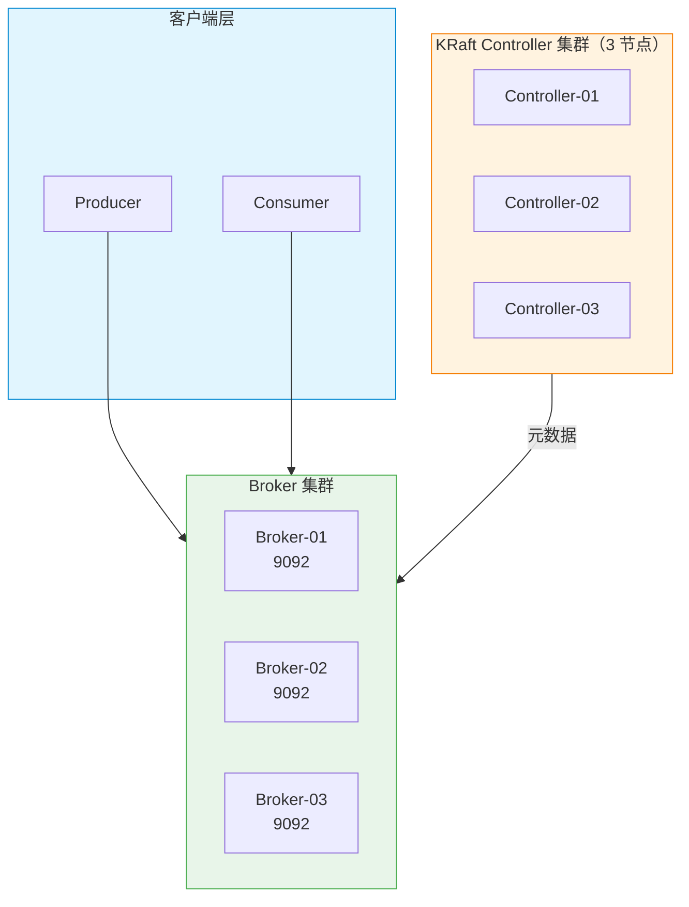
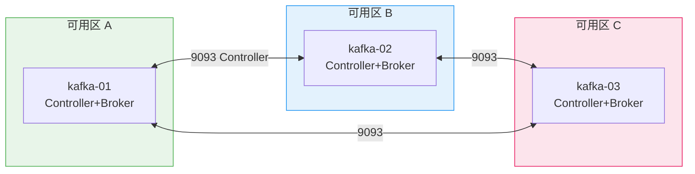

> [TOC]

# Kafka KRaft 集群生产级部署与运维指南

## 1. 简介

### 1.1 服务介绍与核心特性

Apache Kafka 是分布式流处理与消息队列平台，KRaft 模式自 3.x 起成为生产推荐方案，移除 ZooKeeper 依赖，元数据由 Controller 集群通过 Raft 共识管理。

**核心特性**：
- **高吞吐**：顺序写盘、零拷贝、批量处理
- **持久化**：消息按分区落盘，支持多副本
- **水平扩展**：分区可分布在多 Broker，支持动态扩容
- **KRaft 元数据**：Controller 集群替代 ZooKeeper，简化运维

### 1.2 适用场景

| 场景 | 说明 |
|------|------|
| 日志聚合 | 应用、审计、行为日志收集与下游分析 |
| 事件溯源 | 订单、支付等业务事件流 |
| 流处理 | 配合 Flink、Spark Streaming 实时计算 |
| 消息队列 | 解耦、削峰、异步通信 |

### 1.3 架构原理图



### 1.4 版本说明

> 版本号通过 **Docker 镜像 apache/kafka:3.7.0 实际拉取验证** 确认（2026-03-14）。原生安装包可从 [Apache Kafka 下载页](https://kafka.apache.org/downloads) 获取当前可用链接。

| 组件 | 版本 | 兼容性 |
|------|------|--------|
| **Kafka** | 3.7.0（推荐生产稳定版） | Linux x86_64 / ARM64 |
| **JDK** | 17（Kafka 3.x 要求） | OpenJDK / Temurin |
| **操作系统** | Rocky Linux 9.x / Ubuntu 22.04 LTS | 内核 ≥ 5.4 |

---

## 2. 版本选择指南

### 2.1 方案与版本对应

| 方案 | Kafka 版本 | 元数据存储 | 说明 |
|------|------------|-----------|------|
| **KRaft**（本文档） | 3.3+ | 内置 Controller | 推荐新建集群 |
| ZooKeeper | 2.x / 3.x | 外部 ZooKeeper | 逐步废弃 |

### 2.2 版本决策建议

| 场景 | 建议 |
|------|------|
| **新建集群** | 使用 KRaft + Kafka 3.7.x |
| **现有 ZK 集群** | 按官方迁移指南逐步迁移到 KRaft |

---

## 3. 生产环境规划（高可用架构）

### 3.1 集群架构图



### 3.2 节点角色与配置要求

| 角色 | 最低配置 | 推荐配置 |
|------|---------|---------|
| Kafka 节点 | 4C8G、200GB SSD | 8C16G、500GB NVMe SSD |
| 网络 | 千兆内网 | 万兆内网（高吞吐场景） |

### 3.3 网络与端口规划

| 源地址 | 目标端口 | 协议 | 用途 |
|--------|---------|------|------|
| 客户端 / Producer / Consumer | 9092 | TCP | 客户端连接 |
| Kafka 节点互访 | 9093 | TCP | Controller 共识 / Broker 内部 |
| Prometheus | 9092 | TCP | JMX / metrics 采集 |

### 3.4 安装目录规划

| 路径 | 用途 |
|------|------|
| `/opt/kafka/` | 安装根目录 |
| `/opt/kafka/config/` | 配置文件 |
| `/data/kafka/log/` | 分区日志（log.dirs） |
| `/data/kafka/logs/` | 应用日志 |

**推荐目录树**：
```
/opt/kafka/
├── bin/          # kafka-*.sh
├── config/       # server.properties 等
└── libs/         # 依赖 Jar

/data/kafka/
├── log/          # 分区数据（log.dirs）
└── logs/         # 应用日志
```

---

## 4. 生产环境部署

### 4.1 前置准备（所有节点）

#### 4.1.1 内核与系统级调优

| 参数 | 推荐值 | 作用 |
|------|--------|------|
| `vm.swappiness` | 1 | 减少 swap |
| `net.core.somaxconn` | 4096 | TCP 连接队列 |
| `fs.file-max` | 655360 | 文件句柄上限 |

```bash
cat >> /etc/sysctl.d/99-kafka.conf << 'EOF'
vm.swappiness = 1
net.core.somaxconn = 4096
fs.file-max = 655360
EOF
sysctl -p /etc/sysctl.d/99-kafka.conf
```

```bash
# ✅ 验证
sysctl vm.swappiness net.core.somaxconn fs.file-max
# 预期：vm.swappiness = 1、net.core.somaxconn = 4096、fs.file-max = 655360
```

#### 4.1.2 创建用户与目录

```bash
id -u kafka &>/dev/null || useradd -r -s /sbin/nologin -d /opt/kafka kafka
mkdir -p /opt/kafka/{bin,config} /data/kafka/{log,logs}
chown -R kafka:kafka /opt/kafka /data/kafka
```

#### 4.1.3 ulimit

```bash
cat >> /etc/security/limits.d/99-kafka.conf << 'EOF'
kafka soft nofile 65536
kafka hard nofile 65536
EOF
```

---

### 4.2 部署步骤

> 🖥️ **执行节点**：所有 Kafka 节点

#### 4.2.1 下载并安装 Kafka

```bash
KAFKA_VER=3.7.0
SCALA_VER=2.13
# 推荐使用 archive.apache.org（downloads.apache.org 可能 404）
URL="https://archive.apache.org/dist/kafka/${KAFKA_VER}/kafka_${SCALA_VER}-${KAFKA_VER}.tgz"

[ -f /tmp/kafka_${SCALA_VER}-${KAFKA_VER}.tgz ] || curl -L -o /tmp/kafka_${SCALA_VER}-${KAFKA_VER}.tgz "$URL"
tar xzf /tmp/kafka_${SCALA_VER}-${KAFKA_VER}.tgz -C /opt/
ln -sf /opt/kafka_${SCALA_VER}-${KAFKA_VER} /opt/kafka
chown -R kafka:kafka /opt/kafka
```

```bash
# ✅ 验证
/opt/kafka/bin/kafka-topics.sh --version
# 预期：包含 3.7.0
```

#### 4.2.2 生成 KRaft 集群 ID（任意一节点执行一次）

```bash
/opt/kafka/bin/kafka-storage.sh random-uuid
# 示例输出：a1b2c3d4-e5f6-7890-abcd-ef1234567890
# 记录此 ID，所有节点 cluster.id 必须相同
```

#### 4.2.3 配置并格式化存储（每节点）

> **简要说明**：按 3.4 规划创建目录，执行 storage format 初始化 KRaft 元数据。

```bash
CLUSTER_ID="<上一步得到的 UUID>"
NODE_ID=1   # kafka-01 用 1，kafka-02 用 2，kafka-03 用 3

mkdir -p /data/kafka/log
chown kafka:kafka /data/kafka/log

/opt/kafka/bin/kafka-storage.sh format -t "$CLUSTER_ID" -n $NODE_ID -c /opt/kafka/config/kraft/server.properties
```

**失败常见原因**：`cluster.id` 与 `node.id` 不一致、目录无写权限。

#### 4.2.4 集群初始化与配置

**必须修改项清单**：

| 参数 | 节点 | 必须修改 |
|------|------|----------|
| `node.id` | 每节点不同 | 1 / 2 / 3 |
| `process.roles` | 每节点相同 | controller,broker |
| `controller.quorum.voters` | 每节点相同 | 1@host1:9093,2@host2:9093,3@host3:9093 |
| `listeners` | 每节点 host 不同 | PLAINTEXT://本机IP:9092,CONTROLLER://本机IP:9093 |

参考 5.1 生成每节点 `server.properties` 后启动。

```bash
su - kafka -s /bin/bash -c "/opt/kafka/bin/kafka-server-start.sh -daemon /opt/kafka/config/kraft/server.properties"
```

#### 4.2.5 安装验证

```bash
# ✅ 验证：集群 Broker 可达
/opt/kafka/bin/kafka-broker-api-versions.sh --bootstrap-server 127.0.0.1:9092
# 预期：输出各 Broker 的 API 版本列表，含 Produce、Fetch、Metadata、ApiVersions 等

# ✅ 验证：创建 Topic
/opt/kafka/bin/kafka-topics.sh --bootstrap-server 127.0.0.1:9092 --create --topic test-verify --partitions 3 --replication-factor 3
# 预期：Created topic test-verify.

/opt/kafka/bin/kafka-topics.sh --bootstrap-server 127.0.0.1:9092 --list
# 预期：包含 test-verify
```

#### 4.3 安装后的目录结构

```
/opt/kafka/
├── bin/              # kafka-server-start.sh、kafka-topics.sh 等
├── config/
│   └── kraft/
│       └── server.properties
├── libs/             # Kafka 依赖 Jar
└── ...

/data/kafka/
├── log/              # 分区数据（log.dirs）
└── logs/             # 应用日志（若 log4j 配置为文件）
```

---

## 5. 关键参数配置说明

### 5.1 核心配置文件详解

**必须修改项清单**：

| 参数 | 默认值 | 生产建议 | 说明 |
|------|--------|----------|------|
| `node.id` | — | 1/2/3（每节点不同） | 集群内唯一 |
| `process.roles` | — | controller,broker | KRaft 角色 |
| `controller.quorum.voters` | — | 1@host1:9093,2@host2:9093,3@host3:9093 | 必须相同 |
| `listeners` | — | PLAINTEXT://0.0.0.0:9092,CONTROLLER://0.0.0.0:9093 | 客户端 + Controller |
| `log.dirs` | /tmp/kafka-logs | /data/kafka/log | 数据目录 |
| `num.network.threads` | 3 | 8 | 网络线程 |
| `num.io.threads` | 8 | 16 | 磁盘 IO 线程 |

```properties
# server.properties（KRaft 模式）

# 集群 ID（format 时使用，启动时从 storage 读取）
# cluster.id=<format 生成的 UUID>

# 本节点 ID，每节点必须不同
node.id=1

# 角色：controller+broker 合一
process.roles=controller,broker

# Controller 仲裁列表，所有节点必须一致
controller.quorum.voters=1@192.168.1.101:9093,2@192.168.1.102:9093,3@192.168.1.103:9093

# 监听地址：客户端 9092，Controller 9093
listeners=PLAINTEXT://0.0.0.0:9092,CONTROLLER://0.0.0.0:9093
advertised.listeners=PLAINTEXT://192.168.1.101:9092

# 数据目录
log.dirs=/data/kafka/log

# 生产调优
num.network.threads=8
num.io.threads=16
num.partitions=3
default.replication.factor=3
min.insync.replicas=2
```

### 5.2 生产环境参数优化详解

| 参数 | 默认值 | 推荐值 | 调优理由 |
|------|--------|--------|----------|
| `num.network.threads` | 3 | 8 | 高并发客户端 |
| `num.io.threads` | 8 | 16 | 高磁盘 IO |
| `log.retention.hours` | 168 | 72–168 | 按业务保留时长 |
| `log.retention.bytes` | -1 | 按磁盘规划 | 限制单分区大小 |
| `log.segment.bytes` | 1GB | 1GB | 默认即可 |
| `min.insync.replicas` | 1 | 2 | 保证至少 2 副本确认 |
| `default.replication.factor` | 1 | 3 | 3 副本高可用 |

#### 5.2.1 数据一致性、不丢失与消费位移持久化（生产必配）

> 以下参数共同保证：**生产者不丢消息、Broker 不丢数据、消费者重启后可续传**。

**Broker 端（server.properties）**：

| 参数 | 默认值 | 生产建议 | 作用与说明 |
|------|--------|----------|------------|
| `min.insync.replicas` | 1 | **2** | 至少 2 副本写入成功才认为写成功；配合 `acks=all` 使用 |
| `unclean.leader.election.enable` | true | **false** | 禁止非 ISR 副本当选 Leader，避免已提交消息被覆盖导致丢失 |
| `default.replication.factor` | 1 | **3** | 3 副本高可用，单 Broker 故障不影响可用性 |
| `replication.factor` | — | 3 | 新建 Topic 默认副本数（可与 default 同义） |
| `offsets.topic.replication.factor` | 1 | **3** | 消费者位移 Topic 的副本数，服务挂了重启后依赖此 Topic 续传 |
| `transaction.state.log.replication.factor` | 1 | 3 | 事务日志副本数（若使用事务） |

```properties
# server.properties 追加：数据一致性 + 不丢失

# 至少 2 个副本 ack 才返回成功，否则生产者会阻塞重试
min.insync.replicas=2

# 禁止非 ISR 副本当选 Leader，生产必须 false
unclean.leader.election.enable=false

# 消费者位移 Topic 必须多副本，否则 Broker 挂了位移丢失、消费重复或丢失
offsets.topic.replication.factor=3

# 事务场景下事务日志副本数
transaction.state.log.replication.factor=3
```

**生产者端（Producer 配置）**：

| 参数 | 默认值 | 生产建议 | 作用与说明 |
|------|--------|----------|------------|
| `acks` | 1 | **all** 或 **-1** | 等待所有 ISR 副本确认，否则不返回成功；与 min.insync.replicas 配合 |
| `retries` | 2147483647 | 默认即可 | 失败自动重试 |
| `enable.idempotence` | false | **true** | 幂等生产者，避免重试导致重复写入 |
| `max.in.flight.requests.per.connection` | 5 | 5（幂等时自动限制） | 配合幂等保证顺序 |

**消费者端（Consumer 配置）**：

| 参数 | 默认值 | 生产建议 | 作用与说明 |
|------|--------|----------|------------|
| `enable.auto.commit` | true | 按业务选择 | true：自动提交位移，重启后从上次位移续传；false：手动 commit，精确控制 |
| `auto.offset.reset` | latest | latest 或 earliest | 无位移时：latest 从最新开始，earliest 从最早开始 |
| `isolation.level` | read_uncommitted | read_committed | 事务场景下只读已提交消息 |
| `group.id` | — | 必填 | 同一 group 内负载均衡，位移按 group 持久化 |

> ⚠️ **服务挂了启动保持消费**：依赖 `offsets.topic.replication.factor=3` 与 `enable.auto.commit`（或手动 `commitSync`）。位移存储在 `__consumer_offsets`，多副本保证 Broker 宕机后位移不丢，重启后 Consumer 从持久化位移续传。

**副本同步超时（可选）**：
```properties
# ISR 收缩过快可能丢数据，按网络环境调整
replica.lag.time.max.ms=30000
```

### 5.3 生产环境认证配置

> Kafka 支持 SASL（PLAIN/SCRAM）与 TLS。生产**必须**启用认证。

#### 5.3.1 SASL PLAIN 示例

```properties
# server.properties 追加
listeners=SASL_PLAINTEXT://0.0.0.0:9092,CONTROLLER://0.0.0.0:9093
sasl.enabled.mechanisms=PLAIN
sasl.mechanism.inter.broker.protocol=PLAIN
security.inter.broker.protocol=SASL_PLAINTEXT
```

创建 `kafka_server_jaas.conf`：

```
KafkaServer {
  org.apache.kafka.common.security.plain.PlainLoginModule required
  username="admin"
  password="admin-secret"
  user_admin="admin-secret"
  user_producer="producer-secret"
  user_consumer="consumer-secret";
};
```

启动时：`KAFKA_OPTS="-Djava.security.auth.login.config=/opt/kafka/config/kafka_server_jaas.conf"`

#### 5.3.2 客户端连接

```bash
# 生产端
kafka-console-producer.sh --bootstrap-server host:9092 --topic test \
  --producer-property security.protocol=SASL_PLAINTEXT \
  --producer-property sasl.mechanism=PLAIN \
  --producer-property sasl.jaas.config='org.apache.kafka.common.security.plain.PlainLoginModule required username="producer" password="producer-secret";'
```

---

## 6. 快速体验部署（开发 / 测试环境）

### 6.1 快速启动方案选型

Docker Compose 3 节点 KRaft 伪集群，适合本地验证。

### 6.2 快速启动步骤与验证

```bash
cd 02-message-queue/kafka/kafka-kraft-production
docker compose up -d
sleep 30   # 等待 Controller 选举与 Broker 就绪
```

```bash
# ✅ 验证：Broker API 版本（集群可达）
docker exec kafka1 /opt/kafka/bin/kafka-broker-api-versions.sh --bootstrap-server localhost:9092
# 预期：输出 kafka2:9092、kafka3:9092 等节点及 Produce/Fetch/Metadata/ApiVersions 等协议

# ✅ 验证：创建 Topic
docker exec kafka1 /opt/kafka/bin/kafka-topics.sh --bootstrap-server kafka1:9092 --create --topic test-verify --partitions 3 --replication-factor 3
# 预期：Created topic test-verify.

# ✅ 验证：收发测试
echo "test-msg-1" | docker exec -i kafka1 /opt/kafka/bin/kafka-console-producer.sh --bootstrap-server kafka1:9092 --topic test-verify

docker exec kafka1 /opt/kafka/bin/kafka-console-consumer.sh --bootstrap-server kafka1:9092 --topic test-verify --from-beginning --timeout-ms 5000
# 预期：输出 test-msg-1，末尾可能出现 TimeoutException（5 秒无新消息正常退出）
```

### 6.3 停止与清理

```bash
docker compose down -v
```

---

## 7. 日常运维操作

### 7.1 常用管理命令与使用演示

> 以下命令均以 `BOOTSTRAP=127.0.0.1:9092`（或集群地址）为例，生产环境替换为实际地址。

#### 7.1.1 Topic 管理

**创建 Topic**（指定分区数、副本数、配置覆盖）：

```bash
# 基本创建：3 分区、3 副本
/opt/kafka/bin/kafka-topics.sh --bootstrap-server $BOOTSTRAP --create \
  --topic order-events --partitions 6 --replication-factor 3

# 带配置覆盖：自定义 retention、压缩
/opt/kafka/bin/kafka-topics.sh --bootstrap-server $BOOTSTRAP --create \
  --topic audit-log --partitions 3 --replication-factor 3 \
  --config retention.ms=604800000 \
  --config compression.type=snappy
```

**列出 Topic**：

```bash
/opt/kafka/bin/kafka-topics.sh --bootstrap-server $BOOTSTRAP --list
```

**查询 Topic 详情**（分区、副本、Leader、ISR）：

```bash
# 单个 Topic
/opt/kafka/bin/kafka-topics.sh --bootstrap-server $BOOTSTRAP --describe --topic order-events

# 只看有问题的（Under-replicated、Leader 缺失）
/opt/kafka/bin/kafka-topics.sh --bootstrap-server $BOOTSTRAP --describe --under-replicated-partitions
/opt/kafka/bin/kafka-topics.sh --bootstrap-server $BOOTSTRAP --describe --topic order-events --unavailable-partitions
```

**扩容分区**（仅能增加分区数，不能减少）：

```bash
# 将 order-events 从 6 分区扩展到 12 分区
/opt/kafka/bin/kafka-topics.sh --bootstrap-server $BOOTSTRAP --alter \
  --topic order-events --partitions 12

# 预期输出：WARNING: ... 分区数只能增加，不能减少
#           Adding partitions succeeded!
```

**删除 Topic**：

```bash
# 需确保 server.properties 中 delete.topic.enable=true（默认 true）
/opt/kafka/bin/kafka-topics.sh --bootstrap-server $BOOTSTRAP --delete --topic audit-log
```

---

#### 7.1.2 生产与消费

**发送消息**：

```bash
# 交互式
/opt/kafka/bin/kafka-console-producer.sh --bootstrap-server $BOOTSTRAP --topic order-events

# 非交互式（管道输入）
echo "msg1" | /opt/kafka/bin/kafka-console-producer.sh --bootstrap-server $BOOTSTRAP --topic order-events
echo -e "msg1\nmsg2\nmsg3" | /opt/kafka/bin/kafka-console-producer.sh --bootstrap-server $BOOTSTRAP --topic order-events
```

**消费消息**：

```bash
# 从最早开始消费
/opt/kafka/bin/kafka-console-consumer.sh --bootstrap-server $BOOTSTRAP --topic order-events \
  --from-beginning --group my-consumer-group

# 指定分区消费
/opt/kafka/bin/kafka-console-consumer.sh --bootstrap-server $BOOTSTRAP --topic order-events \
  --partition 0 --from-beginning
```

---

#### 7.1.3 消费组管理

**列出消费组**：

```bash
/opt/kafka/bin/kafka-consumer-groups.sh --bootstrap-server $BOOTSTRAP --list
```

**查看消费组详情**（位移、Lag、状态）：

```bash
/opt/kafka/bin/kafka-consumer-groups.sh --bootstrap-server $BOOTSTRAP --describe --group my-consumer-group
# 输出：TOPIC PARTITION CURRENT-OFFSET LOG-END-OFFSET LAG CONSUMER-ID HOST CLIENT-ID
```

**重置消费位移**：

```bash
# 重置到最早
/opt/kafka/bin/kafka-consumer-groups.sh --bootstrap-server $BOOTSTRAP --group my-consumer-group \
  --reset-offsets --to-earliest --topic order-events --execute

# 重置到最新
/opt/kafka/bin/kafka-consumer-groups.sh --bootstrap-server $BOOTSTRAP --group my-consumer-group \
  --reset-offsets --to-latest --topic order-events --execute

# 重置到指定时间戳
/opt/kafka/bin/kafka-consumer-groups.sh --bootstrap-server $BOOTSTRAP --group my-consumer-group \
  --reset-offsets --to-datetime 2026-03-14T00:00:00.000 --topic order-events --execute
```

---

#### 7.1.4 分区与 Offset 查询

**查看分区最新 Offset**：

```bash
/opt/kafka/bin/kafka-run-class.sh kafka.tools.GetOffsetShell \
  --broker-list $BOOTSTRAP --topic order-events --time -1
# 输出：order-events:0:12345  order-events:1:12340 ...
```

**获取 Topic 消息数量（近似）**：

```bash
# -1 表示最新，-2 表示最早
/opt/kafka/bin/kafka-run-class.sh kafka.tools.GetOffsetShell \
  --broker-list $BOOTSTRAP --topic order-events --time -2
/opt/kafka/bin/kafka-run-class.sh kafka.tools.GetOffsetShell \
  --broker-list $BOOTSTRAP --topic order-events --time -1
# 两者相减可得消息数
```

---

#### 7.1.5 集群与 Broker 状态

**Broker API 版本**：

```bash
/opt/kafka/bin/kafka-broker-api-versions.sh --bootstrap-server $BOOTSTRAP
```

**集群 ID（KRaft）**：

```bash
/opt/kafka/bin/kafka-metadata.sh metadata-quorum --bootstrap-server $BOOTSTRAP --describe
```

| 场景 | 常用命令 |
|------|----------|
| Topic 列表 | `kafka-topics.sh --list` |
| Topic 详情 | `kafka-topics.sh --describe --topic <name>` |
| 扩容分区 | `kafka-topics.sh --alter --topic <name> --partitions <N>` |
| 删除 Topic | `kafka-topics.sh --delete --topic <name>` |
| 消费组列表 | `kafka-consumer-groups.sh --list` |
| 消费组 Lag | `kafka-consumer-groups.sh --describe --group <name>` |
| 重置位移 | `kafka-consumer-groups.sh --reset-offsets --to-earliest/latest --execute` |

### 7.2 备份与恢复

**备份**：复制 `log.dirs` 目录，或在业务低峰期执行 mirror-maker / 消费者导出。

**恢复**：从备份恢复 `log.dirs`，确保 `cluster.id`、`node.id` 一致后启动。

### 7.3 集群扩缩容

- **新增 Broker**：加入新节点，设置相同 `controller.quorum.voters`，执行 format 后启动；分区会自动 rebalance。
- **缩减**：需预先迁移分区或接受数据迁移。

### 7.4 版本升级

参考 [Apache Kafka 升级文档](https://kafka.apache.org/documentation/#upgrade)。滚动重启，先 Controller 后 Broker。

### 7.5 日志清理与轮转

**log retention** 由 Broker 配置控制：

```properties
log.retention.hours=168
log.retention.bytes=-1
log.segment.bytes=1073741824
```

**应用日志**：若使用 log4j 输出到文件，配置 logrotate：

```
/data/kafka/logs/*.log {
    daily
    rotate 14
    compress
    delaycompress
    copytruncate
}
```

---

## 9. 监控与告警接入

### 9.1 Prometheus 指标

- **JMX Exporter**：配合 kafka-prometheus-jmx-exporter 暴露 Broker JMX 指标。
- **内置 metrics**：部分版本支持 `metrics.reporter`。

### 9.2 关键监控指标

| 指标 | 说明 | 告警建议 |
|------|------|----------|
| `kafka_server_replicamanager_under_replicated_partitions` | 未充分副本分区数 | > 0 |
| `kafka_network_requestmetrics_total` | 请求延迟 | P99 过高 |
| `kafka_log_log_size` | 分区大小 | 磁盘满风险 |

### 9.3 Grafana Dashboard

推荐使用 Kafka 官方或社区 Dashboard（如 Dashboard ID: 7589）。

---

## 10. 注意事项与生产检查清单

### 10.1 安装前环境核查

- [ ] JDK 17 已安装
- [ ] 内核参数已调优
- [ ] 目录规划完成且权限正确
- [ ] 防火墙放行 9092、9093

### 10.2 常见故障排查与处理指南

| 现象 | 可能原因 | 排查步骤 | 解决方案 |
|------|----------|----------|----------|
| Broker 启动失败 | cluster.id 不一致 | 检查 format 时的 cluster.id | 重新 format 或统一 cluster.id |
| 客户端连接超时 | 防火墙 / advertised.listeners | `telnet host 9092` | 放行端口、修正 advertised.listeners |
| 副本不足 | Broker 宕机或网络分区 | `kafka-topics --describe` 看 Under-replicated | 恢复 Broker、检查网络 |
| Controller 选举失败 | 9093 不通或节点不足 | 检查 controller.quorum.voters | 保证至少 (N/2+1) Controller 在线 |

### 10.3 安全加固建议

- 启用 SASL 或 TLS
- 限制 `advertised.listeners` 仅内网
- 定期审计 ACL

### 10.4 踩坑总结

| 踩坑点 | 说明 |
|--------|------|
| `controller.quorum.voters` 必须完全相同 | 所有节点配置一字不差，包括端口 |
| `node.id` 与 format 时一致 | format 时 -n 与 config 中 node.id 必须对应 |
| 单机多节点端口冲突 | Docker 伪集群用不同端口映射（9092→19092 等） |
| advertised.listeners 错误 | 客户端连不上时，多为该参数未设为客户端可达的地址 |

---

## 11. 参考资料

- [Apache Kafka 官方文档](https://kafka.apache.org/documentation/)
- [KRaft 模式说明](https://kafka.apache.org/documentation/#kraft)
- [Kafka 升级指南](https://kafka.apache.org/documentation/#upgrade)
