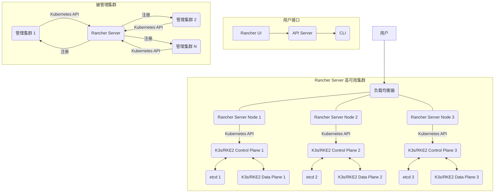

# Rancher 生产级部署与运维技术文档

## 1. 简介

### 1.1 服务介绍与核心特性

Rancher 是一个开源的容器管理平台，它提供了在生产环境中运行和管理 Kubernetes 所需的全部功能。Rancher 简化了 Kubernetes 的部署、管理和运维，使其对企业用户更易用。

**核心特性：**

*   **多集群管理:** 在单个 Rancher UI 中管理多个 Kubernetes 集群，无论是本地部署、云提供商托管还是边缘集群。
*   **统一认证与 RBAC:** 集中管理用户身份、角色和访问控制，为所有管理的 Kubernetes 集群提供统一的认证和授权。
*   **应用目录:** 提供 Helm Chart 仓库和预配置的应用模板，方便一键部署常用应用。
*   **监控与告警:** 集成了 Prometheus 和 Grafana，提供开箱即用的集群监控和告警功能。
*   **日志管理:** 支持与各种日志系统集成。
*   **CI/CD 集成:** 可与 Jenkins、GitLab CI 等 CI/CD 工具集成。
*   **存储与网络:** 提供了对各种存储和网络插件的支持，如 Longhorn 存储、Calico 网络等。

### 1.2 适用场景

*   **企业级 Kubernetes 管理:** 对于需要管理大量 Kubernetes 集群，并要求统一管理、安全控制和运维标准的企业。
*   **混合云/多云部署:** 简化在不同云环境和本地数据中心部署 Kubernetes 集群的复杂性。
*   **边缘计算:** 方便在边缘设备上部署和管理轻量级 Kubernetes 集群。
*   **应用生命周期管理:** 提供从部署、监控到升级的应用全生命周期管理。

### 1.3 架构原理图（Mermaid 图）



## 2. 版本选择指南

### 2.1 版本对应关系表

| Rancher 版本   | 推荐 Kubernetes 版本 (用于 Rancher Server) | 主要特性说明                                                                 |
| :------------- | :--------------------------------------- | :------------------------------------------------------------------------- |
| Rancher 2.7.x  | Kubernetes 1.24 - 1.27                   | 稳定版，功能成熟，推荐用于生产环境。                                         |
| Rancher 2.8.x  | Kubernetes 1.25 - 1.28                   | 最新稳定版，包含新特性和改进，通常建议在测试验证后用于生产。               |
| Rancher 2.9.x+ | Kubernetes 1.26 - 1.29+                  | 预览版或最新开发版，通常用于功能尝鲜和测试，不推荐直接用于生产环境。     |

> ⚠️ **说明**：Rancher Server 本身运行在一个 Kubernetes 集群中（通常推荐使用 K3s 或 RKE2），上述“推荐 Kubernetes 版本”是指承载 Rancher Server 的 Kubernetes 集群版本。被 Rancher 管理的下游 Kubernetes 集群可以支持更广泛的版本范围，具体请查阅 Rancher 官方文档的版本兼容性矩阵。

### 2.2 版本决策建议

选择 Rancher 版本时，应综合考虑以下因素：

1.  **稳定性与成熟度:** 生产环境强烈建议选择 Rancher 的稳定版本（如 2.7.x 或 2.8.x）。最新版本通常包含新功能，但在生产使用前应进行充分的测试验证。
2.  **Kubernetes 兼容性:** 确保所选的 Rancher 版本与您计划用于承载 Rancher Server 的 Kubernetes 版本以及未来要管理的下游 Kubernetes 集群版本兼容。查阅官方文档的兼容性矩阵至关重要。
3.  **社区支持与补丁:** 较新的稳定版本通常能获得更及时的安全补丁和社区支持。
4.  **功能需求:** 如果您的项目依赖于 Rancher 某个特定版本引入的新功能，那么选择该版本是必然的。
5.  **升级路径:** 考虑未来的升级路径，选择一个有清晰升级文档和较少兼容性问题的版本。

**总结:** 对于大多数生产环境，推荐选择 Rancher 2.7.x 或 2.8.x 的最新补丁版本。始终建议先在开发/测试环境中进行充分验证，再推向生产。

## 3. 生产环境规划（高可用架构）

Rancher Server 在生产环境中必须以高可用（HA）模式部署在一个 Kubernetes 集群上。官方推荐使用 K3s 或 RKE2 作为承载 Rancher Server 的 Kubernetes 发行版。本方案以 **RKE2** 为例进行说明。

### 3.1 集群架构图（ASCII 图，至少 3 节点）

本架构采用 3 台服务器部署 RKE2 高可用集群，并在其上部署 Rancher Server。

```
+---------------------------------------------------------------------------------------+
|                                  互联网/Intranet                                      |
+---------------------------------------------------------------------------------------+
        |
        |  HTTPS (443)
        V
+---------------------------------------------------------------------------------------+
|                            负载均衡器 (Nginx/Haproxy/LVS)                            |
|                            (TCP Load Balancer for 443, 80)                            |
+---------------------------------------------------------------------------------------+
        |                           |                           |
        |                           |                           |
        V                           V                           V
+--------------------+   +--------------------+   +--------------------+
|  RKE2/Rancher Node 1 | |  RKE2/Rancher Node 2 | |  RKE2/Rancher Node 3 |
|    (Control Plane + ETCD + Worker)            | |    (Control Plane + ETCD + Worker)            | |    (Control Plane + ETCD + Worker)            |
|  IP: 192.168.1.101   | |  IP: 192.168.1.102   | |  IP: 192.168.1.103   |
|                    | |                    | |                    |
| +----------------+ | | +----------------+ | | +----------------+ |
| |   RKE2 Server  | | | |   RKE2 Server  | | | |   RKE2 Server  | |
| | (API, Controller, | | | (API, Controller, | | | (API, Controller, | |
| |   Scheduler)   | | | |   Scheduler)   | | | |   Scheduler)   | |
| +----------------+ | | +----------------+ | | +----------------+ |
| +----------------+ | | +----------------+ | | +----------------+ |
| |      ETCD      | | | |      ETCD      | | | |      ETCD      | |
| |  (Data Store)  | | | |  (Data Store)  | | | |  (Data Store)  | |
| +----------------+ | | +----------------+ | | +----------------+ |
| +----------------+ | | +----------------+ | | +----------------+ |
| |   RKE2 Agent   | | | |   RKE2 Agent   | | | |   RKE2 Agent   | |
| |  (Kubelet, Kube-proxy)| | |  (Kubelet, Kube-proxy)| | |  (Kubelet, Kube-proxy)| |
| +----------------+ | | +----------------+ | | +----------------+ |
|                    | |                    | |                    |
|  Rancher Manager   | |  Rancher Manager   | |  Rancher Manager   |
|   (Deployed via Helm)  | |   (Deployed via Helm)  | |   (Deployed via Helm)  |
+--------------------+   +--------------------+   +--------------------+
```

### 3.2 节点角色与配置要求

所有节点均为 RKE2 Control Plane 和 Worker 混合角色。每个节点都运行 RKE2 Server 组件（包含 etcd、API Server、Controller Manager、Scheduler）以及 RKE2 Agent 组件（包含 Kubelet、Kube-proxy）。Rancher Server 会通过 Helm 部署到这个 RKE2 集群上。

| 角色              | 最低配置             | 推荐配置             | 存储要求 (系统盘) | 说明                                                |
| :---------------- | :------------------- | :------------------- | :---------------- | :-------------------------------------------------- |
| RKE2 Server Node | 2核 CPU / 4GB RAM / 50GB Disk | 4核 CPU / 8GB RAM / 100GB Disk | 50GB+ SSD         | 运行 RKE2 Control Plane, ETCD, Worker 和 Rancher Server |
| **负载均衡器**    | (软件负载均衡)       | (软件负载均衡)       |                   | 转发 80/443 流量至 RKE2/Rancher 节点                |

> ⚠️ **注意**：上述配置为单个节点的建议。实际生产环境中，请根据您的并发用户量、管理的集群数量以及部署在 Rancher Server 所在集群的其他应用负载进行评估和调整。推荐使用 SSD 磁盘以获得更好的 ETCD 性能。

### 3.3 网络与端口规划

| 端口号 | 协议  | 来源 IP        | 目的 IP        | 目的角色       | 说明                               |
| :----- | :---- | :------------- | :------------- | :------------- | :--------------------------------- |
| 80     | TCP   | Any            | 负载均衡器 IP  | 负载均衡器     | HTTP 重定向到 HTTPS                |
| 443    | TCP   | Any            | 负载均衡器 IP  | 负载均衡器     | Rancher UI/API 访问 (HTTPS)        |
| 6443   | TCP   | 负载均衡器 IP  | RKE2 节点 IP   | RKE2 Control Plane | RKE2 API Server 端口，用于集群管理 |
| 2379   | TCP   | RKE2 节点 IP   | RKE2 节点 IP   | ETCD           | ETCD 客户端通信 (内部)             |
| 2380   | TCP   | RKE2 节点 IP   | RKE2 节点 IP   | ETCD           | ETCD 对等体通信 (内部)             |
| 9345   | TCP   | RKE2 节点 IP   | RKE2 节点 IP   | RKE2 Server    | RKE2 Agent 到 Server 的连接      |
| 10250  | TCP   | RKE2 节点 IP   | RKE2 节点 IP   | Kubelet        | Kubelet API (内部)                 |
| 8443   | TCP   | 负载均衡器 IP  | RKE2 节点 IP   | Ingress Controller | Rancher Server 内部通信           |

> ★ **重要**：请确保所有相关端口在防火墙和安全组中已正确放行。对于生产环境，应尽量限制来源 IP，只允许必要的网络访问。

## 4. 生产环境部署

本章节将指导如何在 Rocky Linux 9 和 Ubuntu 22.04 操作系统上部署 RKE2 高可用集群，并在其上安装 Rancher Server。

### 4.1 前置准备（所有节点）

在所有 RKE2/Rancher 节点上执行以下操作。

1.  **更新系统并安装常用工具**

    ```bash
    # ── Rocky Linux 9 ──────────────────────────
    dnf update -y
    dnf install -y curl wget vim git net-tools iputils-ping

    # ── Ubuntu 22.04 ───────────────────────────
    apt-get update -y
    apt-get install -y curl wget vim git net-tools iputils-ping
    ```

2.  **禁用 SELinux (Rocky Linux)**

    ```bash
    # ── Rocky Linux 9 ──────────────────────────
    setenforce 0
    sed -i 's/^SELINUX=enforcing$/SELINUX=permissive/' /etc/selinux/config

    # ── Ubuntu 22.04 ───────────────────────────
    # Ubuntu 默认不启用 SELinux，无需操作。
    ```

3.  **禁用 Swap**

    ```bash
    # ── Rocky Linux 9 ──────────────────────────
    swapoff -a
    sed -i '/ swap / s/^\(.*\)$/#\1/g' /etc/fstab

    # ── Ubuntu 22.04 ───────────────────────────
    swapoff -a
    sed -i '/ swap / s/^\(.*\)$/#\1/g' /etc/fstab
    ```

4.  **配置内核参数**

    ```bash
    cat >> /etc/sysctl.d/99-kubernetes-cri.conf << 'EOF'
    net.bridge.bridge-nf-call-iptables  = 1
    net.bridge.bridge-nf-call-ip6tables = 1
    net.ipv4.ip_forward                 = 1
    EOF
    sysctl --system
    ```

5.  **配置防火墙**

    *   **Rocky Linux 9 (使用 firewalld)**

        ```bash
        # ── Rocky Linux 9 ──────────────────────────
        systemctl enable --now firewalld
        firewall-cmd --permanent --add-port=80/tcp
        firewall-cmd --permanent --add-port=443/tcp
        firewall-cmd --permanent --add-port=6443/tcp
        firewall-cmd --permanent --add-port=2379-2380/tcp
        firewall-cmd --permanent --add-port=9345/tcp
        firewall-cmd --permanent --add-port=10250/tcp
        firewall-cmd --permanent --add-port=8443/tcp # Rancher Ingress
        firewall-cmd --reload
        firewall-cmd --list-all
        ```

    *   **Ubuntu 22.04 (使用 ufw)**

        ```bash
        # ── Ubuntu 22.04 ───────────────────────────
        ufw enable
        ufw allow 80/tcp
        ufw allow 443/tcp
        ufw allow 6443/tcp
        ufw allow 2379:2380/tcp
        ufw allow 9345/tcp
        ufw allow 10250/tcp
        ufw allow 8443/tcp # Rancher Ingress
        ufw status
        ```

6.  **配置负载均衡器 (LVS/Nginx/Haproxy)**

    在独立的一台服务器（或其中一台 RKE2 节点上运行 keepalived + haproxy/nginx）配置负载均衡器，将 80 和 443 端口的流量转发到 RKE2 节点（端口 6443）。

    > 📎 参考：[Nginx 部署文档](../nginx/README.md) 或 [Haproxy 部署文档](../haproxy/README.md)

    以下以 Nginx 为例，假设您的 Nginx 作为负载均衡器，并将 `rancher.yourdomain.com` 解析到 Nginx IP。

    ```bash
    cat >> /etc/nginx/conf.d/rancher.conf << 'EOF'
    upstream rancher_servers {
        server 192.168.1.101:6443;  # ← ⚠️ 根据实际 RKE2 节点 IP 和端口修改
        server 192.168.1.102:6443;  # ← ⚠️ 根据实际 RKE2 节点 IP 和端口修改
        server 192.168.1.103:6443;  # ← ⚠️ 根据实际 RKE2 节点 IP 和端口修改
    }

    server {
        listen 80;
        server_name rancher.yourdomain.com; # ← ⚠️ 根据实际域名修改
        return 301 https://$host$request_uri;
    }

    server {
        listen 443 ssl http2;
        server_name rancher.yourdomain.com; # ← ⚠️ 根据实际域名修改

        ssl_certificate /etc/nginx/ssl/rancher.yourdomain.com.pem; # ← ⚠️ 根据实际证书路径修改
        ssl_certificate_key /etc/nginx/ssl/rancher.yourdomain.com.key; # ← ⚠️ 根据实际证书路径修改
        ssl_session_timeout 1d;
        ssl_session_cache shared:SSL:50m;
        ssl_session_tickets off;
        ssl_protocols TLSv1.2 TLSv1.3;
        ssl_ciphers 'ECDHE+AESGCM:ECDHE+CHACHA20:DHE+AESGCM:DHE+CHACHA20';
        ssl_prefer_server_ciphers on;

        location / {
            proxy_pass https://rancher_servers;
            proxy_set_header Host $host;
            proxy_set_header X-Forwarded-Proto $scheme;
            proxy_set_header X-Forwarded-Port $server_port;
            proxy_redirect off;
            proxy_http_version 1.1;
            proxy_buffering off;
            proxy_set_header Upgrade $http_upgrade;
            proxy_set_header Connection "upgrade";
        }
    }
    EOF
    ```

    重启 Nginx 服务：

    ```bash
    # ── Rocky Linux 9 ──────────────────────────
    systemctl restart nginx

    # ── Ubuntu 22.04 ───────────────────────────
    systemctl restart nginx
    ```

### 4.2 [Rocky Linux 9 部署步骤]

#### 4.2.1 安装 RKE2 (所有节点)

1.  **设置 RKE2 安装环境变量**

    ```bash
    export INSTALL_RKE2_VERSION="v1.28.x+rKE2" # ← ⚠️ 根据实际选择的 Rancher 兼容 RKE2 版本修改
    export INSTALL_RKE2_TYPE="server"
    ```

2.  **下载并执行 RKE2 安装脚本**

    ```bash
    curl -sfL https://get.rke2.io | sh -
    ```

3.  **创建 RKE2 配置文件 (在所有节点上)**

    在每个 RKE2 节点上创建 `/etc/rancher/rke2/config.yaml` 文件。

    在 **第一个节点 (Control Plane)** 上：

    ```bash
    cat >> /etc/rancher/rke2/config.yaml << 'EOF'
    write-kubeconfig-mode: "0644"
    tls-san:
      - rancher.yourdomain.com # ← ⚠️ 根据实际 Rancher 域名修改
      - 192.168.1.101 # ← ⚠️ 当前节点 IP
      - 192.168.1.102 # ← ⚠️ 其他 RKE2 节点 IP
      - 192.168.1.103 # ← ⚠️ 其他 RKE2 节点 IP
    token: "your-rke2-secret-token" # ★ ⚠️ 生成一个强密码，所有 Control Plane 节点必须一致
    EOF
    ```

    在 **其他节点 (Control Plane)** 上：

    ```bash
    cat >> /etc/rancher/rke2/config.yaml << 'EOF'
    write-kubeconfig-mode: "0644"
    tls-san:
      - rancher.yourdomain.com # ← ⚠️ 根据实际 Rancher 域名修改
      - 192.168.1.101 # ← ⚠️ 所有 RKE2 节点 IP
      - 192.168.1.102 # ← ⚠️ 所有 RKE2 节点 IP
      - 192.168.1.103 # ← ⚠️ 所有 RKE2 节点 IP
    token: "your-rke2-secret-token" # ★ ⚠️ 必须与第一个节点一致
    server: https://192.168.1.101:9345 # ← ⚠️ 指向第一个 RKE2 节点 IP 和 9345 端口
    EOF
    ```
    > ⚠️ **说明**：RKE2 的 token 必须在所有 Server 节点上保持一致。`server` 参数指向集群中任何一个已启动的 Server 节点即可，用于加入集群。

4.  **启动 RKE2 服务 (所有节点)**

    ```bash
    systemctl enable --now rke2-server.service
    ```

#### 4.2.2 部署 Rancher Server (仅在第一个节点操作，Rancher 会部署到 RKE2 集群中)

1.  **等待 RKE2 集群启动并检查状态**

    耐心等待所有 RKE2 节点启动并加入集群。

    ```bash
    export KUBECONFIG=/etc/rancher/rke2/rke2.yaml
    kubectl get nodes
    ```
    预期输出应显示所有节点状态为 `Ready`。

2.  **添加 Helm Chart 仓库**

    ```bash
    helm repo add rancher-stable https://releases.rancher.com/server-charts/stable
    helm repo update
    ```

3.  **安装 Cert-Manager**

    Rancher 需要 Cert-Manager 来自动颁发和管理 TLS 证书。

    ```bash
    kubectl apply -f https://github.com/cert-manager/cert-manager/releases/download/v1.11.0/cert-manager.yaml # ← ⚠️ 版本号根据 Rancher 官方文档推荐修改

    # 等待 Cert-Manager Pod 启动
    kubectl wait --namespace cert-manager \
      --for=condition=ready pod \
      --selector=app.kubernetes.io/instance=cert-manager \
      --timeout=900s
    ```

4.  **安装 Rancher Server**

    ```bash
    helm install rancher rancher-stable/rancher \
      --namespace cattle-system \
      --create-namespace \
      --set hostname=rancher.yourdomain.com \ # ★ ⚠️ 根据实际 Rancher 域名修改
      --set bootstrapPassword=your-rancher-admin-password \ # ★ ⚠️ 设置 Rancher 管理员初始密码
      --set ingress.tls.source=cert-manager \ # 使用 cert-manager 颁发证书
      --set replicas=3 # ★ ⚠️ 生产环境推荐 3 个副本以确保高可用
    ```
    > ⚠️ **注意**：`hostname` 必须与您的负载均衡器配置的域名一致。`bootstrapPassword` 是您第一次登录 Rancher UI 时使用的初始密码，请务必设置一个强密码并妥善保管。

### 4.3 [Ubuntu 22.04 部署步骤]

#### 4.3.1 安装 RKE2 (所有节点)

1.  **设置 RKE2 安装环境变量**

    ```bash
    export INSTALL_RKE2_VERSION="v1.28.x+rKE2" # ← ⚠️ 根据实际选择的 Rancher 兼容 RKE2 版本修改
    export INSTALL_RKE2_TYPE="server"
    ```

2.  **下载并执行 RKE2 安装脚本**

    ```bash
    curl -sfL https://get.rke2.io | sh -
    ```

3.  **创建 RKE2 配置文件 (在所有节点上)**

    在每个 RKE2 节点上创建 `/etc/rancher/rke2/config.yaml` 文件。

    在 **第一个节点 (Control Plane)** 上：

    ```bash
    cat >> /etc/rancher/rke2/config.yaml << 'EOF'
    write-kubeconfig-mode: "0644"
    tls-san:
      - rancher.yourdomain.com # ← ⚠️ 根据实际 Rancher 域名修改
      - 192.168.1.101 # ← ⚠️ 当前节点 IP
      - 192.168.1.102 # ← ⚠️ 其他 RKE2 节点 IP
      - 192.168.1.103 # ← ⚠️ 其他 RKE2 节点 IP
    token: "your-rke2-secret-token" # ★ ⚠️ 生成一个强密码，所有 Control Plane 节点必须一致
    EOF
    ```

    在 **其他节点 (Control Plane)** 上：

    ```bash
    cat >> /etc/rancher/rke2/config.yaml << 'EOF'
    write-kubeconfig-mode: "0644"
    tls-san:
      - rancher.yourdomain.com # ← ⚠️ 根据实际 Rancher 域名修改
      - 192.168.1.101 # ← ⚠️ 所有 RKE2 节点 IP
      - 192.168.1.102 # ← ⚠️ 所有 RKE2 节点 IP
      - 192.168.1.103 # ← ⚠️ 所有 RKE2 节点 IP
    token: "your-rke2-secret-token" # ★ ⚠️ 必须与第一个节点一致
    server: https://192.168.1.101:9345 # ← ⚠️ 指向第一个 RKE2 节点 IP 和 9345 端口
    EOF
    ```
    > ⚠️ **说明**：RKE2 的 token 必须在所有 Server 节点上保持一致。`server` 参数指向集群中任何一个已启动的 Server 节点即可，用于加入集群。

4.  **启动 RKE2 服务 (所有节点)**

    ```bash
    systemctl enable --now rke2-server.service
    ```

#### 4.3.2 部署 Rancher Server (仅在第一个节点操作，Rancher 会部署到 RKE2 集群中)

此步骤与 Rocky Linux 9 相同，因为 Rancher 是部署在 Kubernetes 集群之上的，与底层操作系统无关。

1.  **等待 RKE2 集群启动并检查状态**

    耐心等待所有 RKE2 节点启动并加入集群。

    ```bash
    export KUBECONFIG=/etc/rancher/rke2/rke2.yaml
    kubectl get nodes
    ```
    预期输出应显示所有节点状态为 `Ready`。

2.  **添加 Helm Chart 仓库**

    ```bash
    helm repo add rancher-stable https://releases.rancher.com/server-charts/stable
    helm repo update
    ```

3.  **安装 Cert-Manager**

    Rancher 需要 Cert-Manager 来自动颁发和管理 TLS 证书。

    ```bash
    kubectl apply -f https://github.com/cert-manager/cert-manager/releases/download/v1.11.0/cert-manager.yaml # ← ⚠️ 版本号根据 Rancher 官方文档推荐修改

    # 等待 Cert-Manager Pod 启动
    kubectl wait --namespace cert-manager \
      --for=condition=ready pod \
      --selector=app.kubernetes.io/instance=cert-manager \
      --timeout=900s
    ```

4.  **安装 Rancher Server**

    ```bash
    helm install rancher rancher-stable/rancher \
      --namespace cattle-system \
      --create-namespace \
      --set hostname=rancher.yourdomain.com \ # ★ ⚠️ 根据实际 Rancher 域名修改
      --set bootstrapPassword=your-rancher-admin-password \ # ★ ⚠️ 设置 Rancher 管理员初始密码
      --set ingress.tls.source=cert-manager \ # 使用 cert-manager 颁发证书
      --set replicas=3 # ★ ⚠️ 生产环境推荐 3 个副本以确保高可用
    ```
    > ⚠️ **注意**：`hostname` 必须与您的负载均衡器配置的域名一致。`bootstrapPassword` 是您第一次登录 Rancher UI 时使用的初始密码，请务必设置一个强密码并妥善保管。

### 4.4 集群初始化与配置

在 Rancher Server 部署完成后，通过浏览器访问 `https://rancher.yourdomain.com` (← 根据实际域名修改) 进行初始化配置。

1.  **设置管理员密码:**
    首次访问会提示设置管理员密码，输入在 Helm 安装时设置的 `bootstrapPassword`，然后设置新的管理员密码。

2.  **Rancher URL 配置:**
    确认 Rancher Server URL，通常会自动识别。如果未识别或不正确，请手动修改为 `https://rancher.yourdomain.com` (← 根据实际域名修改)。

3.  **登录 Rancher UI:**
    使用新的管理员密码登录 Rancher UI。

### 4.5 安装验证（含预期输出）

1.  **检查 RKE2 节点状态 (任意 RKE2 节点)**

    ```bash
    export KUBECONFIG=/etc/rancher/rke2/rke2.yaml
    kubectl get nodes
    ```
    **预期输出:**
    ```
    NAME            STATUS   ROLES                       AGE   VERSION
    192.168.1.101   Ready    control-plane,etcd,master   Xd    v1.28.x+rke2
    192.168.1.102   Ready    control-plane,etcd,master   Xd    v1.28.x+rke2
    192.168.1.103   Ready    control-plane,etcd,master   Xd    v1.28.x+rke2
    ```
    所有节点应显示 `Ready` 状态。

2.  **检查 Rancher Pod 运行状态 (任意 RKE2 节点)**

    ```bash
    export KUBECONFIG=/etc/rancher/rke2/rke2.yaml
    kubectl -n cattle-system get pods
    ```
    **预期输出:**
    ```
    NAME                             READY   STATUS    RESTARTS   AGE
    rancher-7xxxxxxx-xxxxx           1/1     Running   0          Xm
    rancher-7xxxxxxx-xxxxx           1/1     Running   0          Xm
    rancher-7xxxxxxx-xxxxx           1/1     Running   0          Xm
    ```
    所有 `rancher-` 开头的 Pods 应该都处于 `Running` 状态，并且 `READY` 列显示 `1/1`。

3.  **访问 Rancher UI**
    在浏览器中访问您配置的 Rancher URL (例如: `https://rancher.yourdomain.com`)，如果能正常显示登录页面并成功登录，则表示 Rancher Server 部署成功。

## 5. 关键参数配置说明

### 5.1 核心配置文件详解（含逐行注释）

#### 5.1.1 RKE2 配置文件: `/etc/rancher/rke2/config.yaml`

```yaml
# ── /etc/rancher/rke2/config.yaml ──────────────────────────
# 以 0644 权限写入 kubeconfig 文件，允许非 root 用户读取
write-kubeconfig-mode: "0644"

# 证书主题备用名称 (Subject Alternative Names)，用于 TLS 证书。
# 必须包含 Rancher 的域名和所有 RKE2 节点的 IP 地址，确保证书有效。
# 如果不配置，客户端访问时可能会出现证书警告。
tls-san:
  - rancher.yourdomain.com # ← ⚠️ Rancher 访问域名
  - 192.168.1.101 # ← ⚠️ RKE2 节点 1 的 IP
  - 192.168.1.102 # ← ⚠️ RKE2 节点 2 的 IP
  - 192.168.1.103 # ← ⚠️ RKE2 节点 3 的 IP

# 用于 RKE2 Server 节点之间通信的共享 Secret。
# 所有 Control Plane 节点必须使用相同的 Token。
# 强烈建议生成一个足够随机和复杂的字符串。
token: "your-rke2-secret-token" # ★ ⚠️ 生产环境必须修改为强密码

# 对于非第一个 Control Plane 节点，需要指定一个已启动的 Control Plane 节点 IP 和端口。
# RKE2 Server 默认监听 9345 端口用于 Server 间通信。
# server: https://192.168.1.101:9345 # ← ⚠️ 其他 Control Plane 节点指向第一个节点的 IP
```

#### 5.1.2 Rancher Helm 安装参数

Rancher Server 主要通过 Helm Chart 安装时传递的参数进行配置。这些参数在 `helm install` 命令中通过 `--set` 选项指定。

```bash
# ── Rancher Helm 安装参数 (示例) ───────────────────────────
helm install rancher rancher-stable/rancher \
  --namespace cattle-system \
  --create-namespace \
  --set hostname=rancher.yourdomain.com \ # ★ ⚠️ Rancher Server 的外部访问域名，必须与负载均衡器和 DNS 配置一致
  --set bootstrapPassword=your-rancher-admin-password \ # ★ ⚠️ 首次登录 Rancher UI 的管理员初始密码
  --set ingress.tls.source=cert-manager \ # ⚠️ 指定 Ingress 控制器如何获取 TLS 证书。
                                          #    cert-manager: 自动通过 Cert-Manager 颁发证书。
                                          #    rancher: Rancher 自签名证书 (不推荐生产环境)。
                                          #    secret: 使用已存在的 Kubernetes Secret 中的证书。
  --set replicas=3 \ # ★ ⚠️ Rancher Server Pod 的副本数量。生产环境推荐 3 个副本以确保高可用。
  --set featureGates="" # ⚠️ 启用或禁用 Rancher 的实验性功能。例如 "multiClusterApp=true"
  --set rancherImage="rancher/rancher" # ⚠️ Rancher 镜像名称，通常无需修改
  --set rancherImageTag="v2.8.x" # ⚠️ Rancher 镜像版本 Tag，与您选择的 Rancher 版本对应
  --set systemDefaultRegistry="<your-private-registry>" # ⚠️ 如果使用私有镜像仓库，在此指定
  --set proxy="http://your_proxy_server:port" # ⚠️ 如果环境需要通过代理访问外部，在此指定
  --set noProxy="127.0.0.1,localhost,.cluster.local,rancher.yourdomain.com" # ⚠️ 不走代理的地址列表
```

### 5.2 生产环境推荐调优参数

1.  **RKE2 节点资源**
    确保每个 RKE2 节点有足够的 CPU、内存和磁盘 I/O。对于 Rancher Server 本身，推荐至少 4核 CPU / 8GB RAM。

2.  **ETCD 性能优化**
    RKE2 默认使用嵌入式 ETCD。确保 ETCD 数据目录 (`/var/lib/rancher/rke2/server/db/`) 位于高性能 SSD 磁盘上，以减少延迟。

3.  **负载均衡器会话保持**
    为负载均衡器配置 TCP 会话保持，确保客户端与 Rancher Server 的连接稳定性。建议使用 TCP 模式直接转发。

4.  **Cert-Manager 配置**
    在生产环境，建议配置 Cert-Manager 使用 Let's Encrypt 或您自己的 CA 颁发真实证书，而不是 Rancher 自签名证书。
    > 📎 参考：[Cert-Manager 部署文档](../cert-manager/README.md)

5.  **监控与告警**
    Rancher 默认集成了 Prometheus 和 Grafana。确保这些组件已启用并配置了适当的告警规则，以便及时发现和解决问题。

6.  **日志管理**
    配置 Rancher 和 Kubernetes 集群的日志收集，例如集成到 ELK Stack 或 Loki，便于集中分析和故障排查。

7.  **备份策略**
    定期备份 Rancher Server 所在 RKE2 集群的 ETCD 数据，以及 Rancher Server 配置。

## 6. 开发/测试环境快速部署（Docker Compose）

**⚠️ 警告：此方案仅适用于开发和测试环境，不适用于生产环境！**

此方案在单台机器上通过 Docker Compose 快速部署一个 Rancher Server。

### 6.1 Docker Compose 部署（单机或伪集群）

1.  **安装 Docker 和 Docker Compose**

    ```bash
    # ── Rocky Linux 9 ──────────────────────────
    dnf install -y yum-utils device-mapper-persistent-data lvm2
    yum-config-manager --add-repo https://download.docker.com/linux/centos/docker-ce.repo
    dnf install -y docker-ce docker-ce-cli containerd.io docker-buildx-plugin docker-compose-plugin
    systemctl start docker
    systemctl enable docker

    # ── Ubuntu 22.04 ───────────────────────────
    apt-get update -y
    apt-get install -y ca-certificates curl gnupg
    install -m 0755 -d /etc/apt/keyrings
    curl -fsSL https://download.docker.com/linux/ubuntu/gpg | gpg --dearmor -o /etc/apt/keyrings/docker.gpg
    chmod a+r /etc/apt/keyrings/docker.gpg
    echo \
      "deb [arch="$(dpkg --print-architecture)" signed-by=/etc/apt/keyrings/docker.gpg] https://download.docker.com/linux/ubuntu \
      "$(. /etc/os-release && echo "$VERSION_CODENAME")" stable" | \
      tee /etc/apt/sources.list.d/docker.list > /dev/null
    apt-get update -y
    apt-get install -y docker-ce docker-ce-cli containerd.io docker-buildx-plugin docker-compose-plugin
    systemctl start docker
    systemctl enable docker
    ```

2.  **创建 Docker Compose 文件**

    创建 `docker-compose.yml` 文件：

    ```bash
    cat >> docker-compose.yml << 'EOF'
    version: '3'

    services:
      rancher:
        image: rancher/rancher:v2.8.3 # ← ⚠️ 根据实际版本修改
        restart: unless-stopped
        ports:
          - "80:80"
          - "443:443"
        volumes:
          - rancher-data:/var/lib/rancher # 数据持久化
        environment:
          # Rancher Server 的外部访问 URL，用于 Rancher 生成的各种链接
          CATTLE_SERVER_URL: "https://rancher.yourdomain.com" # ← ⚠️ 根据实际访问 IP 或域名修改
          # 禁用 Rancher 的证书校验，因为 Docker Compose 部署通常使用自签名证书
          CATTLE_TLS_SERVER_URL: "https://rancher.yourdomain.com" # ← ⚠️ 根据实际访问 IP 或域名修改
          CATTLE_BOOTSTRAP_PASSWORD: "your-bootstrap-password" # ★ ⚠️ 初始管理员密码
          # 如果需要通过代理访问外部网络
          # HTTP_PROXY: "http://your_proxy_server:port"
          # HTTPS_PROXY: "http://your_proxy_server:port"
          # NO_PROXY: "127.0.0.1,localhost,.cluster.local"

    volumes:
      rancher-data:
    EOF
    ```
    > ⚠️ **注意**：`CATTLE_SERVER_URL` 和 `CATTLE_TLS_SERVER_URL` 应指向您可以通过浏览器访问 Rancher Server 的 IP 或域名。如果您没有配置域名，可以使用服务器 IP。`CATTLE_BOOTSTRAP_PASSWORD` 是第一次登录 Rancher UI 的初始密码。

### 6.2 启动与验证

1.  **启动 Rancher Server**

    在 `docker-compose.yml` 文件所在目录执行：

    ```bash
    docker compose up -d
    ```

2.  **检查容器状态**

    ```bash
    docker ps
    ```
    **预期输出:**
    ```
    CONTAINER ID   IMAGE                 COMMAND                  CREATED          STATUS          PORTS                                      NAMES
    xxxxxxxxx      rancher/rancher:v2.8.3   "entrypoint.sh"          X minutes ago    Up X minutes    0.0.0.0:80->80/tcp, 0.0.0.0:443->443/tcp   rancher
    ```
    `rancher` 容器应处于 `Up` 状态。

3.  **访问 Rancher UI**
    在浏览器中访问 `https://<您的服务器IP>` 或 `https://rancher.yourdomain.com` (← 根据 `CATTLE_SERVER_URL` 配置) 进行登录。使用在 `docker-compose.yml` 中设置的 `CATTLE_BOOTSTRAP_PASSWORD` 登录。首次登录会要求设置新的管理员密码。

## 7. 日常运维操作

### 7.1 常用管理命令

1.  **检查 RKE2 集群状态**

    ```bash
    export KUBECONFIG=/etc/rancher/rke2/rke2.yaml
    kubectl get nodes
    kubectl get pods -A
    ```

2.  **检查 Rancher Server Pod 状态**

    ```bash
    export KUBECONFIG=/etc/rancher/rke2/rke2.yaml
    kubectl -n cattle-system get pods
    kubectl -n cattle-system logs -f <rancher-pod-name>
    ```

3.  **查看 Helm Chart 安装状态**

    ```bash
    export KUBECONFIG=/etc/rancher/rke2/rke2.yaml
    helm list -A
    helm get values rancher -n cattle-system
    ```

4.  **RKE2 服务管理**

    ```bash
    systemctl status rke2-server.service
    systemctl restart rke2-server.service
    systemctl stop rke2-server.service
    ```

5.  **Rancher 日志查看 (Docker Compose 模式)**

    ```bash
    docker compose logs -f rancher
    ```

### 7.2 备份与恢复

#### 7.2.1 备份 Rancher Server 所在 RKE2 集群的 ETCD 数据

Rancher Server 的所有配置和管理信息都存储在其所在 RKE2 集群的 ETCD 中。定期备份 ETCD 数据至关重要。

1.  **在 RKE2 Control Plane 节点执行备份**

    ```bash
    # 确保在 RKE2 Server 节点上执行
    export KUBECONFIG=/etc/rancher/rke2/rke2.yaml

    # 执行 RKE2 ETCD 备份
    rke2 ctl etcd-snapshot --name rancher-backup-$(date +%Y%m%d%H%M%S) --snapshot-dir /opt/rke2-etcd-backups # ← ⚠️ 指定备份目录
    ```
    备份文件将生成在 `/opt/rke2-etcd-backups` 目录下。请务必将这些备份文件异地存储。

#### 7.2.2 恢复 Rancher Server 所在 RKE2 集群的 ETCD 数据

1.  **停止所有 RKE2 Server 节点**

    在所有 RKE2 Server 节点上执行：

    ```bash
    systemctl stop rke2-server.service
    ```

2.  **选择一个 RKE2 Server 节点进行恢复**

    将备份文件复制到选定节点的 `/opt/rke2-etcd-backups` (← ⚠️ 根据实际备份目录修改) 目录。

    ```bash
    # 例如，选择最新的备份文件进行恢复
    SNAPSHOT_FILE="/opt/rke2-etcd-backups/rancher-backup-YYYYMMDDHHMMSS.zip" # ← ⚠️ 根据实际备份文件名修改

    # 执行恢复命令
    rke2 server --cluster-reset --cluster-reset-restore-path="${SNAPSHOT_FILE}"
    ```

3.  **启动已恢复的 RKE2 Server 节点**

    ```bash
    systemctl start rke2-server.service
    ```

4.  **重新启动其他 RKE2 Server 节点**

    待第一个恢复节点成功启动后，重新启动其他 RKE2 Server 节点。它们会自动重新加入集群并同步数据。

    ```bash
    systemctl start rke2-server.service
    ```

### 7.3 集群扩缩容

#### 7.3.1 扩容 RKE2/Rancher 节点

要增加 RKE2/Rancher Server 的高可用性或处理能力，可以添加更多 RKE2 Control Plane 节点。

1.  **准备新节点**
    按照 **4.1 前置准备** 中的步骤，在新节点上完成系统初始化。

2.  **安装 RKE2**
    按照 **4.2.1 安装 RKE2** 或 **4.3.1 安装 RKE2** 中的步骤，在新节点上安装 RKE2。

    在新节点的 `/etc/rancher/rke2/config.yaml` 中，`server` 参数指向集群中任何一个已启动的 RKE2 Server 节点，并且 `token` 与现有集群的 token 保持一致。

    ```bash
    cat >> /etc/rancher/rke2/config.yaml << 'EOF'
    write-kubeconfig-mode: "0644"
    tls-san:
      - rancher.yourdomain.com # ← ⚠️ 根据实际 Rancher 域名修改
      - 192.168.1.101 # ← ⚠️ 所有 RKE2 节点 IP
      - 192.168.1.102 # ← ⚠️ 所有 RKE2 节点 IP
      - 192.168.1.103 # ← ⚠️ 所有 RKE2 节点 IP
      - <New_Node_IP> # ← ⚠️ 新节点 IP
    token: "your-rke2-secret-token" # ★ ⚠️ 必须与现有集群一致
    server: https://192.168.1.101:9345 # ← ⚠️ 指向集群中任一现有 RKE2 Server 节点 IP
    EOF
    ```
    > ⚠️ **注意**：需要在所有 RKE2 Server 节点的 `tls-san` 中更新新节点的 IP，并重启 `rke2-server` 服务以使证书生效。

3.  **启动 RKE2 服务**

    ```bash
    systemctl enable --now rke2-server.service
    ```
    新节点会自动加入 RKE2 集群。

4.  **验证**
    ```bash
    export KUBECONFIG=/etc/rancher/rke2/rke2.yaml
    kubectl get nodes
    ```
    新节点应显示为 `Ready`。

#### 7.3.2 缩容 RKE2/Rancher 节点

从 RKE2/Rancher 集群中移除一个节点。

1.  **排空节点上的 Pods (可选，推荐)**

    ```bash
    export KUBECONFIG=/etc/rancher/rke2/rke2.yaml
    kubectl drain <node-name-to-remove> --ignore-daemonsets --delete-emptydir-data
    kubectl cordon <node-name-to-remove>
    ```

2.  **停止 RKE2 服务**

    在要移除的节点上执行：

    ```bash
    systemctl stop rke2-server.service
    systemctl disable rke2-server.service
    ```

3.  **从 RKE2 集群中移除节点**

    在任何一个剩余的 RKE2 Control Plane 节点上执行：

    ```bash
    export KUBECONFIG=/etc/rancher/rke2/rke2.yaml
    kubectl delete node <node-name-to-remove>
    ```

4.  **清理节点**

    在要移除的节点上执行：

    ```bash
    /usr/local/bin/rke2-uninstall.sh
    ```

    > ⚠️ **注意**：如果移除了 Control Plane 节点，需要确保剩余的 Control Plane 节点数量仍能维持 ETCD 的法定人数 (Quorum)。对于 3 节点集群，最多只能移除 1 个 Control Plane 节点。

### 7.4 版本升级

Rancher Server 和底层 RKE2 集群的升级是复杂的操作，请务必参考官方文档并仔细阅读升级注意事项。

#### 7.4.1 升级 RKE2 集群

RKE2 支持原地升级，推荐使用 `system-upgrade-controller` 进行自动化升级。手动升级步骤如下：

1.  **在所有 RKE2 节点上下载新版本 RKE2**

    ```bash
    export INSTALL_RKE2_VERSION="v1.29.x+rKE2" # ← ⚠️ 目标 RKE2 版本
    curl -sfL https://get.rke2.io | sh -
    ```

2.  **逐个节点重启 RKE2 服务**

    为了保证高可用，应逐个节点进行升级。

    ```bash
    # 在第一个节点：
    systemctl restart rke2-server.service
    # 等待该节点状态变为 Ready 后，再到下一个节点操作
    export KUBECONFIG=/etc/rancher/rke2/rke2.yaml
    kubectl get nodes

    # 逐个对所有节点执行上述重启操作
    ```

#### 7.4.2 升级 Rancher Server

Rancher Server 通过 Helm 进行升级。

1.  **更新 Helm Chart 仓库**

    ```bash
    export KUBECONFIG=/etc/rancher/rke2/rke2.yaml
    helm repo update
    ```

2.  **模拟升级 ( dry-run )**

    在执行实际升级前，强烈建议进行 dry-run 以检查潜在问题。

    ```bash
    helm upgrade rancher rancher-stable/rancher \
      --namespace cattle-system \
      --set hostname=rancher.yourdomain.com \
      --set bootstrapPassword=your-rancher-admin-password \
      --set ingress.tls.source=cert-manager \
      --set replicas=3 \
      --dry-run --debug
    ```

3.  **执行 Rancher Server 升级**

    ```bash
    helm upgrade rancher rancher-stable/rancher \
      --namespace cattle-system \
      --set hostname=rancher.yourdomain.com \
      --set bootstrapPassword=your-rancher-admin-password \
      --set ingress.tls.source=cert-manager \
      --set replicas=3
    ```
    > ⚠️ **注意**：升级时应确保所有 `--set` 参数与之前安装时的一致，或者根据新版本要求进行调整。Rancher 会自动处理 Pods 的滚动更新。

## 9. 注意事项与生产检查清单

### 9.1 安装前环境核查

*   [ ] 所有节点操作系统版本一致（推荐 Rocky Linux 9 或 Ubuntu 22.04）。
*   [ ] 所有节点已禁用 Swap。
*   [ ] 所有节点已配置正确的内核参数 (`net.bridge.bridge-nf-call-iptables` 等)。
*   [ ] 所有节点防火墙或安全组已正确放行所需端口 (80, 443, 6443, 2379-2380, 9345, 10250, 8443)。
*   [ ] 至少 3 个满足最低配置要求的服务器用于 RKE2/Rancher 节点。
*   [ ] 已配置外部负载均衡器，并将 Rancher 域名解析到负载均衡器 IP。
*   [ ] 已为 Rancher 域名准备好有效的 TLS 证书 (如果不用 Cert-Manager 自动颁发)。
*   [ ] 已为 RKE2 集群生成并记录了安全的 Token。
*   [ ] 已确定 Rancher 管理员初始密码。
*   [ ] 已对所有操作命令进行验证，特别是涉及路径、IP 和域名的部分。

### 9.2 常见故障排查（含报错日志示例）

1.  **RKE2 节点无法加入集群 (Token 不匹配或 server 地址错误)**

    **可能日志:**
    ```
    FATA[0000] Failed to get client controller: failed to connect to the API server: Error: x509: certificate is valid for 127.0.0.1, <hostname>, not 192.168.1.101
    FATA[0000] Failed to get client controller: failed to connect to the API server: token is not valid
    ```
    **排查步骤:**
    *   检查 `/etc/rancher/rke2/config.yaml` 中的 `token` 是否与第一个 Control Plane 节点一致。
    *   检查 `server` 参数指向的 IP 和端口是否正确可达。
    *   检查 `tls-san` 中是否包含了所有 RKE2 节点的 IP 和 Rancher 域名，并确保 `rke2-server` 服务已重启。

2.  **Rancher Pod 启动失败 (证书问题)**

    **可能日志:**
    ```
    Error creating ingress: Internal error occurred: failed calling webhook "webhook.cert-manager.io": failed to call webhook: Post "https://cert-manager-webhook.cert-manager.svc:443/mutate?timeout=10s": x509: certificate signed by unknown authority
    ```
    **排查步骤:**
    *   检查 Cert-Manager 是否已成功部署并运行。`kubectl -n cert-manager get pods`。
    *   检查 Rancher Helm 安装命令中的 `ingress.tls.source` 参数是否配置正确。
    *   确保 Rancher 域名解析正确，并且负载均衡器配置正确转发 443 端口。

3.  **Rancher UI 无法访问 (502 Bad Gateway)**

    **可能日志 (Nginx/Haproxy):**
    ```
    [error] 12345#0: *123 upstream prematurely closed connection while reading response header from upstream
    ```
    **排查步骤:**
    *   检查负载均衡器配置，确保后端服务器 IP 和端口正确 (RKE2 API Server 端口 6443)。
    *   检查 RKE2 Server 服务是否正常运行。
    *   检查 Rancher Pods 是否正常运行。
    *   确保负载均衡器与 RKE2 节点之间的网络可达，并且防火墙已放行 6443 端口。

4.  **ETCD 集群出现脑裂 (Split-Brain)**

    **排查步骤:**
    *   ETCD 脑裂是严重问题，通常发生在网络隔离或节点故障导致法定人数丢失时。
    *   恢复步骤请参考 **7.2.2 恢复 Rancher Server 所在 RKE2 集群的 ETCD 数据**，务必停止所有节点后进行集群重置恢复。
    *   预防措施：确保网络稳定，避免同时操作或关闭多个 Control Plane 节点。

### 9.3 安全加固建议

*   **最小权限原则:** 为 Rancher 用户和 API 令牌分配最小必要的权限。
*   **强密码策略:** 强制执行强密码策略，并定期更换密码。
*   **TLS 加密:** 始终使用 HTTPS 访问 Rancher UI 和 API，并使用有效、可信的 TLS 证书。
*   **网络隔离:** 尽可能地隔离 Rancher Server 所在 Kubernetes 集群的网络，限制对 6443、2379-2380 等关键端口的访问。
*   **节点安全:** 定期对 RKE2/Rancher 节点进行安全补丁更新和漏洞扫描。
*   **审计日志:** 启用 Kubernetes 和 Rancher 的审计日志，并将其发送到集中式日志系统进行分析。
*   **禁用不必要的功能:** 根据实际需求，禁用 Rancher 中不需要的功能或插件。
*   **备份加密:** 对 ETCD 备份文件进行加密存储。

## 10. 参考资料

*   **Rancher 官方文档:** [https://ranchermanager.docs.rancher.com/zh/](https://ranchermanager.docs.rancher.com/zh/)
*   **Rancher 运行技巧:** [https://ranchermanager.docs.rancher.com/zh/reference-guides/best-practices/rancher-server/tips-for-running-rancher](https://ranchermanager.docs.rancher.com/zh/reference-guides/best-practices/rancher-server/tips-for-running-rancher)
*   **Rancher 架构推荐:** [https://ranchermanager.docs.rancher.com/zh/reference-guides/rancher-manager-architecture/architecture-recommendations](https://ranchermanager.docs.rancher.com/zh/reference-guides/rancher-manager-architecture/architecture-recommendations)
*   **Rancher 2025年高效部署Rancher：Kubernetes集群管理终极实践指南:** [https://www.whovps.com/archives6203.html](https://www.whovps.com/archives6203.html)
*   **Rancher 基于Rancher 部署Kubernetes 集群的工程实践指南:** [https://blog.csdn.net/liupeng9494/article/details/147638730](https://blog.csdn.net/liupeng9494/article/details/147638730)
*   **Rancher 实战：Rancher部署并接入已有Kubernetes集群:** [https://www.modb.pro/db/1910525546656706560](https://www.modb.pro/db/1910525546656706560)
*   **RKE2 使用 dns 进行高可用部署:** [https://forums.rancher.cn/t/rke2-dns/4611](https://forums.rancher.cn/t/rke2-dns/4611)
