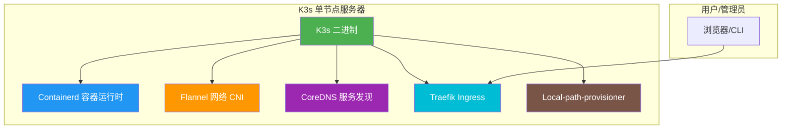
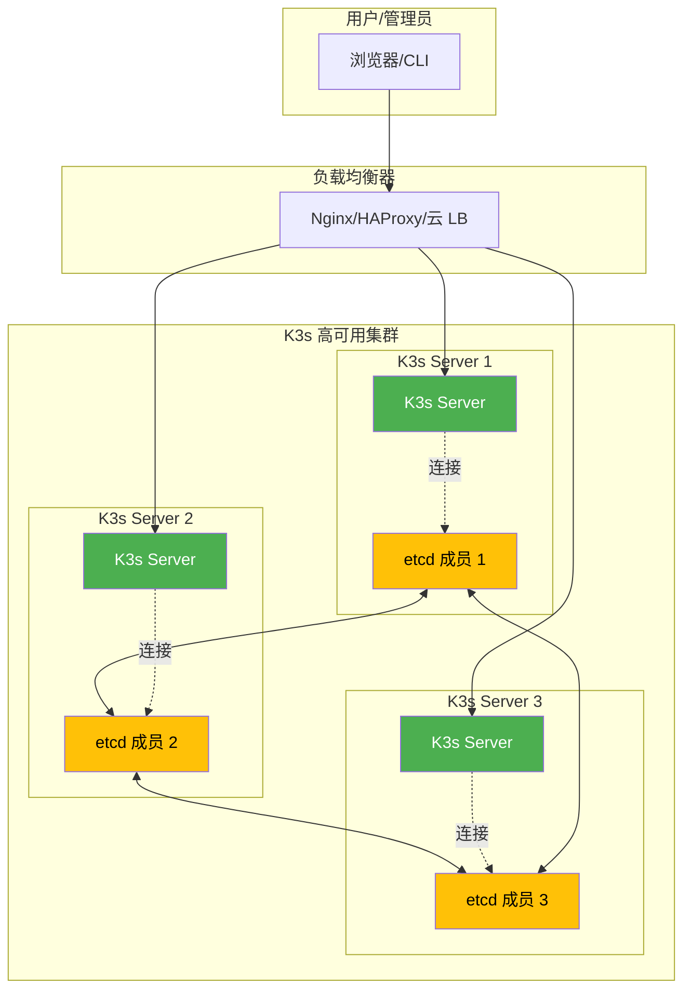
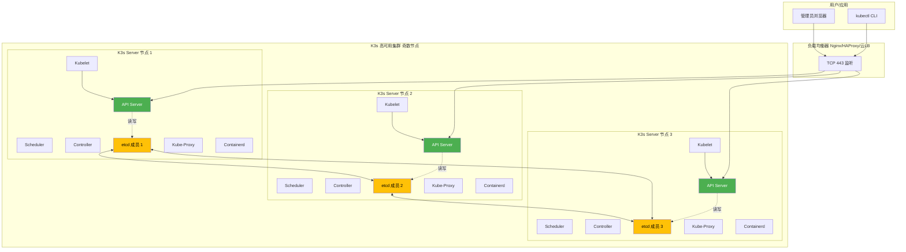

# K3s 生产级部署与运维技术文档

---

## 📑 目录

1. [简介](#1-简介)
2. [版本选择指南](#2-版本选择指南)
3. [生产环境规划（高可用架构）](#3-生产环境规划高可用架构)
4. [生产环境部署](#4-生产环境部署)
5. [关键参数配置说明](#5-关键参数配置说明)
6. [开发/测试环境快速部署（Docker Compose）](#6-开发测试环境快速部署docker-compose)
7. [日常运维操作](#7-日常运维操作)
8. [注意事项与生产检查清单](#8-注意事项与生产检查清单)
9. [参考资料](#9-参考资料)

---

## 1. 简介

### 1.1 服务介绍与核心特性

K3s 是 Rancher 发布的一个轻量级 Kubernetes 发行版，它经过完全符合 CNCF（云原生计算基金会）标准的认证，但打包为单个二进制文件，旨在降低资源占用并简化安装运维流程。K3s 适用于资源受限环境、边缘计算以及快速搭建开发和测试环境，同时也可用于稳定运行生产工作负载。

核心特性：
- **轻量高效**：单个二进制文件，资源需求极低（最低内存 512MB），适合边缘设备和小型集群。
- **内置组件集成**：集成了 Containerd、Flannel（CNI）、CoreDNS、Traefik（Ingress Controller）、HostAgent（本地存储提供程序）等，开箱即用。
- **安全合规**：虽然 K3s 强调轻量，但仍可经过配置通过 CIS Kubernetes Benchmark 认证，适合对安全有要求的场景。
- **多数据存储后端**：支持 SQLite（默认，单节点）、嵌入式 etcd（高可用集群）以及外部 MySQL/PostgreSQL（高可用集群），满足不同可用性需求。
- **ARM 支持**：完整支持 ARM64 和 ARMv7，适用于树莓派等边缘硬件。
- **自动证书管理**：自动轮换并管理服务器与 Agent 间的 TLS 证书。
- **离线安装**：支持离线（Air-gap）安装，便于内网环境部署。
- **多云与边缘友好**：易于在云厂商虚拟机、物理机及边缘设备上快速部署和管理。

### 1.2 适用场景

- **边缘计算/IoT**：在边缘设备、网关、工业网关等资源受限场景下运行容器化应用。
- **CI/CD 与测试环境**：快速搭建短期存在的 Kubernetes 集群，用于构建流水线或自动化测试。
- **小型生产集群**：面向中小规模应用或单一应用的生产集群，便于运维与监控。
- **Rancher 管理平面承载**：作为 Rancher Manager 的专用承载集群，仅运行 Rancher 自身及相关组件。
- **混合云管理**：在私有云、本地数据中心或边缘节点部署统一的控制平面。
- **教育与企业内训**：用于学习 Kubernetes 原理与操作，降低入门门槛。

### 1.3 架构原理图（Mermaid 图）

单节点 K3s 架构示意（仅用于理解组件关系）：



高可用 K3s 集群架构示意（嵌入式 etcd 或外部数据库）：



---

## 2. 版本选择指南

### 2.1 版本对应关系表

| K3s 版本 | 推荐 Kubernetes 版本范围 | 稳定性 | 主要特性说明 |
|----------|-------------------------|--------|--------------|
| K3s v1.28.x | Kubernetes 1.28 | 稳定 | 适用于生产环境的稳定版，与上游 1.28 特性同步。 |
| K3s v1.29.x | Kubernetes 1.29 | 稳定（较新） | 包含 Kubernetes 1.29 的最新特性，适合需要最新功能的场景。 |
| K3s v1.30.x（最新） | Kubernetes 1.30 | 预览/开发 | 功能更新但稳定性有待验证，建议先在非生产环境测试。 |

> ⚠️ **重要说明**：K3s 版本号与 Kubernetes 版本号保持一致。生产环境建议采用已验证的稳定版本（如 v1.28.x 或 v1.29.x 的最新补丁版本），并查阅 K3s 官方文档的版本发布说明以了解重大变更。

### 2.2 版本决策建议

在选择 K3s 版本时，应结合以下因素综合评估：

1. **应用兼容性**：确认您的业务应用支持在哪些 Kubernetes 版本上稳定运行，优先选择兼容性最好的 K3s 版本。
2. **环境限制**：在资源极度受限的边缘设备上，建议选择资源占用更优的版本（通常最新优化版本）。
3. **安全与补丁**：优先选择社区持续维护且及时发布安全补丁的版本。
4. **CIS 合规性**：需要满足安全合规要求的场景，应选择通过 CIS Benchmark 的版本，并在配置上启用加固选项。
5. **功能需求**：是否需要特定 Kubernetes 版本的新功能（如新资源类型、API 变更），确认目标版本是否已包含该功能。
6. **升级路径**：考虑未来的升级策略，避免跨度过大的版本跳跃，降低升级风险。

> ⚠️ **一般建议**：生产环境首选 K3s v1.28.x 或 v1.29.x 的最新补丁版本，在测试环境充分验证后再升级到 v1.30.x 等较新版本。

---

## 3. 生产环境规划（高可用架构）

### 3.1 集群架构图（Mermaid 图）

生产环境建议部署 3 个或以上的 K3s Server 节点，并配合外部负载均衡器（如 Nginx、HAProxy 或云厂商 ALB/SLB）实现高可用。数据存储可采用嵌入式 etcd 或外部数据库（MySQL/PostgreSQL）。



### 3.2 节点角色与配置要求

在高可用架构中，每个节点同时作为 K3s Server（控制平面）和 Agent（工作节点）运行，以最大化资源利用率并简化管理。

| 角色 | 最低配置（每节点） | 推荐配置（每节点） | 说明 |
|------|------------------|------------------|------|
| K3s Server + Agent 节点 | 2 核 CPU / 2 GB RAM / 20 GB 磁盘 | 4 核 CPU / 4 GB RAM / 50 GB 磁盘 | 建议使用 SSD 以获得更好的 etcd 和容器运行时性能。 |
| 外部负载均衡器 | 软件负载均衡（Nginx/HAProxy）或硬件负载均衡 | 任意 | 需配置健康检查，故障自动剔除节点。 |
| 外部数据库（可选） | 2 核 CPU / 4 GB RAM / 100 GB 磁盘 | 4 核 CPU / 8 GB RAM / 200 GB 磁盘 | 用于替代嵌入式 etcd，推荐使用 MySQL 或 PostgreSQL 高可用集群。 |

> ⚠️ **说明**：
> - 磁盘建议 SSD，数据目录 `/var/lib/rancher/k3s` 尤其需要高性能 I/O。
> - 如果只运行轻量级应用，可适当降低内存；运行 Rancher 等重量级平台时，建议不低于 4 GB。
> - 对于 ARM 平台（如树莓派），确保主板供电充足、存储为高速 SD 卡或外接 SSD。

### 3.3 网络与端口规划

| 端口 | 协议 | 来源 | 目的 | 说明 |
|------|------|------|------|------|
| 6443 | TCP | 负载均衡器 / 其他 K3s Server 节点 | K3s Server 节点 | Kubernetes API Server 端口。 |
| 10250 | TCP | K3s Server 节点 | K3s Server 节点 | Kubelet API，用于集群内部通信。 |
| 2379 | TCP | K3s Server 节点 | K3s Server 节点 | etcd 客户端端口（嵌入式 etcd 或外部 etcd 集群）。 |
| 2380 | TCP | K3s Server 节点 | K3s Server 节点 | etcd 对等通信端口（嵌入式 etcd 或外部 etcd 集群）。 |
| 8472 | UDP | K3s Server 节点 | K3s Server 节点 | Flannel VXLAN 网络端口（默认启用 Flannel）。 |
| 53 | UDP/TCP | 集群内部 | CoreDNS Pod | CoreDNS 服务发现端口。 |
| 80/443 | TCP | 用户 / 负载均衡器 | Ingress Controller（Traefik） | HTTP/HTTPS 应用入口。 |

> ★ **重要**：请确保防火墙或安全组正确开放上述端口。etcd 相关端口（2379、2380）建议仅允许 K3s Server 节点之间访问。如有外部数据库，还需开放对应端口（MySQL 3306、PostgreSQL 5432）。

---

## 4. 生产环境部署

本章节将以嵌入式 etcd 为例，指导在 Rocky Linux 9 和 Ubuntu 22.04 上部署 3 节点高可用 K3s 集群。如需使用外部数据库，请在安装参数中替换为 `--datastore-endpoint`。

### 4.1 前置准备（所有节点）

在每个 K3s 节点上执行以下操作。

1. **更新系统并安装必要工具**

```bash
# ── Rocky Linux 9 ──────────────────────────
dnf update -y
dnf install -y curl wget vim git net-tools iputils-ping

# ── Ubuntu 22.04 ───────────────────────────
apt-get update -y
apt-get install -y curl wget vim git net-tools iputils-ping
```

2. **禁用 SELinux（Rocky Linux）**

```bash
# ── Rocky Linux 9 ──────────────────────────
setenforce 0
sed -i 's/^SELINUX=enforcing$/SELINUX=disabled/' /etc/selinux/config

# ── Ubuntu 22.04 ───────────────────────────
# Ubuntu 默认不启用 SELinux，无需操作。
```

3. **禁用 Swap**

```bash
# ── Rocky Linux 9 ──────────────────────────
swapoff -a
sed -i '/ swap / s/^\(.*\)$/#\1/g' /etc/fstab

# ── Ubuntu 22.04 ───────────────────────────
swapoff -a
sed -i '/ swap / s/^\(.*\)$/#\1/g' /etc/fstab
```

4. **配置内核参数**

```bash
cat >> /etc/sysctl.d/99-k3s.conf << 'EOF'
net.bridge.bridge-nf-call-iptables  = 1
net.bridge.bridge-nf-call-ip6tables = 1
net.ipv4.ip_forward                 = 1
EOF
sysctl --system
```

5. **配置防火墙**

*Rocky Linux 9 (firewalld)：*

```bash
# ── Rocky Linux 9 ──────────────────────────
systemctl enable --now firewalld
firewall-cmd --permanent --add-port=6443/tcp  # API Server
firewall-cmd --permanent --add-port=10250/tcp # Kubelet
firewall-cmd --permanent --add-port=2379-2380/tcp # etcd
firewall-cmd --permanent --add-port=8472/udp # Flannel VXLAN
firewall-cmd --reload
```

*Ubuntu 22.04 (ufw)：*

```bash
# ── Ubuntu 22.04 ───────────────────────────
ufw enable
ufw allow 6443/tcp
ufw allow 10250/tcp
ufw allow 2379:2380/tcp
ufw allow 8472/udp
ufw status
```

### 4.2 [Rocky Linux 9 部署步骤]

#### 4.2.1 在第一个节点（Server 1）初始化 K3s 集群

```bash
# 安装 K3s 并使用嵌入式 etcd 初始化集群
export INSTALL_K3S_EXEC="server"
export K3S_TOKEN="YOUR_CLUSTER_SECRET"  # ★ ⚠️ 设置集群共享密钥，所有节点必须相同
curl -sfL https://get.k3s.io | K3S_TOKEN="${K3S_TOKEN}" sh -s - server \
  --cluster-init \
  --tls-san <节点1_IP> \   # ⚠️ 替换为节点 1 IP
  --tls-san <节点2_IP> \   # ⚠️ 替换为节点 2 IP
  --tls-san <节点3_IP> \   # ⚠️ 替换为节点 3 IP
  --tls-san <负载均衡IP或域名> # ⚠️ 替换为负载均衡器 VIP 或域名
  --node-ip <节点1_IP>     # ⚠️ 设置节点 IP
  --bind-address <节点1_IP> # ⚠️ 设置绑定地址
```

等待安装完成后，检查节点状态：

```bash
export KUBECONFIG=/etc/rancher/k3s/k3s.yaml
kubectl get nodes
```

预期输出（显示节点 Ready）：

```
NAME         STATUS   ROLES                       AGE   VERSION
<节点1_IP>   Ready    control-plane,etcd,master   1m    v1.28.x+k3s1
```

#### 4.2.2 加入第二个、第三个节点（Server 2、Server 3）

在节点 2 上执行：

```bash
export INSTALL_K3S_EXEC="server"
export K3S_TOKEN="YOUR_CLUSTER_SECRET"  # 与节点 1 相同
curl -sfL https://get.k3s.io | K3S_TOKEN="${K3S_TOKEN}" sh -s - server \
  --server https://<节点1_IP>:6443 \  # ⚠️ 替换为节点 1 IP
  --tls-san <节点1_IP> \
  --tls-san <节点2_IP> \
  --tls-san <节点3_IP> \
  --tls-san <负载均衡IP或域名> \
  --node-ip <节点2_IP> \
  --bind-address <节点2_IP>
```

在节点 3 上执行：

```bash
export INSTALL_K3S_EXEC="server"
export K3S_TOKEN="YOUR_CLUSTER_SECRET"
curl -sfL https://get.k3s.io | K3S_TOKEN="${K3S_TOKEN}" sh -s - server \
  --server https://<节点1_IP>:6443 \
  --tls-san <节点1_IP> \
  --tls-san <节点2_IP> \
  --tls-san <节点3_IP> \
  --tls-san <负载均衡IP或域名> \
  --node-ip <节点3_IP> \
  --bind-address <节点3_IP>
```

安装后，在任一节点执行 `kubectl get nodes`，应看到三个节点均为 Ready。

### 4.3 [Ubuntu 22.04 部署步骤]

#### 4.3.1 在第一个节点（Server 1）初始化 K3s 集群

```bash
# 安装 K3s 并初始化
export INSTALL_K3S_EXEC="server"
export K3S_TOKEN="YOUR_CLUSTER_SECRET"  # ★ ⚠️ 集群共享密钥，与所有节点保持一致
curl -sfL https://get.k3s.io | K3S_TOKEN="${K3S_TOKEN}" sh -s - server \
  --cluster-init \
  --tls-san <节点1_IP> \
  --tls-san <节点2_IP> \
  --tls-san <节点3_IP> \
  --tls-san <负载均衡IP或域名> \
  --node-ip <节点1_IP> \
  --bind-address <节点1_IP>
```

等待安装完成后，检查节点状态：

```bash
export KUBECONFIG=/etc/rancher/k3s/k3s.yaml
kubectl get nodes
```

预期输出（节点 Ready）：

```
NAME         STATUS   ROLES                       AGE   VERSION
<节点1_IP>   Ready    control-plane,etcd,master   1m    v1.28.x+k3s1
```

#### 4.3.2 加入第二个、第三个节点（Server 2、Server 3）

在节点 2 上执行：

```bash
export INSTALL_K3S_EXEC="server"
export K3S_TOKEN="YOUR_CLUSTER_SECRET"  # 与节点 1 相同
curl -sfL https://get.k3s.io | K3S_TOKEN="${K3S_TOKEN}" sh -s - server \
  --server https://<节点1_IP>:6443 \
  --tls-san <节点1_IP> \
  --tls-san <节点2_IP> \
  --tls-san <节点3_IP> \
  --tls-san <负载均衡IP或域名> \
  --node-ip <节点2_IP> \
  --bind-address <节点2_IP>
```

在节点 3 上执行：

```bash
export INSTALL_K3S_EXEC="server"
export K3S_TOKEN="YOUR_CLUSTER_SECRET"
curl -sfL https://get.k3s.io | K3S_TOKEN="${K3S_TOKEN}" sh -s - server \
  --server https://<节点1_IP>:6443 \
  --tls-san <节点1_IP> \
  --tls-san <节点2_IP> \
  --tls-san <节点3_IP> \
  --tls-san <负载均衡IP或域名> \
  --node-ip <节点3_IP> \
  --bind-address <节点3_IP>
```

安装完成后，在任一节点执行 `kubectl get nodes`，应看到三个节点均为 Ready。

### 4.4 集群初始化与配置

#### 4.4.1 配置负载均衡器

示例 Nginx 配置（TCP 443 转发到三个节点）：

```bash
cat >> /etc/nginx/nginx.conf << 'EOF'
stream {
    upstream k3s_servers {
        least_conn;
        server <节点1_IP>:6443;  # ⚠️ 替换为实际 IP
        server <节点2_IP>:6443;
        server <节点3_IP>:6443;
    }
    server {
        listen 443;
        proxy_pass k3s_servers;
        proxy_timeout 1s;
        proxy_connect_timeout 1s;
    }
}
EOF
systemctl restart nginx
```

> 📎 如需更详细的负载均衡配置，请参考：[Nginx 部署文档](../nginx/README.md) 或 [HAProxy 部署文档](../haproxy/README.md)。

#### 4.4.2 验证集群高可用

```bash
export KUBECONFIG=/etc/rancher/k3s/k3s.yaml

# 查看 etcd 成员
kubectl get endpoints -n kube-system k3s

# 查看 Pod 运行情况
kubectl get pods -A

# 测试 API 可访问性
kubectl get nodes
```

预期输出示例（etcd endpoints 为 3 个，各组件 Pod 正常）。

### 4.5 安装验证（含预期输出）

1. **节点状态**

```bash
export KUBECONFIG=/etc/rancher/k3s/k3s.yaml
kubectl get nodes -o wide
```

预期输出：

```
NAME         STATUS   ROLES                       AGE   VERSION   INTERNAL-IP    EXTERNAL-IP   OS-IMAGE
<节点1_IP>   Ready    control-plane,etcd,master   2m    v1.28.x   <节点1_IP>    <none>        Rocky Linux 9.4
<节点2_IP>   Ready    control-plane,etcd,master   1m    v1.28.x   <节点2_IP>    <none>        Rocky Linux 9.4
<节点3_IP>   Ready    control-plane,etcd,master   30s   v1.28.x   <节点3_IP>    <none>        Rocky Linux 9.4
```

2. **系统 Pod 状态**

```bash
kubectl get pods -A
```

预期输出（CoreDNS、Traefik、svclb-traefik 等 Pod 处于 Running 状态）。

---

## 5. 关键参数配置说明

### 5.1 核心配置文件详解（含逐行注释）

K3s 支持通过命令行参数、环境变量或配置文件（`/etc/rancher/k3s/config.yaml`）进行配置。

#### 5.1.1 配置文件示例（高可用 Server 节点）

```bash
cat >> /etc/rancher/k3s/config.yaml << 'EOF'
# 设置节点角色，server 表示同时作为控制平面和工作节点
# ⚠️ 如果仅需控制平面，可添加 --disable-agent，但工作负载将无法调度到此节点
server: true

# 集群共享密钥，所有 Server 节点必须相同
token: "YOUR_CLUSTER_SECRET"  # ★ ⚠️ 请务必使用强密码

# TLS 证书 SAN 列表，确保包含所有可能访问 API 的 IP 或域名
tls-san:
  - "<节点1_IP>"    # ⚠️ 替换为实际 IP
  - "<节点2_IP>"    # ⚠️ 替换为实际 IP
  - "<节点3_IP>"    # ⚠️ 替换为实际 IP
  - "<负载均衡IP>"  # ⚠️ 替换为负载均衡器 VIP 或域名

# 节点 IP 与绑定地址
node-ip: "<本节点_IP>"         # ⚠️ 替换为本节点 IP
bind-address: "<本节点_IP>"    # ⚠️ 替换为本节点 IP

# 数据存储后端：嵌入式 etcd
# 如使用外部数据库，替换为：datastore-endpoint: "mysql://用户:密码@tcp(主机:3306)/k3s"
cluster-init: true  # 仅在第一个 Server 节点使用，其他节点不应启用此参数

# 可选：禁用特定组件以节省资源
# disable: [traefik]  # 如不需要 Traefik Ingress，可禁用

# 可选：启用审计日志
# audit-log-file: /var/lib/rancher/k3s/server/logs/audit.log
# audit-log-maxage: 30
# audit-log-maxbackup: 10

# 可选：配置镜像仓库
# system-default-registry: "your-registry.example.com"

# 可选：配置代理
# http-proxy: "http://proxy.example.com:8080"
# https-proxy: "http://proxy.example.com:8080"
# no-proxy: "127.0.0.1,localhost,.cluster.local"
EOF
```

> ⚠️ **说明**：`cluster-init` 仅在第一个 Server 节点启用。其他加入的 Server 节点不需要此参数，但需指定 `--server https://第一个节点IP:6443`。

### 5.2 生产环境推荐调优参数

1. **etcd 性能**：确保数据目录 `/var/lib/rancher/k3s/server/db` 位于 SSD 磁盘。
2. **资源限制**：建议根据负载调整 `kubelet` 和 `containerd` 的资源限制（通过 systemd 环境变量）。
3. **证书轮换**：默认 12 个月自动轮换，生产环境无需更改。
4. **API 限流**：如果并发 API 请求较大，可调整 `--kube-apiserver-arg` 中的 `max-mutating-requests-inflight` 和 `max-requests-inflight` 参数。
5. **日志轮转**：启用 `--kube-apiserver-arg=--log-flush-frequency=5s` 和配置 `journald` 日志轮转策略。
6. **镜像仓库**：建议配置私有镜像仓库以提高拉取速度和安全性。

---

## 6. 开发/测试环境快速部署（Docker Compose）

> ⚠️ **警告**：本章节方案仅适用于开发或测试环境，不适用于生产环境。

### 6.1 Docker Compose 部署（单机伪集群）

#### 6.1.1 准备 docker-compose.yml

```bash
cat >> docker-compose.yml << 'EOF'
version: '3.3'

services:
  k3s-server-1:
    image: rancher/k3s:v1.28.3-k3s1  # ⚠️ 替换为目标版本
    privileged: true
    ports:
      - "6443:6443"
    volumes:
      - k3s-server-1-data:/var/lib/rancher/k3s
    environment:
      - K3S_TOKEN=YOUR_CLUSTER_SECRET   # ★ ⚠️ 设置强密码
      - K3S_CLUSTER_INIT=true
      - K3S_TLS_SAN= localhost,127.0.0.1,<本机_IP>  # ⚠️ 替换为实际 IP
    command: server

  k3s-server-2:
    image: rancher/k3s:v1.28.3-k3s1
    privileged: true
    ports:
      - "6444:6443"
    volumes:
      - k3s-server-2-data:/var/lib/rancher/k3s
    environment:
      - K3S_TOKEN=YOUR_CLUSTER_SECRET
      - K3S_SERVER=https://k3s-server-1:6443
      - K3S_TLS_SAN= localhost,127.0.0.1,<本机_IP>
    command: server

  k3s-server-3:
    image: rancher/k3s:v1.28.3-k3s1
    privileged: true
    ports:
      - "6445:6443"
    volumes:
      - k3s-server-3-data:/var/lib/rancher/k3s
    environment:
      - K3S_TOKEN=YOUR_CLUSTER_SECRET
      - K3S_SERVER=https://k3s-server-1:6443
      - K3S_TLS_SAN= localhost,127.0.0.1,<本机_IP>
    command: server

volumes:
  k3s-server-1-data:
  k3s-server-2-data:
  k3s-server-3-data:
EOF
```

### 6.2 启动与验证

1. **启动容器**

```bash
docker compose up -d
```

2. **等待集群初始化并检查状态**

```bash
# 在第一个容器内查看节点
docker exec -it $(docker compose ps -q k3s-server-1) kubectl get nodes
```

预期输出（显示三个节点 Ready）。

3. **清理**

```bash
docker compose down -v
```

---

## 7. 日常运维操作

### 7.1 常用管理命令

1. **查看节点**

```bash
export KUBECONFIG=/etc/rancher/k3s/k3s.yaml
kubectl get nodes -o wide
```

2. **查看 Pod**

```bash
kubectl get pods -A
kubectl get pods -n <namespace>
```

3. **查看日志**

```bash
# K3s 服务日志
journalctl -u k3s -f

# 特定 Pod 日志
kubectl logs -n <namespace> <pod-name> -f
```

4. **进入容器**

```bash
kubectl exec -it <pod-name> -n <namespace> -- /bin/sh
```

5. **查看集群信息**

```bash
kubectl cluster-info
kubectl config view
```

### 7.2 备份与恢复

#### 7.2.1 备份 etcd 数据（嵌入式 etcd）

在任意 Server 节点上执行：

```bash
k3s etcd-snapshot save --name snapshot-$(date +%Y%m%d-%H%M%S) --snapshot-dir /opt/k3s-backups
```

备份文件将生成于 `/opt/k3s-backups`，请定期异地存储。

#### 7.2.2 恢复 etcd 数据

> ⚠️ **注意**：恢复操作会重置集群，请谨慎操作。

1. 停止所有 K3s Server 服务

```bash
systemctl stop k3s
```

2. 在第一个节点执行恢复

```bash
k3s server \
  --cluster-reset \
  --cluster-reset-restore-path=/opt/k3s-backups/snapshot-YYYYMMDD-HHMMSS.zip
```

3. 启动第一个节点

```bash
systemctl start k3s
```

4. 启动其他节点

```bash
systemctl start k3s
```

### 7.3 集群扩缩容

#### 扩容（添加新 Server 节点）

1. 在新节点完成前置准备（参考 4.1）。
2. 执行加入命令：

```bash
export INSTALL_K3S_EXEC="server"
export K3S_TOKEN="YOUR_CLUSTER_SECRET"
curl -sfL https://get.k3s.io | K3S_TOKEN="${K3S_TOKEN}" sh -s - server \
  --server https://<任一现有Server_IP>:6443 \
  --tls-san <新节点_IP> \
  --node-ip <新节点_IP> \
  --bind-address <新节点_IP>
```

#### 缩容（移除 Server 节点）

1. 在目标节点停止 K3s

```bash
systemctl stop k3s
systemctl disable k3s
```

2. 在其他 Server 节点上删除该节点

```bash
kubectl delete node <被删除节点名称或IP>
```

3. 清理节点（可选）

```bash
k3s-uninstall.sh
```

> ⚠️ **注意**：移除 Server 节点时需确保剩余 Server 节点数量仍满足 etcd 法定人数（通常为奇数个节点）。

### 7.4 版本升级

1. 在所有 Server 节点上下载新版本二进制

```bash
export INSTALL_K3S_VERSION="v1.29.3+k3s1"  # ⚠️ 替换为目标版本
curl -sfL https://get.k3s.io | INSTALL_K3S_VERSION="${INSTALL_K3S_VERSION}" sh -
```

2. 逐个重启 K3s 服务

```bash
systemctl restart k3s
```

等待节点 Ready 后再操作下一个节点。

3. 验证升级

```bash
kubectl get nodes
```

确认版本已更新。

---

## 8. 注意事项与生产检查清单

### 8.1 安装前环境核查

- [ ] 操作系统版本为 Rocky Linux 9 或 Ubuntu 22.04
- [ ] 所有节点 Swap 已禁用
- [ ] 所有节点已配置正确的内核参数
- [ ] 防火墙/安全组已开放所需端口
- [ ] 节点硬件资源满足最低配置
- [ ] 磁盘（尤其是数据目录）使用 SSD，且空间充足
- [ ] 集群 Token（共享密钥）已设置并安全保管
- [ ] 负载均衡器已配置并指向所有 Server 节点
- [ ] 网络互通性已验证（节点间、节点至外部服务）

### 8.2 常见故障排查（含报错日志示例）

#### 问题1：节点无法加入集群

**可能日志**：`x509: certificate is valid for 127.0.0.1, not <节点IP>`

**原因**：`tls-san` 未包含该节点 IP。

**解决**：在所有 Server 节点的 `config.yaml` 或启动参数中添加该 IP 到 `tls-san` 列表，重启 K3s 服务。

#### 问题2：etcd 无法启动

**可能日志**：`etcd cluster not healthy`

**排查**：
- 检查数据目录权限
- 确认 2379、2380 端口未被占用
- 查看 journalctl -u k3s 日志

#### 问题3：Pod 无法启动（CrashLoopBackOff）

**排查**：
- `kubectl describe pod <pod-name>` 查看事件
- `kubectl logs <pod-name>` 查看日志
- 确认镜像拉取是否成功
- 检查资源配额

### 8.3 安全加固建议

1. **启用 RBAC**：严格使用 `ServiceAccount` 和 RBAC 规则限制权限。
2. **使用私有镜像仓库**：避免使用公共仓库，确保镜像来源可信。
3. **定期更新**：及时跟进 K3s 版本更新，修补安全漏洞。
4. **网络隔离**：使用 NetworkPolicy 或防火墙限制 Pod 间通信。
5. **审计日志**：启用 Kubernetes 审计日志，并定期审计。
6. **证书管理**：定期检查证书有效期，监控自动轮换是否正常。
7. **最小权限原则**：K3s 节点仅开放必要的端口，并限制来源地址。

---

## 9. 参考资料

- K3s 官方文档（中文）：https://docs.rancher.cn/docs/k3s/
- K3s 官方文档（英文）：https://docs.k3s.io/
- Rancher 支持矩阵：https://www.suse.com/suse-rancher/support-matrix/all-supported-versions/rancher-v2-13-3/
- K3s GitHub 仓库：https://github.com/k3s-io/k3s
- K3s 版本发布说明：https://github.com/k3s-io/k3s/releases

---

**文档版本**：v1.0
**更新日期**：2025-03-09
**适用人群**：需要在生产或测试环境中部署、运维 K3s 集群的 SRE 与运维团队
