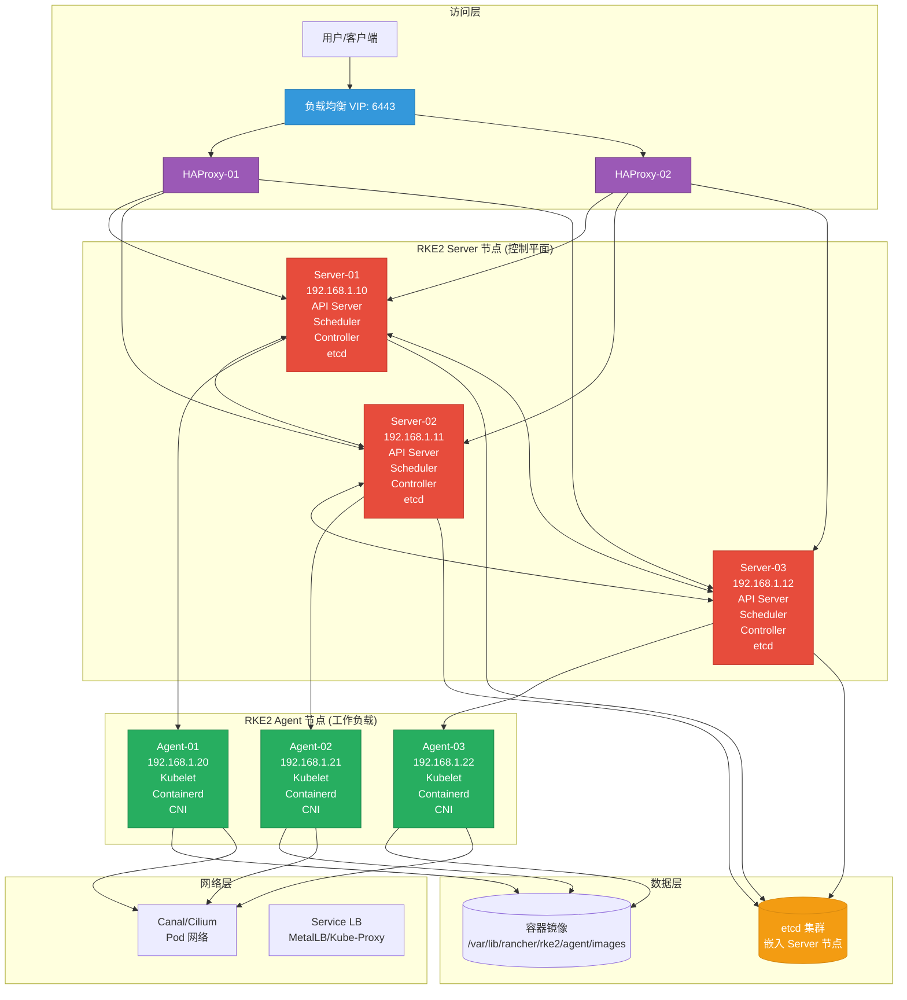
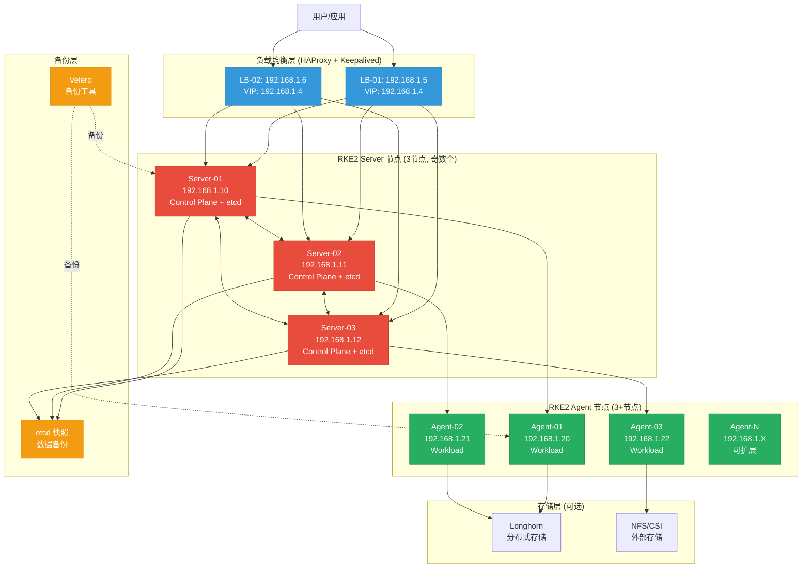

[TOC]

---

# RKE2生产级部署与运维指南

## 1. 简介

### 1.1 服务介绍与核心特性

**RKE2** (Rancher Kubernetes Engine 2) 是 Rancher 推出的企业级 Kubernetes 发行版，专为生产环境设计。它是经过 CNCF 认证的 Kubernetes 发行版，完全符合 CIS Kubernetes 规范，提供企业级的安全性和稳定性。

#### 核心特性

- **CIS 规范合规**：默认配置符合 CIS Kubernetes Benchmark，通过简单的开关即可启用 CIS 模式
- **简化安装**：单一二进制文件，最小化依赖，快速部署
- **自动化证书管理**：自动生成和轮换所有 TLS 证书
- **内置容器运行时**：集成 containerd，无需额外安装
- **多种 CNI 支持**：支持 Canal、Cilium、Calico 等主流网络插件
- **离线安装支持**：提供 Air-gap 安装模式，适合隔离环境
- **与 Rancher 无缝集成**：可作为 Rancher 的下游集群
- **高可用架构**：内置 etcd，支持多控制平面节点
- **安全加固**：默认启用 RBAC、NetworkPolicy 等安全特性
- **自动更新**：支持自动升级和回滚机制

### 1.2 适用场景

| 场景 | 说明 |
|------|------|
| **企业容器平台** | 中大型企业的生产级 Kubernetes 平台 |
| **边缘计算** | 资源受限的边缘场景（RKE2 Lite 模式） |
| **混合云部署** | 跨云厂商或本地数据中心的统一管理 |
| **高合规要求** | 需要满足安全合规标准的行业（金融、政务） |
| **离线环境** | 无法访问公网的隔离网络环境 |
| **Rancher 集群** | 作为 Rancher 的下游或本地集群 |

### 1.3 架构原理图



**架构说明：**

- **访问层**：通过 VIP 提供统一入口，HAProxy 提供负载均衡
- **RKE2 Server 节点**：运行 Kubernetes 控制平面组件 + 嵌入式 etcd
- **RKE2 Agent 节点**：运行 Kubelet、Containerd 和 CNI 插件
- **数据层**：etcd 存储集群状态，本地缓存容器镜像
- **网络层**：CNI 提供 Pod 网络通信，Service 提供服务发现

---

## 2. 版本选择指南

### 2.1 版本对应关系表

| RKE2 版本 | Kubernetes 版本 | 发布日期 | 状态 | 支持期限 | 推荐场景 |
|-----------|-----------------|----------|------|----------|----------|
| **1.29.x** | Kubernetes 1.29.x | 2024-Q4 | 稳定版 | 14个月 | 生产环境（推荐） |
| **1.28.x** | Kubernetes 1.28.x | 2024-Q2 | 稳定版 | 14个月 | 生产环境 |
| **1.27.x** | Kubernetes 1.27.x | 2024-Q1 | 维护模式 | 12个月 | 现有集群 |
| **1.26.x** | Kubernetes 1.26.x | 2023-Q4 | 即将 EOL | 已结束 | 建议升级 |

> 💡 **提示**：RKE2 版本号与 Kubernetes 版本号保持一致，如 RKE2 1.29.5 = Kubernetes 1.29.5

### 2.2 版本决策建议

**选择 RKE2 1.29.x 系列的情况：**
- 新建生产环境部署
- 需要最新的 Kubernetes 特性（如 CEL、动态规模分配等）
- 对安全性有较高要求
- 计划长期维护的集群

**选择 RKE2 1.28.x 系列的情况：**
- 需要更成熟的稳定性
- 依赖特定版本的生态工具链
- 团队对该版本有丰富的运维经验

**版本升级注意事项：**
- 小版本升级（如 1.29.0 → 1.29.5）：支持自动升级，风险较低
- 大版本升级（如 1.28.x → 1.29.x）：建议先在测试环境验证
- 升级前务必备份 etcd 数据和重要配置
- RKE2 支持 system-upgrade-controller 进行自动化滚动升级

---

## 3. 生产环境规划（高可用架构）

### 3.1 集群架构图



### 3.2 节点角色与配置要求

#### RKE2 Server 节点配置（3 节点）

| 配置项 | 最低配置 | 推荐配置 | 说明 |
|--------|----------|----------|------|
| **CPU** | 4 Core | 8 Core+ | etcd 和控制平面消耗 CPU |
| **内存** | 8 GB | 16 GB+ | etcd 需要充足内存 |
| **磁盘** | 100 GB SSD | 200 GB NVMe SSD | 系统盘 + etcd + 容器镜像 |
| **网络** | 1 Gbps | 10 Gbps | 节点间通信带宽 |
| **操作系统** | Rocky Linux 9 / Ubuntu 22.04 | Rocky Linux 9 / Ubuntu 22.04 | 保持版本一致 |
| **角色** | Server + etcd | Server + etcd | 控制平面节点 |

#### RKE2 Agent 节点配置（3+ 节点）

| 配置项 | 最低配置 | 推荐配置 | 说明 |
|--------|----------|----------|------|
| **CPU** | 4 Core | 16 Core+ | 根据业务负载调整 |
| **内存** | 16 GB | 64 GB+ | 根据应用需求调整 |
| **磁盘** | 200 GB SSD | 500 GB NVMe SSD | 容器镜像 + 数据卷 |
| **网络** | 1 Gbps | 10 Gbps | 业务流量带宽 |
| **操作系统** | Rocky Linux 9 / Ubuntu 22.04 | Rocky Linux 9 / Ubuntu 22.04 | 保持版本一致 |
| **角色** | Agent | Agent | 工作负载节点 |

#### 负载均衡节点配置（2 节点）

| 配置项 | 最低配置 | 推荐配置 | 说明 |
|--------|----------|----------|------|
| **CPU** | 2 Core | 4 Core | HAProxy/Keepalived |
| **内存** | 4 GB | 8 GB | 连接跟踪需要内存 |
| **磁盘** | 50 GB SSD | 100 GB SSD | 系统盘 |
| **网络** | 1 Gbps | 10 Gbps | API 流量转发 |
| **VIP** | 192.168.1.4（示例） | 根据规划设置 | 虚拟 IP 地址 |

### 3.3 网络与端口规划

#### RKE2 Server 节点网络端口

| 源地址 | 目标端口 | 协议 | 用途 |
|--------|----------|------|------|
| LB 节点 VIP | 6443 | TCP | Kubernetes API Server |
| Server 节点间 | 6443 | TCP | Kubernetes API Server |
| Server 节点间 | 9345 | TCP | RKE2 API Server |
| Agent 节点 | 6443 | TCP | Kubernetes API Server |
| Agent 节点 | 9345 | TCP | RKE2 API Server |
| Server 节点间 | 2379-2380 | TCP | etcd peer/client 通信 |
| 所有节点 | 10250 | TCP | Kubelet API |
| 监控节点 | 9796 | TCP | RKE2 Metrics |
| 监控节点 | 10259 | TCP | Scheduler 健康 |
| 监控节点 | 10257 | TCP | Controller Manager 健康 |
| CNI 插件 | 动态分配 | 协议依 CNI | Pod 网络通信 |

#### RKE2 Agent 节点网络端口

| 源地址 | 目标端口 | 协议 | 用途 |
|--------|----------|------|------|
| Server 节点 | 10250 | TCP | Kubelet API |
| Server 节点 | 9796 | TCP | RKE2 Metrics |
| 所有 Pod | 30000-32767 | TCP/UDP | NodePort 服务范围 |
| 外部访问 | 80/443 | TCP | Ingress HTTP/HTTPS |
| CNI 插件 | 动态分配 | 协议依 CNI | Pod 网络通信（Canal/Cilium） |

#### 负载均衡节点网络端口

| 源地址 | 目标端口 | 协议 | 用途 |
|--------|----------|------|------|
| 用户/客户端 | 6443 | TCP | Kubernetes API 访问 |
| Server 节点 | 6443 | TCP | 后端健康检查 |
| VRRP 组播 | - | VRRP | Keepalived 心跳（默认 224.0.0.18） |

#### 防火墙配置清单

```bash
# ── Rocky Linux 9 (firewalld) ──────────────────────────
# Server 节点
firewall-cmd --permanent --add-port=6443/tcp   # Kubernetes API
firewall-cmd --permanent --add-port=9345/tcp   # RKE2 API
firewall-cmd --permanent --add-port=2379-2380/tcp  # etcd
firewall-cmd --permanent --add-port=10250/tcp  # Kubelet
firewall-cmd --permanent --add-port=9796/tcp   # RKE2 Metrics
firewall-cmd --permanent --add-port=10259/tcp  # Scheduler
firewall-cmd --permanent --add-port=10257/tcp  # Controller Manager
firewall-cmd --reload

# Agent 节点
firewall-cmd --permanent --add-port=10250/tcp  # Kubelet
firewall-cmd --permanent --add-port=9796/tcp   # RKE2 Metrics
firewall-cmd --permanent --add-port=30000-32767/tcp  # NodePort
firewall-cmd --permanent --add-port=30000-32767/udp
firewall-cmd --reload

# ── Ubuntu 22.04 (ufw) ───────────────────────────
# Server 节点
ufw allow 6443/tcp   # Kubernetes API
ufw allow 9345/tcp   # RKE2 API
ufw allow 2379:2380/tcp  # etcd
ufw allow 10250/tcp  # Kubelet
ufw allow 9796/tcp   # RKE2 Metrics
ufw allow 10259/tcp  # Scheduler
ufw allow 10257/tcp  # Controller Manager

# Agent 节点
ufw allow 10250/tcp  # Kubelet
ufw allow 9796/tcp   # RKE2 Metrics
ufw allow 30000:32767/tcp  # NodePort
ufw allow 30000:32767/udp
```

---

## 4. 生产环境部署

### 4.1 前置准备（所有节点）

#### 4.1.1 系统初始化

```bash
# ── Rocky Linux 9 ──────────────────────────
# 配置主机名
hostnamectl set-hostname rke2-server-01  # ← 根据实际节点修改

# 配置 hosts 文件（所有节点一致）
cat >> /etc/hosts << 'EOF'
192.168.1.5  rke2-lb-01
192.168.1.6  rke2-lb-02
192.168.1.10 rke2-server-01
192.168.1.11 rke2-server-02
192.168.1.12 rke2-server-03
192.168.1.20 rke2-agent-01
192.168.1.21 rke2-agent-02
192.168.1.22 rke2-agent-03
192.168.1.4  rke2-api
EOF

# 更新系统
dnf update -y

# ── Ubuntu 22.04 ───────────────────────────
# 配置主机名
hostnamectl set-hostname rke2-server-01

# 配置 hosts 文件
cat >> /etc/hosts << 'EOF'
192.168.1.5  rke2-lb-01
192.168.1.6  rke2-lb-02
192.168.1.10 rke2-server-01
192.168.1.11 rke2-server-02
192.168.1.12 rke2-server-03
192.168.1.20 rke2-agent-01
192.168.1.21 rke2-agent-02
192.168.1.22 rke2-agent-03
192.168.1.4  rke2-api
EOF

# 更新系统
apt-get update && apt-get upgrade -y
```

#### 4.1.2 关闭 Swap 分区

```bash
# ── Rocky Linux 9 & Ubuntu 22.04 ──────────────────────────
# 临时关闭
swapoff -a

# 永久关闭
sed -ri 's/^(.*swap.*)$/#\1/g' /etc/fstab

# 验证
free -h
```

#### 4.1.3 配置内核参数

```bash
# ── Rocky Linux 9 & Ubuntu 22.04 ──────────────────────────
cat >> /etc/sysctl.d/99-rke2.conf << 'EOF'
# 网络配置
net.bridge.bridge-nf-call-ip6tables = 1
net.bridge.bridge-nf-call-iptables = 1
net.ipv4.ip_forward = 1
net.ipv4.conf.all.forwarding = 1

# 连接跟踪
net.netfilter.nf_conntrack_max = 1000000
net.netfilter.nf_conntrack_tcp_timeout_established = 86400

# 文件描述符
fs.file-max = 2097152
fs.inotify.max_user_watches = 524288
fs.inotify.max_user_instances = 8192

# 内存配置
vm.overcommit_memory = 1
vm.panic_on_oom = 0
vm.swappiness = 0

# IP 分片
net.ipv4.tcp_max_syn_backlog = 8192
net.ipv4.tcp_max_tw_buckets = 5000
net.ipv4.tcp_fastopen = 3
net.ipv4.tcp_retries2 = 15

# 密钥网络（用于安全启动）
net.ipv4.conf.all.rp_filter = 0
net.ipv4.conf.default.rp_filter = 0
EOF

# ── Rocky Linux 9 ──────────────────────────
# 加载内核模块
cat >> /etc/modules-load.d/rke2.conf << 'EOF'
br_netfilter
overlay
ip_vs
ip_vs_rr
ip_vs_wrr
ip_vs_sh
nf_conntrack
xt_conntrack
EOF

modprobe br_netfilter
modprobe overlay
modprobe ip_vs
modprobe ip_vs_rr
modprobe ip_vs_wrr
modprobe ip_vs_sh
modprobe nf_conntrack
modprobe xt_conntrack

# 应用内核参数
sysctl --system

# ── Ubuntu 22.04 ───────────────────────────
# 加载内核模块
cat >> /etc/modules-load.d/rke2.conf << 'EOF'
br_netfilter
overlay
ip_vs
ip_vs_rr
ip_vs_wrr
ip_vs_sh
nf_conntrack
xt_conntrack
EOF

modprobe br_netfilter
modprobe overlay
modprobe ip_vs
modprobe ip_vs_rr
modprobe ip_vs_wrr
modprobe ip_vs_sh
modprobe nf_conntrack
modprobe xt_conntrack

# 应用内核参数
sysctl --system
```

#### 4.1.4 配置时间同步

```bash
# ── Rocky Linux 9 ──────────────────────────
# 安装 chrony
dnf install -y chrony

# 启动并启用 chronyd
systemctl enable --now chronyd

# 验证时间同步
chronyc sources -v

# ── Ubuntu 22.04 ───────────────────────────
# 安装 chrony
apt-get install -y chrony

# 启动并启用 chronyd
systemctl enable --now chronyd

# 验证时间同步
chronyc sources -v
```

#### 4.1.5 配置 SELinux（仅 Rocky Linux）

```bash
# ── Rocky Linux 9 ──────────────────────────
# 设置 SELinux 为 Permissive 模式（RKE2 推荐）
setenforce 0
sed -i 's/^SELINUX=enforcing$/SELINUX=permissive/' /etc/selinux/config

# 验证
getenforce

# ── Ubuntu 22.04 ───────────────────────────
# Ubuntu 不使用 SELinux，无需配置
# AppArmor 通常默认启用且兼容 RKE2
```

### 4.2 Rocky Linux 9 部署步骤

#### 4.2.1 下载并安装 RKE2

```bash
# ── Rocky Linux 9 ──────────────────────────
# 创建 RKE2 配置目录
mkdir -p /etc/rancher/rke2

# 下载 RKE2 安装脚本
curl -sfL https://get.rke2.io | sh -

# 验证安装
rke2 --version
```

#### 4.2.2 配置 RKE2 Server 节点

```bash
# ── Rocky Linux 9 ──────────────────────────
# 创建 Server 配置文件（第一个 Server 节点）
cat >> /etc/rancher/rke2/config.yaml << 'EOF'
# ★ 节点角色
# server: https://192.168.1.4:9345  # ← VIP 地址，其他 Server 节点使用

# ★ 集群 Token（⚠️ 所有节点必须一致）
token: my-cluster-secret-token-001  # ← ⚠️ 修改为安全的随机 token

# ★ 节点名称（⚠️ 每个节点唯一）
node-name: rke2-server-01  # ← 根据实际节点修改

# ★ 集群 CIDR（⚠️ 避免与现有网络冲突）
cluster-cidr: 10.42.0.0/16
service-cidr: 10.43.0.0/16

# ★ CNI 插件选择（canal, cilium, calico）
cni: canal

# 禁用 Server 节点运行工作负载（可选）
disable-scheduler: false
controller-manager-arg: "node-monitor-grace-period=40s"
scheduler-arg: "node-monitor-grace-period=40s"

# ★ etcd 配置
etcd-expose-metrics: true
etcd-snapshot-schedule-cron: "0 */6 * * *"  # 每 6 小时快照
etcd-snapshot-retention: 28  # 保留 28 个快照
etcd-snapshot-dir: /var/lib/rancher/rke2/server/db/snapshots

# ★ API Server 配置
tls-san:
  - 192.168.1.4  # ← VIP
  - 192.168.1.10  # ← Server-01 IP
  - 192.168.1.11  # ← Server-02 IP
  - 192.168.1.12  # ← Server-03 IP
  - rke2-api.example.com  # ← ⚠️ 根据实际域名修改

# 启用 CIS 模式（可选，高安全要求环境）
profile: cis-1.23  # ← 根据版本选择合适的 CIS profile

# 数据目录
data-dir: /var/lib/rancher/rke2

# 日志级别
write-kubeconfig-mode: 0644
debug: false
EOF

# 启用并启动 RKE2 Server
systemctl enable rke2-server.service
systemctl start rke2-server.service

# 等待节点启动（约 2-3 分钟）
sleep 180

# 验证节点状态
/var/lib/rancher/rke2/bin/kubectl --kubeconfig /etc/rancher/rke2/rke2.yaml get nodes
```

#### 4.2.3 配置其他 Server 节点

```bash
# ── Rocky Linux 9 ──────────────────────────
# 在 Server-02 和 Server-03 上创建配置文件
cat >> /etc/rancher/rke2/config.yaml << 'EOF'
# ★ 节点角色
server: https://192.168.1.4:9345  # ← VIP 地址

# ★ 集群 Token（⚠️ 与第一个 Server 节点一致）
token: my-cluster-secret-token-001  # ← ⚠️ 与第一个节点一致

# ★ 节点名称（⚠️ 每个节点唯一）
node-name: rke2-server-02  # ← Server-02 修改为 rke2-server-02

# ★ 集群 CIDR（⚠️ 与第一个 Server 节点一致）
cluster-cidr: 10.42.0.0/16
service-cidr: 10.43.0.0/16

# ★ CNI 插件选择（⚠️ 与第一个 Server 节点一致）
cni: canal

# ★ etcd 配置
etcd-expose-metrics: true

# ★ API Server 配置（⚠️ 与第一个 Server 节点一致）
tls-san:
  - 192.168.1.4
  - 192.168.1.10
  - 192.168.1.11
  - 192.168.1.12
  - rke2-api.example.com

# 启用 CIS 模式（⚠️ 与第一个 Server 节点一致）
profile: cis-1.23

# 数据目录
data-dir: /var/lib/rancher/rke2

# 日志级别
write-kubeconfig-mode: 0644
debug: false
EOF

# 启用并启动 RKE2 Server
systemctl enable rke2-server.service
systemctl start rke2-server.service
```

### 4.3 Ubuntu 22.04 部署步骤

#### 4.3.1 下载并安装 RKE2

```bash
# ── Ubuntu 22.04 ───────────────────────────
# 创建 RKE2 配置目录
mkdir -p /etc/rancher/rke2

# 下载 RKE2 安装脚本
curl -sfL https://get.rke2.io | sh -

# 验证安装
rke2 --version
```

#### 4.3.2 配置 RKE2 Server 节点

```bash
# ── Ubuntu 22.04 ───────────────────────────
# 创建 Server 配置文件（配置内容与 Rocky Linux 相同）
cat >> /etc/rancher/rke2/config.yaml << 'EOF'
# ★ 节点角色
# server: https://192.168.1.4:9345  # ← VIP 地址

# ★ 集群 Token（⚠️ 所有节点必须一致）
token: my-cluster-secret-token-001  # ← ⚠️ 修改为安全的随机 token

# ★ 节点名称（⚠️ 每个节点唯一）
node-name: rke2-server-01  # ← 根据实际节点修改

# ★ 集群 CIDR（⚠️ 避免与现有网络冲突）
cluster-cidr: 10.42.0.0/16
service-cidr: 10.43.0.0/16

# ★ CNI 插件选择
cni: canal

# ★ etcd 配置
etcd-expose-metrics: true
etcd-snapshot-schedule-cron: "0 */6 * * *"
etcd-snapshot-retention: 28

# ★ API Server 配置
tls-san:
  - 192.168.1.4
  - 192.168.1.10
  - 192.168.1.11
  - 192.168.1.12
  - rke2-api.example.com

# 启用 CIS 模式
profile: cis-1.23

# 数据目录
data-dir: /var/lib/rancher/rke2

# 日志级别
write-kubeconfig-mode: 0644
debug: false
EOF

# 启用并启动 RKE2 Server
systemctl enable rke2-server.service
systemctl start rke2-server.service
```

### 4.4 集群初始化与配置

#### 4.4.1 配置负载均衡器

在 **LB-01** 和 **LB-02** 节点上配置 HAProxy 和 Keepalived：

```bash
# ── Rocky Linux 9 & Ubuntu 22.04 ──────────────────────────
# 安装 HAProxy 和 Keepalived

# ── Rocky Linux 9 ──────────────────────────
dnf install -y haproxy keepalived

# ── Ubuntu 22.04 ───────────────────────────
apt-get install -y haproxy keepalived

# 配置 HAProxy
cat >> /etc/haproxy/haproxy.cfg << 'EOF'
frontend rke2-api
    bind *:6443
    mode tcp
    option tcplog
    default_backend rke2-api-backend

backend rke2-api-backend
    mode tcp
    balance roundrobin
    option tcp-check
    server rke2-server-01 192.168.1.10:6443 check fall 3 rise 2
    server rke2-server-02 192.168.1.11:6443 check fall 3 rise 2
    server rke2-server-03 192.168.1.12:6443 check fall 3 rise 2
EOF

# 配置 Keepalived（LB-01）
cat >> /etc/keepalived/keepalived.conf << 'EOF'
vrrp_script chk_haproxy {
    script "killall -0 haproxy"
    interval 2
    weight 2
}

vrrp_instance VI_1 {
    state MASTER  # ← LB-02 改为 BACKUP
    interface eth0  # ← ⚠️ 根据实际网卡修改
    virtual_router_id 51
    priority 100  # ← LB-02 改为 90
    advert_int 1
    authentication {
        auth_type PASS
        auth_pass rke2-haproxy  # ← ⚠️ 修改为安全密码
    }
    virtual_ipaddress {
        192.168.1.4  # ← VIP 地址
    }
    track_script {
        chk_haproxy
    }
}
EOF

# 启动服务
systemctl enable --now haproxy
systemctl enable --now keepalived

# 验证 VIP
ip addr show | grep 192.168.1.4
```

#### 4.4.2 配置 RKE2 Agent 节点

```bash
# ── 所有系统通用 ──────────────────────────
# 安装 RKE2 Agent
curl -sfL https://get.rke2.io | INSTALL_RKE2_TYPE="agent" sh -

# 创建 Agent 配置文件
cat >> /etc/rancher/rke2/config.yaml << 'EOF'
# ★ Server 地址
server: https://192.168.1.4:9345  # ← VIP 地址

# ★ 集群 Token（⚠️ 与 Server 节点一致）
token: my-cluster-secret-token-001  # ← ⚠️ 与 Server 节点一致

# ★ 节点名称（⚠️ 每个节点唯一）
node-name: rke2-agent-01  # ← 根据实际节点修改

# 节点标签（可选）
node-label:
  - "node-role.kubernetes.io/worker=true"
EOF

# 启用并启动 RKE2 Agent
systemctl enable rke2-agent.service
systemctl start rke2-agent.service
```

#### 4.4.3 配置 kubectl

```bash
# ── 所有系统通用 ──────────────────────────
# 复制 kubeconfig 到用户目录
mkdir -p ~/.kube
cp /etc/rancher/rke2/rke2.yaml ~/.kube/config
chmod 600 ~/.kube/config

# 或者创建环境变量
echo 'export KUBECONFIG=/etc/rancher/rke2/rke2.yaml' >> ~/.bashrc
source ~/.bashrc

# 验证连接
kubectl get nodes
kubectl get pods -A
```

### 4.5 安装验证（含预期输出）

```bash
# ── 所有系统通用 ──────────────────────────
# 1. 验证节点状态
kubectl get nodes -o wide

# 预期输出（所有节点应为 Ready 状态）：
# NAME              STATUS   ROLES                       AGE   VERSION
# rke2-server-01    Ready    control-plane,etcd,master   10m   v1.29.5+rke2r1
# rke2-server-02    Ready    control-plane,etcd,master   9m    v1.29.5+rke2r1
# rke2-server-03    Ready    control-plane,etcd,master   8m    v1.29.5+rke2r1
# rke2-agent-01     Ready    <none>                      7m    v1.29.5+rke2r1
# rke2-agent-02     Ready    <none>                      7m    v1.29.5+rke2r1
# rke2-agent-03     Ready    <none>                      7m    v1.29.5+rke2r1

# 2. 验证系统 Pod 状态
kubectl get pods -A

# 预期输出（所有 Pod 应为 Running 或 Completed 状态）

# 3. 验证 etcd 集群状态
kubectl get endpoints kube-etcd -n kube-system

# 预期输出（3 个 etcd 端点）

# 4. 验证集群信息
kubectl cluster-info

# 5. 验证组件健康状态
kubectl get cs

# 6. 验证网络连通性
kubectl run test-pod --image=busybox --restart=Never --command -- sleep 3600
kubectl exec test-pod -- nslookup kubernetes.default

# 清理测试 Pod
kubectl delete pod test-pod
```

---

## 5. 关键参数配置说明

### 5.1 核心配置文件详解

#### 5.1.1 Server 节点配置文件

```yaml
# /etc/rancher/rke2/config.yaml
# ★ 节点角色
server: https://192.168.1.4:9345  # ← VIP 地址，第一个节点为空

# ★ 集群 Token
token: my-cluster-secret-token-001  # ← ⚠️ 修改为安全的随机 token

# ★ 节点名称
node-name: rke2-server-01  # ← 每个节点唯一

# ★ 网络配置
cluster-cidr: 10.42.0.0/16
service-cidr: 10.43.0.0/16
cni: canal

# ★ API Server 配置
tls-san:
  - 192.168.1.4  # VIP
  - 192.168.1.10  # Server-01
  - 192.168.1.11  # Server-02
  - 192.168.1.12  # Server-03
  - rke2-api.example.com

# ★ etcd 配置
etcd-expose-metrics: true
etcd-snapshot-schedule-cron: "0 */6 * * *"
etcd-snapshot-retention: 28

# ★ 安全配置
profile: cis-1.23  # CIS 模式

# 数据目录
data-dir: /var/lib/rancher/rke2
```

### 5.2 生产环境推荐调优参数

```yaml
# API Server 调优
kube-apiserver-arg:
  - "max-requests-inflight=400"
  - "event-ttl=168h"
  - "audit-log-path=/var/log/kubernetes/audit.log"

# Controller Manager 调优
kube-controller-manager-arg:
  - "concurrent-deployment-syncs=10"
  - "node-monitor-grace-period=40s"

# Kubelet 调优
kubelet-arg:
  - "max-pods=200"
  - "serialize-image-pulls=false"
  - "system-reserved=cpu=500m,memory=1Gi"
  - "kube-reserved=cpu=500m,memory=1Gi"

# etcd 调优
etcd-arg:
  - "snapshot-count=10000"
  - "heartbeat-interval=100"
```

---

## 6. 开发/测试环境快速部署

### 6.1 Docker Compose 部署

> ⚠️ **重要提示**：以下部署方式仅适用于开发/测试环境，**不适用于生产环境**。

使用 Vagrant 创建单节点 RKE2 开发环境：

```ruby
# Vagrantfile
Vagrant.configure("2") do |config|
  config.vm.box = "bento/rockylinux-9"
  config.vm.hostname = "rke2-dev"
  config.vm.network "private_network", ip: "192.168.56.10"

  config.vm.provider "virtualbox" do |vb|
    vb.memory = 4096
    vb.cpus = 2
  end

  config.vm.provision "shell", inline: <<-SHELL
    setenforce 0
    sed -i 's/^SELINUX=enforcing$/SELINUX=permissive/' /etc/selinux/config
  SHELL
end
```

```bash
# 启动虚拟机
vagrant up
vagrant ssh

# 安装 RKE2
curl -sfL https://get.rke2.io | sh-

# 配置单节点
cat >> /etc/rancher/rke2/config.yaml << 'EOF'
write-kubeconfig-mode: 0644
debug: true
cni: canal
disable:
  - rke2-metrics-server
EOF

# 启动 RKE2
systemctl enable rke2-server.service
systemctl start rke2-server.service

# 验证
export KUBECONFIG=/etc/rancher/rke2/rke2.yaml
kubectl get nodes
```

---

## 7. 日常运维操作

### 7.1 常用管理命令

```bash
# 查看集群信息
kubectl cluster-info
kubectl version

# 查看节点状态
kubectl get nodes -o wide

# 查看资源使用
kubectl top nodes
kubectl top pods -A

# 查看日志
journalctl -u rke2-server -f
kubectl logs -n kube-system -l app=rke2-canal

# 查看 RKE2 版本
rke2 --version
```

### 7.2 备份与恢复

#### 7.2.1 etcd 备份

```bash
# RKE2 自动进行 etcd 快照
# 手动触发快照
rke2 etcd-snapshot save --name manual-$(date +%Y%m%d-%H%M%S)

# 列出快照
rke2 etcd-snapshot ls

# 删除旧快照
rke2 etcd-snapshot rm <snapshot-name>

# 复制备份到远程
rsync -avz /var/lib/rancher/rke2/server/db/snapshots/ backup-server:/backups/
```

#### 7.2.2 etcd 恢复

```bash
# 停止所有 Server 节点
systemctl stop rke2-server

# 恢复快照
rke2 server \
  --cluster-reset \
  --cluster-reset-restore-path=/var/lib/rancher/rke2/server/db/snapshots/<snapshot-name>.db

# 启动第一个 Server 节点
systemctl start rke2-server
```

### 7.3 集群扩缩容

#### 7.3.1 添加 Server 节点

```bash
# 在新节点安装 RKE2
curl -sfL https://get.rke2.io | sh-

# 配置 Server
cat >> /etc/rancher/rke2/config.yaml << 'EOF'
server: https://192.168.1.4:9345
token: my-cluster-secret-token-001
node-name: rke2-server-04
cluster-cidr: 10.42.0.0/16
service-cidr: 10.43.0.0/16
cni: canal
tls-san:
  - 192.168.1.4
  - 192.168.1.13  # 新节点 IP
EOF

# 启动服务
systemctl enable rke2-server.service
systemctl start rke2-server.service
```

#### 7.3.2 添加 Agent 节点

```bash
# 在新节点安装 RKE2 Agent
curl -sfL https://get.rke2.io | INSTALL_RKE2_TYPE="agent" sh-

# 配置 Agent
cat >> /etc/rancher/rke2/config.yaml << 'EOF'
server: https://192.168.1.4:9345
token: my-cluster-secret-token-001
node-name: rke2-agent-04
node-label:
  - "node-role.kubernetes.io/worker=true"
EOF

# 启动服务
systemctl enable rke2-agent.service
systemctl start rke2-agent.service
```

#### 7.3.3 删除节点

```bash
# 驱逐节点
kubectl drain <node-name> --ignore-daemonsets --delete-emptydir-data --force

# 删除节点
kubectl delete node <node-name>

# 清理节点
systemctl stop rke2-agent  # 或 rke2-server
rm -rf /var/lib/rancher/rke2
rm -rf /etc/rancher/rke2
```

### 7.4 版本升级

#### 7.4.1 升级准备

```bash
# 备份 etcd
rke2 etcd-snapshot save --name pre-upgrade-$(date +%Y%m%d-%H%M%S)

# 检查当前版本
rke2 --version
kubectl version

# 验证集群健康
kubectl get nodes
kubectl get cs
```

#### 7.4.2 手动升级

```bash
# 在配置文件中指定目标版本
cat >> /etc/rancher/rke2/config.yaml << 'EOF'
version: v1.29.6+rke2r1  # ← ⚠️ 根据实际版本修改
EOF

# 重启 RKE2
systemctl restart rke2-server  # Server 节点
systemctl restart rke2-agent   # Agent 节点

# 验证升级
kubectl get nodes
rke2 --version
```

#### 7.4.3 回滚方案

```bash
# 从 etcd 快照恢复
systemctl stop rke2-server

rke2 server \
  --cluster-reset \
  --cluster-reset-restore-path=/var/lib/rancher/rke2/server/db/snapshots/pre-upgrade.db

# 恢复旧版本配置
cat >> /etc/rancher/rke2/config.yaml << 'EOF'
version: v1.28.10+rke2r1  # ← 旧版本
EOF

# 启动服务
systemctl start rke2-server
```

---

## 9. 注意事项与生产检查清单

### 9.1 安装前环境核查

| 检查项 | 检查命令 | 预期结果 | 重要性 |
|--------|----------|----------|--------|
| **操作系统版本** | `cat /etc/os-release` | Rocky Linux 9 / Ubuntu 22.04 | ⭐⭐⭐ |
| **CPU 核心数** | `nproc` | Server≥4核，Agent≥4核 | ⭐⭐⭐ |
| **内存大小** | `free -h` | Server≥8GB，Agent≥16GB | ⭐⭐⭐ |
| **磁盘空间** | `df -h` | ≥100GB 可用空间 | ⭐⭐⭐ |
| **网络连通性** | `ping -c 3 <目标IP>` | 所有节点互通 | ⭐⭐⭐ |
| **时间同步** | `chronyc sources -v` | NTP 服务器在线 | ⭐⭐⭐ |
| **Swap 状态** | `free -h` | Swap 行为 0 | ⭐⭐⭐ |
| **防火墙状态** | `firewall-cmd --list-all` / `ufw status` | 必要端口已开放 | ⭐⭐⭐ |
| **SELinux 状态** | `getenforce` | Permissive / Disabled | ⭐⭐⭐ |
| **内核参数** | `sysctl net.ipv4.ip_forward` | 1 | ⭐⭐⭐ |

### 9.2 常见故障排查

#### 9.2.1 节点 NotReady 状态

**现象**：`kubectl get nodes` 显示节点 NotReady

**可能原因**：
1. CNI 网络插件未就绪
2. 节点资源不足
3. 容器运行时故障

**排查步骤**：
```bash
kubectl describe node <node-name>
kubectl get pods -n kube-system | grep cni
journalctl -u rke2-server -f
```

**解决方案**：
```bash
# 重启 CNI Pod
kubectl delete pod -n kube-system -l k8s-app=canal

# 重启 RKE2
systemctl restart rke2-server
```

#### 9.2.2 Pod Pending 状态

**现象**：Pod 一直处于 Pending 状态

**可能原因**：
1. 集群资源不足
2. 节点选择器不匹配
3. 持久卷未挂载

**排查步骤**：
```bash
kubectl describe pod <pod-name>
kubectl get nodes
kubectl get pv,pvc
```

**解决方案**：
```bash
# 添加节点
# 参考 7.3.2 节

# 调整资源请求
kubectl set resources deployment <name> --requests=cpu=200m,memory=256Mi
```

#### 9.2.3 镜像拉取失败

**现象**：ImagePullBackOff

**可能原因**：
1. 镜像不存在
2. 认证失败
3. 网络问题

**排查步骤**：
```bash
kubectl describe pod <pod-name>
crictl pull <image>
```

**解决方案**：
```bash
# 修正镜像名称
kubectl set image deployment/<name> <container>=<correct-image>

# 配置私有仓库
cat >> /etc/rancher/rke2/config.yaml << 'EOF'
private-registry:
  - url: "registry.example.com"
    user: "username"
    password: "password"
EOF
```

### 9.3 安全加固建议

#### 9.3.1 启用 CIS 模式

```yaml
# /etc/rancher/rke2/config.yaml
profile: cis-1.23
```

#### 9.3.2 网络安全

```bash
# 启用 NetworkPolicy
kubectl apply -f network-policy.yaml

# 配置命名空间隔离
cat >> pod-security-policy.yaml << 'EOF'
apiVersion: v1
kind: Namespace
metadata:
  name: restricted
  labels:
    pod-security.kubernetes.io/enforce: restricted
EOF

kubectl apply -f pod-security-policy.yaml
```

#### 9.3.3 访问控制

```bash
# 创建只读用户
kubectl apply -f readonly-user.yaml

# 启用审计日志
cat >> /etc/rancher/rke2/config.yaml << 'EOF'
kube-apiserver-arg:
  - "audit-log-path=/var/log/kubernetes/audit.log"
  - "audit-policy-file=/etc/kubernetes/audit-policy.yaml"
EOF
```

---

## 10. 参考资料

### 10.1 官方文档

- **RKE2 官方网站**：https://rke2.io
- **RKE2 文档**：https://docs.rke2.io
- **RKE2 GitHub 仓库**：https://github.com/rancher/rke2
- **Rancher 官方网站**：https://rancher.com
- **Kubernetes 官方文档**：https://kubernetes.io/docs/

### 10.2 社区资源

- **Rancher 论坛**：https://forums.rancher.com/
- **Rancher Slack**：https://slack.rancher.io/
- **Rancher University**：https://rancher.com/training
- **Kubernetes 中文社区**：https://www.kubernetes.org.cn/

### 10.3 相关工具

- **kubectl**：Kubernetes 命令行工具
- **Helm**：Kubernetes 包管理器
- **Istio**：服务网格
- **Prometheus**：监控和告警
- **Grafana**：可视化监控
- **Velero**：备份和恢复工具
- **kube-bench**：CIS 基准测试工具

### 10.4 学习资源

- **Kubernetes 基础教程**：https://kubernetes.io/docs/tutorials/
- **Rancher 认证**：https://rancher.com/training/certifications/
- **CKA 认证考试**：https://www.cncf.io/certification/cka/
- **CKAD 认证考试**：https://www.cncf.io/certification/ckad/

---

**文档维护信息**

- **文档版本**：1.0.0
- **最后更新**：2026-03-09
- **维护者**：devinyan
- **适用 RKE2 版本**：v1.29.x

---

**版权声明**

本文档基于 CC BY-NC-SA 4.0 许可证发布。允许在非商业用途下自由转载、修改和分发，但需保留原作者署名并使用相同许可协议。

本文档中的所有配置示例、脚本和命令仅供参考，请在生产环境使用前充分测试并根据实际环境调整。
