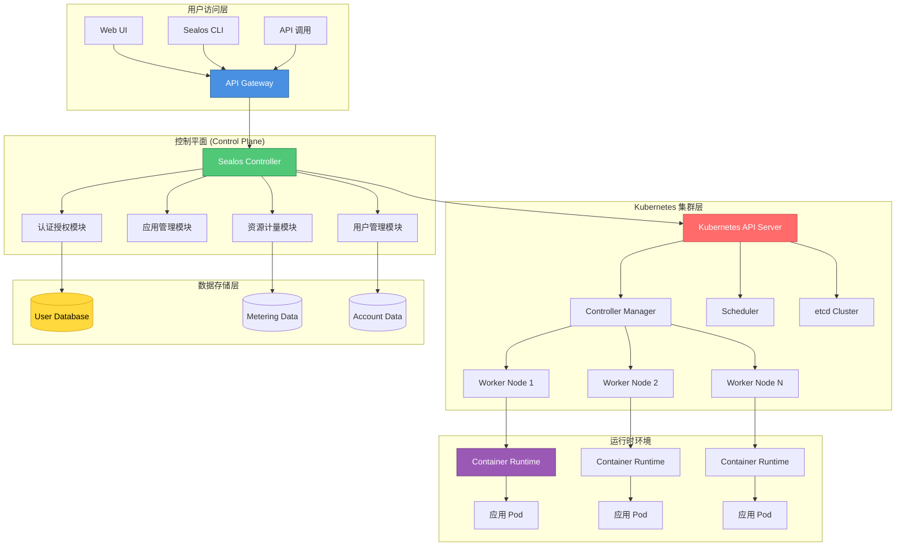
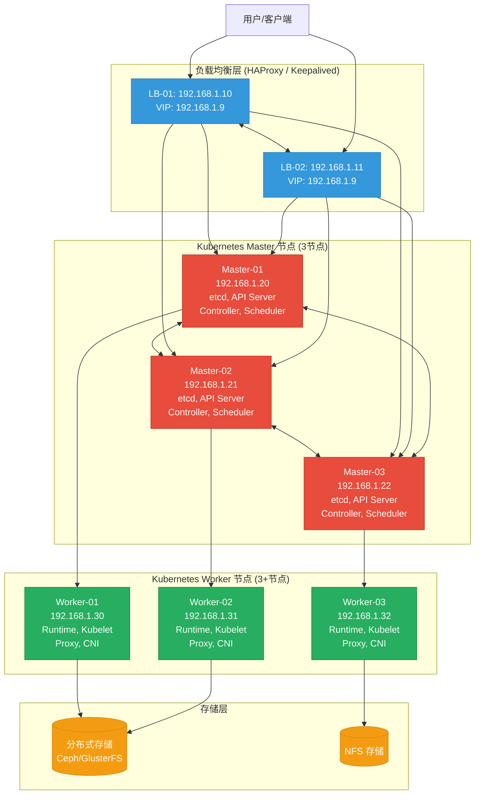

[TOC]

---

# Sealos生产级部署与运维指南

## 1. 简介

### 1.1 服务介绍与核心特性

**Sealos** 是一个基于 Kubernetes 构建的云操作系统（Cloud Operating System），旨在简化云原生应用的开发、部署和管理。它将 Kubernetes 的复杂性抽象为简洁的用户体验，让用户能够像使用个人电脑一样使用云资源。

#### 核心特性

- **一键式部署体验**：通过 Web 界面或命令行快速部署应用、数据库和对象存储
- **多云架构支持**：支持阿里云、腾讯云、AWS、Google Cloud 等主流云平台
- **自带应用市场**：内置丰富的应用模板（WordPress、Redis、MySQL、MongoDB 等）
- **按用量计费**：精确到秒级的资源计量，实现真正的按需付费
- **开源可控**：完全开源，支持私有化部署
- **Kubernetes 原生**：完全兼容 Kubernetes 生态系统
- **高可用架构**：支持多控制平面、多副本部署
- **开发者友好**：提供 CLI 工具和 API，便于 DevOps 集成

### 1.2 适用场景

| 场景 | 说明 |
|------|------|
| **企业应用托管** | 中小型企业的业务系统、OA、ERP 等应用托管 |
| **开发测试环境** | 快速搭建开发、测试、预发布环境 |
| **微服务架构** | 支持容器化的微服务部署与管理 |
| **数据库服务** | 提供高可用的托管数据库服务（MySQL、Redis、PostgreSQL 等） |
| **CI/CD 流水线** | 与 GitLab、Gitea 等 CI/CD 工具集成 |
| **私有云平台** | 企业内部私有云平台建设 |
| **教育与培训**： | 云原生技术教学与实践环境 |

### 1.3 架构原理图



**架构说明：**

- **用户访问层**：提供 Web UI、CLI 和 API 三种交互方式
- **控制平面**：Sealos 核心组件，处理用户请求并管理 Kubernetes 集群
- **Kubernetes 集群层**：底层容器编排引擎
- **数据存储层**：存储用户、计量和账户数据
- **运行时环境**：实际运行用户应用容器

---

## 2. 版本选择指南

### 2.1 版本对应关系表

| Sealos 版本 | Kubernetes 版本 | 发布日期 | 状态 | 推荐场景 |
|-------------|-----------------|----------|------|----------|
| **5.0.x** | 1.28.x - 1.29.x | 2024-Q4 | 稳定版 | 生产环境（推荐） |
| **4.3.x** | 1.26.x - 1.27.x | 2024-Q2 | 维护模式 | 现有生产环境 |
| **4.2.x** | 1.25.x | 2023-Q4 | 即将 EOL | 建议升级 |
| **4.1.x** | 1.24.x | 2023-Q2 | 已 EOL | 不建议使用 |

### 2.2 版本决策建议

**选择 Sealos 5.0.x 系列的情况：**
- 新建生产环境部署
- 需要最新的 Kubernetes 特性支持
- 对安全性有较高要求
- 计划长期维护的集群

**选择 Sealos 4.3.x 系列的情况：**
- 现有集群稳定运行，暂无升级需求
- 需要与特定版本的 Kubernetes 工具链兼容
- 团队对特定版本有运维经验

**版本升级注意事项：**
- 小版本升级（如 4.3.0 → 4.3.5）：可直接升级，风险较低
- 大版本升级（如 4.x → 5.0）：建议先在测试环境验证，制定详细的回滚方案
- 升级前务必备份 etcd 数据和重要配置文件

---

## 3. 生产环境规划（高可用架构）

### 3.1 集群架构图



### 3.2 节点角色与配置要求

#### Master 节点配置（3 节点）

| 配置项 | 最低配置 | 推荐配置 | 说明 |
|--------|----------|----------|------|
| **CPU** | 4 Core | 8 Core+ | etcd 和 API Server 消耗 CPU |
| **内存** | 8 GB | 16 GB+ | etcd 需要充足内存 |
| **磁盘** | 100 GB SSD | 200 GB NVMe SSD | 系统盘 + etcd 数据 |
| **网络** | 1 Gbps | 10 Gbps | 节点间通信带宽 |
| **操作系统** | Rocky Linux 9 / Ubuntu 22.04 | Rocky Linux 9 / Ubuntu 22.04 | 保持版本一致 |
| **角色** | etcd + API Server + Controller + Scheduler | etcd + API Server + Controller + Scheduler | 全功能控制平面 |

#### Worker 节点配置（3+ 节点）

| 配置项 | 最低配置 | 推荐配置 | 说明 |
|--------|----------|----------|------|
| **CPU** | 4 Core | 16 Core+ | 根据业务负载调整 |
| **内存** | 16 GB | 64 GB+ | 根据应用需求调整 |
| **磁盘** | 200 GB SSD | 500 GB NVMe SSD | 容器镜像 + 数据卷 |
| **网络** | 1 Gbps | 10 Gbps | 业务流量带宽 |
| **操作系统** | Rocky Linux 9 / Ubuntu 22.04 | Rocky Linux 9 / Ubuntu 22.04 | 保持版本一致 |
| **角色** | Kubelet + Proxy + Runtime | Kubelet + Proxy + Runtime | 工作负载节点 |

#### 负载均衡节点配置（2 节点）

| 配置项 | 最低配置 | 推荐配置 | 说明 |
|--------|----------|----------|------|
| **CPU** | 2 Core | 4 Core | HAProxy/Keepalived |
| **内存** | 4 GB | 8 GB | 连接跟踪需要内存 |
| **磁盘** | 50 GB SSD | 100 GB SSD | 系统盘 |
| **网络** | 1 Gbps | 10 Gbps | API 流量转发 |
| **VIP** | 192.168.1.9（示例） | 根据规划设置 | 虚拟 IP 地址 |

### 3.3 网络与端口规划

#### Master 节点网络端口

| 源地址 | 目标端口 | 协议 | 用途 |
|--------|----------|------|------|
| LB 节点 VIP | 6443 | TCP | Kubernetes API Server |
| Master 节点间 | 2380 | TCP | etcd peer 通信 |
| Master 节点间 | 2379 | TCP | etcd client 通信 |
| 所有节点 | 10250 | TCP | Kubelet API |
| Worker 节点 | 10259 | TCP | Scheduler 健康 |
| Worker 节点 | 10257 | TCP | Controller Manager 健康 |
| 监控节点 | 9100 | TCP | Node Exporter（可选） |
| 监控节点 | 10249 | TCP | kube-proxy 健康检查 |

#### Worker 节点网络端口

| 源地址 | 目标端口 | 协议 | 用途 |
|--------|----------|------|------|
| Master 节点 | 10250 | TCP | Kubelet API |
| 所有 Pod | 30000-32767 | TCP/UDP | NodePort 服务范围 |
| CNI 插件 | 动态分配 | 协议依 CNI | Pod 网络通信（Calico/flannel） |
| 外部访问 | 80/443 | TCP | Ingress HTTP/HTTPS |

#### 负载均衡节点网络端口

| 源地址 | 目标端口 | 协议 | 用途 |
|--------|----------|------|------|
| 用户/客户端 | 6443 | TCP | Kubernetes API 访问 |
| Master 节点 | 6443 | TCP | 后端健康检查 |
| VRRP 组播 | - | VRRP | Keepalived 心跳（默认 224.0.0.18） |

#### 存储节点网络端口（以 Ceph 为例）

| 源地址 | 目标端口 | 协议 | 用途 |
|--------|----------|------|------|
| 所有节点 | 6789 | TCP | Ceph Monitor |
| 所有节点 | 6800-7300 | TCP | Ceph OSD |
| 所有节点 | 3300 | TCP | Ceph RBD GW |

---

## 4. 生产环境部署

### 4.1 前置准备（所有节点）

#### 4.1.1 系统初始化

```bash
# ── Rocky Linux 9 ──────────────────────────
# 配置主机名
hostnamectl set-hostname sealos-master-01  # ← 根据实际节点修改
# Master 节点: sealos-master-01/02/03
# Worker 节点: sealos-worker-01/02/03
# LB 节点: sealos-lb-01/02

# 配置 hosts 文件（所有节点一致）
cat >> /etc/hosts << 'EOF'
192.168.1.10 sealos-lb-01
192.168.1.11 sealos-lb-02
192.168.1.20 sealos-master-01
192.168.1.21 sealos-master-02
192.168.1.22 sealos-master-03
192.168.1.30 sealos-worker-01
192.168.1.31 sealos-worker-02
192.168.1.32 sealos-worker-03
192.168.1.9  sealos-vip  # ← 虚拟 IP
EOF

# 更新系统
dnf update -y

# ── Ubuntu 22.04 ───────────────────────────
# 配置主机名
hostnamectl set-hostname sealos-master-01  # ← 根据实际节点修改

# 配置 hosts 文件（所有节点一致）
cat >> /etc/hosts << 'EOF'
192.168.1.10 sealos-lb-01
192.168.1.11 sealos-lb-02
192.168.1.20 sealos-master-01
192.168.1.21 sealos-master-02
192.168.1.22 sealos-master-03
192.168.1.30 sealos-worker-01
192.168.1.31 sealos-worker-02
192.168.1.32 sealos-worker-03
192.168.1.9  sealos-vip
EOF

# 更新系统
apt-get update && apt-get upgrade -y
```

#### 4.1.2 关闭 Swap 分区

```bash
# ── Rocky Linux 9 ──────────────────────────
# 临时关闭
swapoff -a

# 永久关闭
sed -ri 's/^(.*swap.*)$/#\1/g' /etc/fstab

# ── Ubuntu 22.04 ───────────────────────────
# 临时关闭
swapoff -a

# 永久关闭
sed -ri 's/^(.*swap.*)$/#\1/g' /etc/fstab
```

#### 4.1.3 配置内核参数

```bash
# ── Rocky Linux 9 & Ubuntu 22.04 ──────────────────────────
cat >> /etc/sysctl.d/k8s.conf << 'EOF'
# 网络配置
net.bridge.bridge-nf-call-ip6tables = 1
net.bridge.bridge-nf-call-iptables = 1
net.ipv4.ip_forward = 1

# SELinux 配置（仅 Rocky Linux）
# net.ipv4.conf.all.rp_filter = 0
# net.ipv4.conf.default.rp_filter = 0

# 连接跟踪
net.netfilter.nf_conntrack_max = 1000000
net.netfilter.nf_conntrack_tcptimeout = 300

# 文件描述符
fs.file-max = 2097152
fs.inotify.max_user_watches = 524288

# 内存配置
vm.swappiness = 0
vm.overcommit_memory = 1
vm.panic_on_oom = 0

# IP 分片
net.ipv4.tcp_max_syn_backlog = 8192
net.ipv4.tcp_max_tw_buckets = 5000
net.ipv4.tcp_fastopen = 3
net.ipv4.tcp_retries2 = 15
EOF

# ── Rocky Linux 9 ──────────────────────────
# 加载内核模块
cat >> /etc/modules-load.d/k8s.conf << 'EOF'
br_netfilter
overlay
ip_vs
ip_vs_rr
ip_vs_wrr
ip_vs_sh
nf_conntrack
EOF

modprobe br_netfilter
modprobe overlay
modprobe ip_vs
modprobe ip_vs_rr
modprobe ip_vs_wrr
modprobe ip_vs_sh
modprobe nf_conntrack

# 应用内核参数
sysctl --system

# ── Ubuntu 22.04 ───────────────────────────
# 加载内核模块
cat >> /etc/modules-load.d/k8s.conf << 'EOF'
br_netfilter
overlay
ip_vs
ip_vs_rr
ip_vs_wrr
ip_vs_sh
nf_conntrack
EOF

modprobe br_netfilter
modprobe overlay
modprobe ip_vs
modprobe ip_vs_rr
modprobe ip_vs_wrr
modprobe ip_vs_sh
modprobe nf_conntrack

# 应用内核参数
sysctl --system
```

#### 4.1.4 配置时间同步

```bash
# ── Rocky Linux 9 ──────────────────────────
# 安装 chrony
dnf install -y chrony

# 启动并启用 chronyd
systemctl enable --now chronyd

# 验证时间同步
chronyc sources -v

# ── Ubuntu 22.04 ───────────────────────────
# 安装 chrony
apt-get install -y chrony

# 启动并启用 chronyd
systemctl enable --now chronyd

# 验证时间同步
chronyc sources -v
```

#### 4.1.5 配置防火墙规则

```bash
# ── Rocky Linux 9 (使用 firewalld) ──────────────────────────
# Master 节点
firewall-cmd --permanent --add-port=6443/tcp
firewall-cmd --permanent --add-port=2379-2380/tcp
firewall-cmd --permanent --add-port=10250/tcp
firewall-cmd --permanent --add-port=10259/tcp
firewall-cmd --permanent --add-port=10257/tcp
firewall-cmd --permanent --add-port=9100/tcp
firewall-cmd --reload

# Worker 节点
firewall-cmd --permanent --add-port=10250/tcp
firewall-cmd --permanent --add-port=30000-32767/tcp
firewall-cmd --permanent --add-port=30000-32767/udp
firewall-cmd --reload

# ── Ubuntu 22.04 (使用 ufw) ───────────────────────────
# Master 节点
ufw allow 6443/tcp
ufw allow 2379:2380/tcp
ufw allow 10250/tcp
ufw allow 10259/tcp
ufw allow 10257/tcp
ufw allow 9100/tcp

# Worker 节点
ufw allow 10250/tcp
ufw allow 30000:32767/tcp
ufw allow 30000:32767/udp
```

### 4.2 Rocky Linux 9 部署步骤

#### 4.2.1 安装容器运行时（Containerd）

```bash
# ── Rocky Linux 9 ──────────────────────────
# 配置 Containerd 仓库
cat >> /etc/yum.repos.d/containerd.repo << 'EOF'
[containerd]
name=Containerd
baseurl=https://download.opensuse.org/repositories/devel:/kubic:/libcontainers:/stable/CentOS_9/
enabled=1
gpgcheck=1
gpgkey=https://download.opensuse.org/repositories/devel:/kubic:/libcontainers:/stable/CentOS_9/repodata/repomd.xml.key
EOF

# 安装 containerd
dnf install -y containerd

# 配置 containerd
mkdir -p /etc/containerd
containerd config default > /etc/containerd/config.toml

# 修改配置使用 systemd cgroup driver
sed -i 's/SystemdCgroup = false/SystemdCgroup = true/' /etc/containerd/config.toml

# 启动并启用 containerd
systemctl enable --now containerd

# 验证
systemctl status containerd
ctr version
```

#### 4.2.2 安装 Sealos

```bash
# ── Rocky Linux 9 ──────────────────────────
# 下载 Sealos 二进制文件
SEALOS_VERSION="5.1.1"  # ← 根据需要修改版本
curl -sfL https://raw.githubusercontent.com/labring/sealos/main/scripts/install.sh \
  | sh -s v${SEALOS_VERSION} labring/sealos:${SEALOS_VERSION}

# 或直接下载二进制
wget https://github.com/labring/sealos/releases/download/v${SEALOS_VERSION}/sealos_${SEALOS_VERSION}_linux_amd64.tar.gz
tar -zxvf sealos_${SEALOS_VERSION}_linux_amd64.tar.gz
mv sealos /usr/local/bin/
chmod +x /usr/local/bin/sealos

# 验证安装
sealos version
```

### 4.3 Ubuntu 22.04 部署步骤

#### 4.3.1 安装容器运行时（Containerd）

```bash
# ── Ubuntu 22.04 ───────────────────────────
# 安装依赖
apt-get install -y apt-transport-https ca-certificates curl gnupg lsb-release

# 添加 Docker GPG 密钥
mkdir -p /etc/apt/keyrings
curl -fsSL https://download.docker.com/linux/ubuntu/gpg | gpg --dearmor -o /etc/apt/keyrings/docker.gpg

# 添加 Docker 仓库
echo \
  "deb [arch=$(dpkg --print-architecture) signed-by=/etc/apt/keyrings/docker.gpg] https://download.docker.com/linux/ubuntu \
  $(lsb_release -cs) stable" | tee /etc/apt/sources.list.d/docker.list > /dev/null

# 安装 containerd
apt-get update
apt-get install -y containerd.io

# 配置 containerd
mkdir -p /etc/containerd
containerd config default > /etc/containerd/config.toml

# 修改配置使用 systemd cgroup driver
sed -i 's/SystemdCgroup = false/SystemdCgroup = true/' /etc/containerd/config.toml

# 启动并启用 containerd
systemctl enable --now containerd

# 验证
systemctl status containerd
ctr version
```

#### 4.3.2 安装 Sealos

```bash
# ── Ubuntu 22.04 ───────────────────────────
# 下载 Sealos 二进制文件
SEALOS_VERSION="5.1.1"  # ← 根据需要修改版本
curl -sfL https://raw.githubusercontent.com/labring/sealos/main/scripts/install.sh \
  | sh -s v${SEALOS_VERSION} labring/sealos:${SEALOS_VERSION}

# 或直接下载二进制
wget https://github.com/labring/sealos/releases/download/v${SEALOS_VERSION}/sealos_${SEALOS_VERSION}_linux_amd64.tar.gz
tar -zxvf sealos_${SEALOS_VERSION}_linux_amd64.tar.gz
mv sealos /usr/local/bin/
chmod +x /usr/local/bin/sealos

# 验证安装
sealos version
```

### 4.4 集群初始化与配置

#### 4.4.1 配置 Sealos 集群配置文件

在 **Master-01** 节点上创建集群配置文件：

```bash
# ── 所有系统通用 ──────────────────────────
# 创建集群配置文件
cat >> /root/sealos/ClusterConfig << 'EOF'
apiVersion: sealos.io/v1beta1
kind: Cluster
metadata:
  name: sealos-prod
  namespace: default
spec:
  # ★ 集群唯一标识（根据实际环境修改）
  clusterID: prod-cluster-001

  # Kubernetes 版本
  image: labring/kubernetes:v1.29.0

  # ★ 虚拟 IP 地址（根据实际网络规划修改）
  vip: 192.168.1.9

  # SSH 用户和端口（⚠️ 根据实际环境修改）
  ssh:
    user: root
    passwd: "YourSSHPassword123"  # ← ⚠️ 生产环境建议使用密钥认证
    pk: /root/.ssh/id_rsa

  # Master 节点列表（★ 根据实际节点 IP 修改）
  masters:
    - 192.168.1.20
    - 192.168.1.21
    - 192.168.1.22

  # Worker 节点列表（★ 根据实际节点 IP 修改）
  nodes:
    - 192.168.1.30
    - 192.168.1.31
    - 192.168.1.32

  # 网络插件配置
  network:
    # CNI 插件选择（calico/flannel/cilium）
    cni: calico

    # ★ Pod 网段（⚠️ 避免与现有网络冲突）
    podCIDR: 100.64.0.0/10

    # ★ Service 网段
    svcCIDR: 10.96.0.0/12

    # Calico 特定配置（网络通信模式选型）
    # ⚠️ 请根据您的实际网络环境选择以下三种模式之一：
    calico:
      # 【选项 1】VXLAN 模式（强烈推荐，云环境/复杂网络首选）
      # - 特点：兼容性最好，不依赖底层路由，使用 UDP 封装。不会被云平台（如阿里云/AWS）拦截。
      # - 适用：公有云环境、不能保证 BGP 畅通的本地机房。
      ipip: "Never"
      vxlan: "Always"
      mode: "VXLAN"
      
      # 【选项 2】纯 BGP 模式（性能最高）
      # - 特点：不封装协议，网络损耗极小（接近原生）。
      # - 适用：本地物理机房（所有节点在同二层子网）；或底层网络已配置支持 BGP。
      # ipip: "Never"
      # vxlan: "Never"
      # mode: "BGP"
      
      # 【选项 3】BGP + IPIP 模式（传统模式）
      # - 特点：同网段走 BGP，跨网段用 IPIP 封装。
      # - 注意：部分防火墙/云环境默认拦截 IPIP 协议，会导致跨节点 Pod 不互通。
      # ipip: "Always"  # 或 "CrossSubnet"
      # vxlan: "Never"
      # mode: "BGP"

  # 容器运行时
  containerRuntime:
    type: containerd

  # etcd 配置
  etcd:
    # 数据目录
    dataDir: /var/lib/etcd

  # API Server 配置
  apiServer:
    # ★ 访问控制（⚠️ 生产环境必须修改）
    authorizationMode: "Node,RBAC"

    # ★ 服务客户端证书（⚠️ 根据实际域名修改）
    # 注意：certSANs 只能配置在 apiServer 下，不可配置在根级或 kubelet 下
    certSANs:
      - "sealos.example.com"    # ← 根据实际域名修改
      - "*.sealos.example.com"  # ← 泛域名支持
      - "192.168.1.9"
      - "192.168.1.20"
      - "192.168.1.21"
      - "192.168.1.22"

    # 额外参数
    extraArgs:
      # 启用审计日志
      audit-log-path: "/var/log/kubernetes/audit.log"
      audit-log-maxage: "30"
      audit-log-maxbackup: "10"
      # 限制请求大小
      max-request-size: "3145728"

  # Controller Manager 配置
  controllerManager:
    extraArgs:
      # POD 数量
      cluster-cidr: "100.64.0.0/10"
      service-cluster-ip-range: "10.96.0.0/12"

  # Scheduler 配置
  scheduler:
    extraArgs: {}

  # Kubelet 配置
  kubelet:
    # ★ 数据目录（建议使用大容量磁盘）
    rootDir: /var/lib/kubelet

    # 额外参数
    extraArgs:
      # Pod 清理策略
      pod-eviction-timeout: "2m"
      # 镜像拉取超时
      serialize-image-pulls: "false"

EOF
```

#### 4.4.2 初始化集群

在 **Master-01** 节点执行：

```bash
# ── 所有系统通用 ──────────────────────────
# 创建必要目录
mkdir -p /root/sealos
cd /root/sealos

# 确保 SSH 免密登录已配置（⚠️ 重要）
# 方式一：密码认证（已在配置文件中设置）
# 方式二：密钥认证（推荐）
ssh-copy-id root@192.168.1.20
ssh-copy-id root@192.168.1.21
ssh-copy-id root@192.168.1.22
ssh-copy-id root@192.168.1.30
ssh-copy-id root@192.168.1.31
ssh-copy-id root@192.168.1.32

# 使用 Sealos 初始化集群
sealos init -f ClusterConfig

# 集群初始化时间约 5-10 分钟，请耐心等待
```

#### 4.4.3 验证集群状态

```bash
# ── 所有系统通用 ──────────────────────────
# 配置 kubectl
mkdir -p ~/.kube
cp /etc/kubernetes/admin.conf ~/.kube/config
chmod 600 ~/.kube/config

# 验证节点状态
kubectl get nodes -o wide

# 预期输出（所有节点应为 Ready 状态）：
# NAME                STATUS   ROLES           AGE   VERSION
# sealos-master-01    Ready    control-plane   10m   v1.29.0
# sealos-master-02    Ready    control-plane   9m    v1.29.0
# sealos-master-03    Ready    control-plane   8m    v1.29.0
# sealos-worker-01    Ready    <none>          7m    v1.29.0
# sealos-worker-02    Ready    <none>          7m    v1.29.0
# sealos-worker-03    Ready    <none>          7m    v1.29.0

# 验证 Pod 状态
kubectl get pods -A

# 预期输出（所有 Pod 应为 Running 状态）：
# NAMESPACE     NAME                                       READY   STATUS    RESTARTS   AGE
# kube-system   calico-kube-controllers-xxx               1/1     Running   0          10m
# kube-system   calico-node-xxx                           1/1     Running   0          10m
# kube-system   coredns-xxx                               1/1     Running   0          10m
# kube-system   etcd-sealos-master-01                     1/1     Running   0          10m

# 验证集群组件健康
kubectl get cs

# 验证网络连通性
kubectl get svc
```

#### 4.4.4 部署 Sealos Dashboard

```bash
# ── 所有系统通用 ──────────────────────────
# 使用 Sealos 部署 Dashboard
sealos run labring/sealos-dashboard:v5.0.0

# 或者使用 Helm 部署
# 添加 Sealos Helm 仓库
helm repo add sealos https://charts.sealos.io
helm repo update

# 部署 Dashboard
helm install sealos-dashboard sealos/sealos-dashboard \
  --namespace sealos-system \
  --create-namespace \
  --set domain=sealos.example.com \  # ← 根据实际域名修改
  --set ingress.enabled=true

# 获取访问地址
kubectl get svc -n sealos-system
```

### 4.5 安装验证（含预期输出）

#### 4.5.1 集群功能验证

```bash
# ── 所有系统通用 ──────────────────────────
# 1. 创建测试命名空间
kubectl create namespace test-namespace

# 预期输出：
# namespace/test-namespace created

# 2. 部署测试应用
kubectl create deployment nginx-test \
  --image=nginx:1.25 \
  --replicas=3 \
  -n test-namespace

# 预期输出：
# deployment.apps/nginx-test created

# 3. 暴露服务
kubectl expose deployment nginx-test \
  --port=80 \
  --target-port=80 \
  --type=NodePort \
  -n test-namespace

# 预期输出：
# service/nginx-test exposed

# 4. 验证 Pod 运行状态
kubectl get pods -n test-namespace

# 预期输出：
# NAME                          READY   STATUS    RESTARTS   AGE
# nginx-test-xxx-xxx            1/1     Running   0          30s
# nginx-test-xxx-yyy            1/1     Running   0          30s
# nginx-test-xxx-zzz            1/1     Running   0          30s

# 5. 验证服务端点
kubectl get endpoints nginx-test -n test-namespace

# 预期输出：
# NAME         ENDPOINTS                                      AGE
# nginx-test   100.64.0.1:80,100.64.0.2:80,100.64.0.3:80    1m

# 6. 测试访问
NODE_PORT=$(kubectl get svc nginx-test -n test-namespace -o jsonpath='{.spec.ports[0].nodePort}')
curl http://192.168.1.30:$NODE_PORT

# 预期输出（HTML 响应）：
# <!DOCTYPE html>
# <html>
# <head>
# <title>Welcome to nginx!</title>
# ...

# 7. 清理测试资源
kubectl delete namespace test-namespace

# 预期输出：
# namespace "test-namespace" deleted
```

#### 4.5.2 高可用验证

```bash
# ── 所有系统通用 ──────────────────────────
# 1. 测试 VIP 故障切换
# 在 LB-01 节点停止 Keepalived
systemctl stop keepalived

# VIP 应自动漂移到 LB-02，验证：
ip addr show | grep 192.168.1.9

# 预期输出（在 LB-02 上应显示 VIP）：
# inet 192.168.1.9/32 scope global eth0

# 2. 测试 API Server 访问
kubectl get nodes

# 预期输出（应正常显示节点列表）：
# NAME                STATUS   ROLES           AGE   VERSION
# sealos-master-01    Ready    control-plane   30m   v1.29.0
# ...

# 3. 测试 Master 节点故障恢复
# 模拟停止 Master-01 的 API Server
systemctl stop kubelet

# 等待 30 秒后验证集群状态
kubectl get nodes

# 预期输出（其他 Master 节点仍正常工作）：
# NAME                STATUS   ROLES           AGE   VERSION
# sealos-master-01    NotReady control-plane   35m   v1.29.0
# sealos-master-02    Ready    control-plane   34m   v1.29.0
# sealos-master-03    Ready    control-plane   33m   v1.29.0

# 恢复 Master-01
systemctl start kubelet

# 验证节点恢复
kubectl get nodes

# 预期输出（所有节点恢复 Ready）：
# NAME                STATUS   ROLES           AGE   VERSION
# sealos-master-01    Ready    control-plane   40m   v1.29.0
# ...
```

---

## 5. 关键参数配置说明

### 5.1 核心配置文件详解（含逐行注释）

#### 5.1.1 Kubernetes API Server 配置

```bash
# ── 所有系统通用 ──────────────────────────
cat >> /etc/kubernetes/manifests/kube-apiserver.yaml << 'EOF'
apiVersion: v1
kind: Pod
metadata:
  name: kube-apiserver
  namespace: kube-system
spec:
  containers:
  - name: kube-apiserver
    image: registry.k8s.io/kube-apiserver:v1.29.0
    command:
    - kube-apiserver
    # ★ API Server 监听端口（默认 6443，生产环境建议保持）
    - --secure-port=6443

    # ★ 服务 Cluster IP 范围（⚠️ 与 ClusterConfig 中 svcCIDR 保持一致）
    - --service-cluster-ip-range=10.96.0.0/12

    # ★ etcd 服务器地址（⚠️ 根据实际节点 IP 修改）
    - --etcd-servers=https://192.168.1.20:2379,https://192.168.1.21:2379,https://192.168.1.22:2379

    # ★ etcd 证书和密钥路径
    - --etcd-cafile=/etc/kubernetes/pki/etcd/ca.crt
    - --etcd-certfile=/etc/kubernetes/pki/apiserver-etcd-client.crt
    - --etcd-keyfile=/etc/kubernetes/pki/apiserver-etcd-client.key

    # ★ 访问控制模式（生产环境必须启用 RBAC）
    - --authorization-mode=Node,RBAC

    # ★ Pod 网段（⚠️ 与 ClusterConfig 中 podCIDR 保持一致）
    - --cluster-cidr=100.64.0.0/10

    # 令牌认证文件
    - --token-auth-file=/etc/kubernetes/pki/tokens.csv

    # ★ 客户端 CA 证书
    - --client-ca-file=/etc/kubernetes/pki/ca.crt

    # ★ 启用 admission 插件
    - --enable-admission-plugins=NodeRestriction,ResourceQuota,LimitRanger,ServiceAccount

    # ★ 证书有效期相关（⚠️ 建议延长至 10 年）
    - --cluster-signing-duration=876000h  # 10 年

    # ★ 审计日志路径（⚠️ 生产环境必须启用）
    - --audit-log-path=/var/log/kubernetes/audit.log

    # ★ 审计日志保留天数
    - --audit-log-maxage=30

    # ★ 审计日志最大备份数
    - --audit-log-maxbackup=10

    # ★ 审计日志最大大小（MB）
    - --audit-log-maxsize=100

    # ★ 匿名认证（⚠️ 生产环境必须禁用）
    - --anonymous-auth=false

    # ★ 请求体大小限制（MB，防止大请求攻击）
    - --max-request-body-size=3145728

    # TLS 证书和密钥
    - --tls-cert-file=/etc/kubernetes/pki/apiserver.crt
    - --tls-private-key-file=/etc/kubernetes/pki/apiserver.key

    # ★ 服务账号密钥
    - --service-account-key-file=/etc/kubernetes/pki/sa.pub

    # ★ 服务账号签发者
    - --service-account-signing-key-file=/etc/kubernetes/pki/sa.key

    # ★ 服务账号 Issuer（⚠️ 根据集群域名修改）
    - --service-account-issuer=https://sealos.example.com:6443

    # ★ API Server 证书 SAN（⚠️ 必须包含 VIP 和所有节点 IP）
    - --kubelet-client-certificate=/etc/kubernetes/pki/apiserver-kubelet-client.crt
    - --kubelet-client-key=/etc/kubernetes/pki/apiserver-kubelet-client.key

    # ★ 启用聚合层
    - --enable-aggregator-routing=true

    # 代理相关
    - --proxy-client-cert-file=/etc/kubernetes/pki/front-proxy-client.crt
    - --proxy-client-key-file=/etc/kubernetes/pki/front-proxy-client.key

    # ★ 节点端口范围（⚠️ 根据实际需求修改）
    - --service-node-port-range=30000-32767

    # ★ Kubelet 预留 CPU（⚠️ 根据节点配置调整）
    - --kubelet-cpu-requirements=100m

    # ★ 事件保留时长
    - --event-ttl=168h  # 7 天

    # 日志级别
    - --v=2

    # 资源限制
    resources:
      requests:
        cpu: 250m
        memory: 512Mi
      limits:
        cpu: 2000m
        memory: 4Gi

    # 健康检查
    livenessProbe:
      httpGet:
        host: 127.0.0.1
        path: /livez
        port: 6443
        scheme: HTTPS
      initialDelaySeconds: 10
      periodSeconds: 10
      timeoutSeconds: 15
      failureThreshold: 8

    readinessProbe:
      httpGet:
        host: 127.0.0.1
        path: /readyz
        port: 6443
        scheme: HTTPS
      initialDelaySeconds: 10
      periodSeconds: 10
      timeoutSeconds: 15
      failureThreshold: 8

    # 挂载卷
    volumeMounts:
    - name: etcd-certs
      mountPath: /etc/kubernetes/pki/etcd
      readOnly: true
    - name: k8s-certs
      mountPath: /etc/kubernetes/pki
      readOnly: true
    - name: audit-log
      mountPath: /var/log/kubernetes
      readOnly: false

  # 卷定义
  volumes:
  - name: etcd-certs
    hostPath:
      path: /etc/kubernetes/pki/etcd
      type: DirectoryOrCreate
  - name: k8s-certs
    hostPath:
      path: /etc/kubernetes/pki
      type: DirectoryOrCreate
  - name: audit-log
    hostPath:
      path: /var/log/kubernetes
      type: DirectoryOrCreate
EOF
```

#### 5.1.2 Kubelet 配置

```bash
# ── 所有系统通用 ──────────────────────────
cat >> /var/lib/kubelet/config.yaml << 'EOF'
apiVersion: kubelet.config.k8s.io/v1beta1
kind: KubeletConfiguration
# ★ Kubelet 监听地址（0.0.0.0 允许所有接口访问）
address: 0.0.0.0

# ★ API Server 地址（⚠️ 使用 VIP 实现高可用）
apiServer: https://192.168.1.9:6443

# ★ 集群 DNS 地址
clusterDNS:
- 10.96.0.10

# ★ 集群域名
clusterDomain: cluster.local

# ★ Pod 网段（⚠️ 与全局配置保持一致）
podCIDR: "100.64.0.0/10"

# ★ 容器运行时端点
containerRuntimeEndpoint: unix:///run/containerd/containerd.sock

# ★ cgroup 驱动（⚠️ 必须与 containerd 配置一致）
cgroupDriver: systemd

# ★ 镜像拉取策略（默认 Always，可优化为 IfNotPresent）
imagePullPolicy: IfNotPresent

# ★ 镜像最少保留数量
imageMinimumGCAge: 2h

# ★ 镜像 GC 间隔
imageGCHighThresholdPercent: 85
imageGCLowThresholdPercent: 80

# ★ Pod 最少保留数量
podGCThreshold: 50

# ★ 节点资源预留（⚠️ 根据节点配置调整）
enforceNodeAllocatable:
- pods
systemReserved:
  cpu: 500m
  memory: 1Gi
  ephemeral-storage: 5Gi
kubeReserved:
  cpu: 500m
  memory: 1Gi
  ephemeral-storage: 5Gi

# ★ 最大 Pod 数量（⚠️ 根据节点性能调整）
maxPods: 110

# ★ Pod 网络配置
networkPluginName: cni

# ★ TLS 证书
tlsCertFile: /var/lib/kubelet/pki/kubelet-client-current.pem
tlsPrivateKeyFile: /var/lib/kubelet/pki/kubelet-client-current.pem

# ★ CA 证书
authentication:
  x509:
    clientCAFile: /etc/kubernetes/pki/ca.crt

# ★ 授权模式
authorization:
  mode: Webhook
  webhook:
    cacheAuthorizedTTL: 5m
    cacheUnauthorizedTTL: 30s

# ★ 失败驱逐超时（⚠️ 根据应用特性调整）
evictionHard:
  memory.available: "100Mi"
  nodefs.available: "10%"
  nodefs.inodesFree: "5%"
  imagefs.available: "15%"

# ★ 卷插件目录
volumePluginDir: /var/lib/kubelet/volumeplugins

# ★ 日志轮转配置
containerLogMaxSize: 10Mi
containerLogMaxFiles: 5

# ★ 轮转证书
rotateCertificates: true
serverTLSBootstrap: true

# ★ 只读端口（10255 用于监控，⚠️ 生产环境需配合认证）
readOnlyPort: 10255

# ★ 健康检查端口（10248 用于本地健康检查）
healthzPort: 10248

# ★ 宕机容忍时间
nodeStatusUpdateFrequency: 10s
nodeStatusReportFrequency: 5m
EOF
```

### 5.2 生产环境推荐调优参数

#### 5.2.1 集群级别调优

```bash
# ── 所有系统通用 ──────────────────────────
# 1. etcd 性能调优
cat >> /etc/etcd/etcd.conf.yml << 'EOF'
# ★ 快照间隔（生产环境推荐 10000-100000）
snapshot-count: 10000

# ★ 心跳间隔（ms）
heartbeat-interval: 100

# ★ 选举超时（ms）
election-timeout: 1000

# ★ 配额后端字节数（2GB）
quota-backend-bytes: 2147483648

# ★ 最大请求字节数（10MB）
max-request-bytes: 10485760

# ★ 监听对等 URL
listen-peer-urls: https://192.168.1.20:2380  # ← 根据实际 IP 修改

# ★ 监听客户端 URL
listen-client-urls: https://192.168.1.20:2379,https://127.0.0.1:2379

# ★ 初始集群（⚠️ 包含所有 etcd 节点）
initial-cluster: sealos-master-01=https://192.168.1.20:2380,sealos-master-02=https://192.168.1.21:2380,sealos-master-03=https://192.168.1.22:2380

# ★ 初始集群状态
initial-cluster-state: new

# ★ 初始集群令牌（⚠️ 自定义令牌）
initial-cluster-token: sealos-etcd-cluster-001

# ★ 数据目录
data-dir: /var/lib/etcd

# ★ 集群名称
name: sealos-master-01  # ← 每个节点不同
EOF

# 2. 控制器并发数调整
kubectl edit deployment -n kube-system coredns
# 添加以下环境变量：
# - name: GOMAXPROCS
#   value: "2"

# 3. 调整 DNS 副本数（根据节点数量）
kubectl scale deployment coredns -n kube-system --replicas=3

# 4. 启用 IPVS 模式（性能优于 iptables）
kubectl edit configmap kube-proxy -n kube-system
# 修改：
# mode: "ipvs"
EOF
```

#### 5.2.2 节点级别调优

```bash
# ── 所有系统通用 ──────────────────────────
# 1. 内核参数优化
cat >> /etc/sysctl.d/k8s-tuning.conf << 'EOF'
# 网络性能优化
net.core.somaxconn = 32768
net.ipv4.tcp_max_syn_backlog = 8192
net.core.netdev_max_backlog = 16384

# TCP 优化
net.ipv4.tcp_fin_timeout = 30
net.ipv4.tcp_keepalive_time = 600
net.ipv4.tcp_keepalive_intvl = 30
net.ipv4.tcp_keepalive_probes = 3

# 连接跟踪
net.netfilter.nf_conntrack_max = 2000000
net.netfilter.nf_conntrack_tcp_timeout_established = 1200

# 文件系统优化
fs.inotify.max_user_instances = 8192
fs.inotify.max_user_watches = 1048576

# 共享内存
kernel.shmmax = 68719476736
kernel.shmall = 4294967296
EOF

sysctl --system

# 2. 文件描述符限制
cat >> /etc/security/limits.d/k8s.conf << 'EOF'
* soft nofile 65536
* hard nofile 65536
* soft nproc 65536
* hard nproc 65536
* soft memlock unlimited
* hard memlock unlimited
EOF

# 3. Containerd 优化
cat >> /etc/containerd/config.toml << 'EOF'
[plugins."io.containerd.grpc.v1.cri".containerd]
  # ★ 镜像拉取并发数
  max_concurrent_downloads = 10

  # ★ 容器退出时删除延迟
  discard_unpacked_layers = true

[plugins."io.containerd.grpc.v1.cri".registry]
  # ★ 镜像拉取超时
  [plugins."io.containerd.grpc.v1.cri".registry.mirrors]
    [plugins."io.containerd.grpc.v1.cri".registry.mirrors."docker.io"]
      endpoint = ["https://registry-1.docker.io"]

    # ★ 国内镜像加速（⚠️ 可选，根据网络环境）
    # [plugins."io.containerd.grpc.v1.cri".registry.mirrors."docker.io"]
    #   endpoint = ["https://docker.mirrors.ustc.edu.cn"]
EOF

systemctl restart containerd

# 4. 日志轮转配置
cat >> /etc/logrotate.d/k8s-containers << 'EOF'
/var/log/containers/*.log {
    daily
    rotate 7
    compress
    missingok
    notifempty
    create 0644 root root
    maxage 30
}
EOF
```

#### 5.2.3 应用级别调优建议

| 调优项 | 推荐配置 | 说明 |
|--------|----------|------|
| **资源请求（Request）** | 根据实际使用量设置 | 避免过度分配 |
| **资源限制（Limit）** | Request 的 1.5-2 倍 | 防止资源耗尽 |
| **副本数** | 生产环境至少 3 副本 | 保证高可用 |
| **亲和性** | 跨节点分散部署 | 避免单点故障 |
| **健康检查** | 配置就绪和存活探针 | 自动恢复异常 Pod |
| **优雅关闭** | 设置 terminationGracePeriodSeconds | 默认 30 秒 |
| **Pod 反亲和性** | 关键应用必须配置 | 避免同节点调度 |

---

## 6. 开发/测试环境快速部署（Docker Compose）

### 6.1 Docker Compose 部署（单机或伪集群）

> ⚠️ **重要提示**：以下部署方式仅适用于开发/测试环境，**不适用于生产环境**。

#### 6.1.1 前置条件

```bash
# ── 所有系统通用 ──────────────────────────
# 安装 Docker
curl -fsSL https://get.docker.com | sh

# 启动 Docker
systemctl enable --now docker

# 验证
docker version
docker compose version
```

#### 6.1.2 创建 Docker Compose 配置

```bash
# ── 所有系统通用 ──────────────────────────
# 创建项目目录
mkdir -p ~/sealos-dev
cd ~/sealos-dev

# 创建 Docker Compose 配置
cat >> docker-compose.yml << 'EOF'
version: '3.8'

services:
  # Sealos 单节点集群
  sealos-single:
    image: labring/sealos:v5.0.0
    container_name: sealos-single
    hostname: sealos-single
    privileged: true
    restart: unless-stopped
    ports:
      - "6443:6443"    # Kubernetes API
      - "8080:8080"    # Dashboard
    volumes:
      - ./data/sealos:/var/lib/sealos
      - ./data/kubelet:/var/lib/kubelet
      - ./data/etcd:/var/lib/etcd
      - ./data/containerd:/var/lib/containerd
      - /sys/fs/cgroup:/sys/fs/cgroup:ro
    environment:
      - SEALOS_DEBUG=false
    networks:
      sealos-net:
        ipv4_address: 172.20.0.10
    healthcheck:
      test: ["CMD", "kubectl", "get", "nodes"]
      interval: 30s
      timeout: 10s
      retries: 3

  # MySQL 数据库（测试应用使用）
  mysql:
    image: mysql:8.0
    container_name: sealos-mysql
    restart: unless-stopped
    ports:
      - "3306:3306"
    environment:
      MYSQL_ROOT_PASSWORD: root123  # ← ⚠️ 仅测试环境
      MYSQL_DATABASE: appdb
      MYSQL_USER: appuser
      MYSQL_PASSWORD: apppass123
    volumes:
      - ./data/mysql:/var/lib/mysql
    networks:
      sealos-net:
        ipv4_address: 172.20.0.20

  # Redis 缓存（测试应用使用）
  redis:
    image: redis:7-alpine
    container_name: sealos-redis
    restart: unless-stopped
    ports:
      - "6379:6379"
    command: redis-server --requirepass redis123  # ← ⚠️ 仅测试环境
    volumes:
      - ./data/redis:/data
    networks:
      sealos-net:
        ipv4_address: 172.20.0.30

  # NFS 存储服务
  nfs-server:
    image: itsthenetwork/nfs-server-alpine:latest
    container_name: sealos-nfs
    restart: unless-stopped
    privileged: true
    ports:
      - "2049:2049"
    environment:
      SHARED_DIRECTORY: /export
    volumes:
      - ./data/nfs:/export
    networks:
      sealos-net:
        ipv4_address: 172.20.0.40

networks:
  sealos-net:
    driver: bridge
    ipam:
      config:
        - subnet: 172.20.0.0/24
EOF
```

#### 6.1.3 创建启动脚本

```bash
# ── 所有系统通用 ──────────────────────────
cat >> start.sh << 'EOF'
#!/bin/bash
set -e

echo "🚀 启动 Sealos 开发环境..."

# 创建数据目录
mkdir -p data/{sealos,kubelet,etcd,containerd,mysql,redis,nfs}

# 启动服务
docker compose up -d

echo "⏳ 等待服务启动..."
sleep 30

# 验证服务状态
echo "✅ 检查服务状态..."
docker compose ps

# 复制 kubeconfig
echo "📝 配置 kubectl..."
docker exec sealos-single cat /etc/kubernetes/admin.conf > ~/sealos-dev/kubeconfig
sed -i 's/localhost:6443/127.0.0.1:6443/g' ~/sealos-dev/kubeconfig

export KUBECONFIG=~/sealos-dev/kubeconfig

# 验证集群
echo "✅ 验证集群状态..."
kubectl get nodes
kubectl get pods -A

echo "🎉 Sealos 开发环境启动成功！"
echo ""
echo "📊 Dashboard 访问地址: http://localhost:8080"
echo "🔧 Kubernetes API: https://localhost:6443"
echo "📝 Kubeconfig 文件: ~/sealos-dev/kubeconfig"
echo ""
echo "💡 常用命令："
echo "   export KUBECONFIG=~/sealos-dev/kubeconfig"
echo "   kubectl get nodes"
echo "   kubectl get pods -A"
EOF

chmod +x start.sh
```

#### 6.1.4 创建停止脚本

```bash
# ── 所有系统通用 ──────────────────────────
cat >> stop.sh << 'EOF'
#!/bin/bash
set -e

echo "🛑 停止 Sealos 开发环境..."
docker compose down

echo "💡 清理数据？(y/N)"
read -r response
if [[ "$response" =~ ^([yY][eE][sS]|[yY])$ ]]; then
    echo "🗑️  清理数据..."
    sudo rm -rf data/*
    echo "✅ 数据已清理"
fi

echo "✅ Sealos 开发环境已停止"
EOF

chmod +x stop.sh
```

### 6.2 启动与验证

```bash
# ── 所有系统通用 ──────────────────────────
# 1. 启动开发环境
./start.sh

# 2. 验证服务
docker compose ps

# 预期输出（所有服务应为 Up 状态）：
# NAME              COMMAND                  SERVICE            STATUS
# sealos-single     "/sbin/init"             sealos-single      Up (healthy)
# sealos-mysql      "docker-entrypoint.s…"   mysql              Up
# sealos-redis      "redis-server --req…"    redis              Up
# sealos-nfs        "/usr/bin/nfs-server…"   nfs-server         Up

# 3. 访问集群
export KUBECONFIG=~/sealos-dev/kubeconfig
kubectl get nodes

# 4. 部署测试应用
kubectl create deployment nginx --image=nginx --replicas=2
kubectl expose deployment nginx --port=80 --type=NodePort

# 5. 获取访问地址
NODE_PORT=$(kubectl get svc nginx -o jsonpath='{.spec.ports[0].nodePort}')
echo "访问地址: http://localhost:$NODE_PORT"

# 6. 停止环境
./stop.sh
```

---

## 7. 日常运维操作

### 7.1 常用管理命令

#### 7.1.1 集群管理命令

```bash
# ── 所有系统通用 ──────────────────────────
# 1. 查看集群信息
kubectl cluster-info
kubectl version

# 2. 查看节点状态
kubectl get nodes -o wide
kubectl describe node <node-name>

# 3. 查看集群资源使用
kubectl top nodes
kubectl top pods -A

# 4. 查看命名空间
kubectl get ns
kubectl create namespace <namespace-name>

# 5. 查看所有 Pod
kubectl get pods -A
kubectl get pods -n <namespace>

# 6. 查看资源详情
kubectl describe pod <pod-name> -n <namespace>
kubectl describe deployment <deployment-name> -n <namespace>
kubectl describe svc <service-name> -n <namespace>

# 7. 查看 Pod 日志
kubectl logs <pod-name> -n <namespace>
kubectl logs <pod-name> -n <namespace> --tail=100 -f

# 8. 进入 Pod 容器
kubectl exec -it <pod-name> -n <namespace> -- sh

# 9. 端口转发（本地调试）
kubectl port-forward svc/<service-name> 8080:80 -n <namespace>

# 10. 从本地复制文件到 Pod
kubectl cp /local/file.txt <pod-name>:/remote/ -n <namespace>

# 11. 从 Pod 复制文件到本地
kubectl cp <pod-name>:/remote/file.txt /local/ -n <namespace>

# 12. 标注节点
kubectl label nodes <node-name> key=value

# 13. 污点节点（禁止调度）
kubectl taint nodes <node-name> key=value:NoSchedule

# 14. 删除污点
kubectl taint nodes <node-name> key:NoSchedule-

# 15. 驱逐 Pod（用于维护）
kubectl drain <node-name> --ignore-daemonsets --delete-emptydir-data

# 16. 恢复节点调度
kubectl uncordon <node-name>
```

#### 7.1.2 Sealos CLI 命令

```bash
# ── 所有系统通用 ──────────────────────────
# 1. 查看 Sealos 版本
sealos version

# 2. 查看集群状态
sealos status

# 3. 添加 Master 节点
sealos add --masters 192.168.1.23

# 4. 添加 Worker 节点
sealos add --nodes 192.168.1.33,192.168.1.34

# 5. 删除节点
sealos delete --nodes 192.168.1.33

# 6. 清理集群
sealos reset

# 7. 部署应用
sealos run labring/nginx:latest

# 8. 查看集群配置
sealos config view

# 9. 备份集群配置
sealos config backup > /backup/sealos-config-backup.yaml
```

#### 7.1.3 应用管理命令

```bash
# ── 所有系统通用 ──────────────────────────
# 1. 创建 Deployment
kubectl create deployment <name> --image=<image> --replicas=<count>

# 2. 扩缩容
kubectl scale deployment <name> --replicas=<count> -n <namespace>

# 3. 更新镜像
kubectl set image deployment/<name> <container>=<new-image> -n <namespace>

# 4. 回滚
kubectl rollout undo deployment/<name> -n <namespace>

# 5. 查看滚动更新状态
kubectl rollout status deployment/<name> -n <namespace>

# 6. 查看更新历史
kubectl rollout history deployment/<name> -n <namespace>

# 7. 暂停更新
kubectl rollout pause deployment/<name> -n <namespace>

# 8. 恢复更新
kubectl rollout resume deployment/<name> -n <namespace>

# 9. 自动扩缩容
kubectl autoscale deployment <name> --min=2 --max=10 --cpu-percent=80 -n <namespace>

# 10. 创建 Service
kubectl expose deployment <name> --port=80 --type=ClusterIP -n <namespace>

# 11. 创建 Ingress
kubectl create ingress <name> --class=nginx \
  --rule=example.com/=app-service:80 -n <namespace>

# 12. 创建 ConfigMap
kubectl create configmap <name> --from-file=file.txt --from-literal=key=value

# 13. 创建 Secret
kubectl create secret generic <name> --from-literal=password=secret123

# 14. 应用资源清单
kubectl apply -f deployment.yaml

# 15. 删除资源
kubectl delete deployment <name> -n <namespace>
kubectl delete -f deployment.yaml

# 16. 强制删除 Pod
kubectl delete pod <pod-name> -n <namespace> --force --grace-period=0
```

### 7.2 备份与恢复

#### 7.2.1 etcd 备份（物理备份）

```bash
# ── 所有系统通用 ──────────────────────────
# 1. etcd 数据快照备份
ETCDCTL_API=3 etcdctl \
  --endpoints=https://192.168.1.20:2379,https://192.168.1.21:2379,https://192.168.1.22:2379 \
  --cacert=/etc/kubernetes/pki/etcd/ca.crt \
  --cert=/etc/kubernetes/pki/etcd/server.crt \
  --key=/etc/kubernetes/pki/etcd/server.key \
  snapshot save /backup/etcd-snapshot-$(date +%Y%m%d-%H%M%S).db

# 预期输出：
# Snapshot saved at /backup/etcd-snapshot-20260309-143022.db

# 2. 验证快照
ETCDCTL_API=3 etcdctl \
  --write-out=table \
  snapshot status /backup/etcd-snapshot-20260309-143022.db

# 3. 定时备份脚本
cat >> /usr/local/bin/etcd-backup.sh << 'EOF'
#!/bin/bash
BACKUP_DIR="/backup/etcd"
RETENTION_DAYS=7
DATE=$(date +%Y%m%d-%H%M%S)

# 创建备份目录
mkdir -p $BACKUP_DIR

# 执行备份
ETCDCTL_API=3 etcdctl \
  --endpoints=https://192.168.1.20:2379 \
  --cacert=/etc/kubernetes/pki/etcd/ca.crt \
  --cert=/etc/kubernetes/pki/etcd/server.crt \
  --key=/etc/kubernetes/pki/etcd/server.key \
  snapshot save $BACKUP_DIR/etcd-snapshot-$DATE.db

# 清理旧备份
find $BACKUP_DIR -name "etcd-snapshot-*.db" -mtime +$RETENTION_DAYS -delete

# 记录日志
echo "[$(date)] etcd backup completed: etcd-snapshot-$DATE.db" >> /var/log/etcd-backup.log
EOF

chmod +x /usr/local/bin/etcd-backup.sh

# 添加定时任务（每天凌晨 2 点执行）
crontab -e
# 添加：
0 2 * * * /usr/local/bin/etcd-backup.sh
```

#### 7.2.2 etcd 恢复

```bash
# ── 所有系统通用 ──────────────────────────
# 1. 停止所有 Master 节点的静态 Pod
systemctl stop kubelet

# 删除 API Server 和 Controller Manager Pod
rm -f /etc/kubernetes/manifests/kube-apiserver.yaml
rm -f /etc/kubernetes/manifests/kube-controller-manager.yaml

# 2. 恢复 etcd 数据（在第一个 Master 节点执行）
ETCDCTL_API=3 etcdctl \
  snapshot restore /backup/etcd-snapshot-20260309-143022.db \
  --data-dir=/var/lib/etcd-restore

# 3. 更新 etcd 配置指向新数据目录
# 修改 /etc/kubernetes/manifests/etcd.yaml 中的 --data-dir 参数

# 4. 启动 etcd
systemctl daemon-reload
systemctl restart etcd

# 5. 验证 etcd 健康状态
ETCDCTL_API=3 etcdctl \
  --endpoints=https://192.168.1.20:2379 \
  --cacert=/etc/kubernetes/pki/etcd/ca.crt \
  --cert=/etc/kubernetes/pki/etcd/healthcheck-client.crt \
  --key=/etc/kubernetes/pki/etcd/healthcheck-client.key \
  endpoint health

# 6. 恢复 API Server 和 Controller Manager
systemctl start kubelet

# 7. 验证集群恢复
kubectl get nodes
kubectl get pods -A
```

#### 7.2.3 资源备份（逻辑备份）

```bash
# ── 所有系统通用 ──────────────────────────
# 1. 备份所有命名空间的资源
kubectl get all --all-namespaces -o yaml > /backup/k8s-resources-$(date +%Y%m%d).yaml

# 2. 备份特定命名空间
kubectl get all -n <namespace> -o yaml > /backup/k8s-<namespace>-$(date +%Y%m%d).yaml

# 3. 备份单个资源
kubectl get deployment <deployment-name> -n <namespace> -o yaml > /backup/deployment-<name>.yaml

# 4. 使用 Velero 备份（推荐）
# 安装 Velero
velero install \
  --provider aws \
  --plugins velero/velero-plugin-for-aws:v1.8.0 \
  --bucket velero \
  --secret-file /credentials/velero-aws \
  --use-volume-snapshots=true \
  --backup-location-config region=us-east-1

# 创建备份
velero backup create <backup-name> --include-namespaces <namespace>

# 定时备份（每天凌晨 3 点）
velero schedule create daily-backup --schedule="0 3 * * *" --ttl 168h

# 恢复备份
velero restore create --from-backup <backup-name>
```

### 7.3 集群扩缩容

#### 7.3.1 添加 Worker 节点

```bash
# ── 所有系统通用 ──────────────────────────
# 1. 准备新节点（参考第 4.1 节前置准备）

# 2. 使用 Sealos 添加节点
sealos add --nodes 192.168.1.33,192.168.1.34

# 3. 验证节点加入
kubectl get nodes

# 4. 给新节点打标签（可选）
kubectl label nodes 192.168.1.33 node-role.kubernetes.io/worker=
kubectl label nodes 192.168.1.33 zone=us-west-1
```

#### 7.3.2 添加 Master 节点

```bash
# ── 所有系统通用 ──────────────────────────
# 1. 准备新 Master 节点（参考第 4.1 节前置准备）

# 2. 使用 Sealos 添加 Master 节点
sealos add --masters 192.168.1.23

# 3. 验证控制平面状态
kubectl get nodes
kubectl get cs

# 4. 更新负载均衡器后端列表
# 在 LB 节点添加新 Master IP 到 HAProxy 配置
```

#### 7.3.3 删除节点

```bash
# ── 所有系统通用 ──────────────────────────
# 1. 驱逐节点上的 Pod
kubectl drain <node-name> --ignore-daemonsets --delete-emptydir-data

# 2. 使用 Sealos 删除节点
sealos delete --nodes <node-ip>

# 3. 验证节点删除
kubectl get nodes

# 4. 清理节点（在被删除的节点上执行）
kubeadm reset
rm -rf /etc/cni/net.d
rm -rf /var/lib/kubelet
iptables -F && iptables -t nat -F && iptables -t mangle -F && iptables -X
```

### 7.4 版本升级（★ 必须包含回滚方案）

#### 7.4.1 升级准备

```bash
# ── 所有系统通用 ──────────────────────────
# 1. 备份集群（⚠️ 必须执行）
ETCDCTL_API=3 etcdctl \
  --endpoints=https://192.168.1.20:2379 \
  --cacert=/etc/kubernetes/pki/etcd/ca.crt \
  --cert=/etc/kubernetes/pki/etcd/server.crt \
  --key=/etc/kubernetes/pki/etcd/server.key \
  snapshot save /backup/etcd-pre-upgrade-$(date +%Y%m%d).db

# 2. 备份所有资源
kubectl get all --all-namespaces -o yaml > /backup/k8s-pre-upgrade-$(date +%Y%m%d).yaml

# 3. 检查当前版本
kubectl version

# 4. 查看可升级版本
sealos version --list-upgrades

# 5. 验证集群健康
kubectl get cs
kubectl get nodes
```

#### 7.4.2 执行升级

```bash
# ── 所有系统通用 ──────────────────────────
# 1. 升级 Master 节点（逐个升级）
# 在 Master-01 执行
sealos upgrade --version v1.29.1 --master 192.168.1.20

# 验证 Master-01 升级成功
kubectl get nodes
kubectl get pods -A | grep -v Running

# 在 Master-02 执行
sealos upgrade --version v1.29.1 --master 192.168.1.21

# 验证 Master-02 升级成功
kubectl get nodes

# 在 Master-03 执行
sealos upgrade --version v1.29.1 --master 192.168.1.22

# 验证所有 Master 节点升级成功
kubectl get nodes

# 2. 升级 Worker 节点（逐个升级）
sealos upgrade --version v1.29.1 --node 192.168.1.30
sealos upgrade --version v1.29.1 --node 192.168.1.31
sealos upgrade --version v1.29.1 --node 192.168.1.32

# 3. 验证集群升级
kubectl version
kubectl get nodes
kubectl get pods -A

# 4. 验证应用运行状态
kubectl get pods -A | grep -v Running
```

#### 7.4.3 回滚方案

```bash
# ── 所有系统通用 ──────────────────────────
# 1. 检查升级失败的节点
kubectl get nodes

# 2. 停止故障节点的 kubelet
systemctl stop kubelet

# 3. 恢复 etcd 数据（如果 etcd 损坏）
# 停止 etcd
systemctl stop etcd

# 恢复快照
ETCDCTL_API=3 etcdctl \
  snapshot restore /backup/etcd-pre-upgrade-20260309.db \
  --data-dir=/var/lib/etcd

# 启动 etcd
systemctl start etcd

# 4. 降级 Kubernetes 组件
# 下载旧版本二进制
wget https://dl.k8s.io/v1.29.0/kubernetes-server-linux-amd64.tar.gz
tar -zxvf kubernetes-server-linux-amd64.tar.gz

# 替换二进制文件
cp kubernetes/server/bin/kubelet /usr/bin/
cp kubernetes/server/bin/kubeadm /usr/bin/
cp kubernetes/server/bin/kubectl /usr/bin/

# 5. 重启 kubelet
systemctl daemon-reload
systemctl restart kubelet

# 6. 验证回滚
kubectl version
kubectl get nodes
kubectl get pods -A

# 7. 如果回滚失败，重建节点
kubeadm reset
rm -rf /etc/cni/net.d
rm -rf /var/lib/kubelet

# 重新加入集群
kubeadm join 192.168.1.9:6443 --token <token> --discovery-token-ca-cert-hash sha256:<hash>
```

---

## 9. 注意事项与生产检查清单

### 9.1 安装前环境核查

| 检查项 | 检查命令 | 预期结果 | 重要性 |
|--------|----------|----------|--------|
| **操作系统版本** | `cat /etc/os-release` | Rocky Linux 9 / Ubuntu 22.04 | ⭐⭐⭐ |
| **CPU 架构** | `uname -m` | x86_64 / aarch64 | ⭐⭐⭐ |
| **CPU 核心数** | `nproc` | Master≥4核，Worker≥4核 | ⭐⭐⭐ |
| **内存大小** | `free -h` | Master≥8GB，Worker≥16GB | ⭐⭐⭐ |
| **磁盘空间** | `df -h` | ≥100GB 可用空间 | ⭐⭐⭐ |
| **网络连通性** | `ping -c 3 <目标IP>` | 所有节点互通 | ⭐⭐⭐ |
| **DNS 解析** | `nslookup kubernetes.default.svc.cluster.local` | 可解析 | ⭐⭐ |
| **时间同步** | `chronyc sources -v` | NTP 服务器在线 | ⭐⭐⭐ |
| **Swap 状态** | `free -h` | Swap 行为 0 | ⭐⭐⭐ |
| **防火墙状态** | `firewall-cmd --list-all` / `ufw status` | 必要端口已开放 | ⭐⭐⭐ |
| **SELinux 状态** | `getenforce` | Permissive / Disabled | ⭐⭐ |
| **文件描述符** | `ulimit -n` | ≥65536 | ⭐⭐ |
| **内核模块** | `lsmod \| grep br_netfilter` | br_netfilter 已加载 | ⭐⭐⭐ |
| **容器运行时** | `containerd --version` | 版本≥1.6.0 | ⭐⭐⭐ |
| **SSH 访问** | `ssh root@<节点IP>` | 免密登录成功 | ⭐⭐⭐ |

### 9.2 常见故障排查

#### 9.2.1 节点 NotReady 状态

**现象**：
```bash
kubectl get nodes
# NAME                STATUS     ROLES           AGE   VERSION
# sealos-master-01    NotReady   control-plane   30m   v1.29.0
```

**可能原因**：
1. 容器运行时未启动
2. CNI 网络插件未就绪
3. 节点资源不足
4. 网络配置错误

**排查步骤**：
```bash
# 1. 检查容器运行时
systemctl status containerd

# 2. 检查 CNI 插件
kubectl get pods -n kube-system | grep cni

# 3. 检查节点资源
kubectl describe node <node-name>

# 4. 检查 Kubelet 日志
journalctl -u kubelet -f

# 5. 检查网络配置
ip addr show
route -n
```

**解决方案**：
```bash
# 1. 启动 containerd
systemctl start containerd
systemctl enable containerd

# 2. 重启 CNI Pod
kubectl delete pod -n kube-system -l k8s-app=calico-node

# 3. 修复网络配置
# 检查网桥配置
ip link show cni0
brctl show

# 4. 重启 kubelet
systemctl restart kubelet
```

#### 9.2.2 Pod 一直 Pending 状态

**现象**：
```bash
kubectl get pods -A
# NAME                          READY   STATUS    RESTARTS   AGE
# nginx-deployment-xxx-xxx      0/1     Pending   0          5m
```

**可能原因**：
1. 集群资源不足
2. 节点选择器不匹配
3. 污点和容忍度冲突
4. 持久卷未挂载

**排查步骤**：
```bash
# 1. 查看 Pod 详情
kubectl describe pod <pod-name> -n <namespace>

# 2. 查看事件
kubectl get events -n <namespace> --sort-by='.lastTimestamp'

# 3. 检查节点资源
kubectl top nodes

# 4. 检查 PV/PV 状态
kubectl get pv,pvc -n <namespace>
```

**解决方案**：
```bash
# 1. 添加节点或扩容
sealos add --nodes 192.168.1.35

# 2. 调整资源请求
kubectl set resources deployment <name> --requests=cpu=200m,memory=256Mi -n <namespace>

# 3. 移除污点
kubectl taint nodes <node-name> key:NoSchedule-

# 4. 创建 PV
kubectl apply -f pv.yaml
```

#### 9.2.3 镜像拉取失败（ImagePullBackOff）

**现象**：
```bash
kubectl get pods -n <namespace>
# NAME                          READY   STATUS              RESTARTS   AGE
# app-pod                       0/1     ImagePullBackOff    0          3m
```

**可能原因**：
1. 镜像不存在或标签错误
2. 镜像仓库认证失败
3. 网络问题无法访问镜像仓库
4. 镜像太大拉取超时

**排查步骤**：
```bash
# 1. 查看 Pod 详情
kubectl describe pod <pod-name> -n <namespace>

# 2. 查看 Pod 事件
kubectl get pod <pod-name> -n <namespace> -o yaml

# 3. 手动拉取镜像测试
crictl pull <image>

# 4. 检查镜像拉取凭证
kubectl get secrets -n <namespace>
```

**解决方案**：
```bash
# 1. 修正镜像名称和标签
kubectl set image deployment/<name> <container>=<correct-image> -n <namespace>

# 2. 创建镜像拉取凭证
kubectl create secret docker-registry regcred \
  --docker-server=<registry> \
  --docker-username=<username> \
  --docker-password=<password> \
  -n <namespace>

# 在 Pod 中引用凭证
# spec:
#   imagePullSecrets:
#   - name: regcred

# 3. 配置镜像加速（修改 containerd 配置）
cat >> /etc/containerd/config.toml << 'EOF'
[plugins."io.containerd.grpc.v1.cri".registry.mirrors]
  [plugins."io.containerd.grpc.v1.cri".registry.mirrors."docker.io"]
    endpoint = ["https://docker.mirrors.ustc.edu.cn"]
EOF

systemctl restart containerd

# 4. 预拉取镜像
crictl pull <image>
```

#### 9.2.4 API Server 无法访问

**现象**：
```bash
kubectl get nodes
# The connection to the server 192.168.1.9:6443 was refused
```

**可能原因**：
1. API Server 未启动
2. 负载均衡器故障
3. 证书过期
4. 防火墙阻断

**排查步骤**：
```bash
# 1. 检查 API Server Pod
kubectl get pods -n kube-system | grep apiserver

# 2. 检查负载均衡器
ssh lb-01 "systemctl status haproxy"
ssh lb-01 "ip addr show | grep 192.168.1.9"

# 3. 检查证书有效期
openssl x509 -in /etc/kubernetes/pki/apiserver.crt -noout -dates

# 4. 检查防火墙
firewall-cmd --list-all  # Rocky Linux
ufw status              # Ubuntu
```

**解决方案**：
```bash
# 1. 重启 API Server
# 删除 API Server Pod 让其自动重建
rm -f /etc/kubernetes/manifests/kube-apiserver.yaml

# 等待 30 秒后验证
kubectl get nodes

# 2. 修复负载均衡器
# 重启 HAProxy
systemctl restart haproxy

# 重启 Keepalived
systemctl restart keepalived

# 3. 续期证书
kubeadm certs renew all
systemctl restart kubelet

# 4. 开放防火墙端口
firewall-cmd --permanent --add-port=6443/tcp
firewall-cmd --reload
```

