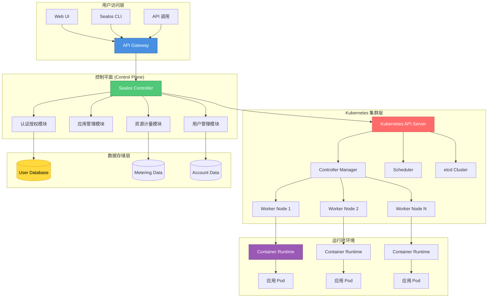
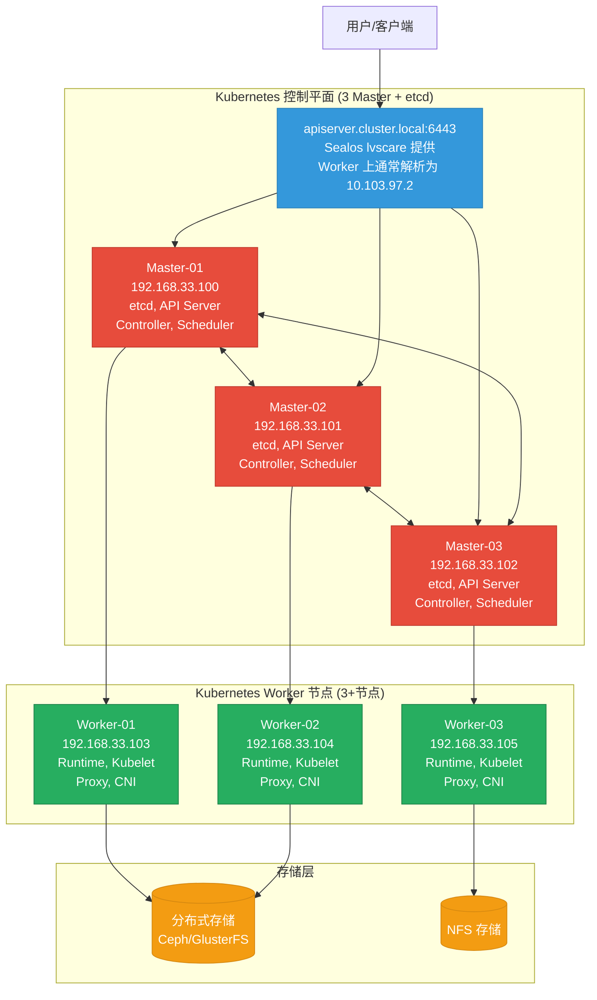

***

title: Sealos生产级部署与运维指南
author: devinyan
updated: 2026-03-11
version: v1
-----------

[TOC]

***

# Sealos生产级部署与运维指南

## 1. 简介

### 1.1 服务介绍与核心特性

**Sealos** 是一个基于 Kubernetes 构建的云操作系统（Cloud Operating System），旨在简化云原生应用的开发、部署和管理。它将 Kubernetes 的复杂性抽象为简洁的用户体验，让用户能够像使用个人电脑一样使用云资源。

#### 核心特性

- **一键式部署体验**：通过 Web 界面或命令行快速部署应用、数据库和对象存储
- **多云架构支持**：支持阿里云、腾讯云、AWS、Google Cloud 等主流云平台
- **自带应用市场**：内置丰富的应用模板（WordPress、Redis、MySQL、MongoDB 等）
- **按用量计费**：精确到秒级的资源计量，实现真正的按需付费
- **开源可控**：完全开源，支持私有化部署
- **Kubernetes 原生**：完全兼容 Kubernetes 生态系统
- **高可用架构**：支持多控制平面、多副本部署
- **开发者友好**：提供 CLI 工具和 API，便于 DevOps 集成

### 1.2 适用场景

| 场景            | 说明                                      |
| ------------- | --------------------------------------- |
| **企业应用托管**    | 中小型企业的业务系统、OA、ERP 等应用托管                 |
| **开发测试环境**    | 快速搭建开发、测试、预发布环境                         |
| **微服务架构**     | 支持容器化的微服务部署与管理                          |
| **数据库服务**     | 提供高可用的托管数据库服务（MySQL、Redis、PostgreSQL 等） |
| **CI/CD 流水线** | 与 GitLab、Gitea 等 CI/CD 工具集成             |
| **私有云平台**     | 企业内部私有云平台建设                             |
| **教育与培训**：    | 云原生技术教学与实践环境                            |

### 1.3 架构原理图



**架构说明：**

- **用户访问层**：提供 Web UI、CLI 和 API 三种交互方式
- **控制平面**：Sealos 核心组件，处理用户请求并管理 Kubernetes 集群
- **Kubernetes 集群层**：底层容器编排引擎
- **数据存储层**：存储用户、计量和账户数据
- **运行时环境**：实际运行用户应用容器

### 1.4 版本说明

- **Sealos CLI**：v5.1.1+（生产环境优先使用 v5 新格式 Clusterfile）
- **Kubernetes**：v1.28.x（成熟稳定，生态适配充分）
- **容器运行时**：Containerd（由 `labring/kubernetes:*` 集群镜像内置安装）
- **CNI**：Calico v3.26.x（生产常用，排障经验丰富）
- **Helm**：v3.12.x（与应用交付强相关）
- **操作系统**：Rocky Linux 9（主线）；Ubuntu 22.04 仅在差异处补充

***

## 2. 版本选择指南

### 2.1 版本对应关系表

| Sealos 版本 | Kubernetes 版本   | 发布日期    | 状态     | 推荐场景     |
| --------- | --------------- | ------- | ------ | -------- |
| **5.0.x** | 1.28.x - 1.29.x | 2024-Q4 | 稳定版    | 生产环境（推荐） |
| **4.3.x** | 1.26.x - 1.27.x | 2024-Q2 | 维护模式   | 现有生产环境   |
| **4.2.x** | 1.25.x          | 2023-Q4 | 即将 EOL | 建议升级     |
| **4.1.x** | 1.24.x          | 2023-Q2 | 已 EOL  | 不建议使用    |

### 2.2 版本决策建议

**选择 Sealos 5.0.x 系列的情况：**

- 新建生产环境部署
- 需要最新的 Kubernetes 特性支持
- 对安全性有较高要求
- 计划长期维护的集群

**选择 Sealos 4.3.x 系列的情况：**

- 现有集群稳定运行，暂无升级需求
- 需要与特定版本的 Kubernetes 工具链兼容
- 团队对特定版本有运维经验

**版本升级注意事项：**

- 小版本升级（如 4.3.0 → 4.3.5）：可直接升级，风险较低
- 大版本升级（如 4.x → 5.0）：建议先在测试环境验证，制定详细的回滚方案
- 升级前务必备份 etcd 数据和重要配置文件

***

## 3. 生产环境规划（高可用架构）

### 3.1 集群架构图



### 3.2 节点角色与配置要求

#### Master 节点配置（3 节点）

| 配置项      | 最低配置                                       | 推荐配置                                       | 说明                       |
| -------- | ------------------------------------------ | ------------------------------------------ | ------------------------ |
| **CPU**  | 4 Core                                     | 8 Core+                                    | etcd 和 API Server 消耗 CPU |
| **内存**   | 8 GB                                       | 16 GB+                                     | etcd 需要充足内存              |
| **磁盘**   | 100 GB SSD                                 | 200 GB NVMe SSD                            | 系统盘 + etcd 数据            |
| **网络**   | 1 Gbps                                     | 10 Gbps                                    | 节点间通信带宽                  |
| **操作系统** | Rocky Linux 9 / Ubuntu 22.04               | Rocky Linux 9 / Ubuntu 22.04               | 保持版本一致                   |
| **角色**   | etcd + API Server + Controller + Scheduler | etcd + API Server + Controller + Scheduler | 全功能控制平面                  |

#### Worker 节点配置（3+ 节点）

| 配置项      | 最低配置                         | 推荐配置                         | 说明         |
| -------- | ---------------------------- | ---------------------------- | ---------- |
| **CPU**  | 4 Core                       | 16 Core+                     | 根据业务负载调整   |
| **内存**   | 16 GB                        | 64 GB+                       | 根据应用需求调整   |
| **磁盘**   | 200 GB SSD                   | 500 GB NVMe SSD              | 容器镜像 + 数据卷 |
| **网络**   | 1 Gbps                       | 10 Gbps                      | 业务流量带宽     |
| **操作系统** | Rocky Linux 9 / Ubuntu 22.04 | Rocky Linux 9 / Ubuntu 22.04 | 保持版本一致     |
| **角色**   | Kubelet + Proxy + Runtime    | Kubelet + Proxy + Runtime    | 工作负载节点     |

### 3.3 网络与端口规划

#### Master 节点网络端口

| 源地址           | 目标端口  | 协议  | 用途                    |
| ------------- | ----- | --- | --------------------- |
| 客户端/执行机 → apiserver.cluster.local | 6443  | TCP | Kubernetes API Server |
| Master 节点间    | 2380  | TCP | etcd peer 通信          |
| Master 节点间    | 2379  | TCP | etcd client 通信        |
| 所有节点          | 10250 | TCP | Kubelet API           |
| Worker 节点     | 10259 | TCP | Scheduler 健康          |
| Worker 节点     | 10257 | TCP | Controller Manager 健康 |
| 监控节点          | 9100  | TCP | Node Exporter（可选）     |
| 监控节点          | 10249 | TCP | kube-proxy 健康检查       |

#### Worker 节点网络端口

| 源地址       | 目标端口        | 协议      | 用途                       |
| --------- | ----------- | ------- | ------------------------ |
| Master 节点 | 10250       | TCP     | Kubelet API              |
| 所有 Pod    | 30000-32767 | TCP/UDP | NodePort 服务范围            |
| CNI 插件    | 动态分配        | 协议依 CNI | Pod 网络通信（Calico/flannel） |
| 外部访问      | 80/443      | TCP     | Ingress HTTP/HTTPS       |

#### 控制平面入口网络端口

| 源地址        | 目标端口 | 协议  | 用途                     |
| ---------- | ---- | --- | ---------------------- |
| 用户/客户端/执行机 | 6443 | TCP | Kubernetes API 访问（apiserver.cluster.local） |

#### 存储节点网络端口（以 Ceph 为例）

| 源地址  | 目标端口      | 协议  | 用途           |
| ---- | --------- | --- | ------------ |
| 所有节点 | 6789      | TCP | Ceph Monitor |
| 所有节点 | 6800-7300 | TCP | Ceph OSD     |
| 所有节点 | 3300      | TCP | Ceph RBD GW  |

***

## 4. 生产环境部署

### 4.1 前置准备（所有节点）

#### 4.1.1 系统初始化

本节不再要求手工配置主机名与 `/etc/hosts`。只需确保：

- 所有节点 `hostname` 唯一且可解析（通过企业 DNS 或 `/etc/hosts` 均可）
- 所有节点之间网络互通，满足端口规划要求

#### 4.1.2 关闭 Swap 分区

本节不再提供 Swap 操作命令。若环境基线已统一处理（例如镜像/初始化脚本已关闭 Swap），可直接跳过。

#### 4.1.3 配置内核参数

本指南不再单独提供内核参数/模块优化配置，Sealos 会在集群初始化流程中完成必要的环境检查与配置。

#### 4.1.4 配置时间同步

```bash
# ── Rocky Linux 9 ──────────────────────────
# 安装 chrony
dnf install -y chrony

# 启动并启用 chronyd
systemctl enable --now chronyd

# 验证时间同步
chronyc sources -v

# ── Ubuntu 22.04 ───────────────────────────
# 安装 chrony
apt-get install -y chrony

# 启动并启用 chronyd
systemctl enable --now chronyd

# 验证时间同步
chronyc sources -v
```

#### 4.1.5 配置防火墙规则

```bash
# ── Rocky Linux 9 (使用 firewalld) ──────────────────────────
# Master 节点
firewall-cmd --permanent --add-port=6443/tcp
firewall-cmd --permanent --add-port=2379-2380/tcp
firewall-cmd --permanent --add-port=10250/tcp
firewall-cmd --permanent --add-port=10259/tcp
firewall-cmd --permanent --add-port=10257/tcp
firewall-cmd --permanent --add-port=9100/tcp
firewall-cmd --reload

# Worker 节点
firewall-cmd --permanent --add-port=10250/tcp
firewall-cmd --permanent --add-port=30000-32767/tcp
firewall-cmd --permanent --add-port=30000-32767/udp
firewall-cmd --reload

# ── Ubuntu 22.04 (使用 ufw) ───────────────────────────
# Master 节点
ufw allow 6443/tcp
ufw allow 2379:2380/tcp
ufw allow 10250/tcp
ufw allow 10259/tcp
ufw allow 10257/tcp
ufw allow 9100/tcp

# Worker 节点
ufw allow 10250/tcp
ufw allow 30000:32767/tcp
ufw allow 30000:32767/udp
```

### 4.2 部署步骤（以 Rocky Linux 9 为主线）

#### 4.2.1 容器运行时（Sealos 自动安装）

Sealos 集群镜像已内置并自动安装容器运行时（containerd），无需在节点上提前手动安装或配置。

如果节点上已安装过 containerd，请先卸载后再执行 `sealos apply`，否则会触发运行时冲突检查：

```bash
# ── Rocky Linux 9 ──────────────────────────
systemctl disable --now containerd || true
dnf remove -y containerd.io containerd || true
rm -rf /etc/containerd /var/lib/containerd /run/containerd

# ── Ubuntu 22.04（差异）────────────────────
# 其余步骤与 Rocky Linux 9 相同，仅以下命令不同：
systemctl disable --now containerd || true
apt-get remove -y containerd.io containerd || true
apt-get purge  -y containerd.io containerd || true
rm -rf /etc/containerd /var/lib/containerd /run/containerd
```

#### 4.2.2 安装 Sealos

```bash
SEALOS_VERSION="5.1.1"  # ← 根据需要修改版本

[ -f "sealos_${SEALOS_VERSION}_linux_amd64.tar.gz" ] || wget https://github.com/labring/sealos/releases/download/v${SEALOS_VERSION}/sealos_${SEALOS_VERSION}_linux_amd64.tar.gz
tar -zxf sealos_${SEALOS_VERSION}_linux_amd64.tar.gz
mv sealos /usr/local/bin/
chmod +x /usr/local/bin/sealos

# 验证安装
sealos version
```

解压包内文件说明：

- `sealos`：Sealos 主命令，负责集群创建/扩容/升级/应用交付等核心能力（实际运行时主要用它）
- `sealctl`：Sealos 辅助管理工具，常用于集群运维/诊断类的配套命令（按需使用）
- `lvscare`：Sealos 组件之一，用于在集群中提供/维护 LVS 相关能力（通常作为组件随集群使用，不必单独手工执行）
- `image-cri-shim`：镜像相关的 CRI 适配组件，用于与容器运行时/CRI 交互的场景（通常随 Sealos 流程或组件使用）
- `README.md`：当前版本的发行包说明、用法提示与变更信息

### 4.4 集群初始化与配置

#### 4.4.1 配置 Sealos 集群配置文件（Clusterfile）

> ⚠️ **重要**：Sealos v5 使用全新的 API `apps.sealos.io/v1beta1`，配置文件格式与 v4 完全不同。本节内容基于 **v5.1.1 实际输出**，请勿使用旧文档或网络上的旧格式。

在 **Master-01** 节点上创建工作目录并生成集群配置文件：

```bash
# ── 所有系统通用 ──────────────────────────
mkdir -p /root/sealos
cd /root/sealos

# ── 步骤一：用 sealos gen 生成基础 Clusterfile（推荐）──────────
# sealos gen 会根据你的镜像列表和节点信息生成完整的多文档 YAML
# 生成后再手动调整 certSANs、Pod 网段等参数
sealos gen \
  labring/kubernetes:v1.28.0 \
  labring/helm:v3.12.0 \
  labring/calico:v3.26.1 \
  --masters 192.168.33.100,192.168.33.101,192.168.33.102 \
  --nodes   192.168.33.103,192.168.33.104,192.168.33.105 \
  --passwd  'YourStrongPassword' \
  --output  Clusterfile

# 生成完成后查看文件（共 5 个 YAML 文档）
cat Clusterfile
```

**完整 Clusterfile 说明（基于 sealos gen 实际输出，含生产调优注释）**：

```yaml
# ═══════════════════════════════════════════════════════════
# 文档 1/5：Cluster（Sealos 自有资源，定义集群整体）
# ═══════════════════════════════════════════════════════════
apiVersion: apps.sealos.io/v1beta1   # ★ v5 固定 API 版本，不可改为 sealos.io/v1beta1
kind: Cluster
metadata:
  name: default                       # 集群名称，sealos status 等命令会用到
spec:
  # ★ 镜像列表（Sealos 会按顺序加载）
  # 可到 https://hub.sealos.io 或 https://explore.ggcr.dev 查询可用版本
  image:
    - labring/kubernetes:v1.28.0   # ★ K8s 核心组件（含 kubelet/kubeadm/kubectl/containerd）
    - labring/helm:v3.12.0         # ★ Helm 包管理器
    - labring/calico:v3.26.1       # ★ CNI 网络插件（也可替换为 cilium/flannel）

  # ★ SSH 认证配置（Sealos 通过 SSH 管理所有节点，无需预先安装 Agent）
  ssh:
    passwd: 'YourStrongPassword'   # ⚠️ 生产环境建议改用私钥认证
    pk: /root/.ssh/id_rsa          # ← 若用私钥，取消此行注释，注释 passwd
    # pkPasswd: ''                 # 私钥密码（如有）
    port: 22                       # SSH 端口，可按需修改

  # ★ 节点规划（v5 格式：hosts 数组 + roles，不再是 masters/nodes 并列字段）
  hosts:
    - roles: [master, amd64]       # master = control-plane；amd64 为架构标签
      ips:
        - 192.168.33.100:22        # ← 根据实际 IP 修改，格式 IP:Port
        - 192.168.33.101:22
        - 192.168.33.102:22
    - roles: [node, amd64]         # node = worker
      ips:
        - 192.168.33.103:22
        - 192.168.33.104:22
        - 192.168.33.105:22

---
# ═══════════════════════════════════════════════════════════
# 文档 2/5：InitConfiguration（kubeadm 初始化配置）
# ═══════════════════════════════════════════════════════════
apiVersion: kubeadm.k8s.io/v1beta3
kind: InitConfiguration
localAPIEndpoint:
  advertiseAddress: 192.168.33.100   # ★ 第一个 Master 的实际 IP（由 sealos gen 自动填充）
  bindPort: 6443
nodeRegistration:
  kubeletExtraArgs:
    node-ip: 192.168.33.100          # ★ 与 advertiseAddress 保持一致
    pod-infra-container-image: registry.cn-hangzhou.aliyuncs.com/google_containers/pause:3.9
  taints: null                        # 不指定自定义 taint；默认仍会给控制平面节点打 NoSchedule 污点。若需允许在 Master 调度可改为 taints: []

---
# ═══════════════════════════════════════════════════════════
# 文档 3/5：ClusterConfiguration（kubeadm 集群配置）
# ═══════════════════════════════════════════════════════════
apiVersion: kubeadm.k8s.io/v1beta3
kind: ClusterConfiguration
kubernetesVersion: v1.28.0
imageRepository: registry.cn-hangzhou.aliyuncs.com/google_containers
# ★ 控制平面入口（Sealos v5：由 lvscare 管理）
# - Master 节点上：apiserver.cluster.local 通常解析为“本机 Master IP”
# - Worker 节点上：apiserver.cluster.local 通常解析为 “10.103.97.2”（lvscare 虚拟 IP）
controlPlaneEndpoint: apiserver.cluster.local:6443

networking:
  podSubnet: 100.64.0.0/10           # ★ Pod 网段，避免与物理网络冲突
  serviceSubnet: 10.96.0.0/16        # ★ Service 网段

apiServer:
  # ★ 证书 SAN：API Server 证书中的额外域名/IP，客户端通过这些地址访问需提前配置
  certSANs:
    - 127.0.0.1
    - apiserver.cluster.local         # ★ Sealos 控制平面入口域名
    - 192.168.33.100                  # ← Master1 实际 IP
    - 192.168.33.101                  # ← Master2 实际 IP
    - 192.168.33.102                  # ← Master3 实际 IP
    # 可按需追加访问域名：
    # - k8s.example.com
    # - apiserver.cluster.local
  extraArgs:
    # 审计日志（生产必开）
    audit-log-format: json
    audit-log-maxage: "7"
    audit-log-maxbackup: "10"
    audit-log-maxsize: "100"
    audit-log-path: /var/log/kubernetes/audit.log
    audit-policy-file: /etc/kubernetes/audit-policy.yml
    enable-aggregator-routing: "true"
    feature-gates: ""
  extraVolumes:
    - hostPath: /etc/kubernetes
      mountPath: /etc/kubernetes
      name: audit
      pathType: DirectoryOrCreate
    - hostPath: /var/log/kubernetes
      mountPath: /var/log/kubernetes
      name: audit-log
      pathType: DirectoryOrCreate
    - hostPath: /etc/localtime
      mountPath: /etc/localtime
      name: localtime
      pathType: File
      readOnly: true

controllerManager:
  extraArgs:
    bind-address: 0.0.0.0
    # ★ 证书有效期延长至 10 年（默认 1 年，生产环境推荐延长）
    cluster-signing-duration: 876000h
    feature-gates: ""
  extraVolumes:
    - hostPath: /etc/localtime
      mountPath: /etc/localtime
      name: localtime
      pathType: File
      readOnly: true

scheduler:
  extraArgs:
    bind-address: 0.0.0.0
    feature-gates: ""
  extraVolumes:
    - hostPath: /etc/localtime
      mountPath: /etc/localtime
      name: localtime
      pathType: File
      readOnly: true

etcd:
  local:
    dataDir: ""                       # 留空使用默认 /var/lib/etcd
    extraArgs:
      listen-metrics-urls: http://0.0.0.0:2381   # 暴露 metrics 给 Prometheus

dns: {}

---
# ═══════════════════════════════════════════════════════════
# 文档 4/5：KubeProxyConfiguration
# ═══════════════════════════════════════════════════════════
apiVersion: kubeproxy.config.k8s.io/v1alpha1
kind: KubeProxyConfiguration
# ★ 代理模式：ipvs（生产推荐，性能优于 iptables）
mode: ipvs
ipvs:
  excludeCIDRs: []
  strictARP: false
  syncPeriod: 30s
conntrack:
  maxPerCore: 32768
  min: 131072
  tcpEstablishedTimeout: 24h0m0s
  tcpCloseWaitTimeout: 1h0m0s
metricsBindAddress: 0.0.0.0:10249
healthzBindAddress: 0.0.0.0:10256
bindAddress: 0.0.0.0

---
# ═══════════════════════════════════════════════════════════
# 文档 5/5：KubeletConfiguration
# ═══════════════════════════════════════════════════════════
apiVersion: kubelet.config.k8s.io/v1beta1
kind: KubeletConfiguration
# ★ cgroup 驱动（需与 containerd 的 SystemdCgroup=true 保持一致）
cgroupDriver: systemd
containerRuntimeEndpoint: unix:///run/containerd/containerd.sock
# ★ 最大 Pod 数（根据节点配置调整，默认 110）
maxPods: 110
# ★ 驱逐阈值（生产环境防止节点资源耗尽）
evictionHard:
  imagefs.available: 10%
  memory.available: 100Mi
  nodefs.available: 10%
  nodefs.inodesFree: 5%
# 日志保留
containerLogMaxFiles: 5
containerLogMaxSize: 10Mi
# 提高 API 请求限速（高并发集群）
kubeAPIBurst: 100
kubeAPIQPS: 50
registryBurst: 100
registryPullQPS: 50
# 证书自动轮换
rotateCertificates: true
# 并发拉镜像（加快 Pod 启动）
serializeImagePulls: false
```

EOF

````


#### 4.4.2 初始化集群

在 **Master-01** 节点执行：

```bash
# ── 所有系统通用 ──────────────────────────
mkdir -p /root/sealos
cd /root/sealos

# ── SSH 认证说明 ───────────────────────────
# Sealos v5 会自动通过 Clusterfile 中的 ssh.passwd 或 ssh.pk 登录所有节点，
# 无需提前手动执行 ssh-copy-id。
#
# 方式一（密码认证，已在 Clusterfile 中设置）：
#   ssh.passwd 填好后，直接 sealos apply 即可，Sealos 会自动分发公钥
#
# 方式二（私钥认证，推荐生产环境）：
#   前提：执行机（Master-01）的 ~/.ssh/id_rsa 已存在
#   Clusterfile 中注释 passwd，启用 pk 字段即可
#   ssh-keygen -t rsa -b 4096 -C "sealos" -f ~/.ssh/id_rsa -N ""   # 若没有则生成

# ── 步骤一：先进行网络连通性验证 ────────────
# 验证从 Master-01 能到其他节点的 SSH（避免防火墙/密码问题导致 apply 中途失败）
ssh root@192.168.33.101 "hostname"
ssh root@192.168.33.102 "hostname"
ssh root@192.168.33.103 "hostname"

# ── 步骤二：执行集群初始化 ──────────────────
# Sealos v5 使用 apply 命令，不再支持旧版的 init
sealos apply -f Clusterfile

# 常见报错：hostname cannot be repeated
# - 原因 1：多台机器的 /etc/hostname 相同（例如都叫 localhost.localdomain）
# - 原因 2：Clusterfile 中 masters/nodes 列表写成了同一批 IP，导致同一台机器被重复加入（日志里会看到 worker 和 master IP 一样）
# 处理方式：
# - 确认每台机器 hostname 唯一：ssh root@<ip> "hostname"；必要时 hostnamectl set-hostname <unique-name>
# - 纠正 Clusterfile：三节点一套同时跑控制面与业务时，推荐 roles 直接写 [master, node, amd64]，不要把同一批 IP 同时写进 masters 和 nodes

# 集群初始化时间约 5-10 分钟，请耐心等待
# 出现 "succeeded" 或 kubectl get nodes 全部 Ready 即为成功

# ── 快速部署（单命令，不使用 Clusterfile）────
# 如果不需要自定义配置，也可以用 sealos run 一行命令完成部署
# sealos run \
#   labring/kubernetes:v1.28.0 \
#   labring/helm:v3.12.0 \
#   labring/calico:v3.26.1 \
#   --masters 192.168.33.100,192.168.33.101,192.168.33.102 \
#   --nodes   192.168.33.103,192.168.33.104,192.168.33.105 \
#   --passwd  'YourStrongPassword'
````

#### 4.4.3 验证集群状态

```bash
# ── 所有系统通用 ──────────────────────────
# 配置 kubectl
mkdir -p ~/.kube
cp /etc/kubernetes/admin.conf ~/.kube/config
chmod 600 ~/.kube/config

# 验证节点状态
kubectl get nodes -o wide

# 预期输出（所有节点应为 Ready 状态）：
# NAME                STATUS   ROLES           AGE   VERSION
# sealos-master-01    Ready    control-plane   10m   v1.29.0
# sealos-master-02    Ready    control-plane   9m    v1.29.0
# sealos-master-03    Ready    control-plane   8m    v1.29.0
# sealos-worker-01    Ready    <none>          7m    v1.29.0
# sealos-worker-02    Ready    <none>          7m    v1.29.0
# sealos-worker-03    Ready    <none>          7m    v1.29.0

# 验证 Pod 状态
kubectl get pods -A

# 预期输出（所有 Pod 应为 Running 状态）：
# NAMESPACE     NAME                                       READY   STATUS    RESTARTS   AGE
# kube-system   calico-kube-controllers-xxx               1/1     Running   0          10m
# kube-system   calico-node-xxx                           1/1     Running   0          10m
# kube-system   coredns-xxx                               1/1     Running   0          10m
# kube-system   etcd-sealos-master-01                     1/1     Running   0          10m

# 验证集群组件健康
kubectl get cs

# 验证网络连通性
kubectl get svc
```

#### 4.4.4 部署 Sealos Dashboard

```bash
# ── 所有系统通用 ──────────────────────────
# 使用 Sealos 部署 Dashboard
sealos run labring/sealos-dashboard:v5.0.0

# 或者使用 Helm 部署
# 添加 Sealos Helm 仓库
helm repo add sealos https://charts.sealos.io
helm repo update

# 部署 Dashboard
helm install sealos-dashboard sealos/sealos-dashboard \
  --namespace sealos-system \
  --create-namespace \
  --set domain=sealos.example.com \  # ← 根据实际域名修改
  --set ingress.enabled=true

# 获取访问地址
kubectl get svc -n sealos-system
```

### 4.5 安装验证（含预期输出）

#### 4.5.1 集群功能验证

```bash
# ── 所有系统通用 ──────────────────────────
# 1. 创建测试命名空间
kubectl create namespace test-namespace

# 预期输出：
# namespace/test-namespace created

# 2. 部署测试应用
kubectl create deployment nginx-test \
  --image=nginx:1.25 \
  --replicas=3 \
  -n test-namespace

# 预期输出：
# deployment.apps/nginx-test created

# 3. 暴露服务
kubectl expose deployment nginx-test \
  --port=80 \
  --target-port=80 \
  --type=NodePort \
  -n test-namespace

# 预期输出：
# service/nginx-test exposed

# 4. 验证 Pod 运行状态
kubectl get pods -n test-namespace

# 预期输出：
# NAME                          READY   STATUS    RESTARTS   AGE
# nginx-test-xxx-xxx            1/1     Running   0          30s
# nginx-test-xxx-yyy            1/1     Running   0          30s
# nginx-test-xxx-zzz            1/1     Running   0          30s

# 5. 验证服务端点
kubectl get endpoints nginx-test -n test-namespace

# 预期输出：
# NAME         ENDPOINTS                                      AGE
# nginx-test   100.64.0.1:80,100.64.0.2:80,100.64.0.3:80    1m

# 6. 测试访问
NODE_PORT=$(kubectl get svc nginx-test -n test-namespace -o jsonpath='{.spec.ports[0].nodePort}')
curl http://192.168.33.103:$NODE_PORT

# 预期输出（HTML 响应）：
# <!DOCTYPE html>
# <html>
# <head>
# <title>Welcome to nginx!</title>
# ...

# 7. 清理测试资源
kubectl delete namespace test-namespace

# 预期输出：
# namespace "test-namespace" deleted
```

#### 4.5.2 高可用验证

```bash
# 1) 验证通过 VIP 访问 API Server
kubectl get --raw='/readyz'
# 预期输出：ok

# 2) 模拟下线一个 Master（在被测试的 Master 上执行）
systemctl stop kubelet

# 3) 验证集群仍可访问（在另一台 Master 或原执行机上执行）
kubectl get nodes
# 预期输出：其余 Master 仍 Ready，可正常返回节点列表

# 4) 恢复该 Master
systemctl start kubelet

# ✅ 验证
kubectl get nodes
# 预期输出：所有节点恢复 Ready
```

***

## 5. 关键参数配置说明

### 5.1 核心配置文件详解（含逐行注释）

#### 5.1.1 Kubernetes API Server 配置

API Server 相关参数由 `Clusterfile` 的 kubeadm 配置（`ClusterConfiguration.apiServer`）统一下发。

> ⚠️ 不建议直接修改 `/etc/kubernetes/manifests/kube-apiserver.yaml`（静态 Pod 清单由 kubeadm 管理，手工改动容易被覆盖且不便回溯）。

```yaml
# Clusterfile（文档 3/5：ClusterConfiguration）示例摘录
apiVersion: kubeadm.k8s.io/v1beta3
kind: ClusterConfiguration
kubernetesVersion: v1.28.0
imageRepository: registry.cn-hangzhou.aliyuncs.com/google_containers
controlPlaneEndpoint: apiserver.cluster.local:6443   # ★ Sealos 控制平面入口（Worker 上通常解析为 10.103.97.2）

networking:
  podSubnet: 100.64.0.0/10                  # ★
  serviceSubnet: 10.96.0.0/16               # ★

apiServer:
  certSANs:
    - apiserver.cluster.local                # ★ 证书 SAN：入口域名
    - 192.168.33.100
    - 192.168.33.101
    - 192.168.33.102
  extraArgs:
    audit-log-format: json
    audit-log-maxage: "7"
    audit-log-maxbackup: "10"
    audit-log-maxsize: "100"
    audit-log-path: /var/log/kubernetes/audit.log
    audit-policy-file: /etc/kubernetes/audit-policy.yml
```

```bash
# ✅ 验证
kubectl get pods -n kube-system -o wide | grep kube-apiserver
# 预期输出：kube-apiserver-* 为 Running
```

#### 5.1.2 Kubelet 配置

Kubelet 参数由 `InitConfiguration.nodeRegistration.kubeletExtraArgs`（节点注册参数）与 `KubeletConfiguration`（kubelet 配置）共同决定。

> ⚠️ 不建议直接覆盖写入 `/var/lib/kubelet/config.yaml`（该文件由 kubeadm 生成/维护）。

```yaml
# Clusterfile（文档 2/5：InitConfiguration）示例摘录
apiVersion: kubeadm.k8s.io/v1beta3
kind: InitConfiguration
nodeRegistration:
  kubeletExtraArgs:
    node-ip: 192.168.33.100
    pod-infra-container-image: registry.cn-hangzhou.aliyuncs.com/google_containers/pause:3.9

---
# Clusterfile（文档 5/5：KubeletConfiguration）示例摘录
apiVersion: kubelet.config.k8s.io/v1beta1
kind: KubeletConfiguration
cgroupDriver: systemd
maxPods: 110
serializeImagePulls: false
evictionHard:
  imagefs.available: 10%
  memory.available: 100Mi
  nodefs.available: 10%
  nodefs.inodesFree: 5%
```

```bash
# ✅ 验证
kubectl get nodes -o wide
# 预期输出：所有节点为 Ready
```

### 5.2 生产环境推荐调优参数

#### 5.2.1 集群级别调优

集群级别调优优先通过 `Clusterfile` 下发，避免运行后再手工修改静态 Pod/ConfigMap 造成不可追溯。

```yaml
# etcd 调优（Clusterfile：文档 3/5，ClusterConfiguration.etcd.local.extraArgs）
etcd:
  local:
    extraArgs:
      snapshot-count: "10000"          # ⚠️ 按写入量调整
      quota-backend-bytes: "2147483648"

---
# kube-proxy 代理模式（Clusterfile：文档 4/5，KubeProxyConfiguration）
mode: ipvs
```

```bash
# ✅ 验证
kubectl get pods -n kube-system -o wide | egrep 'coredns|kube-proxy|etcd'
# 预期输出：核心组件 Running
```

#### 5.2.2 节点级别调优

本指南不再提供节点内核参数优化与 containerd 调优配置，避免与 Sealos 的集群镜像内置组件产生冲突。调优建议以实际监控指标为准，按需在业务侧与系统侧逐项验证后落地。

#### 5.2.3 应用级别调优建议

| 调优项               | 推荐配置                             | 说明         |
| ----------------- | -------------------------------- | ---------- |
| **资源请求（Request）** | 根据实际使用量设置                        | 避免过度分配     |
| **资源限制（Limit）**   | Request 的 1.5-2 倍                | 防止资源耗尽     |
| **副本数**           | 生产环境至少 3 副本                      | 保证高可用      |
| **亲和性**           | 跨节点分散部署                          | 避免单点故障     |
| **健康检查**          | 配置就绪和存活探针                        | 自动恢复异常 Pod |
| **优雅关闭**          | 设置 terminationGracePeriodSeconds | 默认 30 秒    |
| **Pod 反亲和性**      | 关键应用必须配置                         | 避免同节点调度    |

***

## 6. 快速体验部署（开发 / 测试环境）

### 6.1 快速启动方案选型

Sealos 本身就是集群生命周期管理工具，开发/测试环境优先使用 **单机最小化集群**（VM/物理机直接部署），不采用 Docker Compose 的“容器里再跑容器”方案。

> ⚠️ 本章仅用于开发/测试环境验证流程，严禁用于生产。

### 6.2 快速启动步骤与验证

> 🖥️ **执行节点：单机（同时作为执行机与节点）**

```bash
mkdir -p /root/sealos-dev
cd /root/sealos-dev

# 如节点已预装 containerd，先按 4.2.1 卸载，避免运行时冲突

sealos run \
  labring/kubernetes:v1.28.0 \
  labring/helm:v3.12.0 \
  labring/calico:v3.26.1 \
  --single \
  --passwd 'YourStrongPassword'

# ✅ 验证
kubectl get nodes -o wide
# 预期输出：只有 1 个节点且为 Ready

kubectl get pods -A
# 预期输出：kube-system 命名空间核心组件均为 Running
```

### 6.3 停止与清理

> �️ **执行节点：单机（同上）**

```bash
sealos reset --force

# ✅ 验证
kubectl get nodes
# 预期输出：无法连接到集群（已清理）
```

***

## 7. 日常运维操作

### 7.1 常用管理命令

#### 7.1.1 集群管理命令

```bash
# ── 所有系统通用 ──────────────────────────
# 1. 查看集群信息
kubectl cluster-info
kubectl version

# 2. 查看节点状态
kubectl get nodes -o wide
kubectl describe node <node-name>

# 3. 查看集群资源使用
kubectl top nodes
kubectl top pods -A

# 4. 查看命名空间
kubectl get ns
kubectl create namespace <namespace-name>

# 5. 查看所有 Pod
kubectl get pods -A
kubectl get pods -n <namespace>

# 6. 查看资源详情
kubectl describe pod <pod-name> -n <namespace>
kubectl describe deployment <deployment-name> -n <namespace>
kubectl describe svc <service-name> -n <namespace>

# 7. 查看 Pod 日志
kubectl logs <pod-name> -n <namespace>
kubectl logs <pod-name> -n <namespace> --tail=100 -f

# 8. 进入 Pod 容器
kubectl exec -it <pod-name> -n <namespace> -- sh

# 9. 端口转发（本地调试）
kubectl port-forward svc/<service-name> 8080:80 -n <namespace>

# 10. 从本地复制文件到 Pod
kubectl cp /local/file.txt <pod-name>:/remote/ -n <namespace>

# 11. 从 Pod 复制文件到本地
kubectl cp <pod-name>:/remote/file.txt /local/ -n <namespace>

# 12. 标注节点
kubectl label nodes <node-name> key=value

# 13. 污点节点（禁止调度）
kubectl taint nodes <node-name> key=value:NoSchedule

# 14. 删除污点
kubectl taint nodes <node-name> key:NoSchedule-

# 15. 驱逐 Pod（用于维护）
kubectl drain <node-name> --ignore-daemonsets --delete-emptydir-data

# 16. 恢复节点调度
kubectl uncordon <node-name>
```

#### 7.1.2 Sealos CLI 命令

```bash
sealos version

sealos status

# 生成 Clusterfile（推荐用 --output，避免重定向把日志写进文件）
sealos gen labring/kubernetes:v1.28.0 labring/helm:v3.12.0 labring/calico:v3.26.1 \
  --masters 192.168.33.100,192.168.33.101,192.168.33.102 \
  --nodes 192.168.33.103,192.168.33.104 \
  --passwd 'YourStrongPassword' \
  --output Clusterfile

# 创建/更新集群（基于 Clusterfile）
sealos apply -f Clusterfile

# 快速部署（不写 Clusterfile，适合快速验证）
sealos run labring/kubernetes:v1.28.0 labring/calico:v3.26.1 --masters 192.168.33.100 --nodes 192.168.33.103 --passwd 'YourStrongPassword'

# 扩缩容
sealos add --masters 192.168.33.106
sealos add --nodes 192.168.33.107,192.168.33.108
sealos delete --nodes 192.168.33.108

# 远程操作（批量执行命令/拷贝文件）
sealos exec --help
sealos scp --help

# 集群清理（高危：会重置集群并清理节点上的 Kubernetes/Sealos 数据）
sealos reset

# 其他命令（按需查看）
sealos cert --help
sealos registry --help
sealos images --help
```

**集群清理（reset）说明：**

- `sealos reset` 用于**卸载/重置整个集群**：会通过 SSH 在各节点清理 kubelet、静态 Pod、CNI、etcd/k8s 数据目录等，使节点回到可重新部署的状态。
- 建议在“部署集群的同一台执行机”上运行（能免密/同密码 SSH 到所有节点的那台机器）。
- 如果只是移除某个节点，优先使用 `sealos delete --nodes ...` / `sealos delete --masters ...`，不要直接 reset 整个集群。

```bash
# 交互式重置（默认会提示确认）
sealos reset

# 强制重置（适合自动化/无人值守）
sealos reset --force
```

#### 7.1.3 应用管理命令

```bash
# ── 所有系统通用 ──────────────────────────
# 1. 创建 Deployment
kubectl create deployment <name> --image=<image> --replicas=<count>

# 2. 扩缩容
kubectl scale deployment <name> --replicas=<count> -n <namespace>

# 3. 更新镜像
kubectl set image deployment/<name> <container>=<new-image> -n <namespace>

# 4. 回滚
kubectl rollout undo deployment/<name> -n <namespace>

# 5. 查看滚动更新状态
kubectl rollout status deployment/<name> -n <namespace>

# 6. 查看更新历史
kubectl rollout history deployment/<name> -n <namespace>

# 7. 暂停更新
kubectl rollout pause deployment/<name> -n <namespace>

# 8. 恢复更新
kubectl rollout resume deployment/<name> -n <namespace>

# 9. 自动扩缩容
kubectl autoscale deployment <name> --min=2 --max=10 --cpu-percent=80 -n <namespace>

# 10. 创建 Service
kubectl expose deployment <name> --port=80 --type=ClusterIP -n <namespace>

# 11. 创建 Ingress
kubectl create ingress <name> --class=nginx \
  --rule=example.com/=app-service:80 -n <namespace>

# 12. 创建 ConfigMap
kubectl create configmap <name> --from-file=file.txt --from-literal=key=value

# 13. 创建 Secret
kubectl create secret generic <name> --from-literal=password=secret123

# 14. 应用资源清单
kubectl apply -f deployment.yaml

# 15. 删除资源
kubectl delete deployment <name> -n <namespace>
kubectl delete -f deployment.yaml

# 16. 强制删除 Pod
kubectl delete pod <pod-name> -n <namespace> --force --grace-period=0
```

### 7.2 备份与恢复

#### 7.2.1 etcd 备份（物理备份）

```bash
# 🖥️ 执行节点：任意一台 Master 节点
mkdir -p /backup

kubectl -n kube-system get pods | grep '^etcd-'
ETCD_POD="$(kubectl -n kube-system get pods -o name | awk -F/ '$2 ~ /^etcd-/{print $2; exit}')"
SNAP="etcd-snapshot-$(date +%F-%H%M).db"

ETCD_CID=""
if kubectl -n kube-system exec "$ETCD_POD" -- sh -c "ETCDCTL_API=3 etcdctl \
  --endpoints=https://127.0.0.1:2379 \
  --cacert=/etc/kubernetes/pki/etcd/ca.crt \
  --cert=/etc/kubernetes/pki/etcd/healthcheck-client.crt \
  --key=/etc/kubernetes/pki/etcd/healthcheck-client.key \
  snapshot save /var/lib/etcd/$SNAP"; then
  kubectl -n kube-system exec "$ETCD_POD" -- sh -c "ETCDCTL_API=3 etcdctl snapshot status /var/lib/etcd/$SNAP"
else
  ETCD_CID="$(crictl ps -a --name etcd -q | head -n 1)"
  crictl exec "$ETCD_CID" sh -c "ETCDCTL_API=3 etcdctl \
    --endpoints=https://127.0.0.1:2379 \
    --cacert=/etc/kubernetes/pki/etcd/ca.crt \
    --cert=/etc/kubernetes/pki/etcd/healthcheck-client.crt \
    --key=/etc/kubernetes/pki/etcd/healthcheck-client.key \
    snapshot save /var/lib/etcd/$SNAP"

  crictl exec "$ETCD_CID" sh -c "ETCDCTL_API=3 etcdctl snapshot status /var/lib/etcd/$SNAP"
fi

cp -a "/var/lib/etcd/$SNAP" "/backup/$SNAP"
ls -lh "/backup/$SNAP"
```

#### 7.2.2 etcd 恢复

```bash
# 🖥️ 执行节点：任意一台 Master 节点
# ⚠️ etcd 灾难恢复会导致控制面中断。生产请先演练并严格按官方流程执行。

# 0) 选定快照文件（在 Master 上）
SNAP=/backup/etcd-snapshot-YYYY-MM-DD-HHMM.db

# 1) 准备：把快照放到 etcd 的 hostPath（容器与宿主机都能访问）
cp -a "$SNAP" /var/lib/etcd/restore.db
rm -rf /var/lib/etcd-restore

# 2) 从 etcd 静态 Pod 清单获取当前节点的恢复参数（每台 Master 都不一样）
ETCD_YAML=/etc/kubernetes/manifests/etcd.yaml
grep -E -- '--name=|--initial-advertise-peer-urls=|--initial-cluster=|--initial-cluster-token=' "$ETCD_YAML"

# 3) 把上一步 grep 输出的值填到下面 4 个变量（在每台 Master 上分别执行）
NAME="<this-master-node-name>"
INITIAL_ADVERTISE_PEER_URLS="https://<this-master-ip>:2380"
INITIAL_CLUSTER="<master1-name>=https://<master1-ip>:2380,<master2-name>=https://<master2-ip>:2380,<master3-name>=https://<master3-ip>:2380"
INITIAL_CLUSTER_TOKEN="<cluster-token>"

# 4) 使用 etcd 容器内的 etcdctl 做 restore（不依赖容器内 env/etcdutl）
ETCD_CID="$(crictl ps -a --name etcd -q | head -n 1)"
crictl exec "$ETCD_CID" sh -c "ETCDCTL_API=3 etcdctl snapshot restore /var/lib/etcd/restore.db \
  --data-dir=/var/lib/etcd-restore \
  --name=$NAME \
  --initial-advertise-peer-urls=$INITIAL_ADVERTISE_PEER_URLS \
  --initial-cluster=$INITIAL_CLUSTER \
  --initial-cluster-token=$INITIAL_CLUSTER_TOKEN"

# 5) 切换数据目录（该 Master 上）
systemctl stop kubelet
mv /var/lib/etcd "/var/lib/etcd.bak-$(date +%F-%H%M)"
mv /var/lib/etcd-restore /var/lib/etcd
systemctl start kubelet

# 6) 清理临时文件
rm -f /var/lib/etcd/restore.db
```

#### 7.2.3 资源备份（逻辑备份）

```bash
# ── 所有系统通用 ──────────────────────────
# 1. 备份所有命名空间的资源
kubectl get all --all-namespaces -o yaml > /backup/k8s-resources-$(date +%Y%m%d).yaml

# 2. 备份特定命名空间
kubectl get all -n <namespace> -o yaml > /backup/k8s-<namespace>-$(date +%Y%m%d).yaml

# 3. 备份单个资源
kubectl get deployment <deployment-name> -n <namespace> -o yaml > /backup/deployment-<name>.yaml

# 4. 使用 Velero 备份（推荐）
# 安装 Velero
velero install \
  --provider aws \
  --plugins velero/velero-plugin-for-aws:v1.8.0 \
  --bucket velero \
  --secret-file /credentials/velero-aws \
  --use-volume-snapshots=true \
  --backup-location-config region=us-east-1

# 创建备份
velero backup create <backup-name> --include-namespaces <namespace>

# 定时备份（每天凌晨 3 点）
velero schedule create daily-backup --schedule="0 3 * * *" --ttl 168h

# 恢复备份
velero restore create --from-backup <backup-name>
```

### 7.3 集群扩缩容

#### 7.3.1 添加 Worker 节点

```bash
# ── 所有系统通用 ──────────────────────────
# 1. 准备新节点（参考第 4.1 节前置准备）

# 2. 使用 Sealos 添加节点
sealos add --nodes 192.168.33.105,192.168.33.106 --passwd 'YourStrongPassword'

# 3. 验证节点加入
kubectl get nodes

# 4. 给新节点打标签（可选）
kubectl label node <node-name> node-role.kubernetes.io/worker=
kubectl label node <node-name> zone=us-west-1
```

#### 7.3.2 添加 Master 节点

```bash
# ── 所有系统通用 ──────────────────────────
# 1. 准备新 Master 节点（参考第 4.1 节前置准备）

# 2. 使用 Sealos 添加 Master 节点
sealos add --masters 192.168.33.107 --passwd 'YourStrongPassword'

# 3. 验证控制平面状态
kubectl get nodes -o wide
kubectl get --raw='/readyz'
```

#### 7.3.3 删除节点

```bash
# ── 所有系统通用 ──────────────────────────
# 1. 驱逐节点上的 Pod
kubectl drain <node-name> --ignore-daemonsets --delete-emptydir-data

# 2. 使用 Sealos 删除节点
sealos delete --nodes <node-ip>

# 3. 验证节点删除
kubectl get nodes

# 4. 清理节点（在被删除的节点上执行）
kubeadm reset
rm -rf /etc/cni/net.d
rm -rf /var/lib/kubelet
iptables -F && iptables -t nat -F && iptables -t mangle -F && iptables -X
```

### 7.4 版本升级（★ 必须包含回滚方案）

#### 7.4.1 升级准备

```bash
# ── 所有系统通用 ──────────────────────────
# 1. 备份集群（⚠️ 必须执行）
mkdir -p /backup
kubectl -n kube-system get pods | grep '^etcd-'
ETCD_POD="$(kubectl -n kube-system get pods -o name | awk -F/ '$2 ~ /^etcd-/{print $2; exit}')"
SNAP="etcd-pre-upgrade-$(date +%F).db"

ETCD_CID=""
if kubectl -n kube-system exec "$ETCD_POD" -- sh -c "ETCDCTL_API=3 etcdctl \
  --endpoints=https://127.0.0.1:2379 \
  --cacert=/etc/kubernetes/pki/etcd/ca.crt \
  --cert=/etc/kubernetes/pki/etcd/healthcheck-client.crt \
  --key=/etc/kubernetes/pki/etcd/healthcheck-client.key \
  snapshot save /var/lib/etcd/$SNAP"; then
  kubectl -n kube-system exec "$ETCD_POD" -- sh -c "ETCDCTL_API=3 etcdctl snapshot status /var/lib/etcd/$SNAP"
else
  ETCD_CID="$(crictl ps -a --name etcd -q | head -n 1)"
  crictl exec "$ETCD_CID" sh -c "ETCDCTL_API=3 etcdctl \
    --endpoints=https://127.0.0.1:2379 \
    --cacert=/etc/kubernetes/pki/etcd/ca.crt \
    --cert=/etc/kubernetes/pki/etcd/healthcheck-client.crt \
    --key=/etc/kubernetes/pki/etcd/healthcheck-client.key \
    snapshot save /var/lib/etcd/$SNAP"
  crictl exec "$ETCD_CID" sh -c "ETCDCTL_API=3 etcdctl snapshot status /var/lib/etcd/$SNAP"
fi

cp -a "/var/lib/etcd/$SNAP" "/backup/$SNAP"
ls -lh "/backup/$SNAP"

# 2. 备份所有资源
kubectl get all --all-namespaces -o yaml > /backup/k8s-pre-upgrade-$(date +%Y%m%d).yaml

# 3. 检查当前版本
kubectl version

# 4. 验证集群健康
kubectl get --raw='/readyz'
kubectl get nodes -o wide
```

#### 7.4.2 执行升级

```bash
# 🖥️ 执行节点：Master-01（执行机）
# 1) 修改 Clusterfile 的 Kubernetes 集群镜像版本（示例：v1.28.0 → v1.29.1）
# spec:
#   image:
#     - labring/kubernetes:v1.29.1

# 2) 执行升级（Sealos 会按集群状态滚动更新）
sealos apply -f Clusterfile

# ✅ 验证
kubectl get nodes -o wide
kubectl get pods -A
```

#### 7.4.3 回滚方案

```bash
# 1) 回滚版本：把 Clusterfile 的镜像版本改回升级前版本（示例：v1.29.1 → v1.28.0）
# spec:
#   image:
#     - labring/kubernetes:v1.28.0

# 2) 执行回滚
sealos apply -f Clusterfile

# 3) 如控制面不可用，使用升级前快照按 kubeadm/etcd 官方流程恢复（⚠️ 有中断）
# 备份文件：/backup/etcd-pre-upgrade-YYYY-MM-DD.db

# ✅ 验证
kubectl get nodes
kubectl get pods -A
```

***

## 9. 注意事项与生产检查清单

### 9.1 安装前环境核查

| 检查项            | 检查命令                                                         | 预期结果                         | 重要性 |
| -------------- | ------------------------------------------------------------ | ---------------------------- | --- |
| **操作系统版本**     | `cat /etc/os-release`                                        | Rocky Linux 9 / Ubuntu 22.04 | ⭐⭐⭐ |
| **CPU 架构**     | `uname -m`                                                   | x86\_64 / aarch64            | ⭐⭐⭐ |
| **CPU 核心数**    | `nproc`                                                      | Master≥4核，Worker≥4核          | ⭐⭐⭐ |
| **内存大小**       | `free -h`                                                    | Master≥8GB，Worker≥16GB       | ⭐⭐⭐ |
| **磁盘空间**       | `df -h`                                                      | ≥100GB 可用空间                  | ⭐⭐⭐ |
| **网络连通性**      | `ping -c 3 <目标IP>`                                           | 所有节点互通                       | ⭐⭐⭐ |
| **DNS 解析**     | `nslookup kubernetes.default.svc.cluster.local`              | 可解析                          | ⭐⭐  |
| **时间同步**       | `chronyc sources -v`                                         | NTP 服务器在线                    | ⭐⭐⭐ |
| **Swap 状态**    | `free -h`                                                    | Swap 行为 0                    | ⭐⭐⭐ |
| **防火墙状态**      | `firewall-cmd --list-all` / `ufw status`                     | 必要端口已开放                      | ⭐⭐⭐ |
| **SELinux 状态** | `getenforce`                                                 | Permissive / Disabled        | ⭐⭐  |
| **文件描述符**      | `ulimit -n`                                                  | ≥65536                       | ⭐⭐  |
| **容器运行时**      | `command -v containerd \|\| echo "containerd not installed"` | 建议未预装（Sealos 会安装）            | ⭐⭐⭐ |
| **SSH 访问**     | `ssh root@<节点IP>`                                            | 免密登录成功                       | ⭐⭐⭐ |

### 9.2 常见故障排查

#### 9.2.1 节点 NotReady 状态

**现象**：

```bash
kubectl get nodes
# NAME                STATUS     ROLES           AGE   VERSION
# sealos-master-01    NotReady   control-plane   30m   v1.29.0
```

**可能原因**：

1. 容器运行时未启动
2. CNI 网络插件未就绪
3. 节点资源不足
4. 网络配置错误

**排查步骤**：

```bash
# 1. 检查容器运行时
systemctl status containerd

# 2. 检查 CNI 插件
kubectl get pods -n kube-system | grep cni

# 3. 检查节点资源
kubectl describe node <node-name>

# 4. 检查 Kubelet 日志
journalctl -u kubelet -f

# 5. 检查网络配置
ip addr show
route -n
```

**解决方案**：

```bash
# 1. 启动 containerd
systemctl start containerd
systemctl enable containerd

# 2. 重启 CNI Pod
kubectl delete pod -n kube-system -l k8s-app=calico-node

# 3. 修复网络配置
# 检查网桥配置
ip link show cni0
brctl show

# 4. 重启 kubelet
systemctl restart kubelet
```

#### 9.2.2 Pod 一直 Pending 状态

**现象**：

```bash
kubectl get pods -A
# NAME                          READY   STATUS    RESTARTS   AGE
# nginx-deployment-xxx-xxx      0/1     Pending   0          5m
```

**可能原因**：

1. 集群资源不足
2. 节点选择器不匹配
3. 污点和容忍度冲突
4. 持久卷未挂载

**排查步骤**：

```bash
# 1. 查看 Pod 详情
kubectl describe pod <pod-name> -n <namespace>

# 2. 查看事件
kubectl get events -n <namespace> --sort-by='.lastTimestamp'

# 3. 检查节点资源
kubectl top nodes

# 4. 检查 PV/PV 状态
kubectl get pv,pvc -n <namespace>
```

**解决方案**：

```bash
# 1. 添加节点或扩容
sealos add --nodes <node-ip> --passwd 'YourStrongPassword'

# 2. 调整资源请求
kubectl set resources deployment <name> --requests=cpu=200m,memory=256Mi -n <namespace>

# 3. 移除污点
kubectl taint nodes <node-name> key:NoSchedule-

# 4. 创建 PV
kubectl apply -f pv.yaml
```

#### 9.2.3 镜像拉取失败（ImagePullBackOff）

**现象**：

```bash
kubectl get pods -n <namespace>
# NAME                          READY   STATUS              RESTARTS   AGE
# app-pod                       0/1     ImagePullBackOff    0          3m
```

**可能原因**：

1. 镜像不存在或标签错误
2. 镜像仓库认证失败
3. 网络问题无法访问镜像仓库
4. 镜像太大拉取超时

**排查步骤**：

```bash
# 1. 查看 Pod 详情
kubectl describe pod <pod-name> -n <namespace>

# 2. 查看 Pod 事件
kubectl get pod <pod-name> -n <namespace> -o yaml

# 3. 手动拉取镜像测试
ctr images pull <image>

# 4. 检查镜像拉取凭证
kubectl get secrets -n <namespace>
```

**解决方案**：

```bash
# 1. 修正镜像名称和标签
kubectl set image deployment/<name> <container>=<correct-image> -n <namespace>

# 2. 创建镜像拉取凭证
kubectl create secret docker-registry regcred \
  --docker-server=<registry> \
  --docker-username=<username> \
  --docker-password=<password> \
  -n <namespace>

# 在 Pod 中引用凭证
# spec:
#   imagePullSecrets:
#   - name: regcred

# 3. 配置镜像加速（推荐使用 hosts.toml，不直接修改 config.toml）
mkdir -p /etc/containerd/certs.d/docker.io
cat > /etc/containerd/certs.d/docker.io/hosts.toml << EOF
server = "https://registry-1.docker.io"

[host."https://docker.1ms.run"]
  capabilities = ["pull", "resolve"]
EOF

systemctl restart containerd

# 4. 预拉取镜像（ctr 调试场景可按需指定 hosts 目录）
ctr images pull --hosts-dir "/etc/containerd/certs.d" <image>
```

#### 9.2.4 API Server 无法访问

**现象**：

```bash
kubectl get nodes
# The connection to the server apiserver.cluster.local:6443 was refused
```

**可能原因**：

1. API Server 未启动
2. lvscare 入口域名解析异常（Master/Worker 解析行为不同）
3. 证书过期
4. 防火墙阻断

**排查步骤**：

```bash
# 1. 检查 API Server Pod
kubectl get pods -n kube-system | grep apiserver

# 2. 检查 apiserver.cluster.local 解析结果
# Master 节点上通常解析为本机 Master IP
# Worker 节点上通常解析为 10.103.97.2（lvscare 虚拟 IP）
getent hosts apiserver.cluster.local || cat /etc/hosts | grep apiserver.cluster.local

# 3. 检查证书有效期
openssl x509 -in /etc/kubernetes/pki/apiserver.crt -noout -dates

# 4. 检查防火墙
firewall-cmd --list-all  # Rocky Linux
ufw status              # Ubuntu
```

**解决方案**：

```bash
# 1. 重启控制平面静态 Pod（在任意 Master 上执行）
systemctl restart kubelet

# 等待 30 秒后验证
kubectl get nodes

# 2. 续期证书
kubeadm certs renew all
systemctl restart kubelet

# 4. 开放防火墙端口
firewall-cmd --permanent --add-port=6443/tcp
firewall-cmd --reload
```

### 9.3 安全加固建议

- **SSH 认证**：生产环境优先使用私钥认证，禁用弱口令与非必要的 root 远程登录
- **API 访问面**：6443 仅对运维网段开放（云环境优先用安全组控制）
- **审计日志**：启用并落盘（已在 Clusterfile 示例中通过 `apiServer.extraArgs` 配置）
- **最小权限**：按需创建 kubeconfig/RBAC，避免长期使用 admin.conf
- **镜像来源**：统一镜像仓库与代理策略，避免节点直连不可信 Registry

## 10. 参考资料

- [Sealos GitHub](https://github.com/labring/sealos)
- [Sealos 官方文档](https://sealos.run/)
- [kubeadm 配置规范](https://kubernetes.io/docs/reference/config-api/kubeadm-config.v1beta3/)
- [Containerd Registry 配置](https://github.com/containerd/containerd/blob/main/docs/hosts.md)
- [Calico 官方文档](https://docs.tigera.io/calico/latest/)
