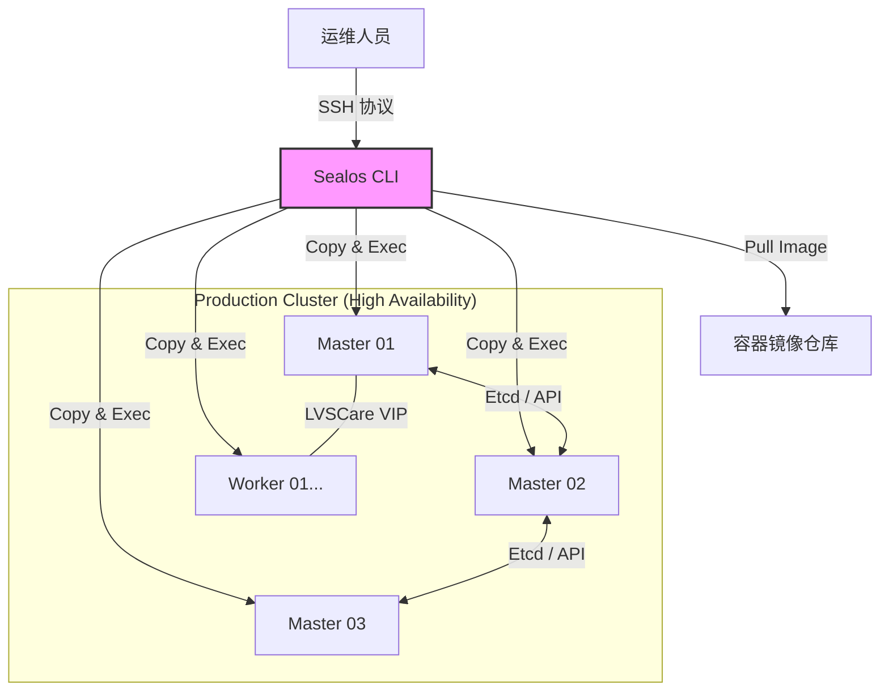

# Sealos 生产级容器云平台技术文档

**版本**：v1.0\
**状态**：发布\
**维护者**：SRE 团队\
**最后更新**：2026-03-09

***

## 1. 简介

### 1.1 服务介绍与核心特性

Sealos 是一款基于 Kubernetes 内核构建的 **AI 原生云操作系统 (AI-native Cloud Operating System)**。它不仅是一个 Kubernetes 发行版，更统一了从云端 IDE 开发到生产环境部署的全生命周期管理。

**核心特性：**

- **AI 原生与应用商店**：内置应用商店，支持一键部署高可用数据库（MySQL, Redis, PostgreSQL）、AI 知识库 (FastGPT) 及各类微服务。
- **全链路一致性**：利用 OCI 镜像技术，保证开发、测试、生产环境的完全一致。
- **极速部署**：生产环境 3 节点集群安装仅需 5-10 分钟，支持离线交付。
- **生命周期管理**：原生支持集群升级、扩容、缩容、备份与恢复。
- **完全解耦**：不依赖 Ansible 或复杂的系统预配置，二进制文件直接运行。

### 1.2 适用场景

- **私有云构建**：在裸金属服务器 (Bare Metal) 或虚拟机 (VMware/OpenStack) 上构建生产级高可用 K8s 集群。
- **边缘计算**：资源受限环境下的轻量级 K8s 交付。
- **信创环境**：完美支持 ARM64 (鲲鹏/飞腾) 与 x86 混合部署。
- **EKS/AKS 替代方案**：为企业提供低成本、自主可控的类公有云体验。

**⚠️ 重要提示：与 EKS/AKS 的关系**
Sealos CLI 核心机制是通过 **SSH** 访问节点进行底层管理（包括 Etcd、Runtime、Kubelet）。

- **自建集群**：Sealos 适用于在 AWS EC2 / Azure VM 上**自建**集群（Self-managed），可完全替代 EKS/AKS，成本更低且版本可控。
- **托管集群**：Sealos CLI **不支持**直接纳管现有的 EKS/AKS 托管集群（因为无法 SSH 访问托管版的 Master 节点）。

### 1.3 架构原理图



***

## 2. 版本选择指南

### 2.1 版本对应关系表

| 组件                    | 推荐版本             | 说明                                    |
| :-------------------- | :--------------- | :------------------------------------ |
| **Sealos CLI**        | `v5.1.1`+        | 建议使用 v5 最新稳定版，性能与稳定性更佳。               |
| **Kubernetes**        | `v1.28.x`        | 兼顾新特性与稳定性，长期支持版本 (LTS)。               |
| **Container Runtime** | `Containerd`     | Sealos 默认内置 Containerd，无需单独安装 Docker。 |
| **Network Plugin**    | `Calico v3.26.x` | 生产环境标准网络方案。                           |
| **Helm**              | `v3.12.x`        | 随集群镜像一同分发。                            |

### 2.2 版本决策建议

- **新业务上线**：建议选择 K8s `v1.28` 或 `v1.29`，这些版本 API 较为稳定，且主流云厂商（EKS/AKS）均提供良好支持，方便未来混合云管理。
- **存量迁移**：若从旧版本迁移，请务必检查 API Group 的废弃情况（如 PSP 移除），Sealos 支持指定旧版本镜像安装。
- **操作系统**：推荐使用 Rocky Linux 9 或 Ubuntu 22.04 LTS，内核版本建议 >= 5.4。

***

## 3. 生产环境规划（高可用架构）

### 3.1 集群架构图

```text
       +-------------------------+
       |   Load Balancer (VIP)   |  <-- 10.0.0.100 (Virtual IP)
       +------------+------------+
                    |
      +-------------+-------------+
      |             |             |
+-----+-----+ +-----+-----+ +-----+-----+
| Master 01 | | Master 02 | | Master 03 |  <-- Control Plane (Etcd/API)
| 10.0.0.11 | | 10.0.0.12 | | 10.0.0.13 |
+-----+-----+ +-----+-----+ +-----+-----+
      |             |             |
+-----+-----+ +-----+-----+ +-----+-----+
| Worker 01 | | Worker 02 | | Worker 03 |  <-- Workloads
| 10.0.0.21 | | 10.0.0.22 | | 10.0.0.23 |
+-----------+ +-----------+ +-----------+
```

### 3.2 节点角色与配置要求

| 角色         | 数量     | 最低配置    | 推荐配置      | 磁盘要求             |
| :--------- | :----- | :------ | :-------- | :--------------- |
| **Master** | 3 (奇数) | 4C / 8G | 8C / 16G  | 系统盘 100G+ (SSD)  |
| **Worker** | 3+     | 4C / 8G | 16C / 32G | 系统盘 100G+, 数据盘按需 |

> **💡 关于 Etcd 部署位置**：
> Sealos 默认采用堆叠式 (Stacked) 高可用架构，Etcd 集群会自动以 **Static Pod** 的形式部署在所有 **Master** 节点上。
>
> - 因此，Master 节点的磁盘 I/O 性能直接决定集群稳定性，生产环境**必须使用 SSD**。
> - 无需单独规划 Etcd 节点，管理 Master 节点即等于管理 Etcd 集群。

### 3.3 网络与端口规划

- **SSH 端口**：所有节点需开放 SSH (默认 22) 给 Sealos 执行机。
- **API Server**：6443 (Master 节点间互通，Worker 节点访问 VIP)。
- **NodePort 范围**：30000-32767。
- **Pod 网段**：`100.64.0.0/10` (默认，需确保不与物理网段冲突)。
- **Service 网段**：`10.96.0.0/22` (默认)。

***

## 4. 生产环境部署

### 4.1 前置准备（所有节点）

1. **主机名解析**：确保主机名唯一且不包含大写字母。
2. **时间同步**：必须保证所有节点时间一致（NTP）。
3. **SSH 互信**：Sealos 执行机需能通过密钥或密码免密登录所有节点。

### 4.2 \[Rocky Linux 9 部署步骤]

```bash
# ── Rocky Linux 9 ──────────────────────────
# 1. 关闭防火墙
systemctl stop firewalld && systemctl disable firewalld

# 2. 设置 SELinux 宽容模式（Sealos 会自动处理，但建议预设）
setenforce 0
sed -i 's/^SELINUX=enforcing$/SELINUX=permissive/' /etc/selinux/config

# 3. 安装基础依赖
dnf install -y tar wget git socat conntrack ipset

# 4. 开启 IP 转发（可选，Sealos 会自动配置）
cat >> /etc/sysctl.d/k8s.conf << 'EOF'
net.ipv4.ip_forward = 1
EOF
sysctl --system
```

### 4.3 \[Ubuntu 22.04 部署步骤]

```bash
# ── Ubuntu 22.04 ───────────────────────────
# 1. 关闭防火墙
ufw disable

# 2. 安装基础依赖
apt-get update
apt-get install -y tar wget git socat conntrack ipset

# 3. 开启 IP 转发
cat >> /etc/sysctl.d/k8s.conf << 'EOF'
net.ipv4.ip_forward = 1
EOF
sysctl --system
```

### 4.4 集群初始化与配置

在**执行机**（可以是 Master01）上安装 Sealos 二进制文件：

```bash
# ── 通用步骤 ───────────────────────────────
# ⚠️ 请根据实际情况替换版本号
VERSION=5.1.1
wget "https://github.com/labring/sealos/releases/download/v${VERSION}/sealos_${VERSION}_linux_amd64.tar.gz"
tar zxvf sealos_${VERSION}_linux_amd64.tar.gz sealos
chmod +x sealos
mv sealos /usr/bin/

# 验证安装
sealos version
```

### 4.5 安装验证

执行部署命令（参考第 5 章配置文件）后，进行以下验证：

```bash
# 1. 检查节点状态
kubectl get nodes -o wide
# 预期输出：所有节点状态为 Ready，ROLES 显示正确

# 2. 检查系统 Pod 状态
kubectl get pods -n kube-system
# 预期输出：所有 Pod (coredns, calico, etcd, apiserver) 状态为 Running

# 3. 验证 Sealos 状态
sealos status
```

***

## 5. 关键参数配置说明

### 5.1 核心配置文件详解 (`Clusterfile`)

该配置文件可以通过 `sealos gen` 命令生成基础模板，也可以直接编写。
**生成基础模板命令示例：**

```bash
sealos gen labring/kubernetes:v1.28.0 \
  labring/helm:v3.12.0 \
  labring/calico:v3.26.1 \
  --masters 10.0.0.11,10.0.0.12,10.0.0.13 \
  --nodes 10.0.0.21,10.0.0.22,10.0.0.23 \
  --passwd 'YourStrongPassword' \
  --output Clusterfile
```

以下为经过生产环境调优的完整配置模板（建议直接使用）：

```bash
cat >> Clusterfile << 'EOF'
apiVersion: apps.sealos.io/v1beta1
kind: Cluster
metadata:
  name: default
spec:
  # ★ 镜像列表：Sealos 会按顺序加载镜像
  # 提示：可访问 https://explore.ggcr.dev/ 查询镜像的所有可用版本 (如 labring/kubernetes)
  image:
    - labring/kubernetes:v1.28.0   # ★ 核心组件
    - labring/helm:v3.12.0         # ★ 包管理工具
    - labring/calico:v3.26.1       # ★ 网络插件

  # ⚠️ 版本兼容性矩阵 (请严格遵守，否则可能导致网络或调度异常)
  # | Kubernetes | Calico  | Helm    | 说明                     |
  # | :---       | :---    | :---    | :---                     |
  # | v1.29.x    | v3.27+  | v3.13+  | K8s 1.29 移除了部分旧 API  |
  # | v1.28.x    | v3.26+  | v3.12+  | 生产环境推荐组合          |
  # | v1.26.x    | v3.25+  | v3.10+  |                          |
  # | v1.24.x    | v3.23+  | v3.8+   | 这里的 Calico 版本是底线   |
  
  # ★ SSH 连接配置
  ssh:
    passwd: 'YourStrongPassword'   # ★ ⚠️ 生产环境建议使用 pk (私钥) 认证，此处填密码
    pk: /root/.ssh/id_rsa          # ★ 若使用私钥，请指定路径
    port: 22                       # ← 根据实际环境修改 SSH 端口
    
  # ★ 节点规划
  hosts:
    - roles: [master, amd64]
      ips: [10.0.0.11, 10.0.0.12, 10.0.0.13] # ★ ← 根据实际环境修改 Master IP
    - roles: [node, amd64]
      ips: [10.0.0.21, 10.0.0.22, 10.0.0.23] # ★ ← 根据实际环境修改 Worker IP
      
  # 环境变量配置
  env:
    # ⚠️ 生产环境建议修改默认 Service/Pod 网段以防冲突
    - key: POD_CIDR
      value: 100.64.0.0/10         # ← 根据实际环境修改，避免与物理网段冲突
    - key: SERVICE_CIDR
      value: 10.96.0.0/22          # ← 根据实际环境修改
      
  # ⚠️ 镜像仓库配置（可选，内网环境使用）
  # registry:
  #   domain: sealos.hub
EOF
```

**执行部署：**

```bash
sealos apply -f Clusterfile
```

### 5.2 生产环境推荐调优参数

建议在安装前或安装后通过 `sysctl` 优化内核参数：

```bash
cat >> /etc/sysctl.d/k8s-prod.conf << 'EOF'
# 开启 IP 转发
net.ipv4.ip_forward = 1
# 防止 iptables 绕过
net.bridge.bridge-nf-call-iptables = 1
net.bridge.bridge-nf-call-ip6tables = 1
# ★ 增加文件句柄限制 (高并发必备)
fs.file-max = 524288
fs.inotify.max_user_watches = 524288
# ★ 调整交换分区使用策略 (K8s 建议关闭 Swap，此处尽量减少使用)
vm.swappiness = 0
EOF

sysctl --system
```

***

## 6. 开发/测试环境快速部署（Docker Compose）

> **说明**：Sealos 本身是 Kubernetes 的生命周期管理工具，用于替代 Docker Compose 进行大规模容器编排。
> 本章节提供 **Single Node (单机模式)** 的部署方案，它在体验上类似 Docker Compose，能在一台机器上快速拉起完整的 K8s 环境。

### 6.1 Docker Compose 部署（单机或伪集群）

我们将使用 Sealos 的单机模式来模拟 Docker Compose 的“一键启动”体验。

```bash
# ── 快速启动单机 K8s ────────────────────────
# 该命令会自动安装 K8s、Helm 和 Calico，并将 Master/Worker 合并
# 适用于：开发测试、CI/CD 环境

sealos run labring/kubernetes:v1.28.0 \
  labring/helm:v3.12.0 \
  labring/calico:v3.26.1 \
  --single \
  --passwd 'YourStrongPassword'  # ← 根据实际环境修改

# ⚠️ 注意：--single 参数去除了资源检查限制，允许在低配机器运行
```

### 6.2 启动与验证

```bash
# 验证单节点集群
kubectl get nodes
# 预期输出：
# NAME      STATUS   ROLES           AGE   VERSION
# master01  Ready    control-plane   1m    v1.28.0

# 部署测试应用（验证集群可用性）
kubectl create deployment nginx --image=nginx:alpine
kubectl expose deployment nginx --port=80 --type=NodePort
kubectl get svc nginx
```

***

## 7. 日常运维操作

### 7.1 常用管理命令

```bash
# 进入节点 Shell（无需 SSH 密码，类似 docker exec）
sealos exec -r master "uname -a"
sealos exec -r node "free -h"

# 拷贝文件到所有节点
sealos scp -r master /local/path /remote/path
sealos scp -r all /etc/hosts /etc/hosts

# 清理集群（卸载）
sealos reset
```

### 7.2 备份与恢复

生产环境建议定期对 Etcd 做快照备份。

```bash
# 创建快照备份（kubeadm 静态 etcd）
mkdir -p /backup
SNAP=/backup/etcd-snapshot-$(date +%F-%H%M).db
ETCDCTL_API=3 etcdctl \
  --endpoints=https://127.0.0.1:2379 \
  --cacert=/etc/kubernetes/pki/etcd/ca.crt \
  --cert=/etc/kubernetes/pki/etcd/healthcheck-client.crt \
  --key=/etc/kubernetes/pki/etcd/healthcheck-client.key \
  snapshot save "$SNAP"

# 验证快照可用
ETCDCTL_API=3 etcdctl snapshot status "$SNAP"
```

### 7.3 集群扩缩容

Sealos 的一大优势是自动化处理复杂的 Etcd 集群变更，用户无需手动操作 `etcdctl`。

**增加节点**（Sealos 会自动完成环境初始化、加入集群及同步配置）：

- **扩容 Worker**：仅增加计算资源。
- **扩容 Master**：会自动将新节点加入 Control Plane **并自动扩容 Etcd 集群**。

```bash
# 增加一个 Worker 节点
sealos add --nodes 10.0.0.24 --passwd 'YourStrongPassword'

# 增加一个 Master 节点 (Etcd 会自动扩容)
sealos add --masters 10.0.0.14 --passwd 'YourStrongPassword'
```

**移除节点**：

- **移除 Worker**：建议先手动 `kubectl drain` 驱逐 Pod，再执行删除。
- **移除 Master**：Sealos 会自动从 Etcd 集群成员列表中移除该节点，确保集群健康度。

```bash
# 移除指定 Worker 节点
sealos delete --nodes 10.0.0.24

# 移除指定 Master 节点 (Etcd 会自动缩容)
sealos delete --masters 10.0.0.14
```

### 7.4 版本升级

Sealos 支持通过替换镜像的方式进行集群版本升级：

```bash
# 将集群升级到 k8s v1.29.0
sealos run labring/kubernetes:v1.29.0 --update-only
```

***

## 9. 注意事项与生产检查清单

### 9.1 安装前环境核查

- [ ] **内核版本**：建议 Linux Kernel 5.4+ (Rocky 9 默认满足, Ubuntu 22.04 默认满足)。
- [ ] **Swap**：生产环境强烈建议关闭 Swap (`swapoff -a`)，并在 `/etc/fstab` 中注释掉。
- [ ] **网络**：检查 Master 节点间 6443, 2379, 2380, 10250 端口连通性。
- [ ] **主机名**：确保 `/etc/hostname` 设置正确且唯一，不包含大写字母和下划线。

### 9.2 常见故障排查（含报错日志示例）

**错误示例 1：Pull 镜像失败**

```text
Error: failed to pull image labring/kubernetes:v1.25.0: ...
```

- **排查**：检查执行机网络，或配置 Sealos 代理。
- **解决**：使用离线包导入 `sealos load -i kubernetes.tar`。

**错误示例 2：节点 NotReady**

```text
Node status is NotReady, CNI plugin not initialized
```

- **排查**：通常是 CNI 插件（Calico）未正确启动。
- **解决**：
  ```bash
  kubectl get pods -n kube-system -o wide | grep calico
  kubectl logs -n kube-system <calico-pod-name>
  ```
  - 常见原因：网卡自动探测错误。需修改 Calico 环境变量 `IP_AUTODETECTION_METHOD`。

**错误示例 3：Etcd 启动失败**

```text
health check for peer ... failed
```

- **排查**：检查时间同步 (NTP) 和防火墙端口 (2379/2380)。
- **解决**：确保所有节点 `date` 时间误差在 2 秒以内。

### 9.3 安全加固建议

1. **限制 SSH 访问**：仅允许运维堡垒机访问 K8s 节点 SSH 端口。
2. **Etcd 加密**：生产环境应开启 Etcd 落盘加密。
3. **审计日志**：开启 API Server 审计日志并转发至日志中心。
4. **RBAC 权限**：避免直接使用 `admin.conf`，为不同人员创建最小权限的 User/Role。

***

## 10. 参考资料

- [Sealos 官方文档](https://sealos.io/zh-Hans/docs/self-hosting/lifecycle-management/quick-start/deploy-kubernetes)
- [Kubernetes 官方文档](https://kubernetes.io/zh-cn/docs/home/)
- [Calico 网络插件配置](https://docs.tigera.io/calico/latest/getting-started/kubernetes/self-managed-onprem/onpremises)
