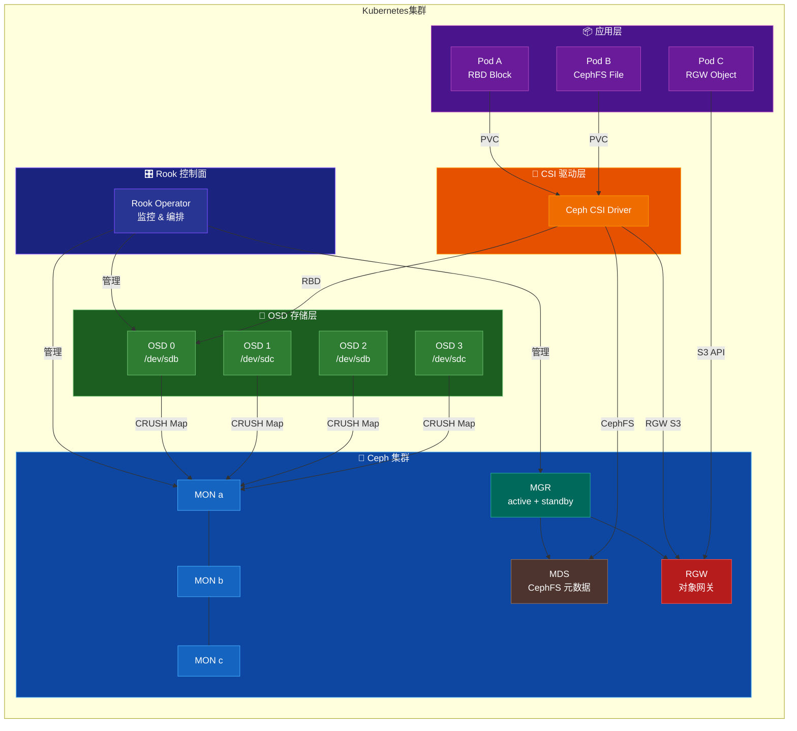
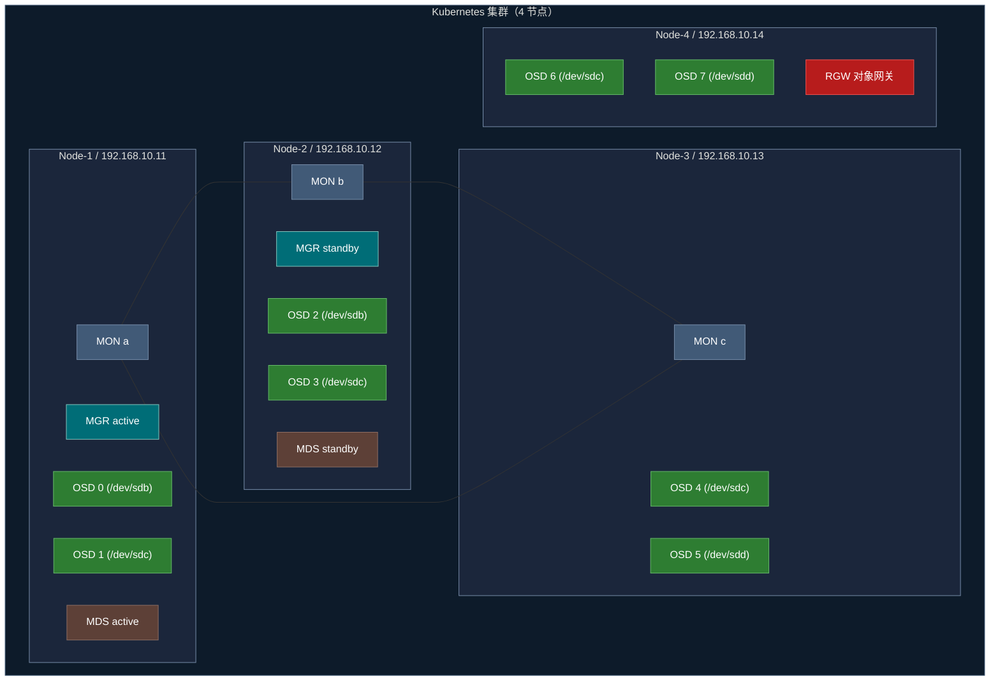

[TOC]

# 1. 简介

## 1.1 服务介绍与核心特性

**Rook** 是一个开源的云原生存储编排器，为 Ceph 存储系统提供与 Kubernetes 的原生集成。Rook 是 CNCF **毕业级**项目。

**Ceph** 是一个高度可扩展的分布式存储系统，同时提供 **块存储（RBD）**、**文件存储（CephFS）** 和 **对象存储（RGW）**。

**核心特性：**

| 特性 | 说明 |
|------|------|
| 自动化部署 | Rook Operator 自动部署和管理 Ceph 集群 |
| 自我修复 | OSD/MON 故障时自动恢复 |
| 自动扩展 | 添加节点/磁盘后自动扩展存储容量 |
| 三种存储类型 | Block（RBD）、Filesystem（CephFS）、Object（RGW） |
| Kubernetes 原生 | 通过 CRD 管理，完美集成 K8s 生态 |
| Dashboard | 内置 Ceph Dashboard Web 管理界面 |
| CSI 驱动 | 通过 CSI 为 Pod 提供持久化存储 |
| 数据高可用 | 支持多副本和纠删码（Erasure Coding） |

## 1.2 适用场景

- **有状态应用持久化**：数据库（MySQL、PostgreSQL）、消息队列（Kafka）等
- **共享文件存储**：多 Pod 共享读写（RWX），如 AI 训练数据集、CMS 媒体文件
- **对象存储**：S3 兼容接口，日志归档、备份数据
- **CI/CD 构建缓存**：构建产物和依赖缓存的持久化
- **大数据与 AI**：训练数据集、模型文件的分布式存储

## 1.3 架构原理图



---

# 2. 版本选择指南

## 2.1 版本对应关系表

| Rook 版本 | Ceph 版本 | Kubernetes 版本 | CSI 版本 | 状态 |
|-----------|-----------|----------------|----------|------|
| v1.19.x | Squid (v19.2.x) | v1.30 - v1.35 | v3.13.x | ★ 最新稳定版 |
| v1.18.x | Squid (v19.2.x) | v1.29 - v1.34 | v3.12.x | 稳定版 |
| v1.17.x | Reef (v18.2.x) | v1.28 - v1.32 | v3.11.x | 维护中 |
| v1.16.x | Reef (v18.2.x) | v1.27 - v1.31 | v3.10.x | 维护中 |
| v1.15.x | Reef (v18.2.x) | v1.26 - v1.30 | v3.9.x | EOL |

> ⚠️ 以上版本信息请以 [Rook 官方文档](https://rook.io/docs/rook/latest-release/Getting-Started/quickstart/) 为准

## 2.2 版本决策建议

- **新建集群**：建议直接使用 **Rook v1.19.x + Ceph Squid**，获得最新特性和最长支持周期
- **已有集群升级**：按照官方升级路径逐版本升级，不要跨大版本
- **Kubernetes 版本**：确认你的 K8s 版本在 Rook 支持矩阵内，当前最新版要求 **K8s v1.30+**
- **CPU 架构**：官方支持 **amd64/x86_64** 和 **arm64**
- **操作系统**：推荐 Rocky Linux 9 或 Ubuntu 22.04，内核版本建议 5.x+

---

# 3. 生产环境规划（高可用架构）

## 3.1 集群架构图

> 以下为 4 节点生产环境架构，其中 2 个节点磁盘为 sdb/sdc，另外 2 个节点磁盘为 sdc/sdd



## 3.2 节点角色与配置要求

| 角色 | 数量 | 最低配置 | ★ 推荐配置 | 说明 |
|------|------|---------|-----------|------|
| MON（监控守护进程） | 3 | 2C/2G/20G SSD | 4C/4G/50G SSD | 必须奇数个，建议 3 或 5 |
| MGR（管理守护进程） | 2 | 2C/2G | 4C/4G | 1 active + 1 standby |
| OSD（对象存储守护进程） | ≥3 | 2C/4G + 独立磁盘 | 4C/8G + SSD/NVMe | 每块磁盘一个 OSD |
| MDS（元数据服务） | 2 | 2C/4G | 4C/8G | 仅 CephFS 需要 |
| RGW（对象网关） | ≥1 | 2C/4G | 4C/8G | 仅对象存储需要 |

> ⚠️ 生产环境中 OSD 节点的磁盘**必须是未格式化的裸设备**（无分区、无文件系统）

## 3.3 网络与端口规划

| 源地址 | 目标端口 | 协议 | 用途 |
|--------|---------|------|------|
| K8s 所有节点 | 6789 | TCP | Ceph MON（传统 v1 协议） |
| K8s 所有节点 | 3300 | TCP | Ceph MON（v2 协议） |
| OSD 节点之间 | 6800-7300 | TCP | OSD 数据复制与恢复 |
| K8s 所有节点 | 9283 | TCP | Ceph Metrics（Prometheus） |
| K8s 所有节点 | 8443 | TCP | Ceph Dashboard（HTTPS） |
| K8s 所有节点 | 80/443 | TCP | RGW 对象网关（S3 接口） |
| K8s 所有节点 | 6800-7568 | TCP | MDS 元数据服务通信 |

---

# 4. 生产环境部署

## 4.1 前置准备（所有节点）

### 4.1.1 安装必要软件包

```bash
# ── Rocky Linux 9 ──────────────────────────
dnf install -y lvm2 git

# ── Ubuntu 22.04 ───────────────────────────
apt-get update && apt-get install -y lvm2 git
```

### 4.1.2 加载必要内核模块

```bash
# ── Rocky Linux 9 / Ubuntu 22.04 通用 ─────
cat >> /etc/modules-load.d/ceph.conf << 'EOF'
rbd
ceph
EOF

modprobe rbd
modprobe ceph
```

### 4.1.3 检查磁盘状态

> ★ **关键步骤**：确认目标磁盘为裸设备（无文件系统、无分区）

```bash
# 查看所有磁盘及文件系统 —— FSTYPE 列为空的磁盘可用于 OSD
lsblk -f

# 示例输出（sdb 和 sdc 没有文件系统，可用）：
# NAME   FSTYPE   LABEL UUID                                 MOUNTPOINT
# sda
# └─sda1 ext4           xxxx-xxxx                            /
# sdb                                                         ← 可用于 OSD
# sdc                                                         ← 可用于 OSD
```

### 4.1.4 清理磁盘（如需要）

> ⚠️ 以下操作会 **永久销毁** 磁盘上的所有数据，请确认磁盘无重要数据

```bash
# 清理目标磁盘（根据实际磁盘名称修改）
# ★ 请确认磁盘名称正确，避免误操作！

# 方式一：擦除磁盘签名
wipefs -a /dev/sdb   # ← 根据实际环境修改磁盘名
wipefs -a /dev/sdc   # ← 根据实际环境修改磁盘名

# 方式二：使用 dd 清零前几个扇区（更彻底）
dd if=/dev/zero of=/dev/sdb bs=1M count=100   # ← 根据实际环境修改
dd if=/dev/zero of=/dev/sdc bs=1M count=100   # ← 根据实际环境修改

# 方式三：使用 sgdisk 清除 GPT/MBR
sgdisk --zap-all /dev/sdb   # ← 根据实际环境修改
sgdisk --zap-all /dev/sdc   # ← 根据实际环境修改
```

### 4.1.5 确认 Kubernetes 集群就绪

```bash
# 确认 K8s 集群正常运行
kubectl get nodes -o wide
kubectl cluster-info

# 确认所有节点为 Ready 状态
kubectl get nodes
# NAME      STATUS   ROLES           AGE   VERSION
# node-1    Ready    control-plane   10d   v1.31.0
# node-2    Ready    worker          10d   v1.31.0
# node-3    Ready    worker          10d   v1.31.0
# node-4    Ready    worker          10d   v1.31.0
```

## 4.2 Rocky Linux 9 额外准备

```bash
# ── Rocky Linux 9 ──────────────────────────
# 关闭 SELinux（或配置策略）
setenforce 0
sed -i 's/^SELINUX=enforcing/SELINUX=permissive/' /etc/selinux/config

# 关闭 firewalld（或放行必要端口）
systemctl disable --now firewalld

# 安装额外依赖
dnf install -y lvm2 chrony
systemctl enable --now chronyd
```

## 4.3 Ubuntu 22.04 额外准备

```bash
# ── Ubuntu 22.04 ───────────────────────────
# 关闭 ufw（或放行必要端口）
ufw disable

# 安装额外依赖
apt-get install -y lvm2 chrony
systemctl enable --now chrony
```

## 4.4 部署 Rook Operator

### 4.4.1 克隆 Rook 仓库

```bash
git clone --single-branch --branch v1.19.2 https://github.com/rook/rook.git
cd rook/deploy/examples
```

### 4.4.2 部署 CRD 和 Operator

```bash
# 创建 CRD、通用资源、CSI Operator 和 Rook Operator
kubectl create -f crds.yaml -f common.yaml -f csi-operator.yaml -f operator.yaml

# 等待 Operator 启动完成
kubectl -n rook-ceph get pod -l app=rook-ceph-operator -w

# 预期输出（等待 STATUS 变为 Running）：
# NAME                                  READY   STATUS    RESTARTS   AGE
# rook-ceph-operator-xxxxxxxxxx-xxxxx   1/1     Running   0          2m
```

### 4.4.3 使用 Helm 部署（可选方式）

```bash
# 添加 Rook Helm 仓库
helm repo add rook-release https://charts.rook.io/release
helm repo update

# 部署 Operator
helm install --create-namespace --namespace rook-ceph \
  rook-ceph rook-release/rook-ceph \
  --version v1.19.2   # ← 根据实际版本修改
```

## 4.5 创建 Ceph 集群（基于磁盘部署 — 多种方式）

> ★ 本节提供 **三种磁盘选择方式**，请根据实际环境选择其一

### 方式一：按节点精确指定磁盘（★ 推荐生产环境使用）

> 适用场景：4 个节点，Node-1/Node-2 的磁盘为 sdb/sdc，Node-3/Node-4 的磁盘为 sdc/sdd

```bash
cat > cluster.yaml << 'EOF'
apiVersion: ceph.rook.io/v1
kind: CephCluster
metadata:
  name: rook-ceph
  namespace: rook-ceph
spec:
  cephVersion:
    image: quay.io/ceph/ceph:v19.2.2       # ★ Ceph Squid 版本，根据实际修改
    allowUnsupported: false
  dataDirHostPath: /var/lib/rook             # ★ Ceph 数据目录，确保该路径所在分区有足够空间
  mon:
    count: 3                                 # ★ MON 数量，生产环境建议 3 或 5
    allowMultiplePerNode: false              # 不允许同一节点运行多个 MON
  mgr:
    count: 2                                 # MGR 数量，1 active + 1 standby
    allowMultiplePerNode: false
    modules:
      - name: dashboard
        enabled: true                        # 启用 Ceph Dashboard
  dashboard:
    enabled: true
    ssl: true
  network:
    connections:
      encryption:
        enabled: false                       # ⚠️ 生产环境可启用加密，但会有性能开销
      compression:
        enabled: false
  storage:
    useAllNodes: false                       # ★ 生产环境必须设为 false，手动指定节点
    useAllDevices: false                     # ★ 生产环境必须设为 false，手动指定磁盘
    nodes:
      # ────── Node-1：磁盘为 sdb, sdc ──────
      - name: "node-1"                       # ← 根据实际 hostname 修改
        devices:
          - name: "sdb"                      # ← 根据实际磁盘名修改
          - name: "sdc"                      # ← 根据实际磁盘名修改
      # ────── Node-2：磁盘为 sdb, sdc ──────
      - name: "node-2"                       # ← 根据实际 hostname 修改
        devices:
          - name: "sdb"
          - name: "sdc"
      # ────── Node-3：磁盘为 sdc, sdd ──────
      - name: "node-3"                       # ← 根据实际 hostname 修改
        devices:
          - name: "sdc"                      # ← 注意：此节点的可用磁盘与前两个不同
          - name: "sdd"
      # ────── Node-4：磁盘为 sdc, sdd ──────
      - name: "node-4"                       # ← 根据实际 hostname 修改
        devices:
          - name: "sdc"
          - name: "sdd"
  resources:                                 # ⚠️ 生产环境建议设置 resource limits
    mon:
      requests:
        cpu: "1"
        memory: "2Gi"
      limits:
        cpu: "2"
        memory: "4Gi"
    osd:
      requests:
        cpu: "1"
        memory: "4Gi"
      limits:
        cpu: "2"
        memory: "8Gi"
    mgr:
      requests:
        cpu: "500m"
        memory: "1Gi"
      limits:
        cpu: "1"
        memory: "2Gi"
EOF
```

### 方式二：使用 deviceFilter 正则匹配（适用于磁盘命名规则统一的环境）

```bash
cat > cluster-devicefilter.yaml << 'EOF'
apiVersion: ceph.rook.io/v1
kind: CephCluster
metadata:
  name: rook-ceph
  namespace: rook-ceph
spec:
  cephVersion:
    image: quay.io/ceph/ceph:v19.2.2
    allowUnsupported: false
  dataDirHostPath: /var/lib/rook
  mon:
    count: 3
    allowMultiplePerNode: false
  mgr:
    count: 2
    allowMultiplePerNode: false
  dashboard:
    enabled: true
    ssl: true
  storage:
    useAllNodes: false
    useAllDevices: false
    nodes:
      # ── Node-1/Node-2：匹配 sdb 和 sdc ──
      - name: "node-1"                       # ← 根据实际 hostname 修改
        deviceFilter: "^sd[bc]$"             # 正则匹配 sdb 和 sdc
      - name: "node-2"
        deviceFilter: "^sd[bc]$"
      # ── Node-3/Node-4：匹配 sdc 和 sdd ──
      - name: "node-3"
        deviceFilter: "^sd[cd]$"             # 正则匹配 sdc 和 sdd
      - name: "node-4"
        deviceFilter: "^sd[cd]$"
EOF

# 其他常用 deviceFilter 示例：
# "sdb"          → 仅选择 sdb
# "^sd."         → 匹配所有 sd 开头的设备
# "^sd[a-d]"     → 匹配 sda ~ sdd
# "^nvme"        → 匹配所有 NVMe 设备
```

### 方式三：使用 devicePathFilter 按路径匹配（适用于需要稳定设备标识的环境）

```bash
cat > cluster-pathfilter.yaml << 'EOF'
apiVersion: ceph.rook.io/v1
kind: CephCluster
metadata:
  name: rook-ceph
  namespace: rook-ceph
spec:
  cephVersion:
    image: quay.io/ceph/ceph:v19.2.2
    allowUnsupported: false
  dataDirHostPath: /var/lib/rook
  mon:
    count: 3
    allowMultiplePerNode: false
  mgr:
    count: 2
    allowMultiplePerNode: false
  dashboard:
    enabled: true
    ssl: true
  storage:
    useAllNodes: false
    useAllDevices: false
    nodes:
      # ★ 使用 /dev/disk/by-id/ 路径，重启后设备名不会变化
      - name: "node-1"
        devices:
          - name: "/dev/disk/by-id/ata-ST4000DM004-XXXX"   # ← 根据实际 by-id 路径修改
          - name: "/dev/disk/by-id/ata-ST4000DM004-YYYY"
      - name: "node-2"
        devices:
          - name: "/dev/disk/by-id/ata-ST4000DM004-AAAA"
          - name: "/dev/disk/by-id/ata-ST4000DM004-BBBB"
      # ── 也可以使用 devicePathFilter 正则 ──
      - name: "node-3"
        devicePathFilter: "^/dev/disk/by-path/pci-.*"      # 匹配 PCI 连接的所有磁盘
      - name: "node-4"
        devicePathFilter: "^/dev/disk/by-path/pci-.*"
EOF

# 查看可用的稳定设备标识：
# ls -la /dev/disk/by-id/
# ls -la /dev/disk/by-path/
```

### 4.5.1 应用集群配置

```bash
# 选择上述三种方式之一创建集群
kubectl create -f cluster.yaml

# 观察集群创建进度
kubectl -n rook-ceph get pod -w

# 等待所有 Pod 运行正常（约 3-5 分钟）
# 预期输出：
# NAME                                            READY   STATUS      AGE
# rook-ceph-mon-a-xxxxxxxxx-xxxxx                 2/2     Running     3m
# rook-ceph-mon-b-xxxxxxxxx-xxxxx                 2/2     Running     3m
# rook-ceph-mon-c-xxxxxxxxx-xxxxx                 2/2     Running     2m
# rook-ceph-mgr-a-xxxxxxxxx-xxxxx                 3/3     Running     2m
# rook-ceph-mgr-b-xxxxxxxxx-xxxxx                 3/3     Running     2m
# rook-ceph-osd-0-xxxxxxxxx-xxxxx                 2/2     Running     1m
# rook-ceph-osd-1-xxxxxxxxx-xxxxx                 2/2     Running     1m
# ...（每块磁盘一个 OSD Pod）
```

## 4.6 安装验证

### 4.6.1 部署 Toolbox

```bash
kubectl create -f toolbox.yaml

# 等待 toolbox Pod 就绪
kubectl -n rook-ceph wait --for=condition=ready pod -l app=rook-ceph-tools --timeout=120s
```

### 4.6.2 检查集群状态

```bash
# 进入 toolbox 执行 Ceph 命令
kubectl -n rook-ceph exec -it deploy/rook-ceph-tools -- bash

# 查看集群状态
ceph status
# 预期输出：
#   cluster:
#     id:     a0452c76-xxxx-xxxx-xxxx-xxxxxxxxxxxx
#     health: HEALTH_OK
#   services:
#     mon: 3 daemons, quorum a,b,c (age 5m)
#     mgr: a(active, since 3m), standbys: b
#     osd: 8 osds: 8 up (since 2m), 8 in (since 2m)

# 查看 OSD 状态
ceph osd status
ceph osd tree

# 查看磁盘使用情况
ceph df
```

---

# 5. 关键参数配置说明

## 5.1 核心配置文件详解

### CephCluster CRD 关键字段

```yaml
apiVersion: ceph.rook.io/v1
kind: CephCluster
metadata:
  name: rook-ceph
  namespace: rook-ceph                       # ★ 命名空间，默认 rook-ceph
spec:
  cephVersion:
    image: quay.io/ceph/ceph:v19.2.2         # ★ Ceph 镜像版本
    allowUnsupported: false                  # 是否允许非官方支持版本

  dataDirHostPath: /var/lib/rook             # ★ 主机上的 Ceph 配置/密钥存储目录
                                             #   确保此路径有足够空间，且重启后持久化

  mon:
    count: 3                                 # ★ MON 数量（必须奇数：1/3/5）
    allowMultiplePerNode: false              # 是否允许同节点多个 MON（生产环境 false）
    volumeClaimTemplate: {}                  # ⚠️ 可为 MON 配置 PVC 持久化存储

  mgr:
    count: 2                                 # MGR 数量（1 active + N standby）
    allowMultiplePerNode: false
    modules:
      - name: dashboard                      # 启用/禁用模块
        enabled: true
      - name: balancer
        enabled: true
      - name: crash
        enabled: true

  dashboard:
    enabled: true                            # 是否启用 Dashboard
    ssl: true                                # 是否启用 HTTPS
    port: 8443                               # Dashboard 端口
    # urlPrefix: /ceph-dashboard             # ⚠️ 反向代理时使用

  network:
    connections:
      encryption:
        enabled: false                       # ⚠️ 启用传输加密（性能开销约 5-10%）
      compression:
        enabled: false                       # 是否启用消息压缩
    # provider: host                         # ⚠️ 使用主机网络（高性能场景）
    # selectors:
    #   public: public-net                   # 分离公共/集群网络
    #   cluster: cluster-net

  storage:
    useAllNodes: false                       # ★ false = 手动指定节点
    useAllDevices: false                     # ★ false = 手动指定磁盘
    config:
      osdsPerDevice: "1"                     # 每个设备 OSD 数量（HDD 用 1，NVMe 可大于 1）
      # encryptedDevice: "true"              # ⚠️ 启用 OSD 磁盘加密（需要 LVM）
    nodes: []                                # 节点列表（见 4.5 节配置）
```

## 5.2 生产环境推荐调优参数

### Operator 调优（operator.yaml）

```yaml
# ★ 关键环境变量（在 operator.yaml 的 Deployment 中设置）
env:
  - name: ROOK_LOG_LEVEL                     # 日志级别
    value: "INFO"                            # 生产环境用 INFO，排障用 DEBUG
  - name: ROOK_OBC_WATCH_OPERATOR_NAMESPACE
    value: "true"                            # 仅监控 Operator 所在命名空间的 OBC
  - name: ROOK_ENABLE_DISCOVERY_DAEMON
    value: "false"                           # ⚠️ 手动管理磁盘时设为 false
  - name: ROOK_CSI_ENABLE_CEPHFS
    value: "true"                            # 启用 CephFS CSI
  - name: ROOK_CSI_ENABLE_RBD
    value: "true"                            # 启用 RBD CSI
```

### Ceph 全局调优

```bash
# 在 toolbox 中执行
# ★ 设置 OSD 恢复速度限制（避免恢复时影响业务 IO）
ceph config set osd osd_recovery_max_active 3
ceph config set osd osd_recovery_sleep 0.1
ceph config set osd osd_max_backfills 1

# ★ 设置 PG 自动缩放
ceph config set mgr mgr/pg_autoscaler/autoscale_mode on

# ★ 设置 scrub 时间窗口（建议在业务低峰期）
ceph config set osd osd_scrub_begin_hour 2       # 凌晨 2 点开始
ceph config set osd osd_scrub_end_hour 6         # 凌晨 6 点结束
```

---

# 6. 存储使用

## 6.1 创建 CephFS 文件存储（★ 共享文件系统）

### 6.1.1 创建 CephFilesystem

```bash
cat > filesystem.yaml << 'EOF'
apiVersion: ceph.rook.io/v1
kind: CephFilesystem
metadata:
  name: myfs                                  # ★ 文件系统名称，根据实际修改
  namespace: rook-ceph
spec:
  metadataPool:
    replicated:
      size: 3                                 # ★ 元数据池副本数，生产环境建议 3
  dataPools:
    - name: replicated
      failureDomain: host                     # 故障域为主机级别
      replicated:
        size: 3                               # ★ 数据池副本数，生产环境建议 3
  preserveFilesystemOnDelete: true            # 删除 CRD 时保留文件系统数据
  metadataServer:
    activeCount: 1                            # MDS 活跃实例数
    activeStandby: true                       # 是否有热备 MDS
    resources:
      requests:
        cpu: "500m"
        memory: "1Gi"
      limits:
        cpu: "2"
        memory: "4Gi"
EOF

kubectl create -f filesystem.yaml

# 验证 MDS 启动
kubectl -n rook-ceph get pod -l app=rook-ceph-mds
# 预期：看到 active 和 standby MDS Pod
```

### 6.1.2 创建 CephFS StorageClass

```bash
cat > storageclass-cephfs.yaml << 'EOF'
apiVersion: storage.k8s.io/v1
kind: StorageClass
metadata:
  name: rook-cephfs
provisioner: rook-ceph.cephfs.csi.ceph.com      # ★ CSI provisioner 名称
parameters:
  clusterID: rook-ceph                            # ★ 集群命名空间
  fsName: myfs                                    # ★ 与 CephFilesystem 名称一致
  pool: myfs-replicated                           # ★ 数据池名 = <fsName>-<poolName>
  csi.storage.k8s.io/provisioner-secret-name: rook-csi-cephfs-provisioner
  csi.storage.k8s.io/provisioner-secret-namespace: rook-ceph
  csi.storage.k8s.io/controller-expand-secret-name: rook-csi-cephfs-provisioner
  csi.storage.k8s.io/controller-expand-secret-namespace: rook-ceph
  csi.storage.k8s.io/node-stage-secret-name: rook-csi-cephfs-node
  csi.storage.k8s.io/node-stage-secret-namespace: rook-ceph
reclaimPolicy: Delete                             # ⚠️ 生产可改为 Retain
allowVolumeExpansion: true
EOF

kubectl create -f storageclass-cephfs.yaml
```

### 6.1.3 创建 PVC 使用文件存储

```bash
cat > pvc-cephfs.yaml << 'EOF'
apiVersion: v1
kind: PersistentVolumeClaim
metadata:
  name: cephfs-pvc
  namespace: default                              # ← 根据实际命名空间修改
spec:
  accessModes:
    - ReadWriteMany                               # ★ CephFS 支持 RWX 多 Pod 共享
  resources:
    requests:
      storage: 10Gi                               # ← 根据实际需求修改
  storageClassName: rook-cephfs
EOF

kubectl create -f pvc-cephfs.yaml

# 验证 PVC 状态
kubectl get pvc cephfs-pvc
# NAME         STATUS   VOLUME       CAPACITY   ACCESS MODES   STORAGECLASS
# cephfs-pvc   Bound    pvc-xxxxx    10Gi       RWX            rook-cephfs
```

### 6.1.4 在 Pod 中挂载使用

```bash
cat > pod-cephfs-demo.yaml << 'EOF'
apiVersion: v1
kind: Pod
metadata:
  name: cephfs-demo
  namespace: default
spec:
  containers:
    - name: app
      image: busybox
      command: ["sh", "-c", "echo 'CephFS works!' > /data/test.txt && sleep 3600"]
      volumeMounts:
        - name: cephfs-vol
          mountPath: /data                        # 容器内挂载路径
  volumes:
    - name: cephfs-vol
      persistentVolumeClaim:
        claimName: cephfs-pvc                     # 引用上面创建的 PVC
EOF

kubectl create -f pod-cephfs-demo.yaml
```

## 6.2 创建 RBD 块存储

```bash
cat > storageclass-rbd.yaml << 'EOF'
apiVersion: ceph.rook.io/v1
kind: CephBlockPool
metadata:
  name: replicapool
  namespace: rook-ceph
spec:
  failureDomain: host
  replicated:
    size: 3                                       # ★ 副本数
---
apiVersion: storage.k8s.io/v1
kind: StorageClass
metadata:
  name: rook-ceph-block
provisioner: rook-ceph.rbd.csi.ceph.com
parameters:
  clusterID: rook-ceph
  pool: replicapool
  imageFormat: "2"
  imageFeatures: layering
  csi.storage.k8s.io/provisioner-secret-name: rook-csi-rbd-provisioner
  csi.storage.k8s.io/provisioner-secret-namespace: rook-ceph
  csi.storage.k8s.io/controller-expand-secret-name: rook-csi-rbd-provisioner
  csi.storage.k8s.io/controller-expand-secret-namespace: rook-ceph
  csi.storage.k8s.io/node-stage-secret-name: rook-csi-rbd-node
  csi.storage.k8s.io/node-stage-secret-namespace: rook-ceph
  csi.storage.k8s.io/fstype: ext4
reclaimPolicy: Delete                             # ⚠️ 生产可改为 Retain
allowVolumeExpansion: true
mountOptions:
  - discard
EOF

kubectl create -f storageclass-rbd.yaml
```

---

# 7. 日常运维操作

## 7.1 常用管理命令

```bash
# ── 进入 Toolbox ──
kubectl -n rook-ceph exec -it deploy/rook-ceph-tools -- bash

# ── 集群状态 ──
ceph status                    # 集群概览
ceph health detail             # 健康详情
ceph -w                        # 实时监控

# ── OSD 管理 ──
ceph osd status                # OSD 状态
ceph osd tree                  # OSD 拓扑树
ceph osd df                    # OSD 磁盘使用率
ceph osd pool ls detail        # 存储池详情

# ── MON 管理 ──
ceph mon stat                  # MON 状态
ceph quorum_status             # 仲裁状态

# ── PG 管理 ──
ceph pg stat                   # PG 统计
ceph pg dump --format=json     # PG 详细信息

# ── CephFS 管理 ──
ceph fs ls                     # 列出文件系统
ceph fs status                 # 文件系统状态
ceph mds stat                  # MDS 状态
```

## 7.2 备份与恢复

### 7.2.1 RBD 快照

```bash
# 创建 RBD 快照
rbd snap create replicapool/csi-vol-xxxxx@snap-$(date +%Y%m%d)

# 列出快照
rbd snap ls replicapool/csi-vol-xxxxx

# 从快照恢复
rbd snap rollback replicapool/csi-vol-xxxxx@snap-20260310
```

### 7.2.2 CephFS 快照

```bash
# 创建目录级别快照
ceph fs subvolume snapshot create myfs <subvolume_name> <snapshot_name> --group_name csi

# 列出快照
ceph fs subvolume snapshot ls myfs <subvolume_name> --group_name csi
```

### 7.2.3 Rook 配置备份

```bash
# 备份所有 Rook CRD 资源
kubectl -n rook-ceph get cephcluster -o yaml > backup-cephcluster.yaml
kubectl -n rook-ceph get cephfilesystem -o yaml > backup-cephfilesystem.yaml
kubectl -n rook-ceph get cephblockpool -o yaml > backup-cephblockpool.yaml
kubectl get sc -o yaml > backup-storageclasses.yaml
```

## 7.3 集群扩缩容

### 7.3.1 添加新节点/新磁盘

```bash
# 编辑 CephCluster 资源，在 nodes 列表中添加新节点
kubectl -n rook-ceph edit cephcluster rook-ceph

# 在 storage.nodes 下添加：
#   - name: "node-5"                # ← 新节点 hostname
#     devices:
#       - name: "sdb"               # ← 新节点磁盘

# 保存后 Operator 会自动创建新 OSD
# 观察新 OSD Pod
kubectl -n rook-ceph get pod -l app=rook-ceph-osd -w

# 验证 OSD 数量增加
kubectl -n rook-ceph exec -it deploy/rook-ceph-tools -- ceph osd tree
```

### 7.3.2 移除 OSD

```bash
# 1. 标记 OSD 为 out
ceph osd out osd.<ID>

# 2. 等待数据迁移完成
ceph -w
# 等待 HEALTH_OK

# 3. 停止 OSD（Operator 管理，通过删除 CephCluster 中的节点/设备实现）
kubectl -n rook-ceph edit cephcluster rook-ceph
# 移除对应节点或设备条目

# 4. 清理 OSD
ceph osd purge osd.<ID> --yes-i-really-mean-it
```

## 7.4 版本升级

### 7.4.1 升级 Rook Operator

```bash
# ★ 升级前备份
kubectl -n rook-ceph get cephcluster rook-ceph -o yaml > pre-upgrade-cluster.yaml

# 1. 更新 CRD
kubectl apply -f https://raw.githubusercontent.com/rook/rook/v1.19.2/deploy/examples/crds.yaml

# 2. 更新 Operator（修改 image 版本）
kubectl -n rook-ceph set image deploy/rook-ceph-operator \
  rook-ceph-operator=rook/ceph:v1.19.2       # ← 根据目标版本修改

# 3. 等待 Operator 重启完成
kubectl -n rook-ceph rollout status deploy/rook-ceph-operator

# 4. 观察各组件滚动更新
kubectl -n rook-ceph get pod -w
```

### 7.4.2 升级 Ceph 版本

```bash
# 修改 CephCluster 的 cephVersion.image
kubectl -n rook-ceph patch cephcluster rook-ceph --type merge \
  -p '{"spec":{"cephVersion":{"image":"quay.io/ceph/ceph:v19.2.3"}}}'

# 观察滚动更新（MON → MGR → OSD 顺序）
kubectl -n rook-ceph get pod -w

# 验证版本
kubectl -n rook-ceph exec -it deploy/rook-ceph-tools -- ceph versions
```

### 7.4.3 ★ 回滚方案

```bash
# ── Operator 回滚 ──
kubectl -n rook-ceph set image deploy/rook-ceph-operator \
  rook-ceph-operator=rook/ceph:v1.18.x       # ← 回退到之前版本
kubectl -n rook-ceph rollout status deploy/rook-ceph-operator

# ── Ceph 版本回滚 ──
kubectl -n rook-ceph patch cephcluster rook-ceph --type merge \
  -p '{"spec":{"cephVersion":{"image":"quay.io/ceph/ceph:v19.2.2"}}}'

# ── 从备份恢复 CephCluster 配置 ──
kubectl apply -f pre-upgrade-cluster.yaml

# ★ 回滚后验证
kubectl -n rook-ceph exec -it deploy/rook-ceph-tools -- ceph status
kubectl -n rook-ceph exec -it deploy/rook-ceph-tools -- ceph versions
```

---

# 8. 开发/测试环境快速部署（Docker Compose）

> ⚠️ **以下 Docker Compose 方案仅适用于开发/测试环境，不适用于生产环境**
>
> 生产环境请使用第 4 章基于 Kubernetes 的 Rook 部署方式

## 8.1 Ceph 单机测试集群（Docker Compose）

> Rook 本身必须运行在 Kubernetes 中，此处提供独立 Ceph 容器用于开发测试

```bash
mkdir -p /opt/ceph-test && cd /opt/ceph-test

cat > docker-compose.yaml << 'EOF'
# ⚠️ 仅用于开发/测试环境 —— 不适合生产环境
version: "3.8"

services:
  ceph-demo:
    image: quay.io/ceph/demo:latest
    container_name: ceph-demo
    hostname: ceph-demo
    network_mode: host
    environment:
      - MON_IP=192.168.10.100                # ← 根据实际 IP 修改
      - CEPH_PUBLIC_NETWORK=192.168.10.0/24  # ← 根据实际网段修改
      - CEPH_DEMO_UID=ceph-test
      - CEPH_DEMO_ACCESS_KEY=demo-access-key # ← 根据实际修改
      - CEPH_DEMO_SECRET_KEY=demo-secret-key # ← 根据实际修改
      - CEPH_DEMO_BUCKET=demo-bucket
      - DEMO_DAEMONS=all                     # 启动所有守护进程（mon,osd,mgr,rgw,mds）
    volumes:
      - ceph-etc:/etc/ceph
      - ceph-lib:/var/lib/ceph
    privileged: true
    restart: unless-stopped

volumes:
  ceph-etc:
  ceph-lib:
EOF
```

## 8.2 启动与验证

```bash
# 启动
docker compose up -d

# 查看状态
docker exec ceph-demo ceph status

# 预期输出：
#   cluster:
#     id:     xxxxx
#     health: HEALTH_OK
#   services:
#     mon: 1 daemons
#     mgr: ceph-demo(active)
#     osd: 1 osds: 1 up, 1 in

# 测试 S3 接口
curl http://192.168.10.100:8080   # ← 根据实际 IP 修改

# 停止
docker compose down

# 清理数据
docker compose down -v
```

---

# 9. 注意事项与生产检查清单

## 9.1 安装前环境核查

| 检查项 | 命令 | 预期结果 |
|--------|------|---------|
| K8s 版本 | `kubectl version --short` | v1.30+ |
| 节点状态 | `kubectl get nodes` | 全部 Ready |
| 裸设备可用 | `lsblk -f` | 目标磁盘 FSTYPE 为空 |
| LVM 工具 | `which lvm` | 路径存在 |
| 内核模块 | `lsmod \| grep rbd` | rbd 已加载 |
| 时间同步 | `chronyc tracking` | 所有节点时钟偏差 < 50ms |
| DNS 解析 | `nslookup kubernetes` | 正常解析 |
| 磁盘性能 | `fio --name=test --rw=randwrite --bs=4k --size=1G --runtime=30` | 满足 IOPS 需求 |

## 9.2 常见故障排查

### 故障 1：OSD Pod 无法启动

| 项目 | 内容 |
|------|------|
| **现象** | OSD Pod 处于 CrashLoopBackOff 或 Error 状态 |
| **原因** | 磁盘上有残留文件系统/分区；LVM 未安装；磁盘被其他进程占用 |
| **排查** | `lsblk -f` 查看磁盘状态；`kubectl -n rook-ceph logs <osd-pod>` 查看日志 |
| **解决** | `wipefs -a /dev/sdX` 清除文件系统签名；安装 lvm2 包；重启 OSD Pod |

### 故障 2：MON 仲裁丢失

| 项目 | 内容 |
|------|------|
| **现象** | `ceph status` 显示 `HEALTH_WARN` 或无法连接 |
| **原因** | MON 节点网络不通；多数 MON 同时故障 |
| **排查** | `ceph mon stat`；检查 MON Pod 日志和节点网络 |
| **解决** | 恢复网络连通性；如需要可参考官方文档重建 MON |

### 故障 3：PVC 绑定失败

| 项目 | 内容 |
|------|------|
| **现象** | PVC 一直处于 Pending 状态 |
| **原因** | StorageClass 配置错误；CSI Pod 异常；Ceph 集群不健康 |
| **排查** | `kubectl describe pvc <name>`；`kubectl -n rook-ceph get pod -l app=csi-rbdplugin` |
| **解决** | 检查 StorageClass 参数；确认 CSI Pod 正常；`ceph status` 确认集群健康 |

### 故障 4：Ceph 集群 HEALTH_WARN

| 项目 | 内容 |
|------|------|
| **现象** | `ceph status` 显示各类 WARN 信息 |
| **原因** | PG 未达最优状态；OSD 接近满载；时钟偏差过大 |
| **排查** | `ceph health detail` 查看具体告警 |
| **解决** | 根据告警类型处理：扩容、调整 PG 数、修复时钟同步等 |

## 9.3 安全加固建议

1. **网络隔离**：使用 Calico/Cilium NetworkPolicy 限制 rook-ceph 命名空间的网络访问
2. **传输加密**：启用 `network.connections.encryption.enabled: true`
3. **Dashboard 访问**：通过 Ingress + TLS 暴露，配置 RBAC 限制访问
4. **磁盘加密**：启用 `encryptedDevice: "true"` 加密 OSD 数据
5. **RBAC**：最小权限原则，限制对 rook-ceph 命名空间的操作权限
6. **审计日志**：启用 Kubernetes 审计日志追踪存储操作
7. **镜像安全**：使用私有镜像仓库，定期更新 Ceph/Rook 镜像
8. **监控告警**：集成 Prometheus + Grafana 监控 Ceph 指标（端口 9283）

---

# 10. 参考资料

| 资源 | 链接 |
|------|------|
| Rook 官方文档 | https://rook.io/docs/rook/latest-release/Getting-Started/intro/ |
| Rook GitHub | https://github.com/rook/rook |
| Rook Quickstart | https://rook.io/docs/rook/latest-release/Getting-Started/quickstart/ |
| CephCluster CRD | https://rook.io/docs/rook/latest-release/CRDs/Cluster/ceph-cluster-crd/ |
| CephFilesystem CRD | https://rook.io/docs/rook/latest-release/CRDs/Shared-Filesystem/ceph-filesystem-crd/ |
| CephBlockPool CRD | https://rook.io/docs/rook/latest-release/CRDs/Block-Storage/ceph-block-pool-crd/ |
| Ceph 官方文档 | https://docs.ceph.com/en/latest/ |
| 存储配置 - Block | https://rook.io/docs/rook/latest-release/Storage-Configuration/Block-Storage-RBD/block-storage/ |
| 存储配置 - Filesystem | https://rook.io/docs/rook/latest-release/Storage-Configuration/Shared-Filesystem-CephFS/filesystem-storage/ |
| 存储配置 - Object | https://rook.io/docs/rook/latest-release/Storage-Configuration/Object-Storage-RGW/object-storage/ |
| Rook 故障排查 | https://rook.io/docs/rook/latest-release/Troubleshooting/ceph-common-issues/ |
| Rook Helm Charts | https://rook.io/docs/rook/latest-release/Helm-Charts/operator-chart/ |
| Ceph Dashboard | https://rook.io/docs/rook/latest-release/Storage-Configuration/Monitoring/ceph-dashboard/ |
